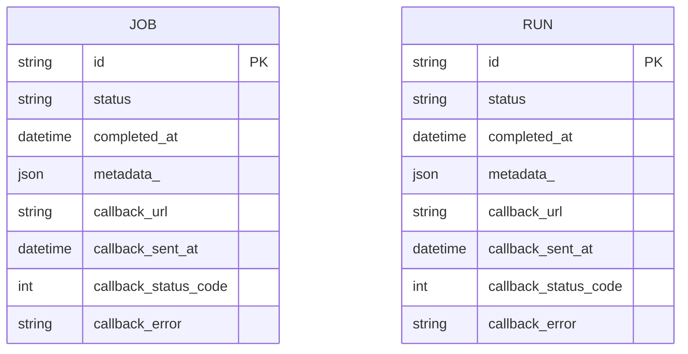
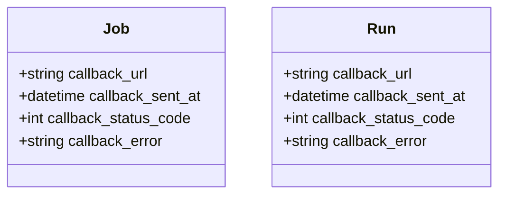
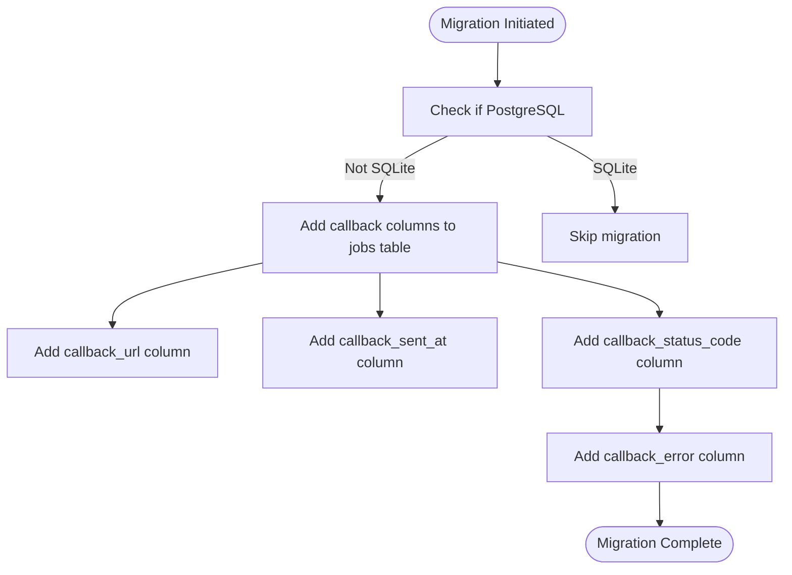
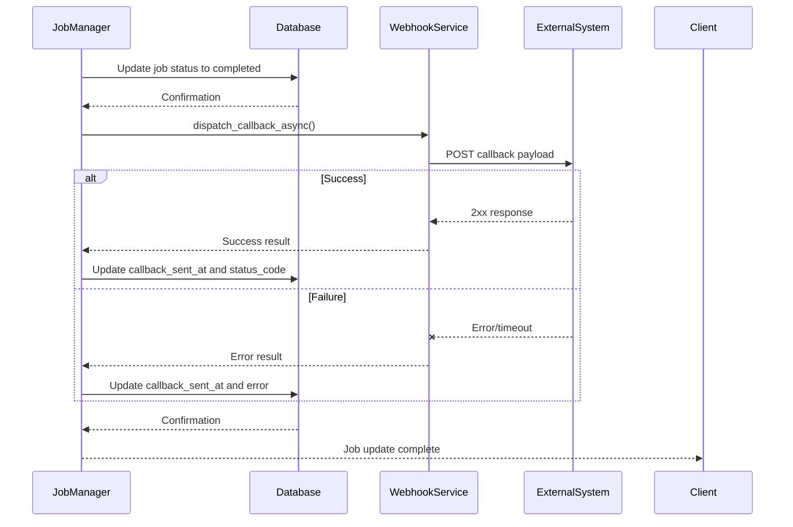
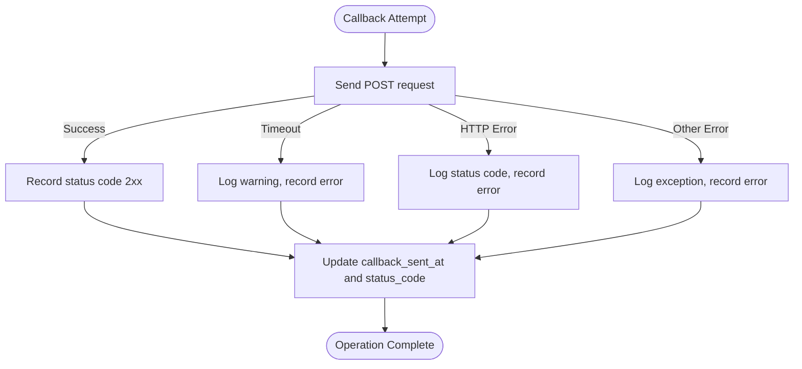
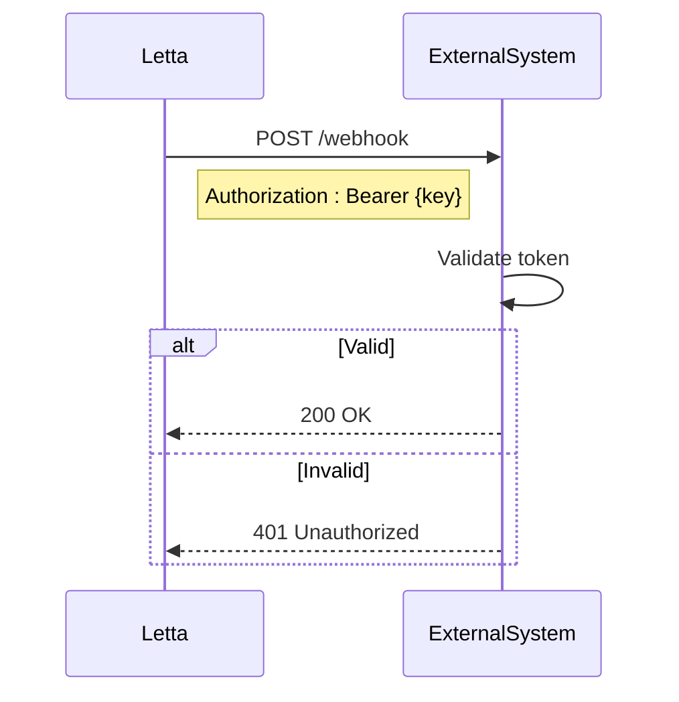

# Callback Integration System

<cite>
**Referenced Files in This Document**   
- [job.py](file://letta/orm/job.py)
- [run.py](file://letta/orm/run.py)
- [job_manager.py](file://letta/services/job_manager.py)
- [run_manager.py](file://letta/services/run_manager.py)
- [webhook_service.py](file://letta/services/webhook_service.py)
- [webhook_service_test.py](file://letta/services/webhook_service_test.py)
- [WEBHOOK_SETUP.md](file://WEBHOOK_SETUP.md)
- [job.py](file://letta/schemas/job.py)
- [a3c7d62e08ca_add_callback_data_to_jobs_table.py](file://alembic/versions/a3c7d62e08ca_add_callback_data_to_jobs_table.py)
- [90fd814d0cda_add_callback_error_field_to_jobs.py](file://alembic/versions/90fd814d0cda_add_callback_error_field_to_jobs.py)
</cite>

## Table of Contents
1. [Introduction](#introduction)
2. [Core Data Model](#core-data-model)
3. [Callback Implementation](#callback-implementation)
4. [Asynchronous Delivery Mechanism](#asynchronous-delivery-mechanism)
5. [Integration Examples](#integration-examples)
6. [Error Handling and Troubleshooting](#error-handling-and-troubleshooting)
7. [Security Considerations](#security-considerations)
8. [Best Practices](#best-practices)
9. [Conclusion](#conclusion)

## Introduction

The Callback Integration System in Letta enables external systems to receive notifications when background jobs and agent runs complete. This webhook-based notification system allows for seamless integration with CI/CD pipelines, monitoring systems, and workflow orchestrators. The system is designed to be reliable, with asynchronous delivery and comprehensive error tracking.

The callback mechanism is implemented through several key components: the Job and Run models that store callback configuration, the JobManager and RunManager services that trigger callbacks upon completion, and the WebhookService that handles delivery. This documentation provides a comprehensive overview of the system architecture, implementation details, and best practices for integration.

## Core Data Model

The callback functionality is implemented through specific fields in the Job and Run models that track callback configuration and delivery status. These fields enable external system integration while maintaining comprehensive delivery tracking.



**Diagram sources**
- [job.py](file://letta/orm/job.py#L46-L51)
- [run.py](file://letta/orm/run.py#L54-L59)

### Callback Configuration Fields

The callback_url field in both Job and Run models enables external system integration by specifying the endpoint that should be notified upon completion. When a job or run completes, the system sends a POST request to this URL with relevant completion data.



**Diagram sources**
- [job.py](file://letta/orm/job.py#L46-L51)
- [run.py](file://letta/orm/run.py#L54-L59)

**Section sources**
- [job.py](file://letta/orm/job.py#L46-L51)
- [run.py](file://letta/orm/run.py#L54-L59)
- [job.py](file://letta/schemas/job.py#L36-L39)

### Delivery Tracking Fields

The system tracks callback delivery attempts through three key fields that provide comprehensive monitoring and troubleshooting capabilities:

| Field | Type | Description | Purpose |
|-------|------|-------------|---------|
| callback_sent_at | datetime | Timestamp when the callback was last attempted | Tracks when delivery was attempted for monitoring and debugging |
| callback_status_code | int | HTTP status code returned by the callback endpoint | Records the response from the external system to determine success or failure |
| callback_error | string | Error message from failed callback attempts | Captures detailed error information for troubleshooting delivery issues |

These fields work together to provide a complete picture of callback delivery status, enabling administrators to monitor success rates and diagnose problems.

**Section sources**
- [job.py](file://letta/orm/job.py#L47-L51)
- [run.py](file://letta/orm/run.py#L55-L59)

## Callback Implementation

The callback system is implemented through database migrations that add the necessary fields to support webhook notifications. These migrations ensure the database schema can store callback configuration and delivery status.



**Diagram sources**
- [a3c7d62e08ca_add_callback_data_to_jobs_table.py](file://alembic/versions/a3c7d62e08ca_add_callback_data_to_jobs_table.py)
- [90fd814d0cda_add_callback_error_field_to_jobs.py](file://alembic/versions/90fd814d0cda_add_callback_error_field_to_jobs.py)

The callback functionality was implemented in two phases through Alembic migrations. The first migration added the core callback fields (callback_url, callback_sent_at, and callback_status_code), while a subsequent migration added the callback_error field to capture detailed error information from failed delivery attempts.

**Section sources**
- [a3c7d62e08ca_add_callback_data_to_jobs_table.py](file://alembic/versions/a3c7d62e08ca_add_callback_data_to_jobs_table.py#L29-L31)
- [90fd814d0cda_add_callback_error_field_to_jobs.py](file://alembic/versions/90fd814d0cda_add_callback_error_field_to_jobs.py#L29)

## Asynchronous Delivery Mechanism

The webhook delivery system is implemented as an asynchronous process that ensures reliable message delivery without blocking job completion. The mechanism is implemented in the JobManager and RunManager services, which handle callback dispatch when jobs or runs reach terminal states.



**Diagram sources**
- [job_manager.py](file://letta/services/job_manager.py#L128-L147)
- [run_manager.py](file://letta/services/run_manager.py#L398-L424)

The asynchronous delivery mechanism follows these key steps:
1. Job or run status is updated to a terminal state (completed, failed, or cancelled)
2. The system checks if a callback_url is configured and if the job/run was not previously completed
3. If conditions are met, the callback is dispatched asynchronously
4. The delivery result (success, status code, or error) is stored in the database
5. The original operation completes regardless of callback delivery success

This design ensures that external system availability does not impact the core functionality of job processing.

**Section sources**
- [job_manager.py](file://letta/services/job_manager.py#L79-L147)
- [run_manager.py](file://letta/services/run_manager.py#L397-L424)

## Integration Examples

The callback system can be integrated with various external systems to enable automated workflows and monitoring. Below are examples of common integration patterns.

### CI/CD Pipeline Integration

For CI/CD pipeline integration, configure the callback_url to point to your pipeline's webhook endpoint. When a job completes, your CI/CD system can automatically trigger downstream processes such as deployment, testing, or notification.

```json
{
  "job_id": "job-12345",
  "status": "completed",
  "completed_at": "2025-04-17T17:40:16.224424",
  "metadata": {
    "pipeline_id": "pipeline-67890",
    "artifact_version": "1.2.3"
  }
}
```

### Monitoring System Integration

Integrate with monitoring systems by setting the callback_url to your monitoring platform's ingestion endpoint. The callback payload can include custom metadata with metrics and health information for real-time monitoring and alerting.

### Workflow Orchestrator Integration

For workflow orchestration, use callbacks to chain operations where the completion of one job triggers the next step in a workflow. Configure the callback_url to point to your orchestrator's API endpoint to enable complex multi-step processes.

**Section sources**
- [WEBHOOK_SETUP.md](file://WEBHOOK_SETUP.md#L52-L60)
- [job_manager.py](file://letta/services/job_manager.py#L497-L502)

## Error Handling and Troubleshooting

The callback system implements comprehensive error handling to ensure reliability and provide detailed information for troubleshooting delivery issues.

### Error Classification

The system categorizes callback errors into three main types:

| Error Type | Detection Method | Handling Strategy |
|------------|------------------|-------------------|
| Timeout | HTTP request exceeds 5-second timeout | Logged as warning, does not block job completion |
| HTTP Error | Non-2xx HTTP status code from endpoint | Logged with status code, stored in callback_status_code |
| Other Exceptions | Any other exception during request | Captured in callback_error field with full error message |



**Diagram sources**
- [job_manager.py](file://letta/services/job_manager.py#L502-L506)
- [webhook_service.py](file://letta/services/webhook_service.py#L49-L57)

The error handling implementation ensures that callback failures do not affect job completion. The system continues processing regardless of webhook delivery success, maintaining system reliability even when external endpoints are unavailable.

**Section sources**
- [job_manager.py](file://letta/services/job_manager.py#L502-L506)
- [webhook_service.py](file://letta/services/webhook_service.py#L49-L57)

## Security Considerations

The callback system includes several security features to protect against unauthorized access and ensure data integrity.

### Authentication

The WebhookService supports optional authentication through the STEP_COMPLETE_KEY environment variable. When configured, the service includes a Bearer token in the Authorization header of callback requests, allowing receiving systems to verify the authenticity of incoming notifications.



**Diagram sources**
- [webhook_service.py](file://letta/services/webhook_service.py#L33-L34)
- [WEBHOOK_SETUP.md](file://WEBHOOK_SETUP.md#L48-L50)

### Payload Validation

Receiving systems should implement signature verification and payload validation to ensure the integrity of callback data. This includes validating the structure of the JSON payload and verifying any authentication tokens.

**Section sources**
- [webhook_service.py](file://letta/services/webhook_service.py#L14-L15)
- [WEBHOOK_SETUP.md](file://WEBHOOK_SETUP.md#L62-L71)

## Best Practices

Implementing effective callback integrations requires following several best practices to ensure reliability, security, and maintainability.

### Idempotency Implementation

Callback receivers should be designed to handle duplicate notifications gracefully. Since network issues may cause the same callback to be delivered multiple times, receiving systems should implement idempotency checks using the job_id or run_id as a unique identifier.

### Rate Limiting Handling

Receiving systems should implement proper rate limiting to prevent resource exhaustion. This includes setting appropriate limits on request frequency and payload size, and returning appropriate HTTP status codes (429 Too Many Requests) when limits are exceeded.

### Monitoring and Alerting

Monitor callback delivery success rates and set up alerts for high failure rates. Track metrics such as:
- Callback success rate
- Average delivery time
- Error type distribution
- Retry frequency

These metrics help identify issues with external endpoints and ensure reliable integration.

**Section sources**
- [WEBHOOK_SETUP.md](file://WEBHOOK_SETUP.md#L135-L143)
- [webhook_service_test.py](file://letta/services/webhook_service_test.py)

## Conclusion

The Callback Integration System in Letta provides a robust mechanism for notifying external systems when jobs and runs complete. By implementing webhook notifications with comprehensive error tracking and asynchronous delivery, the system enables seamless integration with various external services while maintaining reliability and performance.

Key features of the system include:
- Configurable callback URLs for external system integration
- Comprehensive delivery tracking with timestamp, status code, and error fields
- Asynchronous delivery that does not block job completion
- Detailed error handling and troubleshooting capabilities
- Security features including optional authentication

By following the best practices outlined in this documentation, developers can implement reliable and secure callback integrations that enhance the functionality of their Letta-based applications.