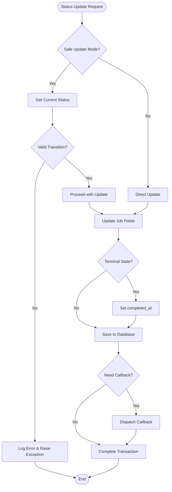
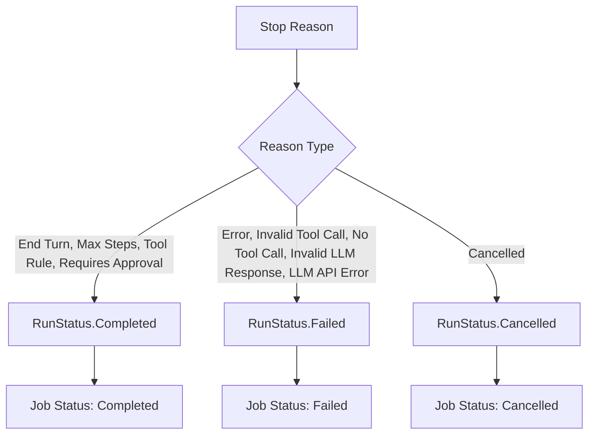
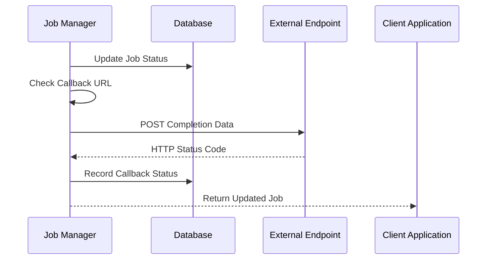

# Job State Management

<cite>
**Referenced Files in This Document**
- [job_manager.py](file://letta/services/job_manager.py)
- [job.py](file://letta/orm/job.py)
- [schemas/job.py](file://letta/schemas/job.py)
- [schemas/enums.py](file://letta/schemas/enums.py)
- [schemas/letta_stop_reason.py](file://letta/schemas/letta_stop_reason.py)
- [jobs/helpers.py](file://letta/jobs/helpers.py)
- [jobs/types.py](file://letta/jobs/types.py)
- [jobs/llm_batch_job_polling.py](file://letta/jobs/llm_batch_job_polling.py)
- [jobs/scheduler.py](file://letta/jobs/scheduler.py)
- [test_job_manager.py](file://tests/managers/test_job_manager.py)
</cite>

## Table of Contents
1. [Introduction](#introduction)
2. [Job Status Lifecycle](#job-status-lifecycle)
3. [Core Components](#core-components)
4. [Status Transition Management](#status-transition-management)
5. [Job Persistence and ORM](#job-persistence-and-orm)
6. [Stop Reason Tracking](#stop-reason-tracking)
7. [Metadata Management](#metadata-management)
8. [Callback System](#callback-system)
9. [Monitoring and Observability](#monitoring-and-observability)
10. [Best Practices](#best-practices)
11. [Common Issues and Solutions](#common-issues-and-solutions)
12. [Implementation Examples](#implementation-examples)

## Introduction

Letta's job state management system provides comprehensive tracking and control over asynchronous job lifecycles. The system manages job states through a robust state machine with strict transition guards, automatic completion timestamps, and detailed tracking of job outcomes through stop reasons and metadata storage.

The job management system supports various job types including batch processing, data loading, and LLM API operations. It provides atomic state changes, race condition protection, and comprehensive monitoring capabilities for production environments.

## Job Status Lifecycle

The job status system implements a well-defined state machine with specific transition rules to ensure data consistency and prevent invalid state changes.

```mermaid
stateDiagram-v2
[*] --> Created
Created --> Pending : Job initialization
Pending --> Running : Job execution begins
Running --> Completed : Successful completion
Running --> Failed : Error occurs
Running --> Cancelled : User/system cancellation
Running --> Expired : Timeout reached
Completed --> [*]
Failed --> [*]
Cancelled --> [*]
Expired --> [*]
note right of Running : Terminal states : <br/>Completed, Failed,<br/>Cancelled, Expired
```

**Diagram sources**
- [schemas/enums.py](file://letta/schemas/enums.py#L115-L131)
- [job_manager.py](file://letta/services/job_manager.py#L85-L96)

### Status Definitions

| Status | Description | Terminal State | Is Terminal |
|--------|-------------|----------------|-------------|
| `created` | Job initialized but not yet processed | No | No |
| `pending` | Job queued and awaiting execution | No | No |
| `running` | Job actively executing | No | No |
| `completed` | Job finished successfully | Yes | Yes |
| `failed` | Job terminated due to error | Yes | Yes |
| `cancelled` | Job cancelled by user/system | Yes | Yes |
| `expired` | Job timed out or exceeded limits | Yes | Yes |

**Section sources**
- [schemas/enums.py](file://letta/schemas/enums.py#L115-L131)

## Core Components

### Job Manager

The [`JobManager`](file://letta/services/job_manager.py#L34-L600) class serves as the central orchestrator for job state management, providing:

- **State Transition Guards**: Validates job status changes against the defined state machine
- **Atomic Updates**: Ensures database consistency through transactional operations
- **Callback Dispatch**: Handles webhook notifications for job completion
- **Metadata Management**: Provides flexible storage for custom job context
- **Query Capabilities**: Supports filtering and pagination for job listings

### Job ORM Model

The [`Job`](file://letta/orm/job.py#L19-L66) ORM model defines the database schema with:

- **Status Tracking**: Current job state with foreign key constraints
- **Completion Timestamp**: Automatic tracking of completion time
- **Stop Reason**: Detailed cause of job termination
- **Metadata Storage**: Flexible JSONB field for custom context
- **Callback Information**: Webhook URL and delivery tracking

### Job Schema

The [`Job`](file://letta/schemas/job.py#L46-L51) Pydantic model provides:

- **Validation**: Type-safe job data with automatic serialization
- **Default Values**: Safe defaults for optional fields
- **ID Generation**: Consistent UUID generation with prefix handling
- **Relationships**: Clear associations with users and organizations

**Section sources**
- [job_manager.py](file://letta/services/job_manager.py#L34-L600)
- [job.py](file://letta/orm/job.py#L19-L66)
- [schemas/job.py](file://letta/schemas/job.py#L46-L51)

## Status Transition Management

### Safe Update Mechanism

The job manager implements sophisticated state transition validation through the [`safe_update_job_status_async`](file://letta/services/job_manager.py#L153-L189) method:



**Diagram sources**
- [job_manager.py](file://letta/services/job_manager.py#L85-L189)

### Transition Validation Rules

The system enforces strict transition rules to maintain data integrity:

1. **Terminal State Restriction**: Only terminal states can transition from non-terminal states
2. **Created State Guard**: A job in `created` state can only remain `created`
3. **Pending to Running**: Only `pending` jobs can transition to `running`
4. **Automatic Completion**: Terminal state transitions automatically set `completed_at`

**Section sources**
- [job_manager.py](file://letta/services/job_manager.py#L85-L96)

## Job Persistence and ORM

### Database Schema Design

The job table schema provides comprehensive tracking capabilities:

| Column | Type | Purpose | Constraints |
|--------|------|---------|-------------|
| `status` | String | Current job state | Not null, default 'created' |
| `completed_at` | DateTime | Completion timestamp | Nullable |
| `stop_reason` | String | Cause of termination | Nullable |
| `metadata_` | JSONB | Custom job context | Nullable |
| `callback_url` | String | Webhook endpoint | Nullable |
| `callback_sent_at` | DateTime | Last callback attempt | Nullable |
| `callback_status_code` | Integer | HTTP status from callback | Nullable |
| `ttft_ns` | BigInteger | Time to first token | Nullable |
| `total_duration_ns` | BigInteger | Total execution time | Nullable |

### ORM Operations

The job ORM model supports:

- **Asynchronous Operations**: Full async support for database operations
- **Transaction Safety**: Automatic transaction management
- **Refresh Control**: Configurable refresh behavior for performance
- **Access Control**: User-based access verification

**Section sources**
- [job.py](file://letta/orm/job.py#L28-L66)

## Stop Reason Tracking

### Stop Reason Types

The [`StopReasonType`](file://letta/schemas/letta_stop_reason.py#L8-L40) enum captures detailed job termination causes:

| Reason | Description | Associated Status |
|--------|-------------|-------------------|
| `end_turn` | Normal completion | Completed |
| `error` | General error condition | Failed |
| `llm_api_error` | LLM API failure | Failed |
| `invalid_tool_call` | Malformed tool invocation | Failed |
| `max_steps` | Exceeded step limit | Completed |
| `no_tool_call` | Expected tool call missing | Failed |
| `tool_rule` | Tool rule violation | Completed |
| `cancelled` | User/system cancellation | Cancelled |
| `requires_approval` | Approval needed | Completed |

### Stop Reason Mapping

The system automatically maps stop reasons to appropriate job statuses:



**Diagram sources**
- [schemas/letta_stop_reason.py](file://letta/schemas/letta_stop_reason.py#L20-L40)

**Section sources**
- [schemas/letta_stop_reason.py](file://letta/schemas/letta_stop_reason.py#L8-L40)

## Metadata Management

### JSONB Storage

The `metadata_` field provides flexible storage for custom job context:

- **Dynamic Structure**: No schema restrictions for custom data
- **Type Preservation**: Maintains Python types during serialization
- **Query Support**: JSONB operators enable efficient querying
- **Size Limits**: Database-level constraints prevent excessive growth

### Metadata Patterns

Common metadata patterns include:

```python
# Source tracking
{
    "source_id": "source-123",
    "source_type": "file",
    "chunk_count": 150,
    "processing_time": 12.5
}

# Batch job context
{
    "batch_size": 1000,
    "batch_number": 1,
    "total_batches": 10,
    "completion_percentage": 75
}

# Error context
{
    "error_type": "validation_error",
    "retry_count": 3,
    "last_error": "Invalid input format",
    "recovery_attempted": true
}
```

### Querying by Metadata

The system supports querying jobs by metadata fields:

```python
# Find jobs by source ID
jobs = await job_manager.list_jobs_async(
    actor=user,
    source_id="source-123"
)

# Find failed jobs with specific error type
jobs = await job_manager.list_jobs_async(
    actor=user,
    statuses=[JobStatus.failed],
    metadata={"error_type": "validation_error"}
)
```

**Section sources**
- [job.py](file://letta/orm/job.py#L34-L34)
- [test_job_manager.py](file://tests/managers/test_job_manager.py#L164-L171)

## Callback System

### Webhook Integration

The callback system enables external notification of job completion:



**Diagram sources**
- [job_manager.py](file://letta/services/job_manager.py#L128-L146)

### Callback Payload Structure

Callback requests include comprehensive job information:

```json
{
    "job_id": "job-123",
    "status": "completed",
    "completed_at": "2024-01-15T10:30:00Z",
    "metadata": {
        "source_id": "source-456",
        "processing_time": 120.5,
        "records_processed": 1000
    }
}
```

### Callback Management

The system handles callback delivery with:

- **Retry Logic**: Automatic retry for transient failures
- **Status Tracking**: Records HTTP status codes and errors
- **Timeout Protection**: Configurable timeout limits
- **Error Isolation**: Callback failures don't affect job completion

**Section sources**
- [job_manager.py](file://letta/services/job_manager.py#L483-L537)

## Monitoring and Observability

### Metrics Collection

The job system tracks key performance indicators:

- **Job Duration**: Total execution time in nanoseconds
- **Time to First Token**: Initial response latency
- **Completion Rates**: Success vs. failure ratios
- **Queue Depth**: Pending job counts
- **Error Patterns**: Common failure reasons

### LLM Batch Polling

The [`BatchPollingMetrics`](file://letta/jobs/llm_batch_job_polling.py#L20-L39) class provides detailed monitoring:

```python
class BatchPollingMetrics:
    def __init__(self):
        self.start_time = datetime.now()
        self.total_batches = 0
        self.anthropic_batches = 0
        self.running_count = 0
        self.completed_count = 0
        self.updated_items_count = 0
```

### Scheduler Monitoring

The job scheduler includes leader election and monitoring:

- **Leader Election**: PostgreSQL advisory locks prevent duplicate schedulers
- **Health Checks**: Regular lock validation and retry mechanisms
- **Metrics Logging**: Comprehensive timing and count reporting
- **Graceful Shutdown**: Proper cleanup of resources and locks

**Section sources**
- [jobs/llm_batch_job_polling.py](file://letta/jobs/llm_batch_job_polling.py#L20-L39)
- [jobs/scheduler.py](file://letta/jobs/scheduler.py#L163-L229)

## Best Practices

### Idempotent Status Updates

Implement idempotent status updates by:

1. **Using Safe Updates**: Always use `safe_update=True` for state transitions
2. **Checking Current State**: Verify the current job state before updating
3. **Handling Race Conditions**: Expect and handle concurrent updates gracefully
4. **Logging Transitions**: Maintain audit trails for state changes

### Atomic Operations

Ensure atomicity through:

1. **Transaction Boundaries**: Wrap state changes in database transactions
2. **Lock Acquisition**: Use advisory locks for distributed systems
3. **Compensation Logic**: Implement rollback mechanisms for failed updates
4. **Consistency Checks**: Validate state consistency after updates

### Metadata Design

Follow metadata best practices:

1. **Schema Versioning**: Include version information in metadata
2. **Field Naming**: Use consistent, descriptive field names
3. **Data Types**: Store appropriate data types for query optimization
4. **Size Management**: Monitor metadata size to prevent database bloat

### Error Handling

Implement robust error handling:

1. **Graceful Degradation**: Continue operation when non-critical failures occur
2. **Retry Logic**: Implement exponential backoff for transient failures
3. **Alerting**: Notify administrators of persistent failures
4. **Recovery Procedures**: Document and automate recovery steps

## Common Issues and Solutions

### Stuck Jobs in Running State

**Problem**: Jobs remain in `running` state indefinitely

**Causes**:
- Application crashes during execution
- Network timeouts preventing status updates
- Deadlocks in processing logic
- Missing completion callbacks

**Solutions**:
1. **Heartbeat Mechanism**: Implement periodic status updates
2. **Timeout Detection**: Monitor job age and mark stale jobs
3. **Manual Intervention**: Provide admin tools for job state correction
4. **Orphan Cleanup**: Implement scheduled cleanup of stale jobs

### Race Condition Handling

**Problem**: Concurrent updates causing inconsistent states

**Solutions**:
1. **Optimistic Locking**: Use version numbers for conflict detection
2. **Database Constraints**: Leverage database-level constraints
3. **Application Locks**: Implement application-level locking mechanisms
4. **Retry Logic**: Gracefully handle and retry conflicting updates

### Callback Delivery Failures

**Problem**: External endpoints fail to receive completion notifications

**Solutions**:
1. **Retry Policies**: Implement exponential backoff retry logic
2. **Dead Letter Queues**: Queue failed callbacks for manual review
3. **Health Monitoring**: Monitor callback endpoint availability
4. **Fallback Mechanisms**: Implement alternative notification methods

### Orphaned Jobs

**Problem**: Jobs that are never cleaned up

**Solutions**:
1. **Cleanup Schedules**: Implement automated cleanup of old jobs
2. **Retention Policies**: Define job retention periods by status
3. **Monitoring Alerts**: Alert on excessive job accumulation
4. **Manual Review Tools**: Provide admin interfaces for job inspection

## Implementation Examples

### Basic Job Creation and Status Update

```python
# Create a new job
job_data = PydanticJob(
    status=JobStatus.created,
    metadata={"source_id": "source-123", "type": "data_processing"}
)
created_job = await job_manager.create_job_async(job_data, actor=user)

# Update job status safely
success = await job_manager.safe_update_job_status_async(
    job_id=created_job.id,
    new_status=JobStatus.running,
    actor=user,
    stop_reason=StopReasonType.end_turn,
    metadata={"processing_start": datetime.now()}
)

# Update to completed state
await job_manager.safe_update_job_status_async(
    job_id=created_job.id,
    new_status=JobStatus.completed,
    actor=user,
    stop_reason=StopReasonType.end_turn
)
```

### Batch Job Monitoring

```python
# List running jobs
running_jobs = await job_manager.list_jobs_async(
    actor=user,
    statuses=[JobStatus.running]
)

# Query by metadata
batch_jobs = await job_manager.list_jobs_async(
    actor=user,
    source_id="batch-123"
)

# Monitor job progress
for job in running_jobs:
    if job.metadata and job.metadata.get("progress"):
        progress = job.metadata["progress"]
        print(f"Job {job.id}: {progress}% complete")
```

### Error Recovery Pattern

```python
async def process_job_with_recovery(job_id: str, actor: PydanticUser):
    try:
        # Attempt to update job status
        success = await job_manager.safe_update_job_status_async(
            job_id=job_id,
            new_status=JobStatus.running,
            actor=actor,
            metadata={"attempt": 1}
        )
        
        if not success:
            # Handle race condition - job already updated
            current_job = await job_manager.get_job_by_id_async(job_id, actor)
            if current_job.status.is_terminal:
                return current_job
        
        # Perform job processing...
        
        # Update completion
        await job_manager.safe_update_job_status_async(
            job_id=job_id,
            new_status=JobStatus.completed,
            actor=actor,
            stop_reason=StopReasonType.end_turn
        )
        
    except Exception as e:
        # Handle error with recovery attempt
        await job_manager.safe_update_job_status_async(
            job_id=job_id,
            new_status=JobStatus.failed,
            actor=actor,
            stop_reason=StopReasonType.error,
            metadata={
                "error": str(e),
                "retry_attempt": 1
            }
        )
```

### Dashboard Implementation

```python
async def get_job_dashboard_stats(actor: PydanticUser):
    # Get job counts by status
    jobs_by_status = {}
    for status in JobStatus:
        count = await job_manager.count_jobs_async(
            actor=actor,
            statuses=[status]
        )
        jobs_by_status[status.value] = count
    
    # Get recent completions
    recent_jobs = await job_manager.list_jobs_async(
        actor=actor,
        statuses=[JobStatus.completed, JobStatus.failed],
        limit=50,
        ascending=False
    )
    
    # Calculate average completion time
    avg_completion_time = 0
    if recent_jobs:
        total_time = sum(
            (job.completed_at - job.created_at).total_seconds()
            for job in recent_jobs if job.completed_at
        )
        avg_completion_time = total_time / len(recent_jobs)
    
    return {
        "job_counts": jobs_by_status,
        "recent_jobs": recent_jobs[:10],
        "average_completion_time": avg_completion_time,
        "total_jobs": sum(jobs_by_status.values())
    }
```

**Section sources**
- [test_job_manager.py](file://tests/managers/test_job_manager.py#L109-L193)
- [job_manager.py](file://letta/services/job_manager.py#L153-L189)