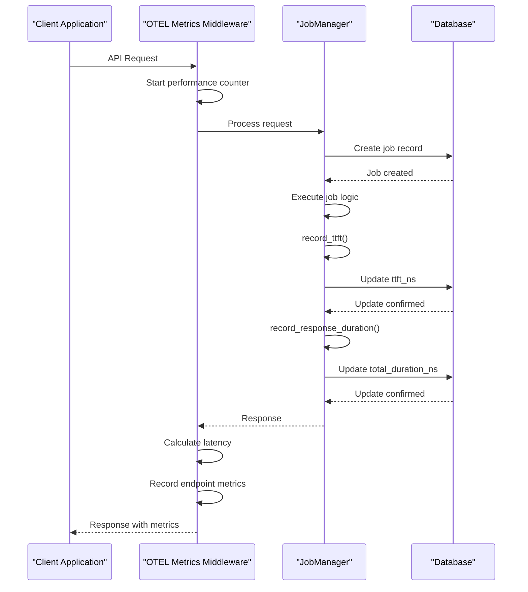
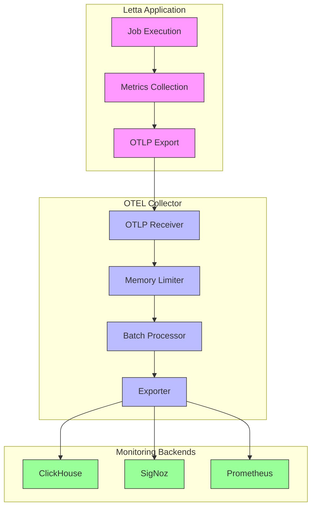

# Performance Metrics Monitoring

<cite>
**Referenced Files in This Document**   
- [metrics.py](file://letta/otel/metrics.py)
- [metric_registry.py](file://letta/otel/metric_registry.py)
- [job_manager.py](file://letta/services/job_manager.py)
- [otel-collector-config-clickhouse.yaml](file://otel/otel-collector-config-clickhouse.yaml)
- [otel-collector-config-signoz.yaml](file://otel/otel-collector-config-signoz.yaml)
- [sqlalchemy_instrumentation.py](file://letta/otel/sqlalchemy_instrumentation.py)
- [tracing.py](file://letta/otel/tracing.py)
- [context.py](file://letta/otel/context.py)
</cite>

## Table of Contents
1. [Introduction](#introduction)
2. [Core Performance Metrics Implementation](#core-performance-metrics-implementation)
3. [Metrics Capture and Timing Points](#metrics-capture-and-timing-points)
4. [OpenTelemetry Instrumentation](#opentelemetry-instrumentation)
5. [Integration with Job Manager](#integration-with-job-manager)
6. [Metrics Export and Backend Integration](#metrics-export-and-backend-integration)
7. [Monitoring Dashboard Examples](#monitoring-dashboard-examples)
8. [Common Issues and Troubleshooting](#common-issues-and-troubleshooting)
9. [Best Practices](#best-practices)
10. [Conclusion](#conclusion)

## Introduction
Letta's observability infrastructure provides comprehensive performance monitoring capabilities through OpenTelemetry instrumentation. The system captures critical performance metrics such as time to first token (ttft_ns) and total duration (total_duration_ns) to measure job execution performance across the platform. These metrics are captured at key execution points and exposed through a robust OpenTelemetry-based metrics system that enables detailed performance analysis, bottleneck identification, and system optimization. The observability stack integrates seamlessly with various monitoring backends like Prometheus, ClickHouse, and SigNoz through configurable OTEL collector configurations, allowing organizations to choose their preferred monitoring infrastructure. This documentation details the implementation of Letta's performance metrics system, covering metric capture, timing measurement, integration patterns, export configurations, and best practices for effective monitoring and alerting.

## Core Performance Metrics Implementation

Letta's performance monitoring system centers around two key metrics: ttft_ns (time to first token) and total_duration_ns (total response duration). These metrics are implemented at the database level with the addition of corresponding columns in the jobs table, as evidenced by the Alembic migration that added these fields to track agent loop run metrics. The metrics are stored as BigInteger values in nanoseconds, providing high precision timing measurements that can be converted to more human-readable units like milliseconds when needed.

The implementation follows a structured approach where timing measurements are captured at specific execution points and stored in the job record. The ttft_ns metric measures the time from when a job is initiated to when the first token is generated, which is particularly important for assessing the responsiveness of LLM operations. The total_duration_ns metric captures the complete execution time of a job from start to finish, providing insight into overall performance and resource utilization.

These metrics are designed to work in conjunction with other observability features in the system, including tracing and logging, to provide a comprehensive view of system performance. The metrics are exposed through the OpenTelemetry metrics system, which allows for aggregation, visualization, and alerting based on performance data. The implementation ensures that timing measurements are captured consistently across different job types and execution patterns, providing reliable data for performance analysis and optimization.

**Section sources**
- [05c3bc564286_add_metrics_to_agent_loop_runs.py](file://alembic/versions/05c3bc564286_add_metrics_to_agent_loop_runs.py#L24-L25)
- [job_manager.py](file://letta/services/job_manager.py#L458-L478)

## Metrics Capture and Timing Points

The performance metrics in Letta are captured at critical execution points through dedicated methods in the JobManager class. The system implements two primary timing capture methods: record_ttft for time to first token measurements and record_response_duration for total execution duration. These methods are designed to be called at specific points in the job execution lifecycle to ensure accurate timing measurements.

The record_ttft method is invoked when the first token is generated during job execution, capturing the elapsed time from job initiation to first token generation. This timing point is crucial for assessing the responsiveness of LLM operations and identifying potential bottlenecks in the initial processing phase. The record_response_duration method is called upon job completion, measuring the total time from job initiation to completion. This provides insight into the overall efficiency of job execution and helps identify performance issues that may affect user experience.

The timing capture implementation includes error handling to ensure graceful degradation when recording metrics for non-existent jobs. The methods use database transactions to ensure data consistency and include logging to track any issues with metric recording. The timing values are stored as nanosecond-precision integers, allowing for high-resolution performance analysis while maintaining compatibility with OpenTelemetry's metrics system. The capture points are strategically placed to minimize overhead while ensuring comprehensive coverage of job execution performance.

**Section sources**
- [job_manager.py](file://letta/services/job_manager.py#L458-L480)

## OpenTelemetry Instrumentation

Letta's observability infrastructure is built on OpenTelemetry, providing a comprehensive metrics and tracing system for performance monitoring. The implementation in metrics.py sets up a metrics middleware that captures endpoint-level performance data for specific API endpoints, including latency and request counts. The middleware is configured to track only selected endpoints defined in _included_v1_endpoints_regex, which includes key message endpoints for agent interaction.

The metrics system uses OpenTelemetry's MeterProvider to create and manage metrics instruments, with configuration options for preferred temporality settings. The setup_metrics function initializes the metrics exporter, configuring it to send data to a specified OTLP endpoint with appropriate temporal characteristics. The system implements a periodic exporting metric reader that batches and exports metrics at regular intervals, balancing real-time visibility with system performance.

The instrumentation includes automatic context propagation through HTTP headers, extracting attributes like organization ID, project ID, and agent ID to enrich metrics with contextual information. This allows for detailed performance analysis segmented by organizational units, projects, and specific agents. The system also implements endpoint-level metrics recording, capturing latency and request counts with attributes including endpoint path, HTTP method, and status code, enabling detailed performance analysis of API endpoints.

**Diagram sources**
- [metrics.py](file://letta/otel/metrics.py#L40-L75)
- [job_manager.py](file://letta/services/job_manager.py#L458-L478)

## Integration with Job Manager

The integration between Letta's job manager and the metrics system ensures accurate timing measurements throughout the job execution lifecycle. The JobManager class provides dedicated methods for recording performance metrics, which are called at specific points during job processing. This integration is designed to be non-intrusive, allowing job execution logic to proceed normally while capturing essential performance data.

The job manager's record_ttft and record_response_duration methods handle the entire process of metric capture, from database access validation to actual metric storage. These methods use the _verify_job_access_async helper to ensure the calling actor has appropriate permissions before updating job metrics. The implementation includes transaction management to ensure data consistency, with explicit commit operations to persist metric updates to the database.

The integration also includes error handling to gracefully manage cases where metrics are recorded for non-existent jobs. Instead of raising exceptions, the system logs warnings and continues execution, preventing metric recording issues from affecting job completion. This fault-tolerant design ensures that performance monitoring does not introduce additional points of failure in the system.

The job manager's metrics integration works in conjunction with the OpenTelemetry context system, ensuring that timing measurements are properly attributed to the correct organizational units, projects, and agents. This contextual information is automatically propagated through the system, enabling detailed performance analysis segmented by various dimensions.

**Section sources**
- [job_manager.py](file://letta/services/job_manager.py#L458-L480)
- [metrics.py](file://letta/otel/metrics.py#L78-L98)

## Metrics Export and Backend Integration

Letta's observability infrastructure supports integration with multiple monitoring backends through configurable OpenTelemetry collector configurations. The system provides pre-configured collector configurations for ClickHouse and SigNoz, demonstrating its flexibility in supporting different monitoring ecosystems. These configurations define the complete pipeline for metrics collection, processing, and export, enabling seamless integration with external monitoring systems.

The ClickHouse configuration (otel-collector-config-clickhouse.yaml) sets up the collector to receive OTLP metrics via gRPC and HTTP protocols on standard ports (4317 and 4318). It configures a ClickHouse exporter with connection details provided through environment variables, allowing for secure and flexible deployment configurations. The pipeline includes batching and memory limiting processors to optimize resource usage and ensure reliable metrics delivery.

The SigNoz configuration (otel-collector-config-signoz.yaml) demonstrates integration with the SigNoz observability platform, using the OTLP exporter to send metrics to a SigNoz endpoint. The configuration includes authentication via an ingestion key, ensuring secure transmission of metrics data. Both configurations include health check, pprof, and zpages extensions for collector monitoring and debugging.

The metrics export system is designed to be extensible, allowing for the addition of new exporters and backends as needed. The collector configurations can be customized to include additional processing steps, such as attribute filtering or aggregation, to meet specific monitoring requirements. This flexibility enables organizations to adapt Letta's observability infrastructure to their existing monitoring ecosystems.

**Diagram sources**
- [otel-collector-config-clickhouse.yaml](file://otel/otel-collector-config-clickhouse.yaml#L1-L82)
- [otel-collector-config-signoz.yaml](file://otel/otel-collector-config-signoz.yaml#L1-L49)

## Monitoring Dashboard Examples

Letta's performance metrics can be visualized in monitoring dashboards to track latency percentiles, identify performance bottlenecks, and monitor system throughput. The OpenTelemetry metrics system exposes data that can be used to create comprehensive dashboards in various monitoring platforms like SigNoz, Grafana, or ClickHouse's native visualization tools.

Key dashboard components include latency percentile charts showing P50, P90, P95, and P99 response times for different endpoints and job types. These charts help identify outliers and performance degradation over time. Throughput monitoring displays requests per second or jobs processed per minute, providing insight into system utilization and capacity planning. Error rate tracking shows the percentage of failed requests or jobs, helping to identify reliability issues.

Bottleneck analysis dashboards can correlate ttft_ns and total_duration_ns metrics to identify whether performance issues are related to initial processing latency or overall execution time. This helps distinguish between LLM response time issues and processing overhead in the application logic. Dimensional analysis dashboards can break down performance metrics by organization, project, agent, or model type, enabling targeted optimization efforts.

The metrics system also supports creating SLO (Service Level Objective) compliance dashboards that track whether performance targets are being met. These dashboards can include burn rate calculations and remaining budget indicators to provide early warning of potential SLO violations. Custom dashboards can be created to monitor specific use cases or business-critical operations, providing tailored visibility into system performance.

**Section sources**
- [metric_registry.py](file://letta/otel/metric_registry.py#L72-L81)
- [metrics.py](file://letta/otel/metrics.py#L148-L157)

## Common Issues and Troubleshooting

Several common issues can affect the accuracy and reliability of performance metrics in distributed environments. Clock drift between different system components can lead to inaccurate timing measurements, particularly when jobs span multiple services or nodes. To mitigate this, it's recommended to use monotonic clocks for timing measurements and ensure NTP synchronization across all system components.

In distributed environments, network latency and variable processing times can introduce noise into performance metrics. This can be addressed by implementing statistical analysis to identify outliers and using percentile-based metrics rather than averages to avoid skew from extreme values. The system should also handle cases where metrics are recorded for non-existent jobs gracefully, as demonstrated by the warning-based approach in the job manager's metric recording methods.

Correlating metrics with logs and traces is essential for effective troubleshooting but can be challenging in high-volume systems. Letta's implementation addresses this by propagating context attributes like trace IDs, organization IDs, and agent IDs across the observability stack. This enables seamless correlation between metrics, logs, and traces for comprehensive debugging.

Other common issues include metric cardinality explosion from high-dimensional attributes, which can be mitigated by careful attribute selection and sampling strategies. The system should also handle cases where the metrics backend is temporarily unavailable, implementing retry logic and local buffering to prevent data loss during outages.

**Section sources**
- [job_manager.py](file://letta/services/job_manager.py#L466-L467)
- [context.py](file://letta/otel/context.py#L16-L25)

## Best Practices

Implementing effective performance monitoring in Letta requires adherence to several best practices. For SLO violation alerts, it's recommended to set up multi-tier alerting based on burn rates, with warning alerts for moderate SLO budget consumption and critical alerts for rapid budget depletion. Alerts should include contextual information like affected services, error rates, and recent deployment data to facilitate rapid incident response.

To optimize metric cardinality, limit the number of high-cardinality attributes and avoid using unbounded dimensions like user IDs or request parameters. Instead, use aggregated dimensions like organization, project, or agent type. Implement metric sampling for high-volume jobs to reduce monitoring overhead while maintaining statistical significance. This can be achieved by sampling a representative subset of jobs or using probabilistic sampling techniques.

For distributed tracing, ensure consistent trace context propagation across service boundaries and implement trace sampling strategies to balance observability with performance. Use structured logging with consistent attribute naming to enable effective log-metric-trace correlation. Regularly review and clean up unused metrics to prevent metric sprawl and maintain monitoring system performance.

Implement monitoring for the monitoring system itself, including collector health, export success rates, and data pipeline latency. This ensures the reliability of the observability infrastructure and provides early warning of potential data gaps. Finally, establish clear ownership and response procedures for alerts to ensure timely resolution of performance issues.

**Section sources**
- [metric_registry.py](file://letta/otel/metric_registry.py#L38-L42)
- [metrics.py](file://letta/otel/metrics.py#L113-L122)

## Conclusion

Letta's observability infrastructure provides a comprehensive performance monitoring solution through its OpenTelemetry-based metrics system. The implementation of ttft_ns and total_duration_ns metrics enables detailed performance analysis of job execution, with accurate timing measurements captured at critical execution points. The integration with the job manager ensures reliable metric collection throughout the job lifecycle, while the flexible OTEL collector configurations support integration with various monitoring backends like ClickHouse and SigNoz.

The system's design emphasizes reliability, with graceful error handling and fault-tolerant metric recording that prevents monitoring issues from affecting core functionality. The rich set of performance metrics, combined with contextual attributes and integration with tracing and logging, enables comprehensive performance analysis and effective troubleshooting. By following best practices for alerting, cardinality management, and sampling, organizations can leverage Letta's observability infrastructure to maintain high system performance and reliability.

The extensible architecture of the metrics system allows for future enhancements and integration with additional monitoring tools, ensuring the observability infrastructure can evolve with changing requirements. This comprehensive approach to performance monitoring positions Letta to deliver reliable, high-performance AI agent services with the visibility needed for continuous optimization and improvement.