# Status Tracking and Monitoring

<cite>
**Referenced Files in This Document**
- [job.py](file://letta/orm/job.py)
- [job.py](file://letta/schemas/job.py)
- [job_manager.py](file://letta/services/job_manager.py)
- [types.py](file://letta/jobs/types.py)
- [llm_batch_job_polling.py](file://letta/jobs/llm_batch_job_polling.py)
- [enums.py](file://letta/schemas/enums.py)
- [webhook_service.py](file://letta/services/webhook_service.py)
- [tracing.py](file://letta/otel/tracing.py)
- [event_loop_watchdog.py](file://letta/monitoring/event_loop_watchdog.py)
- [letta_stop_reason.py](file://letta/schemas/letta_stop_reason.py)
- [metric_registry.py](file://letta/otel/metric_registry.py)
</cite>

## Table of Contents
1. [Introduction](#introduction)
2. [Job Status Tracking System](#job-status-tracking-system)
3. [Callback Mechanisms](#callback-mechanisms)
4. [Metadata Management](#metadata-management)
5. [Performance Metrics Collection](#performance-metrics-collection)
6. [Job Monitoring and Filtering](#job-monitoring-and-filtering)
7. [Webhook Integration](#webhook-integration)
8. [Tracing and Distributed Observability](#tracing-and-distributed-observability)
9. [Monitoring Challenges and Solutions](#monitoring-challenges-and-solutions)
10. [Best Practices](#best-practices)
11. [Troubleshooting Guide](#troubleshooting-guide)

## Introduction

Letta's job observability system provides comprehensive tracking and monitoring capabilities for background jobs, batch processing operations, and LLM batch requests. The system enables real-time status tracking, automated callbacks, performance metrics collection, and distributed tracing across microservices architectures.

The observability framework consists of several interconnected components:
- **Status Tracking**: Real-time job lifecycle management with state transitions
- **Callback System**: Automated webhook notifications for external system integration
- **Metrics Collection**: Performance monitoring with TTFT and duration measurements
- **Filtering & Pagination**: Advanced job listing with cursor-based pagination
- **Distributed Tracing**: OpenTelemetry integration for cross-service observability
- **Health Monitoring**: Event loop watchdog for detecting system hangs

## Job Status Tracking System

### Status Field Implementation

The job status system uses a sophisticated state machine with strict transition rules to ensure data consistency and prevent invalid state changes.


**Diagram sources**
- [enums.py](file://letta/schemas/enums.py#L115-L131)
- [job_manager.py](file://letta/services/job_manager.py#L85-L96)

### Status Fields and Their Purposes

| Field | Type | Purpose | Constraints |
|-------|------|---------|-------------|
| `status` | JobStatus | Current job state | Must follow state transition rules |
| `completed_at` | Optional[datetime] | Completion timestamp | Automatically set for terminal states |
| `stop_reason` | Optional[StopReasonType] | Reason for termination | Maps to RunStatus for terminal jobs |
| `background` | Optional[bool] | Background processing flag | Indicates async execution mode |

### State Transition Guards

The system implements strict state transition validation to prevent invalid job progression:

```mermaid
flowchart TD
A[Update Job Status] --> B{Safe Update Mode?}
B --> |Yes| C{Current Status}
B --> |No| D[Direct Update]
C --> |Created| E{New Status ≠ Created?}
C --> |Pending| F{New Status = Running?}
C --> |Running| G{New Status Terminal?}
E --> |Yes| H[Invalid Transition]
E --> |No| I[Allow Update]
F --> |Yes| I
F --> |No| H
G --> |Yes| I
G --> |No| H
D --> I
H --> J[Raise ValueError]
```



**Diagram sources**
- [job_manager.py](file://letta/services/job_manager.py#L85-L96)

**Section sources**
- [job_manager.py](file://letta/services/job_manager.py#L85-L182)
- [enums.py](file://letta/schemas/enums.py#L115-L131)

## Callback Mechanisms

### Webhook Configuration

The callback system enables external system integration through configurable webhook endpoints with automatic retry logic and error handling.


**Diagram sources**
- [job_manager.py](file://letta/services/job_manager.py#L128-L146)
- [webhook_service.py](file://letta/services/webhook_service.py#L17-L58)

### Callback Fields and Lifecycle

| Field | Type | Purpose | Auto-populated |
|-------|------|---------|----------------|
| `callback_url` | Optional[str] | Target webhook endpoint | Manual configuration |
| `callback_sent_at` | Optional[datetime] | Last attempt timestamp | Yes (auto-set) |
| `callback_status_code` | Optional[int] | HTTP response code | Yes (auto-set) |
| `callback_error` | Optional[str] | Error message if failed | Yes (auto-set) |

### Callback Trigger Conditions

Callbacks are triggered under specific conditions to minimize unnecessary network calls:

1. **Terminal State Changes**: Only when transitioning to `completed` or `failed`
2. **First Attempt**: Only if the job wasn't previously completed
3. **URL Configuration**: Only if `callback_url` is set
4. **Asynchronous Execution**: Callbacks are processed asynchronously to avoid blocking job completion

**Section sources**
- [job_manager.py](file://letta/services/job_manager.py#L98-L146)
- [webhook_service.py](file://letta/services/webhook_service.py#L10-L58)

## Metadata Management

### Custom Tracking Information Storage

The `metadata_` field provides flexible storage for custom tracking information, context data, and application-specific metadata.


**Diagram sources**
- [job.py](file://letta/orm/job.py#L34-L51)
- [job.py](file://letta/schemas/job.py#L28-L39)

### Metadata Usage Patterns

Common metadata patterns include:

- **Source Tracking**: Associating jobs with specific data sources (`source_id`)
- **Batch Coordination**: Linking related jobs in batch processing workflows
- **Custom Context**: Application-specific context and configuration data
- **Audit Trail**: Historical information for compliance and debugging

### Metadata Operations

The system supports dynamic metadata manipulation with automatic merging and validation:


**Diagram sources**
- [job_manager.py](file://letta/services/job_manager.py#L171-L179)

**Section sources**
- [job.py](file://letta/orm/job.py#L34-L51)
- [job_manager.py](file://letta/services/job_manager.py#L171-L179)

## Performance Metrics Collection

### Time-to-First-Token (TTFT) Tracking

TTFT measurement provides insights into LLM response latency and system performance.


**Diagram sources**
- [job_manager.py](file://letta/services/job_manager.py#L458-L479)
- [metric_registry.py](file://letta/otel/metric_registry.py#L70-L81)

### Duration Measurement System

| Metric | Type | Precision | Purpose |
|--------|------|-----------|---------|
| `ttft_ns` | BigInteger | Nanoseconds | Time to first token |
| `total_duration_ns` | BigInteger | Nanoseconds | Complete job duration |

### Metrics Collection Workflow


**Diagram sources**
- [job_manager.py](file://letta/services/job_manager.py#L458-L479)

### OpenTelemetry Integration

The system integrates with OpenTelemetry for distributed tracing and metrics collection:

- **Histogram Metrics**: TTFT measurements in milliseconds
- **Counter Metrics**: User message counts and tool executions
- **Span Tracing**: Complete request lifecycle tracking

**Section sources**
- [job_manager.py](file://letta/services/job_manager.py#L458-L479)
- [metric_registry.py](file://letta/otel/metric_registry.py#L44-L81)

## Job Monitoring and Filtering

### Comprehensive Filtering Capabilities

The `list_jobs_async` method provides extensive filtering and pagination options for monitoring job fleets.


**Diagram sources**
- [job_manager.py](file://letta/services/job_manager.py#L203-L304)

### Pagination and Cursor-Based Navigation

The system implements sophisticated cursor-based pagination for efficient large-scale job monitoring:

| Parameter | Type | Purpose | Example |
|-----------|------|---------|---------|
| `before` | Optional[str] | Cursor for older jobs | `job_id_100` |
| `after` | Optional[str] | Cursor for newer jobs | `job_id_50` |
| `limit` | Optional[int] | Maximum results per page | `50` |
| `ascending` | bool | Sort direction | `true`/`false` |

### Advanced Filtering Options


**Diagram sources**
- [job_manager.py](file://letta/services/job_manager.py#L203-L304)

**Section sources**
- [job_manager.py](file://letta/services/job_manager.py#L203-L304)

## Webhook Integration

### External System Integration

The webhook system enables seamless integration with external monitoring systems, CI/CD pipelines, and notification services.


**Diagram sources**
- [webhook_service.py](file://letta/services/webhook_service.py#L17-L58)

### Webhook Configuration

Environment-based configuration for webhook endpoints:

| Environment Variable | Purpose | Example |
|---------------------|---------|---------|
| `STEP_COMPLETE_WEBHOOK` | Webhook URL | `https://api.example.com/webhooks/step-complete` |
| `STEP_COMPLETE_KEY` | Authorization key | `Bearer eyJhbGciOiJIUzI1NiIs...` |

### Webhook Payload Structure

Standardized payload format for consistent integration:

```json
{
  "step_id": "step-uuid-here",
  "timestamp": "2024-01-01T00:00:00Z",
  "status": "completed",
  "metadata": {
    "custom_field": "value",
    "source_id": "source-uuid"
  }
}
```

**Section sources**
- [webhook_service.py](file://letta/services/webhook_service.py#L10-L58)

## Tracing and Distributed Observability

### OpenTelemetry Integration

Letta implements comprehensive distributed tracing using OpenTelemetry for end-to-end observability across microservices.


**Diagram sources**
- [tracing.py](file://letta/otel/tracing.py#L38-L58)
- [tracing.py](file://letta/otel/tracing.py#L127-L208)

### Trace Attributes and Context

The tracing system automatically captures comprehensive context information:

| Attribute Category | Fields | Purpose |
|-------------------|--------|---------|
| Request Info | `http.method`, `http.url` | HTTP request details |
| User Context | `user.id`, `organization.id` | User and organizational context |
| Resource Info | `agent.id`, `project.id` | Resource identification |
| Performance | `http.status_code` | Response metrics |

### Method-Level Tracing

The `@trace_method` decorator provides automatic function-level tracing with parameter filtering:


**Diagram sources**
- [tracing.py](file://letta/otel/tracing.py#L210-L418)

### Parameter Filtering and Security

The tracing system implements intelligent parameter filtering to balance observability with security:

- **Large Object Exclusion**: Automatic exclusion of large parameters (messages, embeddings)
- **Size Limits**: Configurable limits on parameter size and total span size
- **Priority Parameters**: Always logged parameters (request data, IDs)
- **Serialization Safety**: Safe handling of complex object serialization

**Section sources**
- [tracing.py](file://letta/otel/tracing.py#L127-L208)
- [tracing.py](file://letta/otel/tracing.py#L210-L418)

## Monitoring Challenges and Solutions

### Transient Failure Handling

The system addresses common monitoring challenges through robust error handling and retry mechanisms.


### Long-Running Job Monitoring

Special considerations for long-running jobs and batch processing:

| Challenge | Solution | Implementation |
|-----------|----------|----------------|
| Timeout Detection | Event loop watchdog | Thread-based monitoring |
| Progress Tracking | Status callbacks | Periodic status updates |
| Resource Monitoring | Metrics collection | TTFT and duration tracking |
| Health Checks | Heartbeat mechanism | Separate thread monitoring |

### Stuck Job Detection

The event loop watchdog provides proactive detection of system hangs:


**Diagram sources**
- [event_loop_watchdog.py](file://letta/monitoring/event_loop_watchdog.py#L75-L119)

### Alerting on Stuck Jobs

The system provides multiple alerting mechanisms:

1. **Event Loop Watchdog**: Detects complete system freezes
2. **Callback Failures**: Alerts on webhook delivery issues
3. **Status Transitions**: Monitors for stuck state changes
4. **Performance Degradation**: Tracks TTFT and duration anomalies

**Section sources**
- [event_loop_watchdog.py](file://letta/monitoring/event_loop_watchdog.py#L17-L180)

## Best Practices

### Job Status Management

1. **Use Safe Updates**: Always use `safe_update_job_status_async` for state transitions
2. **Provide Context**: Include meaningful metadata for debugging and auditing
3. **Configure Callbacks**: Set up callbacks for external system integration
4. **Monitor Performance**: Track TTFT and duration metrics for optimization

### Callback Implementation

1. **Idempotent Endpoints**: Design webhook endpoints to handle duplicate deliveries
2. **Timeout Configuration**: Set appropriate timeouts for webhook calls
3. **Error Handling**: Implement robust error handling in webhook receivers
4. **Security**: Use authentication and encryption for sensitive callbacks

### Monitoring Dashboard Setup

Recommended dashboard metrics:

- **Job Status Distribution**: Pie chart of job statuses
- **Completion Rate**: Percentage of completed vs failed jobs
- **Performance Trends**: TTFT and duration histograms
- **Error Patterns**: Stop reason classification
- **Throughput Metrics**: Jobs per hour/day

### Logging and Tracing

1. **Structured Logging**: Use consistent log formats across services
2. **Trace Correlation**: Link logs to trace IDs for debugging
3. **Metric Granularity**: Balance detail with performance impact
4. **Retention Policies**: Implement appropriate data retention

## Troubleshooting Guide

### Common Issues and Solutions

| Issue | Symptoms | Solution |
|-------|----------|----------|
| Callback Not Sent | Job completes but no webhook received | Check callback_url configuration and network connectivity |
| Slow Job Completion | Jobs take longer than expected | Monitor TTFT and duration metrics, check LLM provider |
| Status Stuck | Job remains in running state indefinitely | Check event loop health and system resources |
| Missing Metrics | Performance data unavailable | Verify OpenTelemetry configuration and exporters |

### Debugging Tools

1. **Job Listing API**: Use comprehensive filtering to locate problematic jobs
2. **Status History**: Track job state transitions for debugging
3. **Callback Logs**: Monitor webhook delivery attempts
4. **Performance Analytics**: Analyze TTFT and duration distributions

### Performance Optimization

1. **Batch Size Tuning**: Optimize batch sizes for LLM providers
2. **Connection Pooling**: Configure appropriate connection pools
3. **Caching Strategies**: Implement caching for frequently accessed data
4. **Resource Allocation**: Monitor and optimize system resources

**Section sources**
- [job_manager.py](file://letta/services/job_manager.py#L203-L304)
- [llm_batch_job_polling.py](file://letta/jobs/llm_batch_job_polling.py#L170-L248)