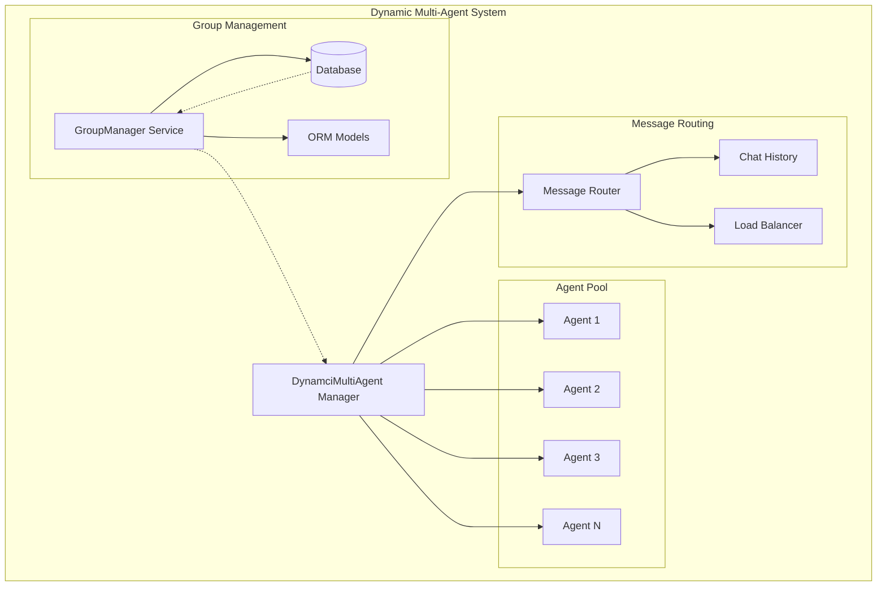
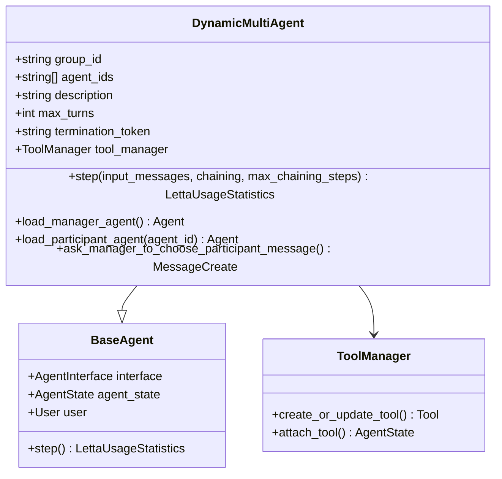
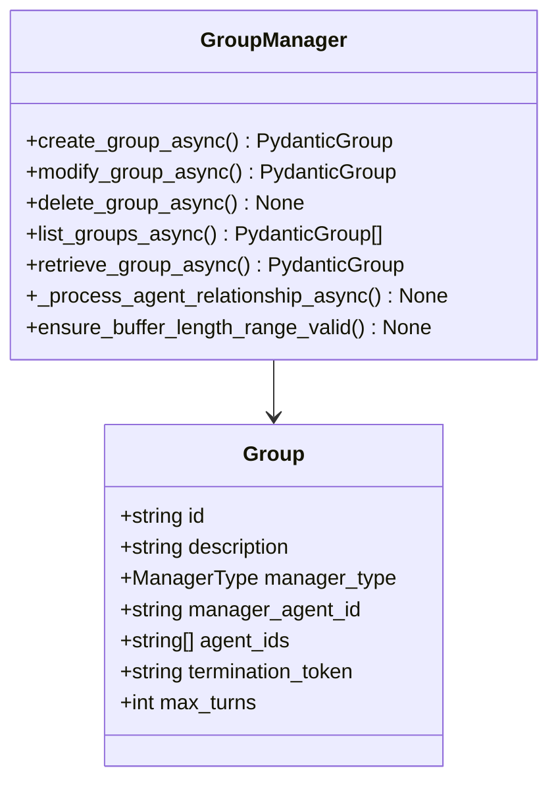
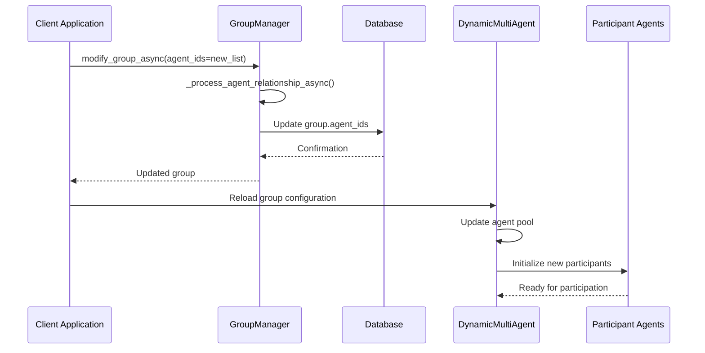
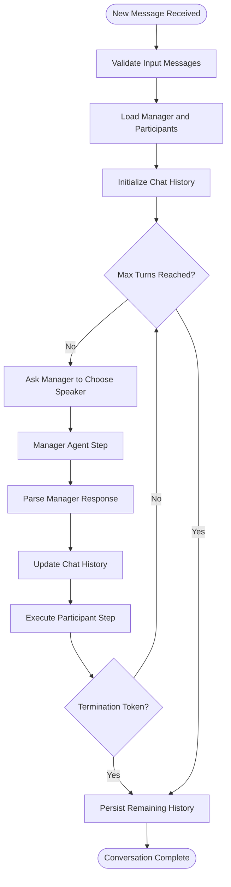
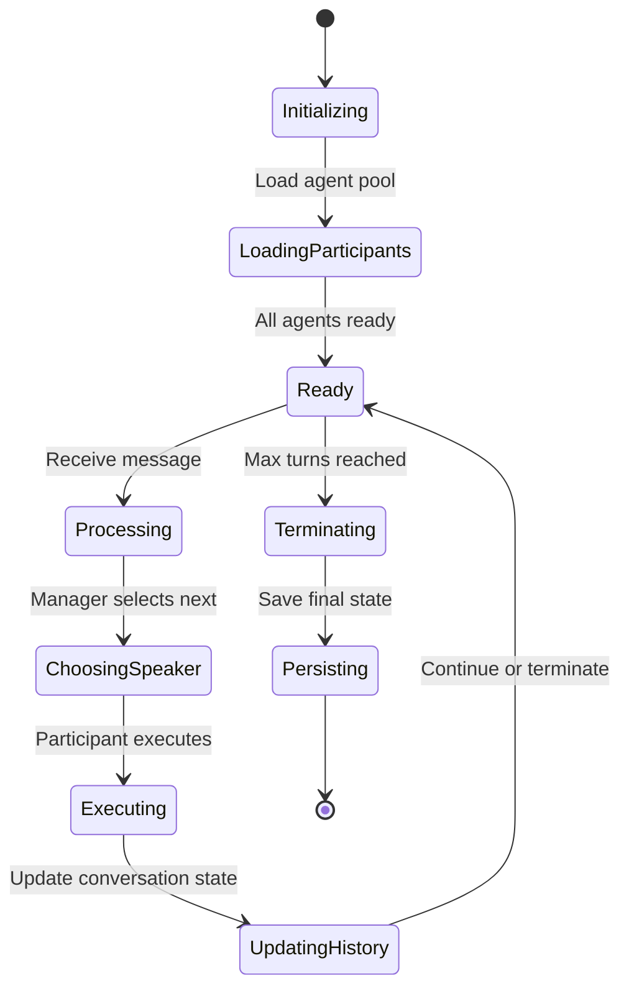
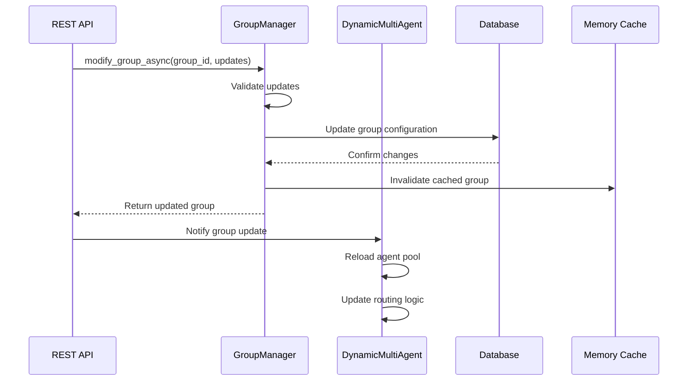
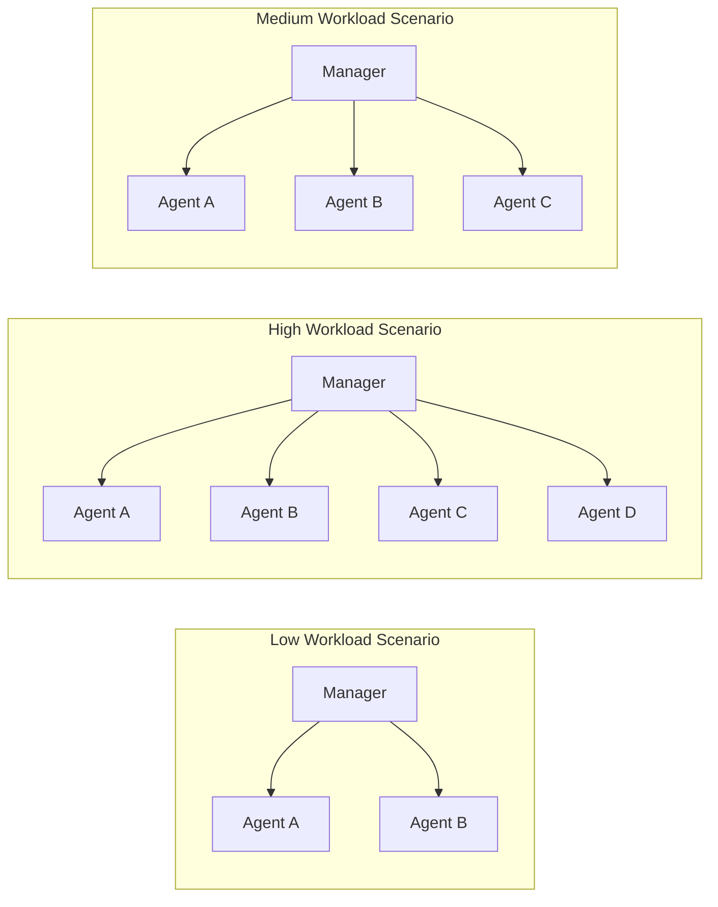

# Dynamic Multi-Agent Coordination

<cite>
**Referenced Files in This Document**
- [dynamic_multi_agent.py](file://letta/groups/dynamic_multi_agent.py)
- [group_manager.py](file://letta/services/group_manager.py)
- [group.py](file://letta/schemas/group.py)
- [helpers.py](file://letta/groups/helpers.py)
- [group.py](file://letta/orm/group.py)
- [groups_agents.py](file://letta/orm/groups_agents.py)
- [integration_test_multi_agent.py](file://tests/integration_test_multi_agent.py)
- [test_multi_agent.py](file://tests/test_multi_agent.py)
</cite>

## Table of Contents
1. [Introduction](#introduction)
2. [Architecture Overview](#architecture-overview)
3. [Core Components](#core-components)
4. [Dynamic Membership Management](#dynamic-membership-management)
5. [Message Routing and Load Distribution](#message-routing-and-load-distribution)
6. [Agent Lifecycle Events](#agent-lifecycle-events)
7. [Integration with GroupManager Service](#integration-with-groupmanager-service)
8. [Configuration Options](#configuration-options)
9. [Use Cases and Scenarios](#use-cases-and-scenarios)
10. [Performance Implications](#performance-implications)
11. [Implementation Examples](#implementation-examples)
12. [Troubleshooting Guide](#troubleshooting-guide)
13. [Conclusion](#conclusion)

## Introduction

The Dynamic Multi-Agent Coordination pattern in Letta enables intelligent teams of AI agents to collaborate seamlessly while maintaining flexibility in agent composition. This architecture allows agents to be dynamically added or removed from groups during runtime based on workload demands, task requirements, or system conditions. The pattern implements sophisticated message routing logic, load distribution strategies, and real-time membership management to create adaptive, elastic agent teams capable of handling variable workloads and failover scenarios.

The DynamicMultiAgent class serves as the central orchestrator for managing agent interactions within a group, implementing a manager-agent pattern where one designated agent (the manager) makes decisions about which participant should speak next based on conversation context and agent capabilities. This approach provides both centralized control and distributed execution capabilities.

## Architecture Overview

The Dynamic Multi-Agent Coordination system follows a hierarchical architecture with clear separation of concerns between management and execution responsibilities:



**Diagram sources**
- [dynamic_multi_agent.py](file://letta/groups/dynamic_multi_agent.py#L15-L279)
- [group_manager.py](file://letta/services/group_manager.py#L25-L540)

The architecture consists of several key layers:

- **Manager Layer**: The DynamicMultiAgent class acts as the coordinator, making routing decisions and managing conversation flow
- **Participant Layer**: Individual agents that execute tasks and respond to messages
- **Management Layer**: GroupManager service handling persistent storage and group lifecycle
- **Routing Layer**: Sophisticated message routing logic with load balancing capabilities

## Core Components

### DynamicMultiAgent Class

The DynamicMultiAgent class is the cornerstone of the dynamic coordination system, inheriting from BaseAgent and implementing the core coordination logic:



**Diagram sources**
- [dynamic_multi_agent.py](file://letta/groups/dynamic_multi_agent.py#L15-L279)

Key attributes and their purposes:

- **group_id**: Unique identifier for the group, enabling persistent management across sessions
- **agent_ids**: Ordered list of participating agent identifiers, maintained for routing decisions
- **description**: Human-readable description of the group's purpose and characteristics
- **max_turns**: Maximum conversation depth before automatic termination
- **termination_token**: Special token indicating conversation completion
- **tool_manager**: Manages dynamic tool creation for participant selection

**Section sources**
- [dynamic_multi_agent.py](file://letta/groups/dynamic_multi_agent.py#L15-L34)

### GroupManager Service

The GroupManager service provides comprehensive group lifecycle management with real-time modification capabilities:



**Diagram sources**
- [group_manager.py](file://letta/services/group_manager.py#L25-L540)
- [group.py](file://letta/schemas/group.py#L27-L70)

**Section sources**
- [group_manager.py](file://letta/services/group_manager.py#L25-L188)

## Dynamic Membership Management

### Runtime Agent Addition and Removal

The system supports dynamic membership changes through the GroupManager service, enabling elastic scaling of agent teams:



**Diagram sources**
- [group_manager.py](file://letta/services/group_manager.py#L189-L200)
- [dynamic_multi_agent.py](file://letta/groups/dynamic_multi_agent.py#L53-L59)

### Validation and Constraints

The system enforces strict validation rules to maintain system integrity:

| Constraint | Description | Enforcement |
|------------|-------------|-------------|
| **Unique Agent IDs** | Prevents duplicate agents in the same group | DynamicMultiAgent.validate_agent_ids() |
| **Unique Agent Names** | Ensures distinct agent identities | GroupManager validates agent names |
| **Manager Agent Requirement** | Designated manager agent must exist | Required during group creation |
| **Minimum Agent Count** | Groups must have at least one participant | Enforced during initialization |

**Section sources**
- [group_manager.py](file://letta/services/group_manager.py#L293-L354)
- [test_multi_agent.py](file://tests/test_multi_agent.py#L374-L437)

## Message Routing and Load Distribution

### Conversation Flow Management

The DynamicMultiAgent implements a sophisticated message routing system that balances load across participants while maintaining conversation coherence:



**Diagram sources**
- [dynamic_multi_agent.py](file://letta/groups/dynamic_multi_agent.py#L37-L177)

### Load Balancing Strategies

The system implements multiple load balancing approaches:

1. **Manager-Based Selection**: The manager agent decides which participant should respond next
2. **Context-Aware Routing**: Decisions based on conversation history and agent capabilities
3. **Turn-Based Fairness**: Ensures all agents get equal opportunity to participate
4. **Workload Distribution**: Balances computational load across available agents

**Section sources**
- [dynamic_multi_agent.py](file://letta/groups/dynamic_multi_agent.py#L72-L98)

## Agent Lifecycle Events

### Event Handling and State Management

The DynamicMultiAgent system manages various lifecycle events through a comprehensive event handling mechanism:



**Diagram sources**
- [dynamic_multi_agent.py](file://letta/groups/dynamic_multi_agent.py#L37-L177)

### Rebalancing Responsibilities

When agents are added or removed, the system automatically rebalances responsibilities:

- **Agent Addition**: New agents are integrated into the participant pool with appropriate initialization
- **Agent Removal**: Removed agents' state is preserved, and remaining agents continue operation
- **Manager Adaptation**: The manager agent updates its internal state to reflect current participant availability
- **Load Redistribution**: Computational load is redistributed among remaining agents

**Section sources**
- [dynamic_multi_agent.py](file://letta/groups/dynamic_multi_agent.py#L179-L228)

## Integration with GroupManager Service

### Real-Time Group Modifications

The GroupManager service provides seamless integration with the DynamicMultiAgent system for real-time group modifications:



**Diagram sources**
- [group_manager.py](file://letta/services/group_manager.py#L189-L200)

### Database Schema Integration

The system leverages a robust database schema supporting dynamic group management:

| Table | Purpose | Key Columns |
|-------|---------|-------------|
| **groups** | Group metadata and configuration | id, description, manager_type, agent_ids |
| **groups_agents** | Many-to-many relationship | group_id, agent_id |
| **groups_blocks** | Shared block associations | group_id, block_id |

**Section sources**
- [group.py](file://letta/orm/group.py#L12-L39)
- [groups_agents.py](file://letta/orm/groups_agents.py#L7-L14)

## Configuration Options

### Dynamic Thresholds and Policies

The DynamicMultiAgent system supports extensive configuration options for tailoring behavior to specific use cases:

| Configuration Parameter | Type | Default | Description |
|------------------------|------|---------|-------------|
| **max_turns** | int | Length of agent_ids | Maximum conversation depth |
| **termination_token** | string | "DONE!" | Token indicating conversation completion |
| **manager_agent_id** | string | Required | ID of the manager agent |
| **description** | string | "" | Human-readable group description |

### Advanced Configuration Examples

#### Elastic Workload Configuration
```python
# High-throughput configuration
group_config = {
    "max_turns": 20,
    "termination_token": "WORK_COMPLETE",
    "description": "High-performance analytics team"
}

# Low-latency configuration  
group_config = {
    "max_turns": 5,
    "termination_token": "TASK_DONE",
    "description": "Real-time response team"
}
```

#### Failover Configuration
```python
# Redundant agent configuration
group_config = {
    "max_turns": 10,
    "termination_token": "MISSION_COMPLETE",
    "description": "Mission-critical backup team"
}
```

**Section sources**
- [group.py](file://letta/schemas/group.py#L104-L116)
- [group_manager.py](file://letta/services/group_manager.py#L82-L162)

## Use Cases and Scenarios

### Elastic Agent Teams for Variable Workloads

The DynamicMultiAgent pattern excels in scenarios requiring adaptive team sizes:



**Diagram sources**
- [integration_test_multi_agent.py](file://tests/integration_test_multi_agent.py#L374-L437)

### Failover Scenarios

The system provides robust failover capabilities:

1. **Agent Failure Recovery**: Automatic detection and rerouting when agents become unavailable
2. **Manager Agent Failover**: Alternative manager agents can take over coordination duties
3. **Graceful Degradation**: Reduced functionality with fewer agents rather than complete failure
4. **State Preservation**: Conversation state maintained even during agent failures

### Adaptive System Scaling

Dynamic scaling enables efficient resource utilization:

- **Horizontal Scaling**: Adding agents during peak demand periods
- **Vertical Scaling**: Increasing agent capabilities through shared resources
- **Auto-scaling**: Automated adjustments based on workload metrics
- **Cost Optimization**: Resource allocation based on actual usage patterns

**Section sources**
- [test_multi_agent.py](file://tests/test_multi_agent.py#L152-L275)

## Performance Implications

### Impact of Frequent Reconfiguration

Frequent dynamic reconfiguration can impact system performance in several ways:

#### Memory and CPU Considerations
- **Agent Initialization Overhead**: Creating new agent instances requires computational resources
- **State Synchronization**: Maintaining consistency across distributed agents
- **Memory Footprint**: Each agent maintains its own state and context
- **Garbage Collection**: Managing agent lifecycles reduces memory pressure

#### Network and Communication Costs
- **Inter-Agent Communication**: Message passing between agents increases network traffic
- **Coordination Overhead**: Manager-agent communication adds latency
- **Synchronization Points**: Coordinating agent states across the group
- **Bandwidth Utilization**: Shared resources require careful bandwidth management

### Optimization Strategies

To mitigate performance impacts, the system implements several optimization strategies:

1. **Lazy Loading**: Agents are initialized only when needed
2. **Connection Pooling**: Reusing network connections between agents
3. **State Caching**: Caching frequently accessed agent states
4. **Batch Processing**: Grouping related operations for efficiency
5. **Resource Pooling**: Sharing expensive resources across agents

### Monitoring and Metrics

Key performance indicators for monitoring dynamic multi-agent systems:

| Metric | Description | Threshold |
|--------|-------------|-----------|
| **Agent Creation Time** | Time to initialize new agents | < 5 seconds |
| **Message Latency** | End-to-end message processing time | < 100ms |
| **Throughput** | Messages processed per second | > 10 msg/sec |
| **Memory Usage** | Peak memory consumption | < 2GB per group |
| **CPU Utilization** | Average CPU usage | < 80% |

**Section sources**
- [dynamic_multi_agent.py](file://letta/groups/dynamic_multi_agent.py#L37-L177)

## Implementation Examples

### Basic Dynamic Group Setup

Here's how to create and configure a basic dynamic multi-agent group:

```python
# Example implementation pattern (not actual code)
# See dynamic_multi_agent.py for actual implementation
```

**Section sources**
- [integration_test_multi_agent.py](file://tests/integration_test_multi_agent.py#L374-L437)

### Advanced Configuration Patterns

The system supports sophisticated configuration patterns for specialized use cases:

#### Multi-Domain Expertise
```python
# Configuration for specialized domains
expert_group_config = {
    "description": "Technical problem-solving team",
    "max_turns": 15,
    "termination_token": "PROBLEM_SOLVED"
}
```

#### Collaborative Research
```python
# Configuration for research collaboration
research_group_config = {
    "description": "Cross-disciplinary research team",
    "max_turns": 25,
    "termination_token": "RESEARCH_COMPLETE"
}
```

**Section sources**
- [test_multi_agent.py](file://tests/test_multi_agent.py#L374-L437)

## Troubleshooting Guide

### Common Issues and Solutions

#### Agent Initialization Failures
**Symptoms**: Agents fail to initialize or become unresponsive
**Causes**: 
- Insufficient system resources
- Network connectivity issues
- Configuration conflicts

**Solutions**:
- Verify system resource availability
- Check network connectivity between agents
- Review agent configuration parameters

#### Message Routing Problems
**Symptoms**: Messages not reaching intended recipients
**Causes**:
- Incorrect agent ID assignments
- Manager agent misconfiguration
- Network partitioning

**Solutions**:
- Validate agent ID lists
- Verify manager agent setup
- Check network infrastructure

#### Performance Degradation
**Symptoms**: Slow response times or high resource usage
**Causes**:
- Too many concurrent agents
- Insufficient system resources
- Inefficient message routing

**Solutions**:
- Optimize agent count
- Scale system resources
- Review routing algorithms

### Debugging Tools and Techniques

The system provides several debugging capabilities:

1. **Logging Integration**: Comprehensive logging for all system events
2. **Metrics Collection**: Real-time performance monitoring
3. **State Inspection**: Ability to inspect agent states and configurations
4. **Event Tracing**: Detailed event flow tracking for debugging

**Section sources**
- [dynamic_multi_agent.py](file://letta/groups/dynamic_multi_agent.py#L170-L177)

## Conclusion

The Dynamic Multi-Agent Coordination pattern represents a sophisticated approach to building flexible, scalable AI agent systems. By combining the DynamicMultiAgent class with the GroupManager service, the system achieves remarkable flexibility in agent composition while maintaining robust coordination and communication capabilities.

Key benefits of this architecture include:

- **Elastic Scalability**: Dynamic addition and removal of agents based on workload
- **Fault Tolerance**: Robust failover mechanisms and graceful degradation
- **Adaptive Behavior**: Intelligent load balancing and resource allocation
- **Persistent State**: Reliable state management across agent lifecycle events
- **Flexible Configuration**: Extensive customization options for diverse use cases

The system's design enables organizations to build AI-powered teams that can adapt to changing requirements, handle variable workloads efficiently, and maintain reliability under various operational conditions. As AI agent technology continues to evolve, this dynamic coordination pattern provides a solid foundation for building increasingly sophisticated multi-agent systems.

Future enhancements may include advanced machine learning-based routing algorithms, improved resource optimization techniques, and enhanced monitoring and observability features to further improve the system's adaptability and performance.