# Multi-Agent Systems

<cite>
**Referenced Files in This Document**   
- [dynamic_multi_agent.py](file://letta/groups/dynamic_multi_agent.py)
- [round_robin_multi_agent.py](file://letta/groups/round_robin_multi_agent.py)
- [sleeptime_multi_agent.py](file://letta/groups/sleeptime_multi_agent.py)
- [supervisor_multi_agent.py](file://letta/groups/supervisor_multi_agent.py)
- [group_manager.py](file://letta/services/group_manager.py)
- [group.py](file://letta/orm/group.py)
- [groups_blocks.py](file://letta/orm/groups_blocks.py)
- [multi_agent.py](file://letta/functions/function_sets/multi_agent.py)
- [sleeptime_multi_agent_v2.py](file://letta/groups/sleeptime_multi_agent_v2.py)
- [sleeptime_multi_agent_v3.py](file://letta/groups/sleeptime_multi_agent_v3.py)
- [shared_memory_system_prompt.txt](file://examples/notebooks/data/shared_memory_system_prompt.txt)
- [task_queue_system_prompt.txt](file://examples/notebooks/data/task_queue_system_prompt.txt)
</cite>

## Table of Contents
1. [Introduction](#introduction)
2. [Multi-Agent Patterns](#multi-agent-patterns)
3. [Group Lifecycle Management](#group-lifecycle-management)
4. [Memory Sharing and Coordination](#memory-sharing-and-coordination)
5. [Sleep-Time Agents](#sleep-time-agents)
6. [Use Cases](#use-cases)
7. [Configuration and Performance Tuning](#configuration-and-performance-tuning)
8. [Challenges and Debugging](#challenges-and-debugging)

## Introduction
Letta's multi-agent system enables coordinated collaboration between multiple AI agents through various architectural patterns. The system supports dynamic, round-robin, sleep-time, and supervisor-worker architectures, allowing for flexible agent organization and task distribution. Agents within groups share memory blocks and coordinate through message passing, enabling complex collaborative behaviors. This documentation details the implementation of these multi-agent capabilities, including group lifecycle management, memory sharing mechanisms, and specialized agent types for background processing.

## Multi-Agent Patterns
Letta supports several multi-agent coordination patterns, each designed for different collaboration scenarios and workflow requirements.

### Dynamic Multi-Agent Architecture
The dynamic multi-agent pattern uses a manager agent to dynamically select which participant agent should respond next based on the conversation context. The manager agent evaluates the chat history and determines the most appropriate agent to continue the conversation.

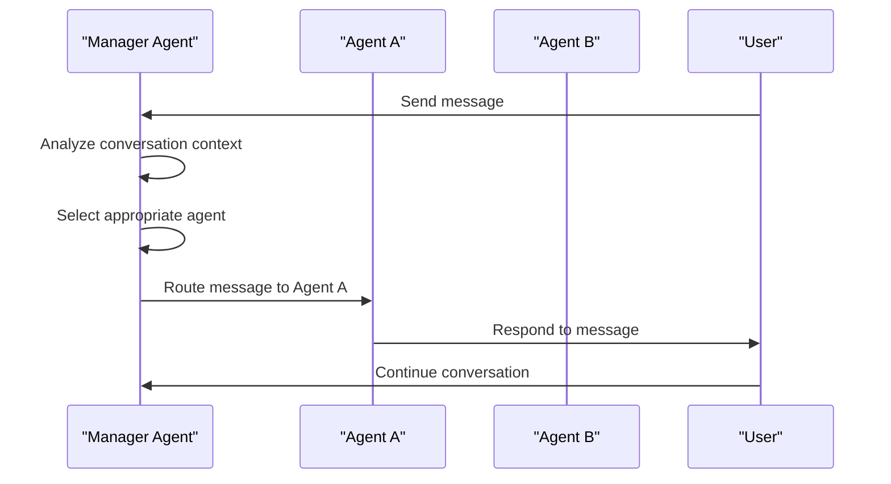

**Diagram sources**
- [dynamic_multi_agent.py](file://letta/groups/dynamic_multi_agent.py#L15-L279)

**Section sources**
- [dynamic_multi_agent.py](file://letta/groups/dynamic_multi_agent.py#L15-L279)

### Round-Robin Multi-Agent Architecture
The round-robin pattern cycles through agents in a predetermined order, ensuring each agent gets a turn to respond. This approach provides equitable participation and is useful for scenarios requiring balanced contribution from all group members.

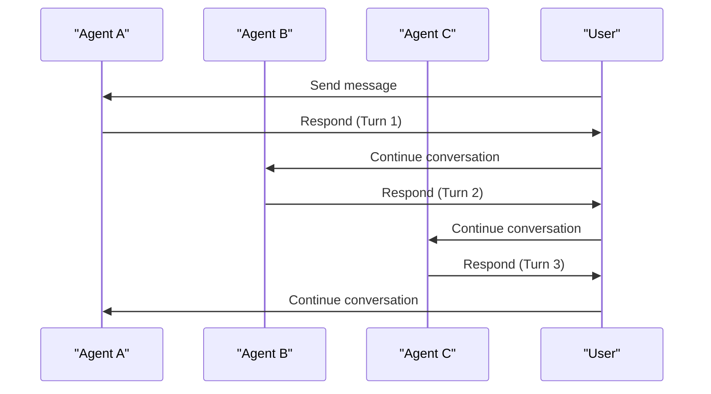

**Diagram sources**
- [round_robin_multi_agent.py](file://letta/groups/round_robin_multi_agent.py#L13-L161)

**Section sources**
- [round_robin_multi_agent.py](file://letta/groups/round_robin_multi_agent.py#L13-L161)

### Supervisor-Worker Architecture
The supervisor-worker pattern designates a manager agent that coordinates tasks among worker agents. The supervisor agent maintains oversight of the group's activities and delegates specific tasks to appropriate worker agents based on their capabilities.

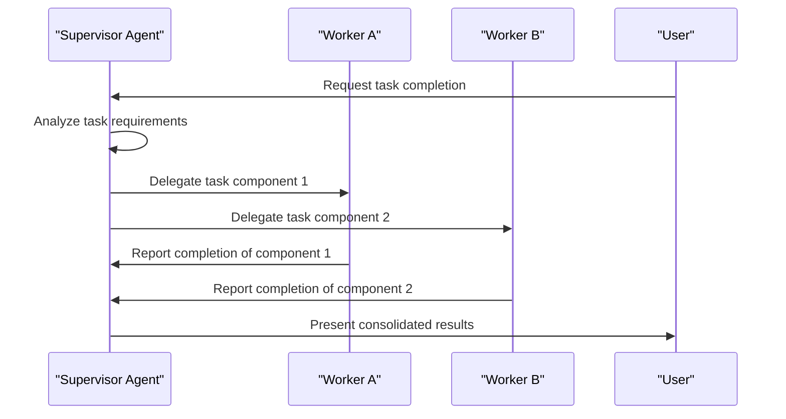

**Diagram sources**
- [supervisor_multi_agent.py](file://letta/groups/supervisor_multi_agent.py#L21-L121)

**Section sources**
- [supervisor_multi_agent.py](file://letta/groups/supervisor_multi_agent.py#L21-L121)

## Group Lifecycle Management
The group lifecycle in Letta encompasses creation, member assignment, execution coordination, and termination of multi-agent groups.

### Group Creation and Configuration
Groups are created through the GroupManager service, which handles the initialization of group properties and relationships. The creation process involves specifying the group pattern, member agents, and configuration parameters.

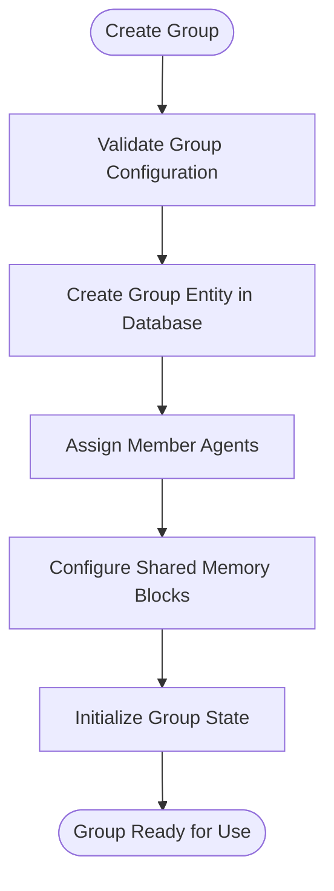

**Diagram sources**
- [group_manager.py](file://letta/services/group_manager.py#L76-L123)
- [group.py](file://letta/orm/group.py#L12-L39)

**Section sources**
- [group_manager.py](file://letta/services/group_manager.py#L76-L123)
- [group.py](file://letta/orm/group.py#L12-L39)

### Member Assignment and Management
Agents are assigned to groups through relationship management in the database. The system maintains bidirectional relationships between groups and agents, allowing for efficient querying and management of group membership.

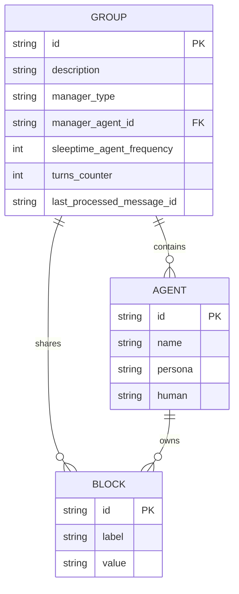

**Diagram sources**
- [group.py](file://letta/orm/group.py#L30-L37)
- [groups_agents.py](file://letta/orm/groups_agents.py#L7-L14)
- [groups_blocks.py](file://letta/orm/groups_blocks.py#L7-L13)

**Section sources**
- [group.py](file://letta/orm/group.py#L12-L39)
- [groups_agents.py](file://letta/orm/groups_agents.py#L7-L14)
- [groups_blocks.py](file://letta/orm/groups_blocks.py#L7-L13)

## Memory Sharing and Coordination
Multi-agent groups in Letta coordinate through shared memory blocks and message passing mechanisms.

### Shared Memory Implementation
Groups can share memory blocks that are automatically distributed to all member agents. When a block is attached to a group, it becomes accessible to all agents within that group, enabling consistent context across the collaboration.

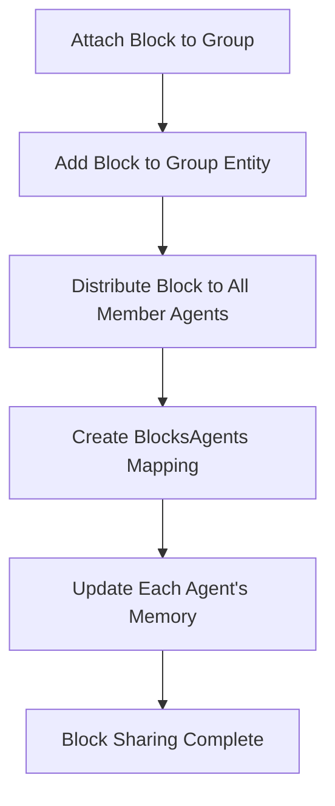

**Diagram sources**
- [group_manager.py](file://letta/services/group_manager.py#L364-L414)
- [groups_blocks.py](file://letta/orm/groups_blocks.py#L7-L13)

**Section sources**
- [group_manager.py](file://letta/services/group_manager.py#L364-L414)
- [groups_blocks.py](file://letta/orm/groups_blocks.py#L7-L13)

### Message Passing and Coordination
Agents within a group communicate through a centralized message system that routes messages according to the group's coordination pattern. The message passing infrastructure ensures reliable delivery and maintains conversation history.

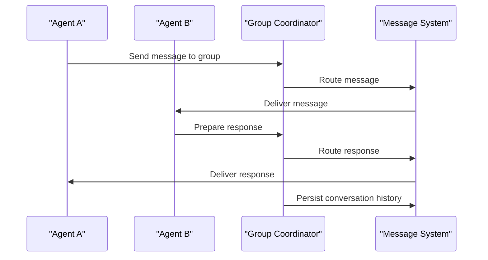

**Section sources**
- [dynamic_multi_agent.py](file://letta/groups/dynamic_multi_agent.py#L37-L176)
- [round_robin_multi_agent.py](file://letta/groups/round_robin_multi_agent.py#L31-L132)

## Sleep-Time Agents
Sleep-time agents are specialized agents designed for background processing and memory maintenance tasks that execute periodically or in response to specific triggers.

### Background Processing Architecture
Sleep-time agents operate on a schedule or frequency-based system, where they are activated after a specified number of interaction turns. This allows for periodic maintenance tasks without interfering with primary conversation flows.

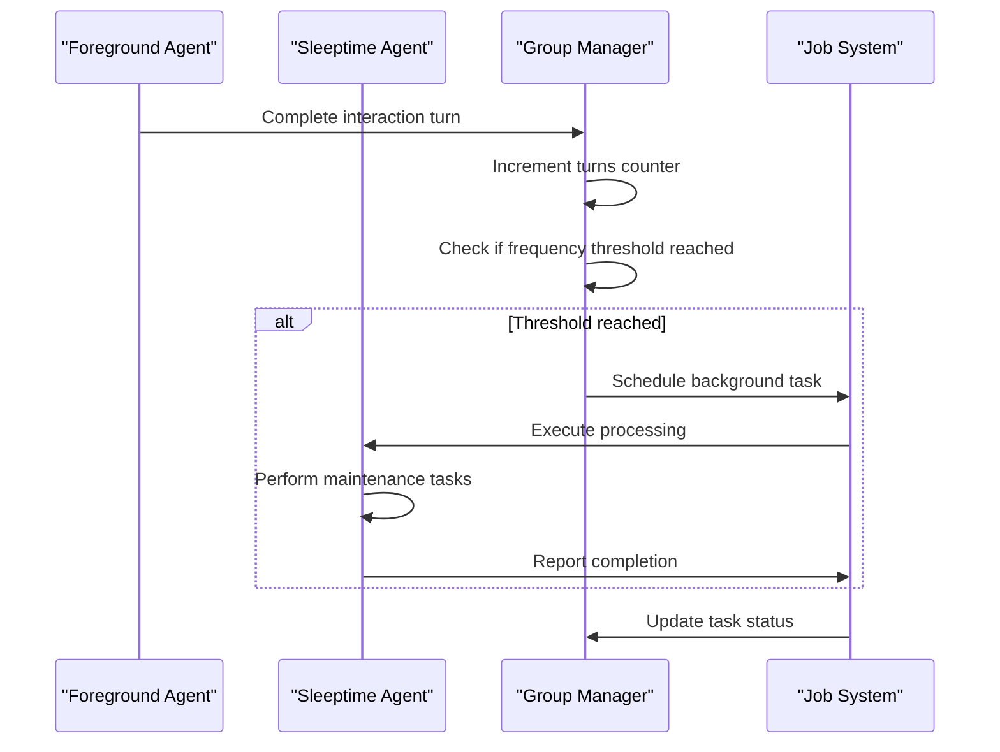

**Diagram sources**
- [sleeptime_multi_agent.py](file://letta/groups/sleeptime_multi_agent.py#L23-L291)
- [sleeptime_multi_agent_v2.py](file://letta/groups/sleeptime_multi_agent_v2.py#L30-L337)

**Section sources**
- [sleeptime_multi_agent.py](file://letta/groups/sleeptime_multi_agent.py#L23-L291)
- [sleeptime_multi_agent_v2.py](file://letta/groups/sleeptime_multi_agent_v2.py#L30-L337)

### Memory Maintenance and Processing
Sleep-time agents can perform various background tasks such as memory summarization, archival, and optimization. These agents help maintain system performance and ensure memory efficiency over extended interactions.

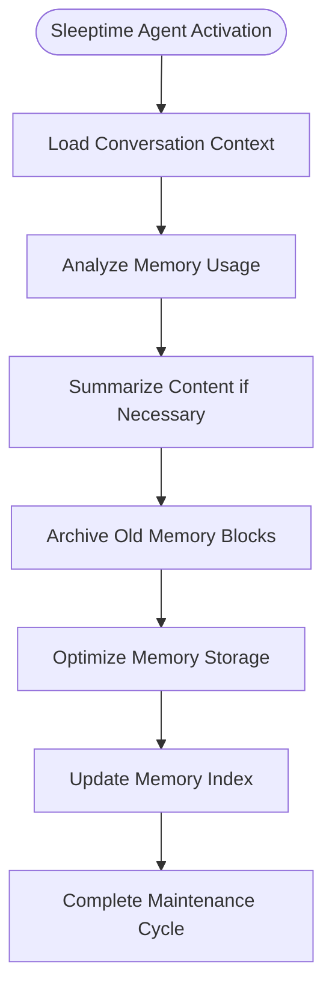

**Section sources**
- [sleeptime_multi_agent.py](file://letta/groups/sleeptime_multi_agent.py#L100-L189)
- [sleeptime_multi_agent_v3.py](file://letta/groups/sleeptime_multi_agent_v3.py#L159-L231)

## Use Cases
Letta's multi-agent system supports various collaborative scenarios and organizational structures.

### Collaborative Problem Solving
Multiple agents with specialized expertise can collaborate to solve complex problems by combining their knowledge and capabilities. The dynamic pattern is particularly effective for this use case, as it allows the system to route questions to the most appropriate expert agent.

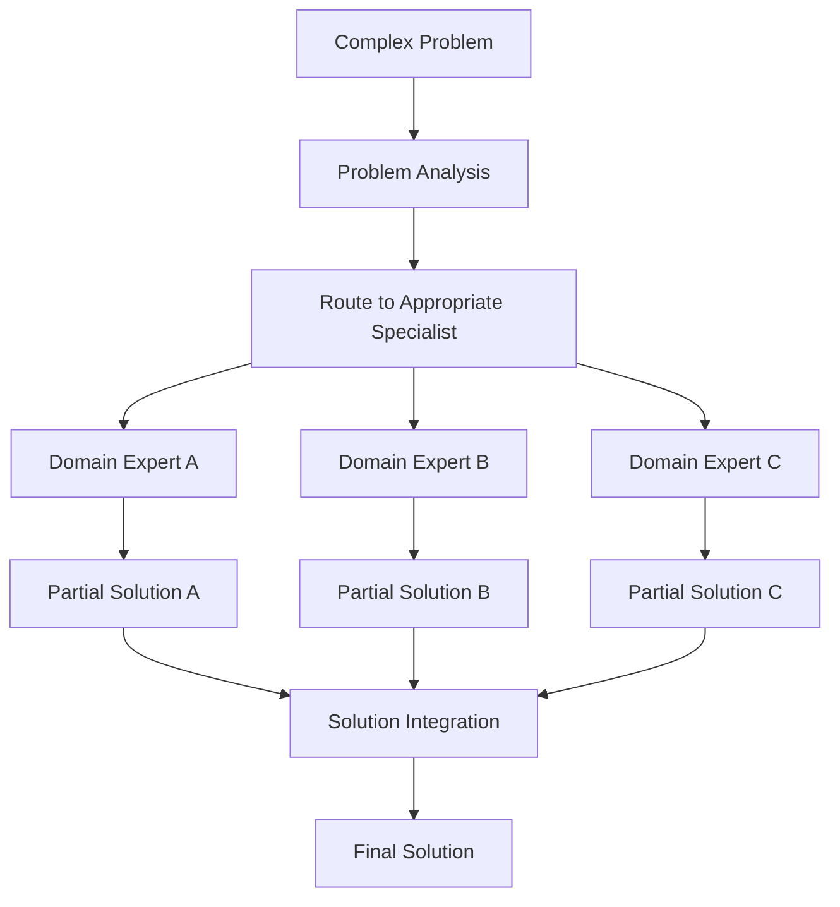

**Section sources**
- [multi_agent.py](file://letta/functions/function_sets/multi_agent.py#L18-L158)
- [dynamic_multi_agent.py](file://letta/groups/dynamic_multi_agent.py#L73-L98)

### Distributed Task Processing
The system can distribute tasks across multiple agents for parallel processing, improving efficiency and throughput. The broadcast capabilities allow a manager agent to delegate tasks to multiple worker agents simultaneously.

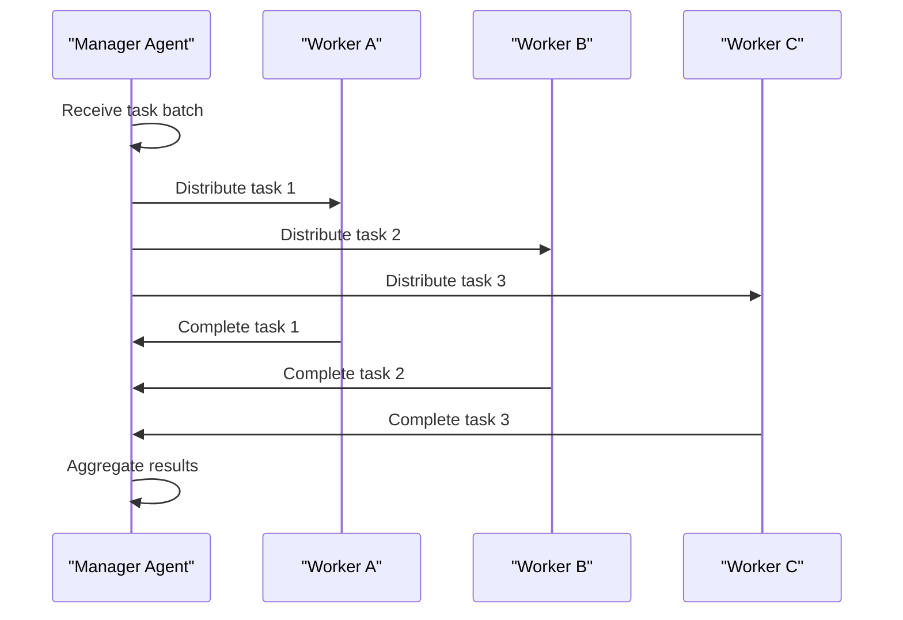

**Section sources**
- [multi_agent.py](file://letta/functions/function_sets/multi_agent.py#L44-L109)
- [integration_test_multi_agent.py](file://tests/integration_test_multi_agent.py#L245-L375)

### Hierarchical Agent Organizations
The supervisor-worker pattern enables hierarchical organizations where a central agent coordinates the activities of multiple subordinate agents. This structure is useful for managing complex workflows with clear division of responsibilities.

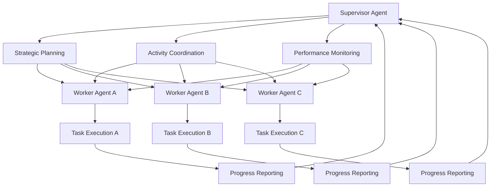

**Section sources**
- [supervisor_multi_agent.py](file://letta/groups/supervisor_multi_agent.py#L21-L121)
- [multi_agent.py](file://letta/functions/function_sets/multi_agent.py#L112-L125)

## Configuration and Performance Tuning
The multi-agent system provides various configuration options to optimize group behavior and performance.

### Group Behavior Configuration
Groups can be configured with specific parameters that control their behavior, including turn limits, termination conditions, and processing frequencies.

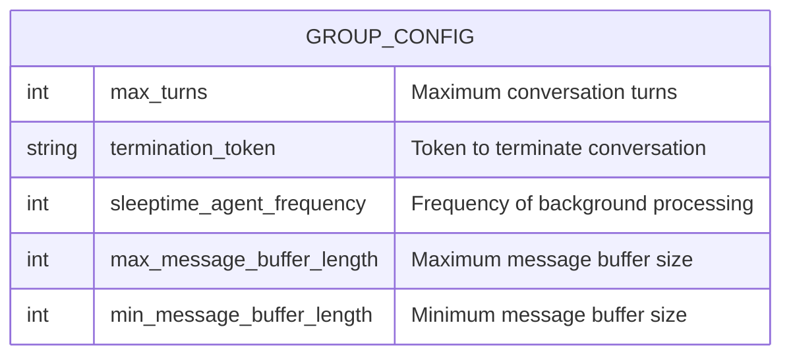

**Section sources**
- [group.py](file://letta/orm/group.py#L16-L27)
- [group_manager.py](file://letta/services/group_manager.py#L82-L110)

### Performance Optimization Settings
The system includes settings to optimize performance, particularly for groups with sleep-time agents that perform background processing. Buffer length configurations help balance memory usage and processing efficiency.

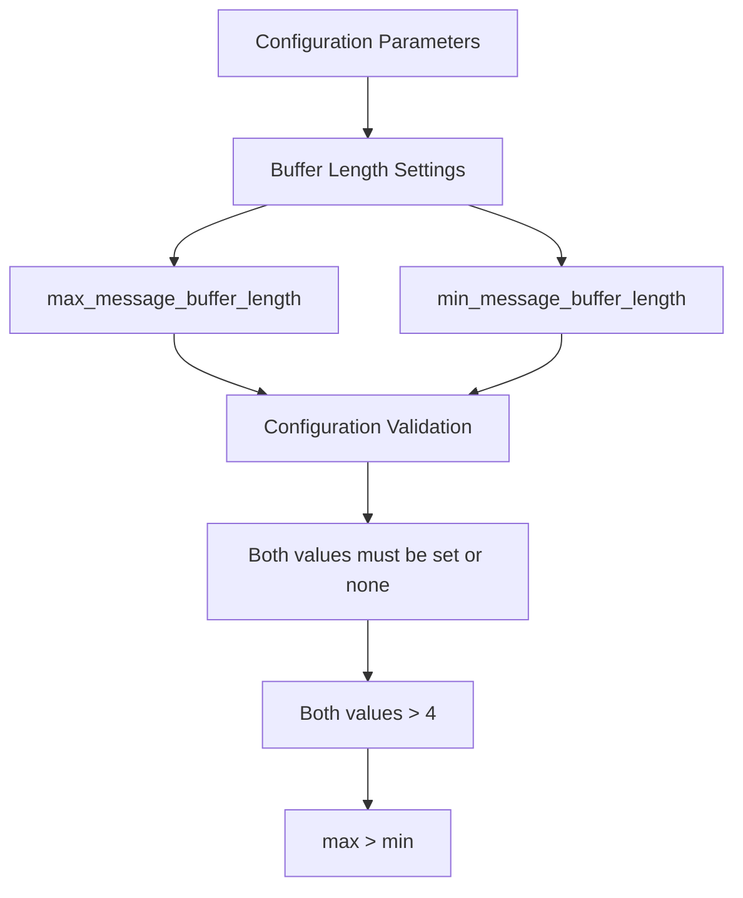

**Diagram sources**
- [group_manager.py](file://letta/services/group_manager.py#L458-L493)

**Section sources**
- [group_manager.py](file://letta/services/group_manager.py#L458-L493)
- [integration_test_voice_agent.py](file://tests/integration_test_voice_agent.py#L576-L612)

## Challenges and Debugging
Multi-agent systems present unique challenges in synchronization and debugging distributed interactions.

### Synchronization Challenges
Coordinating multiple agents requires careful management of state, timing, and resource access to prevent conflicts and ensure consistent behavior across the system.

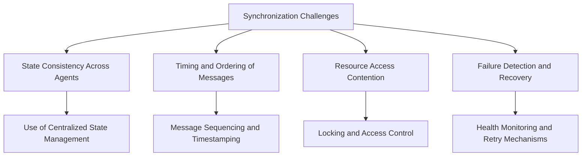

**Section sources**
- [sleeptime_multi_agent.py](file://letta/groups/sleeptime_multi_agent.py#L47-L62)
- [sleeptime_multi_agent_v2.py](file://letta/groups/sleeptime_multi_agent_v2.py#L240-L251)

### Debugging Distributed Interactions
Debugging multi-agent systems requires specialized tools and approaches to trace interactions across multiple agents and identify issues in distributed workflows.

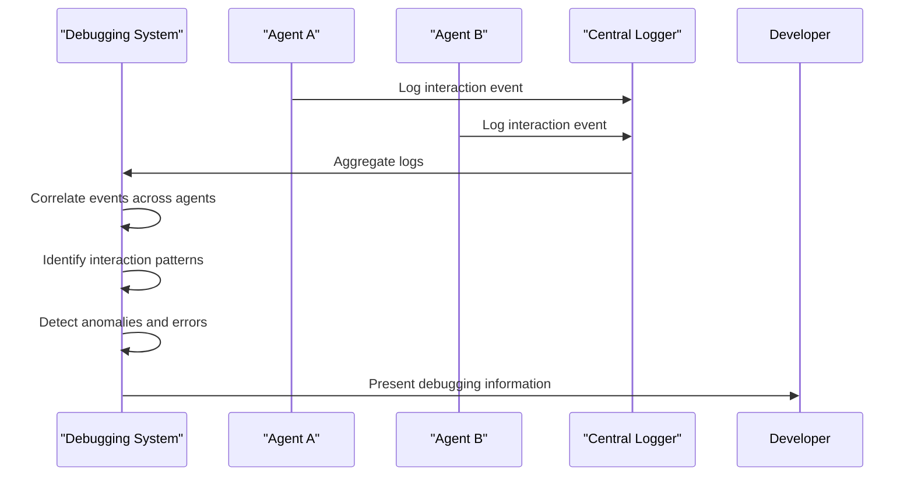

**Section sources**
- [sleeptime_multi_agent.py](file://letta/groups/sleeptime_multi_agent.py#L113-L189)
- [sleeptime_multi_agent_v3.py](file://letta/groups/sleeptime_multi_agent_v3.py#L168-L231)