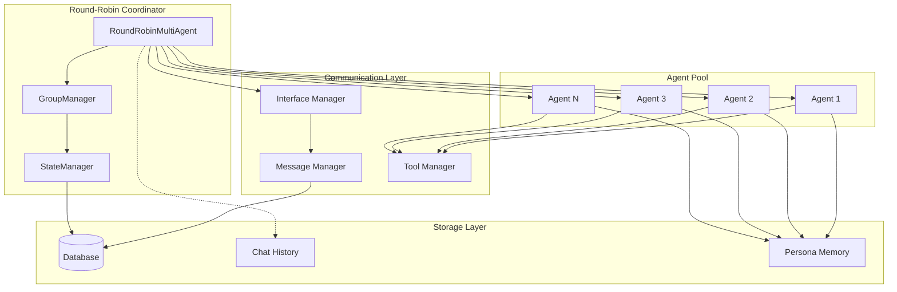
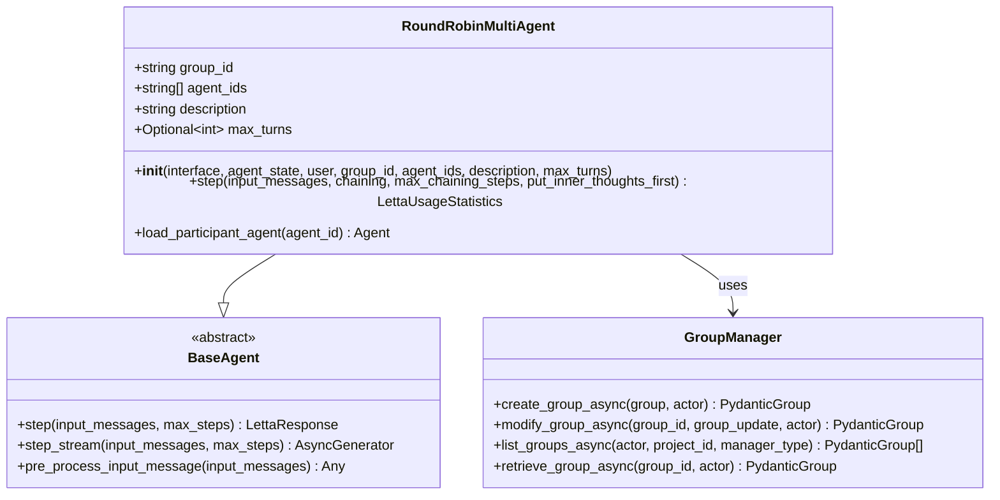
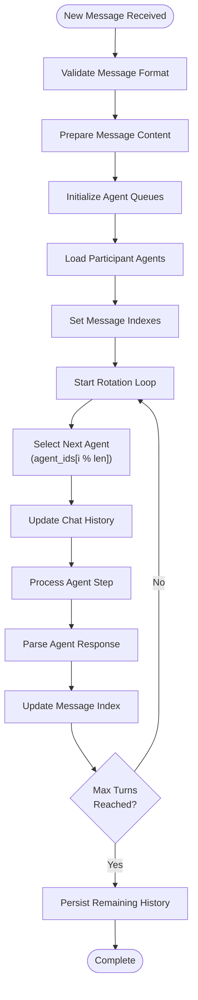
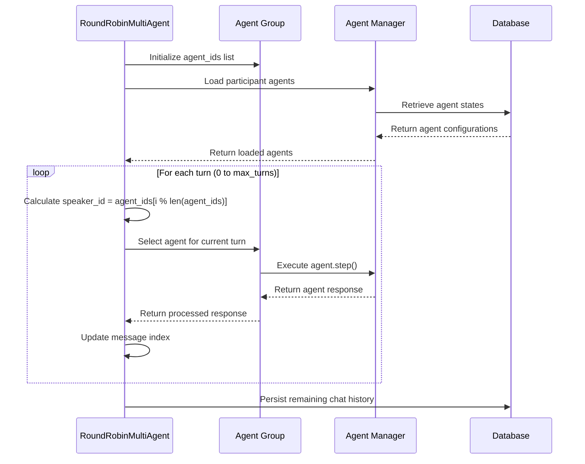
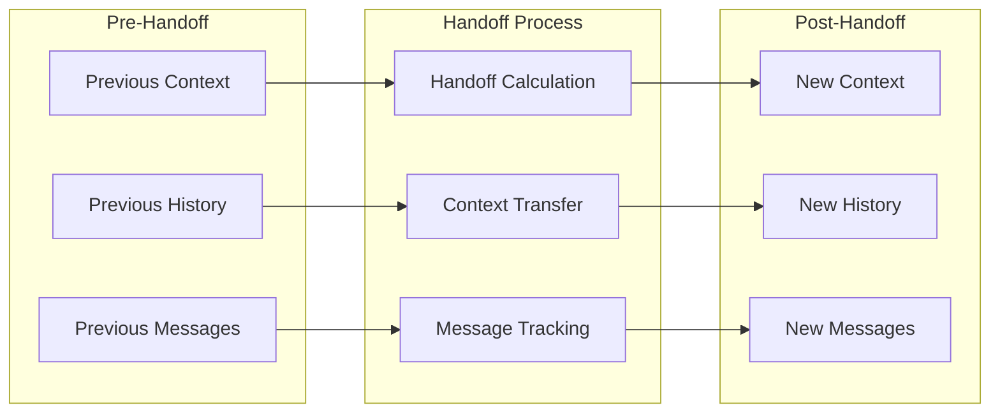
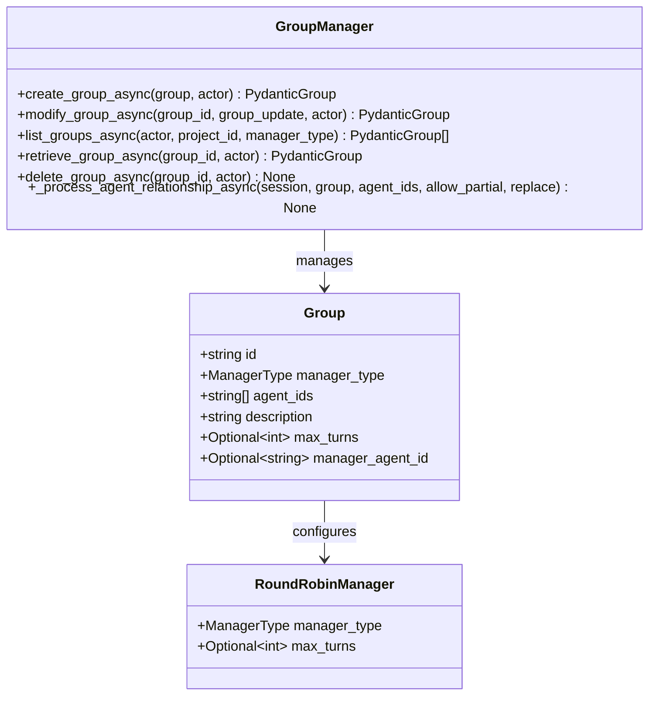
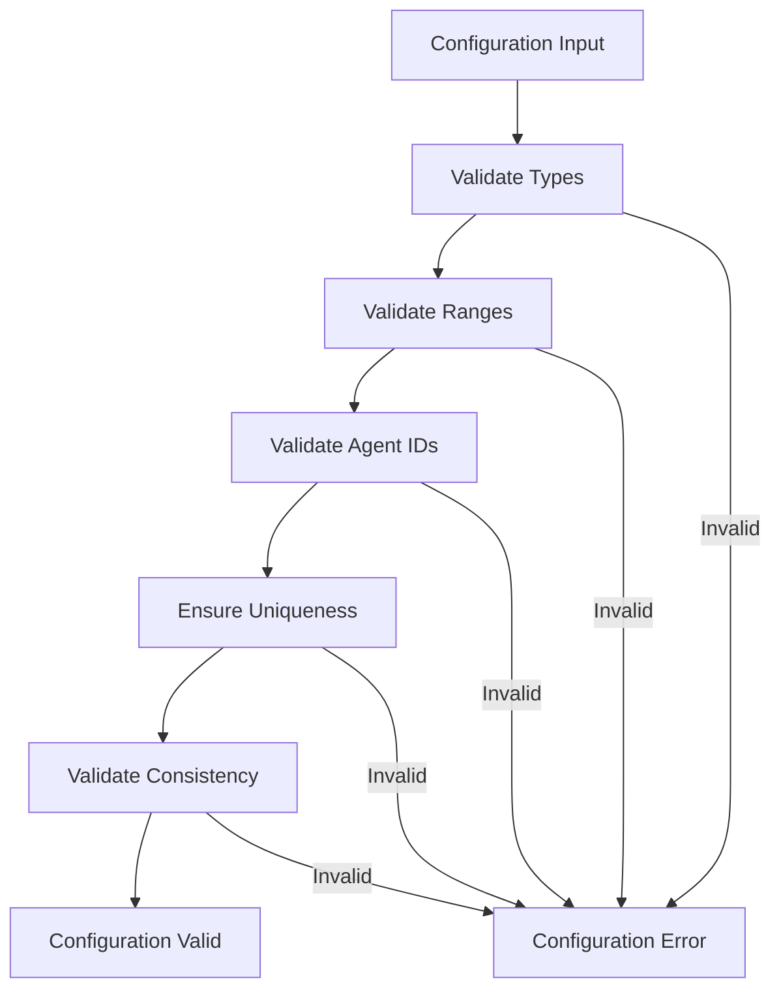
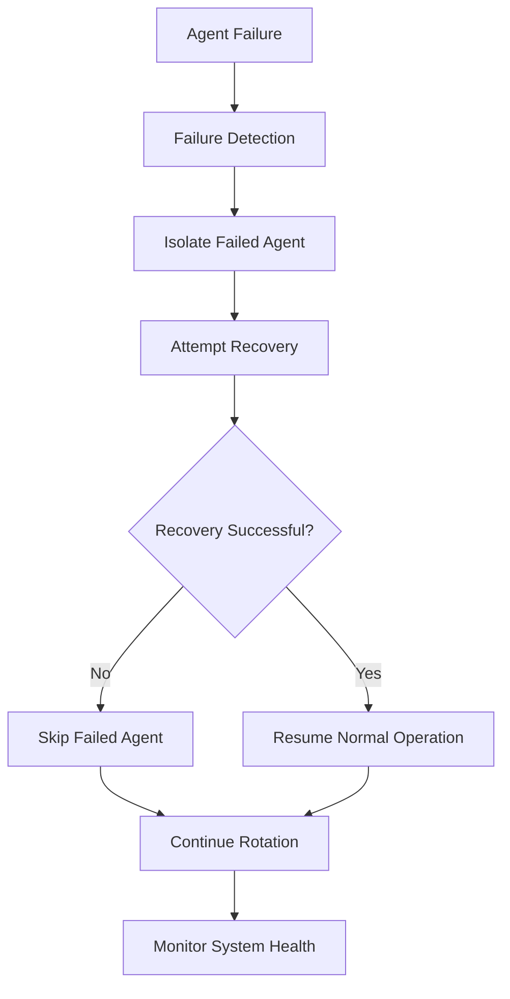

# Round-Robin Multi-Agent Coordination Pattern

<cite>
**Referenced Files in This Document**
- [round_robin_multi_agent.py](file://letta/groups/round_robin_multi_agent.py)
- [group_manager.py](file://letta/services/group_manager.py)
- [helpers.py](file://letta/groups/helpers.py)
- [base_agent.py](file://letta/agents/base_agent.py)
- [group.py](file://letta/schemas/group.py)
- [message.py](file://letta/schemas/message.py)
- [test_multi_agent.py](file://tests/test_multi_agent.py)
- [multi_agent.py](file://letta/functions/function_sets/multi_agent.py)
- [sleeptime_multi_agent_v4.py](file://letta/groups/sleeptime_multi_agent_v4.py)
</cite>

## Table of Contents
1. [Introduction](#introduction)
2. [Architecture Overview](#architecture-overview)
3. [Core Components](#core-components)
4. [Task Queuing Mechanism](#task-queuing-mechanism)
5. [Agent Selection Logic](#agent-selection-logic)
6. [Handoff Protocols](#handoff-protocols)
7. [Integration with GroupManager](#integration-with-groupmanager)
8. [Configuration Options](#configuration-options)
9. [Use Cases](#use-cases)
10. [Trade-offs and Fault Tolerance](#trade-offs-and-fault-tolerance)
11. [Implementation Examples](#implementation-examples)
12. [Troubleshooting Guide](#troubleshooting-guide)

## Introduction

The Round-Robin Multi-Agent coordination pattern is a distributed task management system that ensures balanced workload distribution among multiple AI agents by sequentially assigning tasks in a circular fashion. This pattern implements a fair scheduling algorithm where each agent takes turns processing messages and participating in group conversations, guaranteeing equal opportunity for all participants while maintaining predictable execution order.

The implementation leverages the `RoundRobinMultiAgent` class, which extends the `BaseAgent` foundation to coordinate multiple agents within a group. This architecture is particularly effective for scenarios requiring fair resource allocation, polling systems, batch processing pipelines, and collaborative problem-solving environments where all agents should have equal participation opportunities.

## Architecture Overview

The Round-Robin Multi-Agent system follows a hierarchical architecture with clear separation of concerns between coordination, communication, and execution layers.



**Diagram sources**
- [round_robin_multi_agent.py](file://letta/groups/round_robin_multi_agent.py#L13-L161)
- [group_manager.py](file://letta/services/group_manager.py#L25-L540)

The architecture consists of several key layers:

- **Coordinator Layer**: The `RoundRobinMultiAgent` class manages agent rotation and task distribution
- **Agent Pool**: Individual AI agents that execute tasks and participate in conversations
- **Communication Infrastructure**: Handles message passing, tool execution, and inter-agent coordination
- **Persistence Layer**: Manages state, chat history, and agent configurations

## Core Components

### RoundRobinMultiAgent Class

The `RoundRobinMultiAgent` class serves as the central coordinator for round-robin task distribution. It inherits from `BaseAgent` and implements the core logic for agent rotation and message processing.



**Diagram sources**
- [round_robin_multi_agent.py](file://letta/groups/round_robin_multi_agent.py#L13-L161)
- [base_agent.py](file://letta/agents/base_agent.py#L28-L202)

**Section sources**
- [round_robin_multi_agent.py](file://letta/groups/round_robin_multi_agent.py#L13-L161)
- [base_agent.py](file://letta/agents/base_agent.py#L28-L202)

### Agent State Management

Each agent maintains its own state while participating in the round-robin system. The state includes:

- **Memory Blocks**: Persona, human, and other memory components
- **Chat History**: Complete conversation history with message indexing
- **Execution Metrics**: Token usage, step counts, and performance statistics
- **Group Context**: Information about the current group and rotation position

### Message Processing Pipeline

The system implements a sophisticated message processing pipeline that handles:

- **Message Validation**: Ensuring message format compliance and content integrity
- **Content Transformation**: Converting between different message formats
- **Routing Logic**: Determining which agent receives each message
- **Response Aggregation**: Collecting and formatting responses from all participants

**Section sources**
- [round_robin_multi_agent.py](file://letta/groups/round_robin_multi_agent.py#L31-L161)

## Task Queuing Mechanism

The Round-Robin Multi-Agent system implements a sequential task queuing mechanism that ensures fair distribution of work across all participating agents. The queuing system operates on a First-In-First-Out (FIFO) basis within each agent's turn.

### Queue Structure and Management



**Diagram sources**
- [round_robin_multi_agent.py](file://letta/groups/round_robin_multi_agent.py#L62-L127)

### Message Lifecycle

The message lifecycle in the round-robin system follows a structured pattern:

1. **Message Reception**: New messages are received and validated
2. **Content Preparation**: Messages are formatted and prepared for distribution
3. **Agent Loading**: All participant agents are loaded with appropriate contexts
4. **Rotation Execution**: Messages are distributed according to the rotation schedule
5. **Response Collection**: Responses are collected and formatted
6. **State Persistence**: Final state is persisted to the database

### Turn-Based Execution

The system implements strict turn-based execution where each agent gets exactly one turn per cycle. The execution order is determined by the agent's position in the `agent_ids` list, ensuring predictable and fair distribution of tasks.

**Section sources**
- [round_robin_multi_agent.py](file://letta/groups/round_robin_multi_agent.py#L62-L127)

## Agent Selection Logic

The agent selection logic in the Round-Robin Multi-Agent system implements a mathematical rotation algorithm that guarantees fair distribution of tasks across all agents.

### Rotation Algorithm



**Diagram sources**
- [round_robin_multi_agent.py](file://letta/groups/round_robin_multi_agent.py#L64-L98)

### Selection Criteria

The agent selection follows these principles:

1. **Sequential Ordering**: Agents are selected in the order they appear in the `agent_ids` list
2. **Modular Arithmetic**: The selection formula `speaker_id = agent_ids[i % len(agent_ids)]` ensures circular rotation
3. **Fair Distribution**: Each agent receives exactly one turn per complete cycle
4. **Predictable Behavior**: The selection order is deterministic and reproducible

### Agent Context Injection

When selecting an agent, the system injects specific context to ensure proper participation:

- **Group Context**: Information about the group and current conversation
- **Role Assignment**: Clear indication of the agent's current role in the conversation
- **Interaction Guidelines**: Rules for appropriate group interaction behavior
- **Personalization**: Agent-specific personality and capabilities

**Section sources**
- [round_robin_multi_agent.py](file://letta/groups/round_robin_multi_agent.py#L64-L98)
- [round_robin_multi_agent.py](file://letta/groups/round_robin_multi_agent.py#L134-L161)

## Handoff Protocols

The Round-Robin Multi-Agent system implements sophisticated handoff protocols that ensure smooth transitions between agents while maintaining conversation continuity and context preservation.

### Context Preservation



**Diagram sources**
- [round_robin_multi_agent.py](file://letta/groups/round_robin_multi_agent.py#L70-L98)

### Message Index Management

The system maintains precise message indices to track conversation flow:

- **Per-Agent Tracking**: Each agent maintains its own message index
- **Incremental Updates**: Indices are updated incrementally after each agent's turn
- **Gap Detection**: The system detects and handles gaps in message sequences
- **Persistence Pointers**: Critical points are marked for state persistence

### Conversation Continuity

To maintain conversation continuity across agent handoffs:

1. **Context Propagation**: Essential context is propagated between agents
2. **State Synchronization**: Agent states are synchronized at handoff points
3. **Error Recovery**: The system can recover from partial failures
4. **Audit Trail**: Complete audit trail of all handoff activities

**Section sources**
- [round_robin_multi_agent.py](file://letta/groups/round_robin_multi_agent.py#L70-L98)
- [round_robin_multi_agent.py](file://letta/groups/round_robin_multi_agent.py#L107-L127)

## Integration with GroupManager

The Round-Robin Multi-Agent system integrates seamlessly with the `GroupManager` service, which provides essential group management capabilities and maintains agent ordering.

### Group Configuration Management



**Diagram sources**
- [group_manager.py](file://letta/services/group_manager.py#L25-L540)
- [group.py](file://letta/schemas/group.py#L27-L87)

### Agent Ordering and Maintenance

The `GroupManager` handles several critical aspects of agent management:

- **Agent Registration**: Maintains the ordered list of agents in the group
- **Relationship Management**: Handles agent-to-group relationships
- **Configuration Updates**: Supports dynamic modification of group settings
- **Validation**: Ensures agent lists meet system requirements

### Dynamic Group Modification

The system supports dynamic modification of group configurations:

- **Agent Addition**: New agents can be added to existing groups
- **Agent Removal**: Existing agents can be removed from groups
- **Order Reordering**: Agent positions can be changed
- **Configuration Updates**: Group-level settings can be modified

**Section sources**
- [group_manager.py](file://letta/services/group_manager.py#L25-L540)
- [helpers.py](file://letta/groups/helpers.py#L14-L73)

## Configuration Options

The Round-Robin Multi-Agent system provides extensive configuration options to customize behavior for different use cases and requirements.

### Basic Configuration Parameters

| Parameter | Type | Description | Default Value |
|-----------|------|-------------|---------------|
| `group_id` | string | Unique identifier for the group | "" |
| `agent_ids` | List[string] | Ordered list of agent identifiers | [] |
| `description` | string | Human-readable group description | "" |
| `max_turns` | Optional[int] | Maximum number of turns per cycle | len(agent_ids) |

### Advanced Configuration Options

The system supports several advanced configuration options:

- **Turn Limitation**: Control the maximum number of turns per cycle
- **Agent Ordering**: Define custom agent ordering for rotation
- **Context Injection**: Configure additional context for agent participation
- **Performance Tuning**: Adjust timeout and retry parameters

### Configuration Validation

The system implements comprehensive validation:



**Diagram sources**
- [group_manager.py](file://letta/services/group_manager.py#L293-L353)

**Section sources**
- [group.py](file://letta/schemas/group.py#L27-L87)
- [group_manager.py](file://letta/services/group_manager.py#L293-L353)

## Use Cases

The Round-Robin Multi-Agent coordination pattern is highly versatile and suitable for various applications requiring fair task distribution and collaborative processing.

### Polling Systems

Round-robin coordination is ideal for implementing polling systems where each agent gets equal opportunity to respond:

- **Survey Processing**: Distribute survey responses across multiple analysis agents
- **Feedback Collection**: Collect and process feedback from multiple sources
- **Data Validation**: Validate data entries using multiple validation agents
- **Quality Assurance**: Implement quality checks with rotating QA agents

### Batch Processing Pipelines

The system excels in batch processing scenarios:

- **Document Processing**: Process documents sequentially with specialized agents
- **Data Transformation**: Transform data through multiple processing stages
- **Content Moderation**: Moderate content using rotating moderation agents
- **Report Generation**: Generate reports using specialized reporting agents

### Collaborative Problem Solving

The round-robin pattern supports collaborative problem-solving environments:

- **Brainstorming Sessions**: Facilitate creative brainstorming with diverse perspectives
- **Technical Discussions**: Enable technical discussions with rotating subject matter experts
- **Strategic Planning**: Support strategic planning sessions with diverse viewpoints
- **Educational Settings**: Implement educational discussions with rotating instructors

### Fair Resource Allocation

The system ensures fair resource allocation:

- **Load Balancing**: Distribute computational load evenly across agents
- **Resource Sharing**: Ensure equitable access to shared resources
- **Priority Management**: Implement fair priority handling
- **Capacity Planning**: Optimize resource utilization

**Section sources**
- [test_multi_agent.py](file://tests/test_multi_agent.py#L200-L299)

## Trade-offs and Fault Tolerance

The Round-Robin Multi-Agent system balances simplicity with fault tolerance, offering predictable behavior while maintaining robustness against failures.

### Simplicity vs. Complexity Trade-offs

| Aspect | Round-Robin Approach | Alternative Approaches |
|--------|---------------------|----------------------|
| **Implementation Complexity** | Low - Mathematical rotation | High - Dynamic scheduling |
| **Predictability** | High - Deterministic ordering | Medium - Adaptive scheduling |
| **Overhead** | Minimal - Simple arithmetic | Higher - Complex algorithms |
| **Scalability** | Good - Linear scaling | Variable - Depends on algorithm |

### Fault Tolerance Mechanisms

The system implements several fault tolerance mechanisms:



### Error Handling Strategies

The system employs multiple error handling strategies:

- **Graceful Degradation**: Continue operation with reduced functionality
- **Automatic Retry**: Attempt failed operations with exponential backoff
- **State Recovery**: Restore state from checkpoints
- **Agent Replacement**: Substitute failed agents with available ones

### Performance Considerations

Key performance factors include:

- **Latency**: Minimal latency due to simple rotation algorithm
- **Throughput**: High throughput with efficient message processing
- **Resource Utilization**: Balanced resource utilization across agents
- **Scalability**: Linear scalability with agent count

**Section sources**
- [round_robin_multi_agent.py](file://letta/groups/round_robin_multi_agent.py#L125-L127)

## Implementation Examples

### Basic Round-Robin Setup

Here's how to set up a basic round-robin multi-agent system:

```python
# Example setup (code path references)
from letta.groups.round_robin_multi_agent import RoundRobinMultiAgent
from letta.schemas.group import GroupCreate, RoundRobinManager
from letta.orm.user import User

# Configuration
group_config = GroupCreate(
    description="Team collaboration group",
    agent_ids=["agent_1", "agent_2", "agent_3"],
    manager_config=RoundRobinManager(max_turns=5)
)

# Create group
group = await group_manager.create_group_async(group_config, actor=user)

# Initialize coordinator
coordinator = RoundRobinMultiAgent(
    interface=agent_interface,
    agent_state=manager_agent_state,
    user=user,
    group_id=group.id,
    agent_ids=group.agent_ids,
    description=group.description,
    max_turns=group.max_turns
)
```

### Message Broadcasting

The system supports broadcasting messages to all agents in the group:

```python
# Example broadcasting (code path references)
from letta.functions.function_sets.multi_agent import send_message_to_all_agents_in_group

# Broadcast message to all group members
responses = await send_message_to_all_agents_in_group(
    self=coordinator,
    message="Important announcement for all team members"
)
```

### Custom Rotation Policies

Advanced rotation policies can be implemented by extending the base class:

```python
# Example custom policy (conceptual)
class CustomRoundRobinMultiAgent(RoundRobinMultiAgent):
    def __init__(self, *args, rotation_policy="custom", **kwargs):
        super().__init__(*args, **kwargs)
        self.rotation_policy = rotation_policy
    
    def select_next_agent(self, current_index):
        # Custom selection logic
        if self.rotation_policy == "custom":
            return self.custom_selection_algorithm(current_index)
        return super().select_next_agent(current_index)
```

**Section sources**
- [helpers.py](file://letta/groups/helpers.py#L14-L73)
- [multi_agent.py](file://letta/functions/function_sets/multi_agent.py#L112-L123)

## Troubleshooting Guide

### Common Issues and Solutions

#### Agent Selection Problems

**Issue**: Agents not selected in expected order
**Solution**: Verify agent_ids list order and check for duplicates

**Issue**: Some agents skipped during rotation
**Solution**: Check agent availability and ensure proper initialization

#### Message Processing Issues

**Issue**: Messages not reaching all agents
**Solution**: Verify message routing and agent connectivity

**Issue**: Response timing problems
**Solution**: Adjust timeout settings and check network connectivity

#### State Synchronization Issues

**Issue**: Inconsistent state across agents
**Solution**: Implement state validation and synchronization checks

### Debugging Techniques

1. **Enable Logging**: Increase logging verbosity for detailed execution traces
2. **State Inspection**: Examine agent states and message histories
3. **Performance Monitoring**: Track execution times and resource usage
4. **Error Analysis**: Review error logs and exception handling

### Performance Optimization

- **Batch Processing**: Process multiple messages together when possible
- **Caching**: Cache frequently accessed agent states
- **Connection Pooling**: Use connection pooling for database operations
- **Async Operations**: Leverage asynchronous processing where applicable

**Section sources**
- [round_robin_multi_agent.py](file://letta/groups/round_robin_multi_agent.py#L125-L127)
- [test_multi_agent.py](file://tests/test_multi_agent.py#L200-L299)