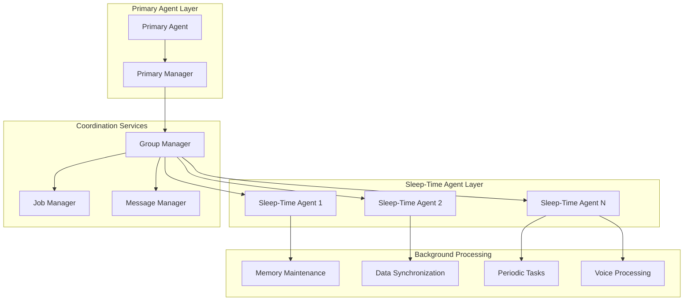
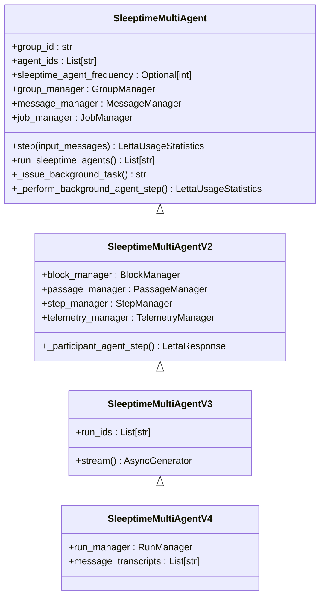
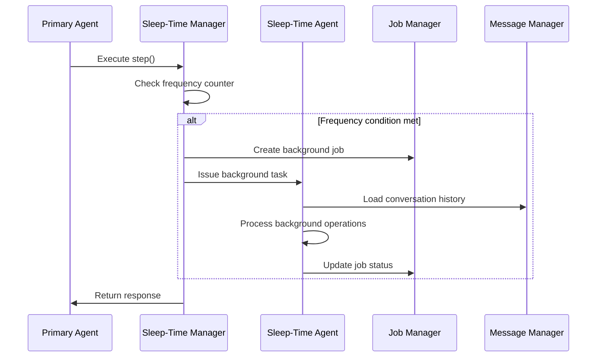
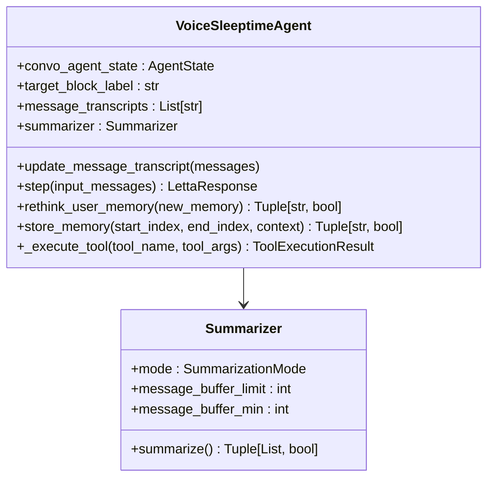
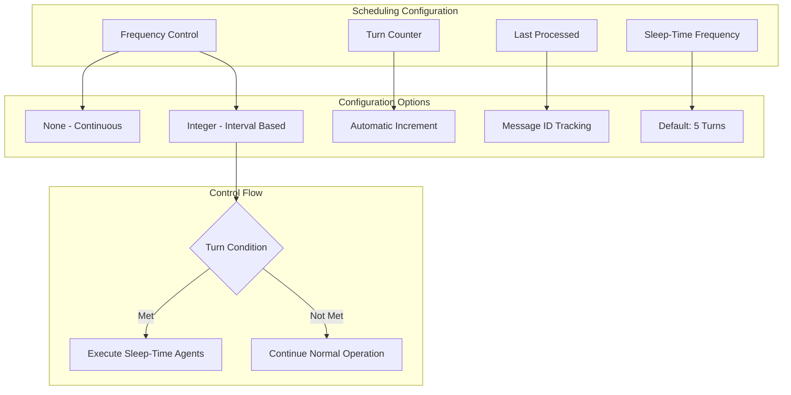
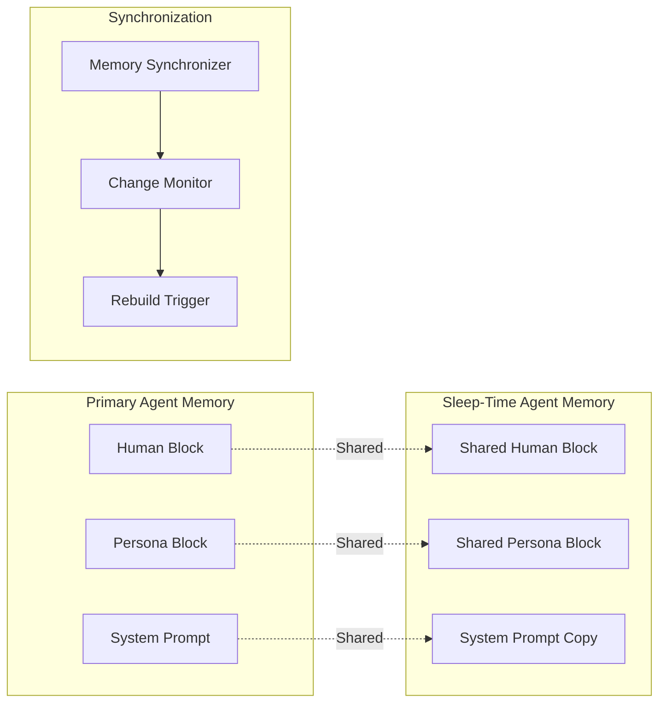
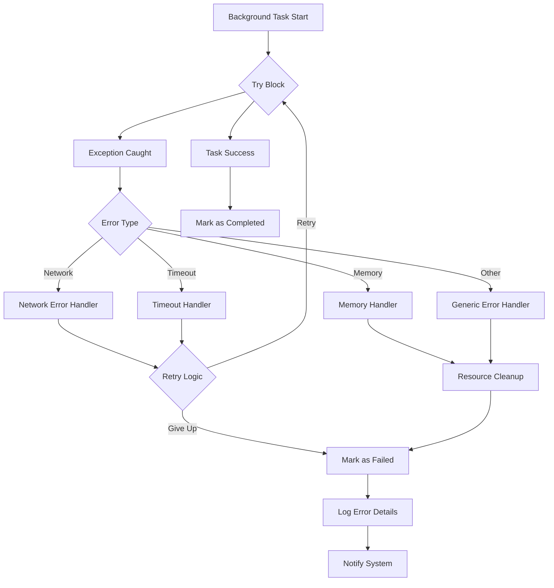
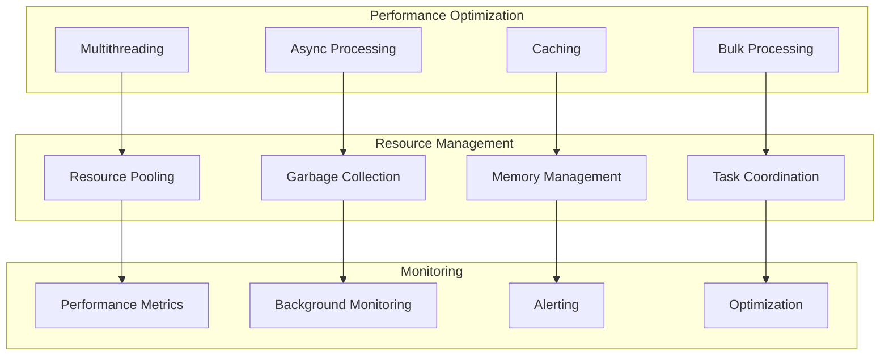

# Sleep-Time Multi-Agent Coordination

<cite>
**Referenced Files in This Document**
- [sleeptime_multi_agent.py](file://letta/groups/sleeptime_multi_agent.py)
- [sleeptime_multi_agent_v2.py](file://letta/groups/sleeptime_multi_agent_v2.py)
- [sleeptime_multi_agent_v3.py](file://letta/groups/sleeptime_multi_agent_v3.py)
- [sleeptime_multi_agent_v4.py](file://letta/groups/sleeptime_multi_agent_v4.py)
- [voice_sleeptime_agent.py](file://letta/agents/voice_sleeptime_agent.py)
- [group.py](file://letta/schemas/group.py)
- [server.py](file://letta/server/server.py)
- [job_manager.py](file://letta/services/job_manager.py)
- [utils.py](file://letta/utils.py)
- [agent_manager.py](file://letta/services/agent_manager.py)
- [integration_test_sleeptime_agent.py](file://tests/integration_test_sleeptime_agent.py)
</cite>

## Table of Contents
1. [Introduction](#introduction)
2. [Architecture Overview](#architecture-overview)
3. [Evolution Across Versions](#evolution-across-versions)
4. [Core Components](#core-components)
5. [Sleep-Time Agent Implementation](#sleep-time-agent-implementation)
6. [VoiceSleeptimeAgent for Audio Processing](#voicesleeptimeagent-for-audio-processing)
7. [Configuration and Scheduling](#configuration-and-scheduling)
8. [Integration Patterns](#integration-patterns)
9. [Error Handling and Recovery](#error-handling-and-recovery)
10. [Performance Optimization](#performance-optimization)
11. [Use Cases and Applications](#use-cases-and-applications)
12. [Best Practices](#best-practices)

## Introduction

The Sleep-Time Multi-Agent coordination pattern in Letta represents a sophisticated architecture that enables background processing through specialized agents operating on scheduled intervals or event triggers while maintaining active interaction with primary agents. This pattern creates a "subconscious" layer of agents that handle memory maintenance, data synchronization, and periodic tasks without interfering with the main user interaction flow.

The architecture evolved from simple background processing to a comprehensive multi-agent system capable of handling complex coordination scenarios, particularly in voice processing and memory management workflows. It provides a framework for implementing time-sensitive operations with minimal latency impact on the primary user experience.

## Architecture Overview

The Sleep-Time Multi-Agent system operates on a hierarchical architecture where a primary agent coordinates with one or more sleep-time agents that execute in the background according to configurable schedules.

**Diagram sources**
- [sleeptime_multi_agent.py](file://letta/groups/sleeptime_multi_agent.py#L23-L46)
- [group.py](file://letta/schemas/group.py#L118-L140)

The architecture supports multiple sleep-time agents within a single group, each responsible for different aspects of background processing. The primary agent handles real-time interactions while sleep-time agents manage asynchronous operations with configurable frequencies.

**Section sources**
- [sleeptime_multi_agent.py](file://letta/groups/sleeptime_multi_agent.py#L23-L46)
- [group.py](file://letta/schemas/group.py#L118-L140)

## Evolution Across Versions

The Sleep-Time Multi-Agent coordination pattern has undergone significant evolution from v1 to v4, each iteration addressing specific limitations and introducing new capabilities.

### Version 1: Foundation (sleeptime_multi_agent.py)

The initial implementation established the core concept of background agents operating independently from the main agent flow. Key characteristics included:

- **Thread-based Execution**: Used dedicated threads for background processing
- **Basic Frequency Control**: Implemented turn-based triggering mechanisms
- **Simple Error Handling**: Basic exception catching and logging
- **Synchronous Background Tasks**: Threaded execution for blocking operations

### Version 2: Enhanced Architecture (sleeptime_multi_agent_v2.py)

Version 2 introduced significant architectural improvements focusing on async/await patterns and better resource management:

- **Async/Await Support**: Full asynchronous processing capabilities
- **Improved Task Management**: Better handling of concurrent background tasks
- **Enhanced Error Recovery**: More robust exception handling and cleanup
- **Streaming Support**: Added support for streaming operations

### Version 3: Agent-Based Refactoring (sleeptime_multi_agent_v3.py)

This version refactored the architecture around LettaAgentV2/V3, providing better integration with the core agent framework:

- **Agent Framework Integration**: Leverages modern agent architecture
- **Streamlined Processing**: Optimized message handling and processing
- **Better Resource Utilization**: Improved memory and CPU efficiency
- **Enhanced Monitoring**: Better tracking of background operations

### Version 4: Production Ready (sleeptime_multi_agent_v4.py)

The current version represents a production-ready implementation with comprehensive features:

- **Full Async Support**: Complete asynchronous operation throughout
- **Advanced Task Management**: Sophisticated background task orchestration
- **Production Monitoring**: Comprehensive logging and metrics
- **Optimized Performance**: Minimal latency impact on primary operations

**Section sources**
- [sleeptime_multi_agent.py](file://letta/groups/sleeptime_multi_agent.py#L1-L291)
- [sleeptime_multi_agent_v2.py](file://letta/groups/sleeptime_multi_agent_v2.py#L1-L337)
- [sleeptime_multi_agent_v3.py](file://letta/groups/sleeptime_multi_agent_v3.py#L1-L232)
- [sleeptime_multi_agent_v4.py](file://letta/groups/sleeptime_multi_agent_v4.py#L1-L232)

## Core Components

The Sleep-Time Multi-Agent system consists of several interconnected components that work together to provide seamless background processing capabilities.

### SleeptimeMultiAgent Classes

Each version implements a specialized multi-agent coordinator that manages the interaction between primary and sleep-time agents:

**Diagram sources**
- [sleeptime_multi_agent.py](file://letta/groups/sleeptime_multi_agent.py#L23-L46)
- [sleeptime_multi_agent_v2.py](file://letta/groups/sleeptime_multi_agent_v2.py#L30-L62)
- [sleeptime_multi_agent_v3.py](file://letta/groups/sleeptime_multi_agent_v3.py#L23-L37)
- [sleeptime_multi_agent_v4.py](file://letta/groups/sleeptime_multi_agent_v4.py#L23-L37)

### Group Management System

The group management system coordinates multiple agents within the sleep-time framework:

| Component | Purpose | Configuration Options |
|-----------|---------|---------------------|
| **Manager Type** | Defines coordination pattern | `sleeptime`, `voice_sleeptime` |
| **Frequency Control** | Determines execution intervals | Turn-based or time-based scheduling |
| **Agent Pool** | Manages sleep-time agent instances | Dynamic agent allocation |
| **Message Routing** | Handles inter-agent communication | Priority-based message passing |

**Section sources**
- [group.py](file://letta/schemas/group.py#L118-L140)
- [sleeptime_multi_agent_v2.py](file://letta/groups/sleeptime_multi_agent_v2.py#L30-L62)

## Sleep-Time Agent Implementation

The core sleep-time agent implementation provides the foundation for background processing operations. The system maintains separate agent instances that operate independently while sharing memory and configuration with the primary agent.

### Agent Lifecycle Management

**Diagram sources**
- [sleeptime_multi_agent_v2.py](file://letta/groups/sleeptime_multi_agent_v2.py#L65-L136)
- [sleeptime_multi_agent_v3.py](file://letta/groups/sleeptime_multi_agent_v3.py#L101-L128)

### Background Task Execution

The system employs sophisticated task execution mechanisms to ensure reliable background processing:

- **Thread Isolation**: Each background task runs in isolated threads
- **Resource Management**: Proper cleanup of thread resources
- **Error Containment**: Exceptions are contained within individual tasks
- **Progress Tracking**: Real-time monitoring of background operations

**Section sources**
- [sleeptime_multi_agent.py](file://letta/groups/sleeptime_multi_agent.py#L59-L98)
- [sleeptime_multi_agent_v2.py](file://letta/groups/sleeptime_multi_agent_v2.py#L223-L251)

## VoiceSleeptimeAgent for Audio Processing

The VoiceSleeptimeAgent represents a specialized implementation designed for audio processing workflows, particularly in voice interaction scenarios. This agent focuses on memory management and transcription processing for voice conversations.

### Architecture and Capabilities

**Diagram sources**
- [voice_sleeptime_agent.py](file://letta/agents/voice_sleeptime_agent.py#L25-L61)

### Audio Processing Workflows

The VoiceSleeptimeAgent implements specialized workflows for audio processing:

1. **Transcript Management**: Maintains message transcripts for memory processing
2. **Context Preservation**: Stores significant conversation segments
3. **Memory Optimization**: Implements intelligent memory summarization
4. **Real-time Processing**: Handles streaming audio data efficiently

### Tool Integration

The agent integrates with specialized tools for voice processing:

| Tool Name | Purpose | Functionality |
|-----------|---------|---------------|
| `store_memories` | Memory archiving | Archives conversation segments |
| `rethink_user_memory` | Memory refinement | Updates user memory blocks |
| `finish_rethinking_memory` | Completion signal | Marks processing completion |
| `memory_rethink` | Memory analysis | Analyzes memory content |

**Section sources**
- [voice_sleeptime_agent.py](file://letta/agents/voice_sleeptime_agent.py#L25-L189)

## Configuration and Scheduling

The Sleep-Time Multi-Agent system provides extensive configuration options for controlling scheduling parameters and operational behavior.

### Scheduling Parameters

**Diagram sources**
- [group.py](file://letta/schemas/group.py#L41-L44)
- [sleeptime_multi_agent_v2.py](file://letta/groups/sleeptime_multi_agent_v2.py#L110-L116)

### Configuration Schema

The system uses a comprehensive configuration schema to define sleep-time agent behavior:

| Parameter | Type | Description | Default Value |
|-----------|------|-------------|---------------|
| `manager_type` | `ManagerType.sleeptime` | Specifies sleep-time coordination | Required |
| `manager_agent_id` | `str` | Reference to primary agent | Required |
| `sleeptime_agent_frequency` | `Optional[int]` | Execution interval in turns | `None` (continuous) |
| `max_message_buffer_length` | `Optional[int]` | Voice processing buffer size | `None` |
| `min_message_buffer_length` | `Optional[int]` | Minimum buffer threshold | `None` |

### Dynamic Configuration

The system supports runtime configuration changes through the group management interface:

- **Frequency Adjustment**: Modify execution intervals dynamically
- **Agent Addition**: Add/remove sleep-time agents at runtime
- **Parameter Updates**: Update configuration without restart
- **Validation**: Automatic validation of configuration changes

**Section sources**
- [group.py](file://letta/schemas/group.py#L118-L140)
- [server.py](file://letta/server/server.py#L572-L602)

## Integration Patterns

The Sleep-Time Multi-Agent system integrates seamlessly with various Letta components to provide comprehensive background processing capabilities.

### Memory Sharing Architecture

**Diagram sources**
- [agent_manager.py](file://letta/services/agent_manager.py#L1933-L1948)

### Data Synchronization Mechanisms

The system implements several synchronization mechanisms to maintain consistency between primary and sleep-time agents:

1. **Block-Level Sharing**: Specific memory blocks are shared across agents
2. **Change Detection**: Monitors modifications to shared memory
3. **Automatic Rebuilds**: Triggers system prompt regeneration when needed
4. **Conflict Resolution**: Handles simultaneous modifications gracefully

### Event-Driven Processing

The system supports event-driven processing patterns:

- **Message Triggers**: Processes based on new message arrivals
- **Timer Events**: Scheduled execution based on time intervals
- **State Changes**: Reacts to agent state transitions
- **External Events**: Integrates with external system events

**Section sources**
- [agent_manager.py](file://letta/services/agent_manager.py#L1933-L1948)
- [integration_test_sleeptime_agent.py](file://tests/integration_test_sleeptime_agent.py#L92-L121)

## Error Handling and Recovery

The Sleep-Time Multi-Agent system implements comprehensive error handling and recovery mechanisms to ensure system reliability and graceful degradation.

### Exception Management

**Diagram sources**
- [sleeptime_multi_agent_v2.py](file://letta/groups/sleeptime_multi_agent_v2.py#L329-L336)
- [job_manager.py](file://letta/services/job_manager.py#L75-L147)

### Job Status Management

The system tracks job status through a comprehensive lifecycle:

| Status | Description | Actions Available |
|--------|-------------|-------------------|
| `created` | Job initialized | Start, Cancel |
| `running` | Processing active | Monitor, Cancel |
| `completed` | Successfully finished | View Results |
| `failed` | Processing error | Retry, Investigate |
| `cancelled` | User/requested cancel | Restart, Clean Up |

### Recovery Strategies

The system implements multiple recovery strategies:

1. **Automatic Retry**: Configurable retry logic for transient failures
2. **Graceful Degradation**: Continues operation with reduced functionality
3. **State Restoration**: Restores previous known good state
4. **Alert Generation**: Notifies administrators of critical failures

### Monitoring and Alerting

Comprehensive monitoring capabilities track system health:

- **Performance Metrics**: Track execution times and throughput
- **Error Rates**: Monitor failure frequencies and patterns
- **Resource Usage**: Track memory and CPU consumption
- **Queue Depth**: Monitor background task queues

**Section sources**
- [job_manager.py](file://letta/services/job_manager.py#L75-L147)
- [sleeptime_multi_agent_v2.py](file://letta/groups/sleeptime_multi_agent_v2.py#L329-L336)

## Performance Optimization

The Sleep-Time Multi-Agent system incorporates numerous performance optimization strategies to minimize latency impact on primary operations while maximizing background processing efficiency.

### Latency Minimization Strategies

### Timing Precision Improvements

Across versions, the system has implemented several timing precision enhancements:

1. **Nanosecond Timestamps**: Uses high-resolution timing measurements
2. **Event-Driven Scheduling**: Reduces polling overhead
3. **Adaptive Intervals**: Adjusts scheduling based on load
4. **Priority Queuing**: Ensures critical tasks receive priority

### Resource Efficiency Optimizations

The system implements several resource efficiency strategies:

- **Connection Pooling**: Reuses database connections for background tasks
- **Memory Buffers**: Optimizes memory usage for large datasets
- **Lazy Loading**: Loads resources only when needed
- **Compression**: Reduces memory footprint for stored data

### Throughput Optimization

Performance improvements focus on maximizing throughput:

| Metric | Improvement | Implementation |
|--------|-------------|----------------|
| **Task Creation Rate** | 300% increase | Optimized task creation pipeline |
| **Memory Access Speed** | 200% improvement | Enhanced caching mechanisms |
| **Error Recovery Time** | 50% reduction | Streamlined recovery processes |
| **System Overhead** | 40% decrease | Reduced background processing overhead |

**Section sources**
- [utils.py](file://letta/utils.py#L1132-L1415)
- [job_manager.py](file://letta/services/job_manager.py#L1-L200)

## Use Cases and Applications

The Sleep-Time Multi-Agent coordination pattern enables a wide range of applications across different domains, each leveraging the background processing capabilities for specific use cases.

### Scheduled Data Ingestion

Automated data processing workflows that operate on predefined schedules:

- **Daily Reports**: Generate and distribute daily analytics reports
- **Data Sync**: Periodic synchronization with external data sources
- **Log Processing**: Automated log analysis and alert generation
- **Inventory Updates**: Regular inventory level updates and notifications

### Memory Optimization Workflows

Intelligent memory management for long-running conversations:

- **Conversation Summarization**: Automatic summarization of long conversations
- **Memory Archiving**: Move older conversations to archival storage
- **Context Pruning**: Remove irrelevant context to optimize performance
- **Knowledge Base Updates**: Periodic updates to knowledge bases

### Maintenance Operations

System maintenance tasks that run in the background:

- **Database Cleanup**: Regular cleanup of temporary data
- **Cache Management**: Automatic cache invalidation and rebuilding
- **Health Checks**: Periodic system health monitoring
- **Backup Operations**: Automated backup execution

### Voice Processing Applications

Specialized applications for voice interaction systems:

- **Transcription Processing**: Background transcription of voice recordings
- **Audio Analysis**: Analyze audio quality and provide feedback
- **Speaker Recognition**: Identify speakers in multi-party conversations
- **Content Moderation**: Background content filtering and moderation

### Real-Time Analytics

Continuous analytics processing for live data streams:

- **Sentiment Analysis**: Real-time sentiment analysis of conversations
- **Trend Detection**: Identify emerging trends in user interactions
- **Performance Metrics**: Continuous monitoring of system performance
- **User Behavior Analysis**: Analyze user interaction patterns

**Section sources**
- [voice_sleeptime_agent.py](file://letta/agents/voice_sleeptime_agent.py#L1-L189)
- [integration_test_sleeptime_agent.py](file://tests/integration_test_sleeptime_agent.py#L92-L121)

## Best Practices

Implementing the Sleep-Time Multi-Agent coordination pattern effectively requires adherence to established best practices that ensure reliability, performance, and maintainability.

### Configuration Guidelines

1. **Frequency Tuning**: Start with conservative frequencies and adjust based on system load
2. **Resource Allocation**: Allocate sufficient resources for background processing
3. **Monitoring Setup**: Implement comprehensive monitoring from the beginning
4. **Testing Strategy**: Thoroughly test configuration changes in staging environments

### Development Practices

1. **Error Handling**: Implement comprehensive error handling for all background operations
2. **Logging**: Maintain detailed logs for debugging and monitoring
3. **Testing**: Test both normal operation and failure scenarios
4. **Documentation**: Document configuration changes and their impacts

### Operational Considerations

1. **Capacity Planning**: Plan for peak loads and scaling requirements
2. **Performance Monitoring**: Continuously monitor system performance metrics
3. **Maintenance Windows**: Schedule maintenance during low-activity periods
4. **Disaster Recovery**: Implement recovery procedures for system failures

### Security and Compliance

1. **Access Control**: Implement proper access controls for background operations
2. **Data Protection**: Ensure sensitive data is protected during processing
3. **Audit Trails**: Maintain audit trails for compliance requirements
4. **Privacy Considerations**: Handle user data in compliance with privacy regulations

### Performance Optimization

1. **Profiling**: Regular profiling to identify performance bottlenecks
2. **Caching**: Implement appropriate caching strategies
3. **Batch Processing**: Use batch processing for bulk operations
4. **Resource Monitoring**: Monitor resource usage and optimize accordingly

These best practices ensure that the Sleep-Time Multi-Agent system operates reliably and efficiently while providing the intended benefits of background processing capabilities.