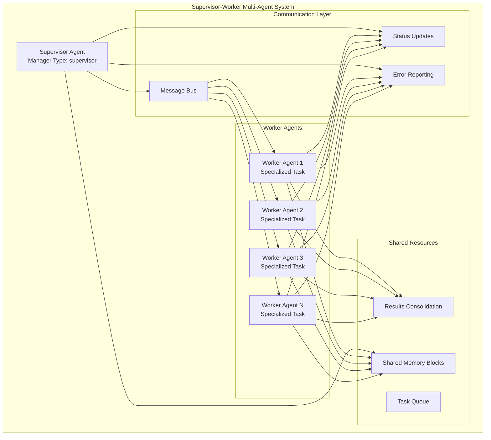
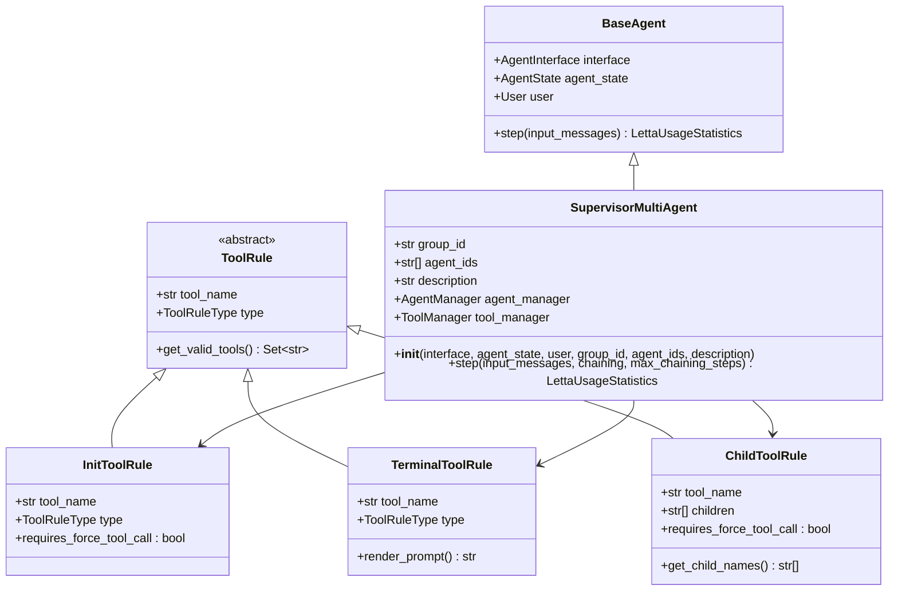
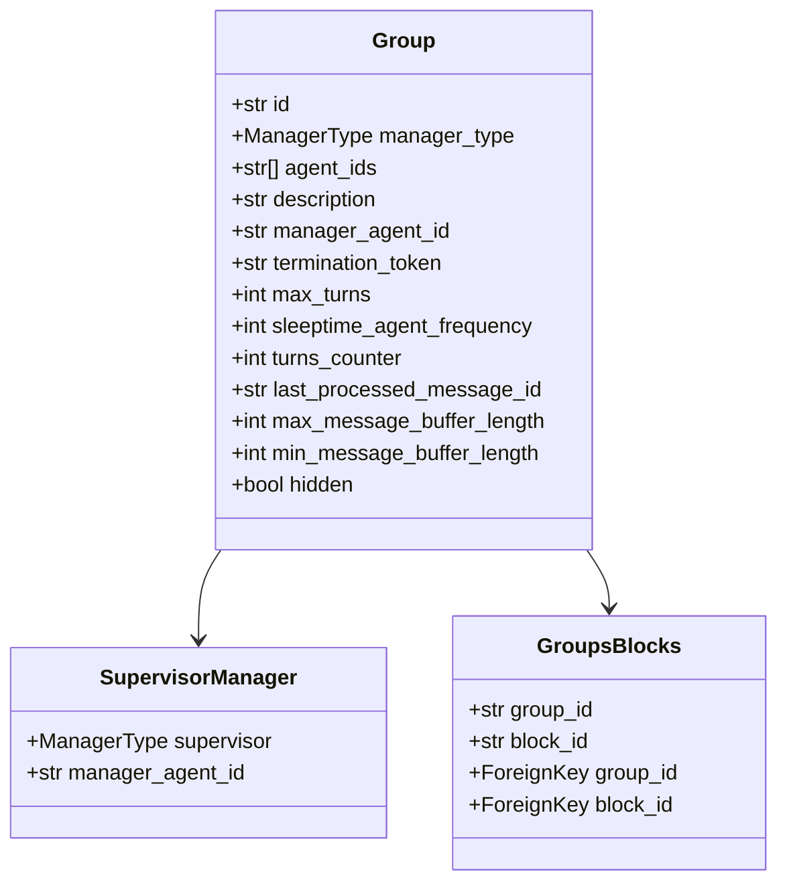
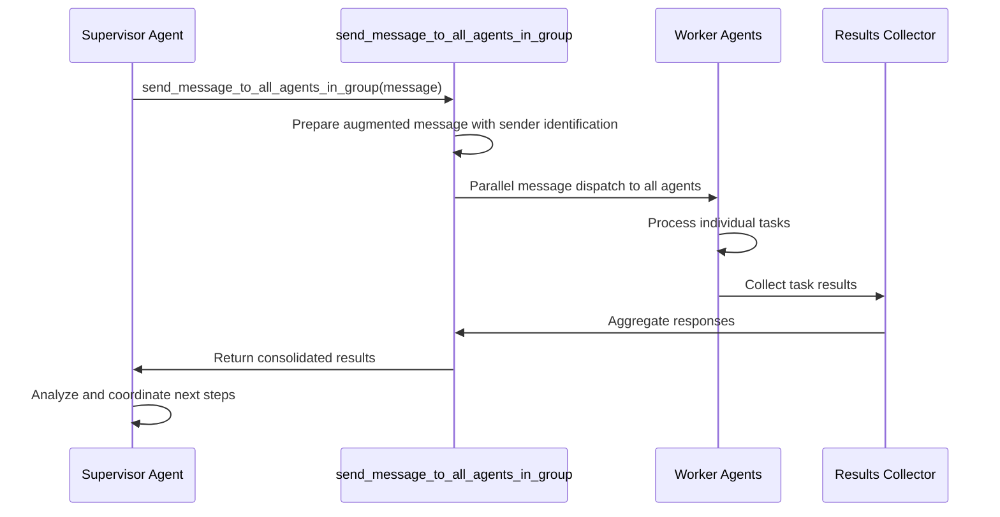
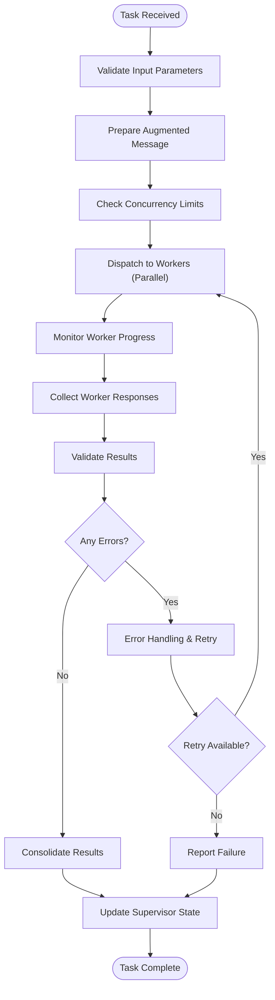
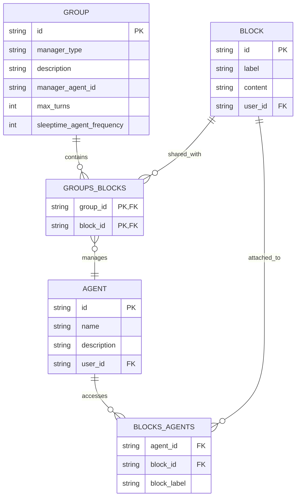
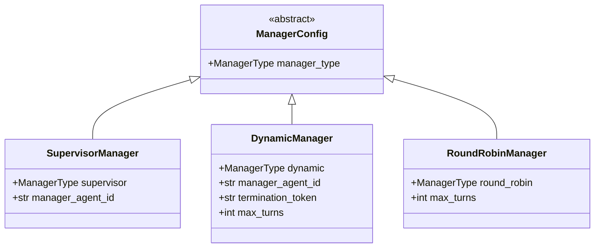
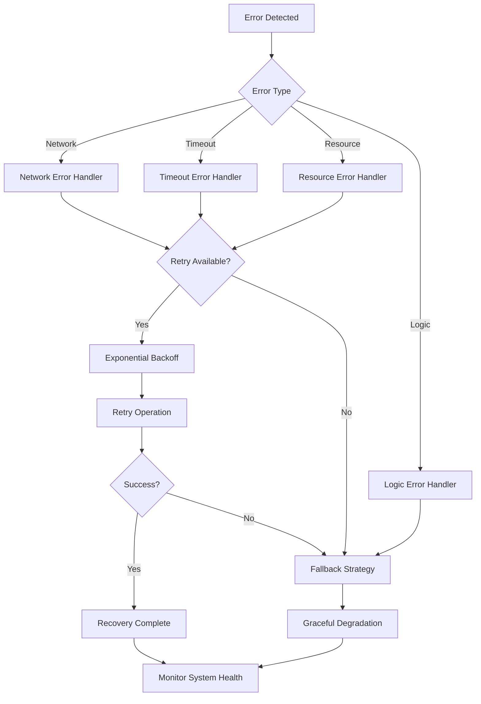
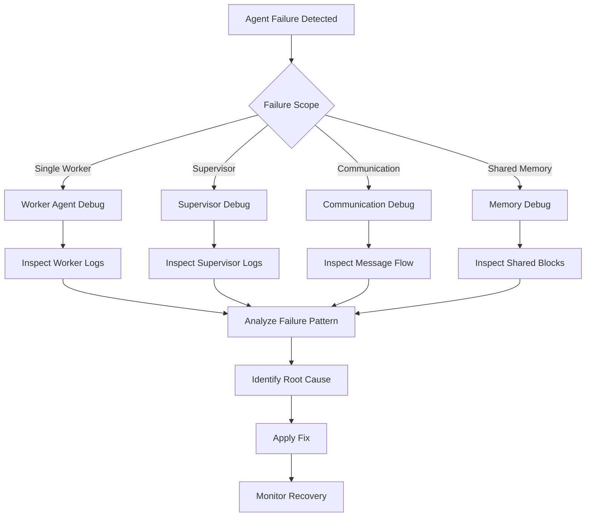

# Supervisor-Worker Multi-Agent Coordination

<cite>
**Referenced Files in This Document**
- [supervisor_multi_agent.py](file://letta/groups/supervisor_multi_agent.py)
- [multi_agent.py](file://letta/functions/function_sets/multi_agent.py)
- [groups_blocks.py](file://letta/orm/groups_blocks.py)
- [tool_rule.py](file://letta/schemas/tool_rule.py)
- [group.py](file://letta/schemas/group.py)
- [settings.py](file://letta/settings.py)
- [helpers.py](file://letta/functions/helpers.py)
- [group_manager.py](file://letta/services/group_manager.py)
- [mcp_client/exceptions.py](file://letta/functions/mcp_client/exceptions.py)
- [shared_memory_system_prompt.txt](file://examples/notebooks/data/shared_memory_system_prompt.txt)
- [task_queue_system_prompt.txt](file://examples/notebooks/data/task_queue_system_prompt.txt)
</cite>

## Table of Contents
1. [Introduction](#introduction)
2. [Architecture Overview](#architecture-overview)
3. [Core Components](#core-components)
4. [Task Decomposition and Management](#task-decomposition-and-management)
5. [Message Flow and Communication](#message-flow-and-communication)
6. [Shared Memory and Data Exchange](#shared-memory-and-data-exchange)
7. [Configuration Options](#configuration-options)
8. [Fault Tolerance and Error Handling](#fault-tolerance-and-error-handling)
9. [Debugging Strategies](#debugging-strategies)
10. [Use Cases and Applications](#use-cases-and-applications)
11. [Performance Considerations](#performance-considerations)
12. [Conclusion](#conclusion)

## Introduction

The Supervisor-Worker Multi-Agent coordination pattern represents a hierarchical architecture where a central supervisor agent orchestrates multiple worker agents through a command-and-control structure. This pattern enables complex problem-solving scenarios, distributed computation, and quality assurance workflows by organizing agents into specialized roles with clear delegation and coordination mechanisms.

The SupervisorMultiAgent class serves as the central coordinator, managing task distribution, progress monitoring, and result consolidation across multiple worker agents. This hierarchical approach provides structured control while maintaining the flexibility and autonomy of individual agents.

## Architecture Overview

The Supervisor-Worker architecture follows a clear hierarchical structure with distinct roles and responsibilities:

**Diagram sources**
- [supervisor_multi_agent.py](file://letta/groups/supervisor_multi_agent.py#L21-L121)
- [group.py](file://letta/schemas/group.py#L10-L17)

**Section sources**
- [supervisor_multi_agent.py](file://letta/groups/supervisor_multi_agent.py#L21-L121)
- [group.py](file://letta/schemas/group.py#L10-L17)

## Core Components

### SupervisorMultiAgent Class

The SupervisorMultiAgent class extends BaseAgent and implements the hierarchical coordination logic:

**Diagram sources**
- [supervisor_multi_agent.py](file://letta/groups/supervisor_multi_agent.py#L21-L121)
- [tool_rule.py](file://letta/schemas/tool_rule.py#L13-L374)

### Group Management System

The group management system coordinates multiple agents within a supervisor-worker structure:

**Diagram sources**
- [group.py](file://letta/schemas/group.py#L27-L198)
- [groups_blocks.py](file://letta/orm/groups_blocks.py#L7-L14)

**Section sources**
- [supervisor_multi_agent.py](file://letta/groups/supervisor_multi_agent.py#L21-L121)
- [group.py](file://letta/schemas/group.py#L27-L198)

## Task Decomposition and Management

### Task Assignment Mechanism

The supervisor agent implements sophisticated task decomposition and assignment through the `send_message_to_all_agents_in_group` function:

**Diagram sources**
- [multi_agent.py](file://letta/functions/function_sets/multi_agent.py#L112-L158)
- [helpers.py](file://letta/functions/helpers.py#L463-L479)

### Progress Monitoring

The system implements comprehensive progress monitoring through tool rules and execution tracking:

| Component | Purpose | Implementation |
|-----------|---------|----------------|
| **InitToolRule** | Enforces initial task execution | Forces supervisor to start with task assignment |
| **ChildToolRule** | Manages worker task execution | Restricts worker tools to assigned tasks only |
| **TerminalToolRule** | Controls completion flow | Ensures all workers complete before supervisor proceeds |
| **MaxCountPerStepToolRule** | Limits execution frequency | Prevents infinite loops in task processing |

**Section sources**
- [supervisor_multi_agent.py](file://letta/groups/supervisor_multi_agent.py#L71-L83)
- [tool_rule.py](file://letta/schemas/tool_rule.py#L254-L374)

## Message Flow and Communication

### Communication Patterns

The supervisor-worker system implements several communication patterns for efficient coordination:

**Diagram sources**
- [multi_agent.py](file://letta/functions/function_sets/multi_agent.py#L89-L123)
- [helpers.py](file://letta/functions/helpers.py#L463-L479)

### Message Augmentation

Each message sent to worker agents includes contextual information for proper routing and response handling:

- **Sender Identification**: `[Incoming message from agent with ID '{sender_agent.agent_state.id}']`
- **Response Instructions**: Guidance on how to structure responses for proper routing
- **Context Preservation**: Maintains original message intent while adding coordination metadata

**Section sources**
- [multi_agent.py](file://letta/functions/function_sets/multi_agent.py#L112-L158)
- [helpers.py](file://letta/functions/helpers.py#L463-L479)

## Shared Memory and Data Exchange

### GroupsBlocks Architecture

The GroupsBlocks system facilitates shared memory access across the multi-agent team:

**Diagram sources**
- [groups_blocks.py](file://letta/orm/groups_blocks.py#L7-L14)
- [group_manager.py](file://letta/services/group_manager.py#L364-L477)

### Data Synchronization

Shared memory blocks enable seamless data exchange between supervisor and workers:

| Feature | Description | Benefits |
|---------|-------------|----------|
| **Atomic Access** | Thread-safe block access | Prevents race conditions |
| **Version Control** | Block versioning support | Tracks changes and conflicts |
| **Access Control** | Role-based permissions | Security and isolation |
| **Lazy Loading** | On-demand block retrieval | Performance optimization |

**Section sources**
- [groups_blocks.py](file://letta/orm/groups_blocks.py#L7-L14)
- [group_manager.py](file://letta/services/group_manager.py#L364-L477)

## Configuration Options

### Delegation Policies

The system supports flexible delegation policies through manager configuration:

**Diagram sources**
- [group.py](file://letta/schemas/group.py#L19-L198)

### Timeout Settings

Comprehensive timeout configuration ensures system reliability:

| Setting | Default Value | Purpose | Configuration Method |
|---------|---------------|---------|---------------------|
| **MCP Connect Timeout** | 30.0 seconds | Server connection establishment | `mcp_connect_to_server_timeout` |
| **MCP List Tools Timeout** | 30.0 seconds | Tool discovery operations | `mcp_list_tools_timeout` |
| **MCP Execute Tool Timeout** | 60.0 seconds | Tool execution completion | `mcp_execute_tool_timeout` |
| **Tool Sandbox Timeout** | 180.0 seconds | Sandbox operation limits | `tool_sandbox_timeout` |

### Fault Tolerance Mechanisms

The system implements multiple layers of fault tolerance:

- **Concurrent Execution Limits**: Controlled parallelism prevents resource exhaustion
- **Graceful Degradation**: Partial failures don't halt the entire system
- **Automatic Retry Logic**: Failed operations attempt recovery
- **Circuit Breaker Pattern**: Prevents cascading failures

**Section sources**
- [settings.py](file://letta/settings.py#L35-L41)
- [group.py](file://letta/schemas/group.py#L19-L198)

## Fault Tolerance and Error Handling

### Error Classification

The system categorizes errors into distinct types for appropriate handling:

**Diagram sources**
- [mcp_client/exceptions.py](file://letta/functions/mcp_client/exceptions.py#L1-L6)

### Error Reporting and Recovery

The system implements comprehensive error reporting and recovery mechanisms:

- **Structured Error Messages**: Consistent error formatting for debugging
- **Stack Trace Capture**: Complete execution context preservation
- **Automated Logging**: Centralized error tracking and monitoring
- **Health Monitoring**: Real-time system health assessment

**Section sources**
- [mcp_client/exceptions.py](file://letta/functions/mcp_client/exceptions.py#L1-L6)

## Debugging Strategies

### Hierarchical Agent Failures

Debugging hierarchical agent systems requires specialized approaches:

### Debugging Tools and Techniques

| Technique | Application | Benefits |
|-----------|-------------|----------|
| **Structured Logging** | Comprehensive audit trail | Easy correlation of events |
| **State Inspection** | Runtime state examination | Quick diagnosis of issues |
| **Message Tracing** | End-to-end message flow tracking | Identifies communication bottlenecks |
| **Performance Profiling** | Resource utilization analysis | Optimizes system performance |

### Monitoring and Observability

The system provides extensive monitoring capabilities:

- **Real-time Metrics**: Live system performance indicators
- **Distributed Tracing**: End-to-end request flow tracking
- **Health Checks**: Automated system health assessment
- **Alerting Systems**: Proactive failure detection

**Section sources**
- [letta_agent_v3.py](file://letta/agents/letta_agent_v3.py#L673-L693)
- [letta_agent_v2.py](file://letta/agents/letta_agent_v2.py#L547-L567)

## Use Cases and Applications

### Complex Problem Solving

The supervisor-worker pattern excels in complex problem-solving scenarios:

**Example: Scientific Research Collaboration**
- **Supervisor**: Leads research project coordination
- **Workers**: Specialized researchers (biologists, chemists, physicists)
- **Shared Memory**: Research data, methodologies, preliminary results
- **Outcome**: Integrated scientific discoveries with coordinated validation

**Example: Software Development Pipeline**
- **Supervisor**: Project manager overseeing development
- **Workers**: Developers, testers, DevOps engineers
- **Shared Memory**: Code repositories, test results, deployment logs
- **Outcome**: Coordinated software delivery with quality assurance

### Distributed Computation

The architecture supports distributed computational tasks:

**Example: Large-Scale Data Analysis**
- **Supervisor**: Orchestrates data processing pipeline
- **Workers**: Specialized processors (data cleaning, analysis, visualization)
- **Shared Memory**: Intermediate data stages, processing logs
- **Outcome**: Efficient data processing with parallel execution

**Example: Machine Learning Training**
- **Supervisor**: Coordinates training process
- **Workers**: Data preprocessing, model training, evaluation
- **Shared Memory**: Training datasets, model checkpoints, metrics
- **Outcome**: Scalable ML pipeline with resource optimization

### Quality Assurance Workflows

The pattern enables robust quality assurance processes:

**Example: Content Moderation System**
- **Supervisor**: Manages moderation workflow
- **Workers**: Content analyzers, policy interpreters, decision makers
- **Shared Memory**: Content samples, policy documents, moderation logs
- **Outcome**: Consistent and fair content moderation

**Example: Financial Compliance Monitoring**
- **Supervisor**: Oversees compliance checks
- **Workers**: Risk assessors, regulatory experts, documentation specialists
- **Shared Memory**: Transaction records, compliance guidelines, audit trails
- **Outcome**: Comprehensive compliance coverage with cross-validation

**Section sources**
- [shared_memory_system_prompt.txt](file://examples/notebooks/data/shared_memory_system_prompt.txt#L1-L62)
- [task_queue_system_prompt.txt](file://examples/notebooks/data/task_queue_system_prompt.txt#L1-L62)

## Performance Considerations

### Concurrency Management

The system implements sophisticated concurrency controls:

- **Thread Pool Management**: Optimized thread allocation for worker tasks
- **Semaphore-Based Limiting**: Prevents resource contention
- **Asynchronous Processing**: Non-blocking operations for improved throughput
- **Load Balancing**: Even distribution of work across available workers

### Resource Optimization

Performance optimization strategies include:

| Strategy | Implementation | Impact |
|----------|----------------|--------|
| **Connection Pooling** | Reuse database connections | Reduced latency |
| **Message Batching** | Group small messages | Improved throughput |
| **Lazy Loading** | On-demand resource loading | Lower memory usage |
| **Caching Layers** | Frequently accessed data caching | Faster response times |

### Scalability Patterns

The architecture supports horizontal scaling through:

- **Stateless Design**: Workers can be easily replicated
- **Shared Storage**: Consistent state across scaled instances
- **Event-Driven Architecture**: Asynchronous processing patterns
- **Microservice Principles**: Modular, independently scalable components

## Conclusion

The Supervisor-Worker Multi-Agent coordination pattern provides a robust framework for building complex, distributed AI systems. Through its hierarchical architecture, sophisticated task decomposition mechanisms, and comprehensive coordination features, it enables organizations to tackle complex problems that require collaboration between specialized agents.

Key strengths of the system include:

- **Hierarchical Organization**: Clear command structure with delegation capabilities
- **Flexible Communication**: Multiple communication patterns for different use cases  
- **Robust Error Handling**: Comprehensive fault tolerance and recovery mechanisms
- **Scalable Architecture**: Designed for horizontal scaling and performance optimization
- **Rich Configuration**: Extensive customization options for diverse deployment scenarios

The system's emphasis on shared memory blocks, structured communication, and comprehensive monitoring makes it particularly well-suited for enterprise applications requiring coordination between multiple specialized agents. Its modular design and extensive configuration options ensure it can adapt to a wide variety of use cases while maintaining reliability and performance.

Future enhancements could include advanced machine learning-based delegation policies, enhanced real-time collaboration features, and expanded integration capabilities with external systems and services.