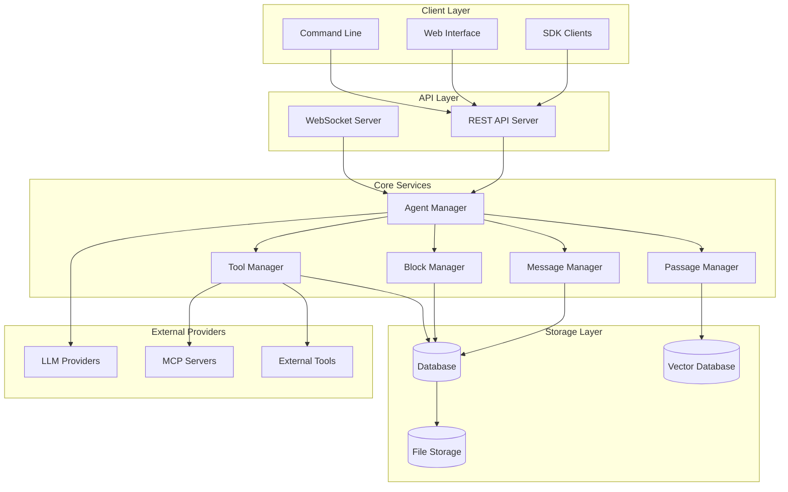
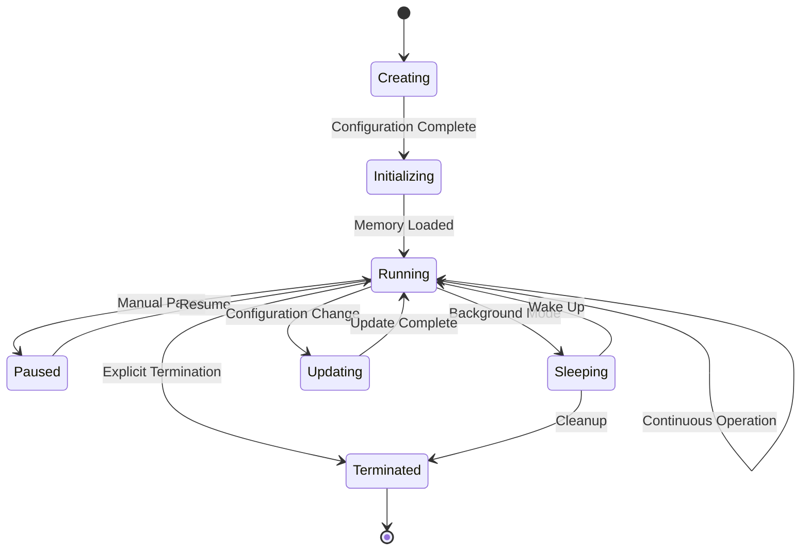
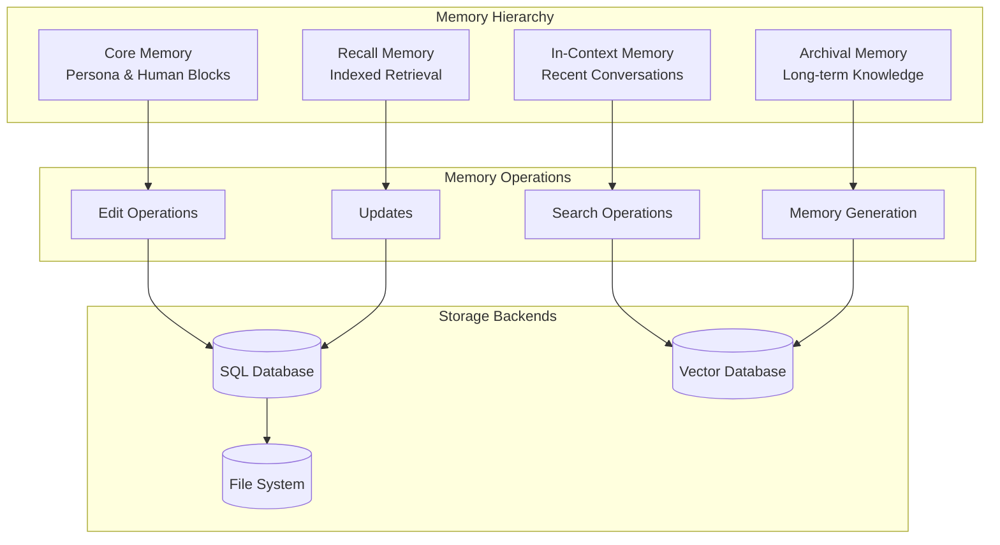
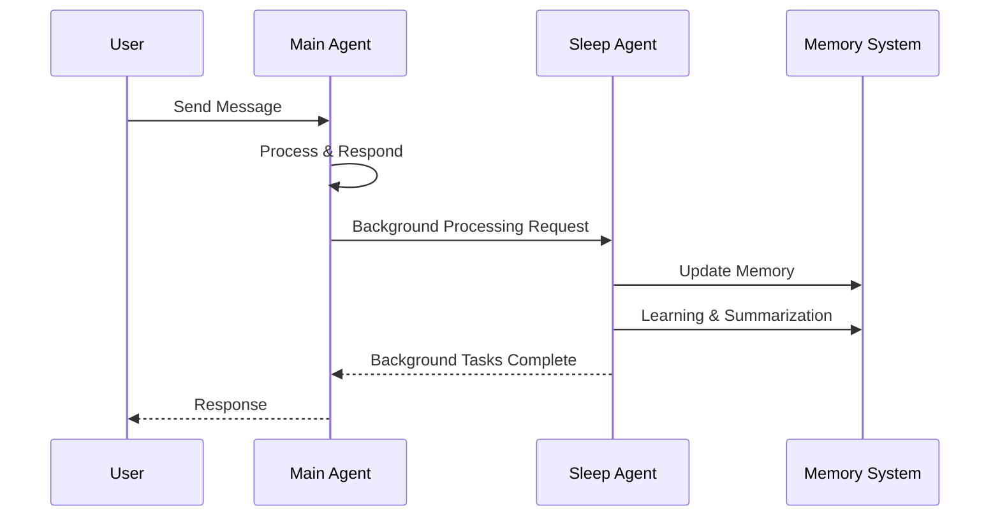
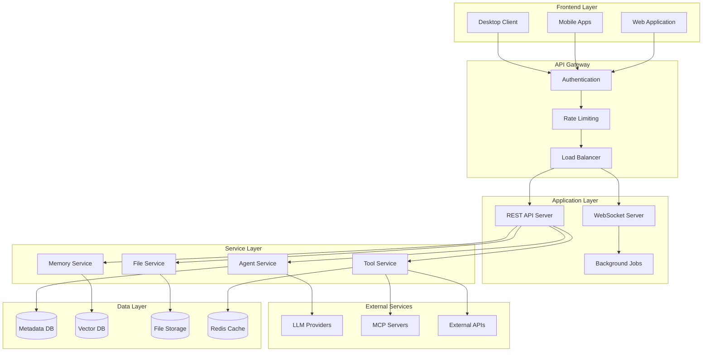
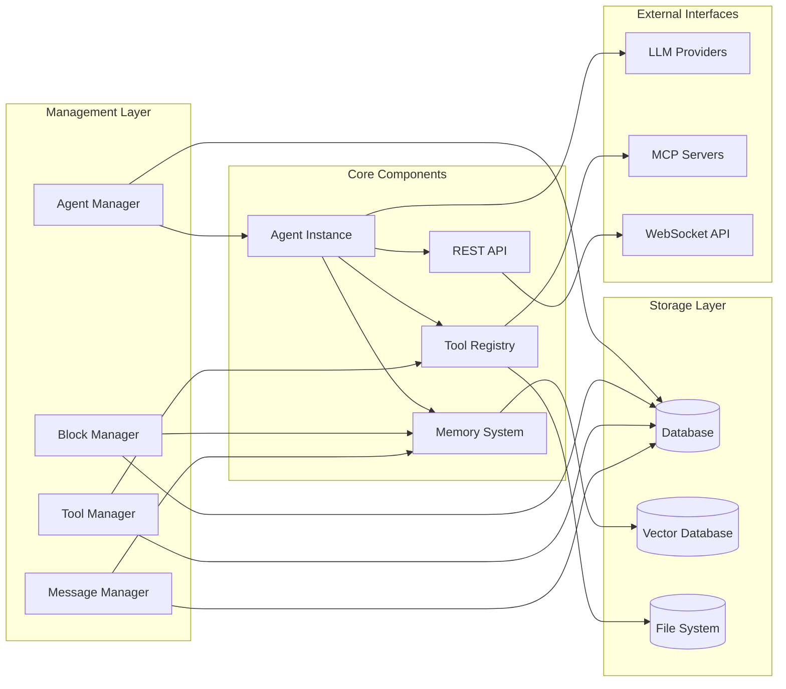

# Project Overview

<cite>
**Referenced Files in This Document**
- [README.md](file://README.md)
- [letta/__init__.py](file://letta/__init__.py)
- [letta/config.py](file://letta/config.py)
- [letta/main.py](file://letta/main.py)
- [letta/memory.py](file://letta/memory.py)
- [letta/agents/base_agent.py](file://letta/agents/base_agent.py)
- [letta/agents/letta_agent.py](file://letta/agents/letta_agent.py)
- [letta/server/server.py](file://letta/server/server.py)
- [letta/server/constants.py](file://letta/server/constants.py)
- [letta/server/ws_api/server.py](file://letta/server/ws_api/server.py)
- [letta/server/ws_api/interface.py](file://letta/server/ws_api/interface.py)
- [letta/groups/supervisor_multi_agent.py](file://letta/groups/supervisor_multi_agent.py)
- [letta/groups/sleeptime_multi_agent_v4.py](file://letta/groups/sleeptime_multi_agent_v4.py)
- [letta/orm/base.py](file://letta/orm/base.py)
- [letta/schemas/agent.py](file://letta/schemas/agent.py)
</cite>

## Table of Contents
1. [Introduction](#introduction)
2. [Platform Purpose and Vision](#platform-purpose-and-vision)
3. [Core Architecture](#core-architecture)
4. [Agent Lifecycle Management](#agent-lifecycle-management)
5. [Memory Hierarchy](#memory-hierarchy)
6. [External Integrations](#external-integrations)
7. [Key Features](#key-features)
8. [System Architecture Overview](#system-architecture-overview)
9. [Use Cases](#use-cases)
10. [Prerequisites for Developers](#prerequisites-for-developers)
11. [Component Relationships](#component-relationships)
12. [Getting Started Resources](#getting-started-resources)

## Introduction

Letta (formerly MemGPT) is a sophisticated platform designed to build stateful AI agents with advanced memory capabilities that can learn and self-improve over time. As a backend service, Letta provides the infrastructure for creating persistent, intelligent agents that maintain continuous conversations and evolve based on their experiences.

The platform represents a significant advancement in AI agent architecture, introducing the concept of the "LLM Operating System" for memory management. Unlike traditional AI systems that operate with ephemeral memory, Letta agents maintain persistent state across conversations, enabling truly autonomous and evolving AI personalities.

## Platform Purpose and Vision

Letta serves as the foundation for building intelligent, stateful AI agents that can:
- Maintain persistent memory across conversations
- Learn from interactions and adapt behavior
- Self-improve through experience accumulation
- Operate autonomously with minimal human intervention
- Coordinate with other agents in multi-agent systems

The platform's vision is to democratize access to advanced AI agent capabilities, making it possible for developers to create sophisticated AI assistants that can handle complex, long-term tasks and maintain meaningful relationships with users.

**Section sources**
- [README.md](file://README.md#L11-L12)

## Core Architecture

Letta's architecture is built around several key components that work together to provide a robust platform for stateful AI agents:



**Diagram sources**
- [letta/server/server.py](file://letta/server/server.py#L117-L208)
- [letta/agents/base_agent.py](file://letta/agents/base_agent.py#L28-L51)

### Architectural Principles

The platform follows several key architectural principles:

1. **Modular Design**: Clear separation of concerns with distinct managers for different responsibilities
2. **Extensibility**: Plugin-based architecture supporting custom tools and providers
3. **Persistence**: Comprehensive data persistence with multiple storage backends
4. **Scalability**: Support for both single-agent and multi-agent architectures
5. **Integration**: Seamless connectivity with external services and tools

**Section sources**
- [letta/server/server.py](file://letta/server/server.py#L117-L208)
- [letta/agents/base_agent.py](file://letta/agents/base_agent.py#L28-L51)

## Agent Lifecycle Management

Letta implements a sophisticated agent lifecycle management system that handles the complete journey from agent creation to retirement:



### Agent States and Transitions

The platform manages several distinct agent states:

- **Creating**: Agent initialization with configuration
- **Initializing**: Memory loading and setup
- **Running**: Active operational state
- **Paused**: Temporarily suspended operation
- **Sleeping**: Background processing mode
- **Updating**: Configuration modification
- **Terminated**: Final state requiring cleanup

### Memory Management During Lifecycle

During each lifecycle phase, Letta handles memory management differently:

- **Creation Phase**: Establishes core memory blocks and initial context
- **Initialization Phase**: Loads persistent memory from storage
- **Operation Phase**: Dynamic memory updates and learning
- **Cleanup Phase**: Persists memory state and releases resources

**Section sources**
- [letta/agents/letta_agent.py](file://letta/agents/letta_agent.py#L169-L206)
- [letta/services/agent_manager.py](file://letta/services/agent_manager.py#L1351-L1607)

## Memory Hierarchy

Letta implements a sophisticated multi-layered memory system that enables agents to maintain persistent, organized knowledge:



**Diagram sources**
- [letta/memory.py](file://letta/memory.py#L1-L109)
- [letta/schemas/agent.py](file://letta/schemas/agent.py#L60-L106)

### Memory Layers

1. **Core Memory**: Persistent personality and relationship information stored in memory blocks
2. **In-Context Memory**: Recent conversation history loaded for current interactions
3. **Archival Memory**: Long-term knowledge storage with semantic search capabilities
4. **Recall Memory**: Indexed retrieval system for efficient knowledge access

### Memory Operations

The platform supports sophisticated memory operations including:
- **Dynamic Editing**: Real-time memory modifications through tool calls
- **Semantic Search**: Vector-based retrieval of relevant information
- **Automatic Summarization**: Context window management through intelligent summarization
- **Conflict Resolution**: Handling of conflicting memory updates

**Section sources**
- [letta/memory.py](file://letta/memory.py#L53-L109)
- [letta/schemas/agent.py](file://letta/schemas/agent.py#L60-L106)

## External Integrations

Letta provides extensive integration capabilities with external services and providers:

### LLM Provider Support

The platform supports multiple LLM providers through a unified interface:

- **OpenAI**: GPT-4, GPT-4o, and other OpenAI models
- **Anthropic**: Claude family of models
- **Google**: Gemini and Vertex AI models
- **Azure**: Azure OpenAI Service
- **AWS Bedrock**: Various foundation models
- **Local Models**: Ollama, LM Studio, vLLM
- **Custom Providers**: Configurable endpoints

### Vector Database Integration

Support for multiple vector database backends:
- **Turbopuffer**: Native integration for high-performance vector search
- **PostgreSQL**: pgvector extension support
- **Redis**: Vector similarity search
- **Weaviate**: Semantic search capabilities

### Tool Integration

Comprehensive tool ecosystem including:
- **Built-in Tools**: Core memory and communication functions
- **MCP (Model Context Protocol)**: External tool servers
- **Custom Python Tools**: User-defined functionality
- **External APIs**: REST API integrations
- **File System Tools**: Document processing and management

**Section sources**
- [letta/server/server.py](file://letta/server/server.py#L209-L316)
- [letta/services/mcp_manager.py](file://letta/services/mcp_manager.py#L77-L100)

## Key Features

### Sleep-Time Agents

Letta introduces innovative sleep-time agents that operate in the background, managing memory and learning while the primary agent focuses on immediate tasks:



**Diagram sources**
- [letta/groups/sleeptime_multi_agent_v4.py](file://letta/groups/sleeptime_multi_agent_v4.py#L99-L128)
- [letta/server/server.py](file://letta/server/server.py#L572-L602)

### Multi-Agent Coordination

Advanced multi-agent capabilities enable sophisticated agent collaboration:

- **Supervisor Agents**: Central coordination and orchestration
- **Round-Robin Scheduling**: Balanced workload distribution
- **Broadcast Communication**: Efficient information sharing
- **Shared Memory Systems**: Coordinated knowledge bases

### Long-Running Operations

Robust support for complex, time-intensive operations:

- **Background Processing**: Asynchronous task execution
- **Streaming Responses**: Real-time progress updates
- **Checkpointing**: Reliable operation recovery
- **Cancellation Support**: Graceful operation termination

### Agent File System

Persistent agent state management through Agent Files (.af):

- **Serialization**: Complete agent state export
- **Portability**: Cross-platform agent migration
- **Version Control**: Agent state versioning
- **Backup & Restore**: Comprehensive data protection

**Section sources**
- [letta/groups/sleeptime_multi_agent_v4.py](file://letta/groups/sleeptime_multi_agent_v4.py#L99-L128)
- [letta/groups/supervisor_multi_agent.py](file://letta/groups/supervisor_multi_agent.py#L21-L121)

## System Architecture Overview

Letta's system architecture is designed for scalability, reliability, and extensibility:



**Diagram sources**
- [letta/server/server.py](file://letta/server/server.py#L117-L208)
- [letta/server/constants.py](file://letta/server/constants.py#L1-L6)

### Scalability Features

- **Horizontal Scaling**: Stateless API servers with shared storage
- **Vertical Scaling**: Optimized for high-throughput operations
- **Caching Layer**: Redis for frequently accessed data
- **Async Processing**: Background job queues for long-running tasks

### Reliability Features

- **Database Replication**: PostgreSQL clustering support
- **Health Monitoring**: Comprehensive health checks
- **Graceful Degradation**: Fallback mechanisms for service failures
- **Data Validation**: Rigorous input validation and sanitization

**Section sources**
- [letta/server/server.py](file://letta/server/server.py#L117-L208)
- [letta/server/constants.py](file://letta/server/constants.py#L1-L6)

## Use Cases

### Autonomous Agents

Letta excels in creating autonomous agents that can operate independently:

- **Customer Support Bots**: Intelligent, learning customer service representatives
- **Personal Assistants**: Personal AI companions that remember preferences
- **Research Assistants**: Agents that accumulate knowledge across sessions
- **Development Assistants**: Coding partners that learn from project context

### Document Processing Systems

Sophisticated document handling capabilities:

- **Knowledge Bases**: Organized document repositories with semantic search
- **Content Moderation**: Automated content analysis and categorization
- **Document Summarization**: Intelligent document processing and synthesis
- **Workflow Automation**: Document-centric business process automation

### Collaborative AI Workflows

Multi-agent coordination for complex tasks:

- **Team-Based Research**: Distributed research teams with shared knowledge
- **Content Creation**: Collaborative writing and content generation
- **Problem Solving**: Multi-perspective problem analysis and solutions
- **Project Management**: AI-assisted project coordination and tracking

### Educational Applications

Learning and educational scenarios:

- **Tutoring Systems**: Adaptive learning assistants that track student progress
- **Research Assistance**: Academic research support with persistent knowledge
- **Skill Development**: Practice environments with intelligent feedback
- **Knowledge Transfer**: Expert system capture and dissemination

**Section sources**
- [README.md](file://README.md#L198-L220)
- [README.md](file://README.md#L220-L285)

## Prerequisites for Developers

### Technical Requirements

Developers working with Letta should have proficiency in:

#### Programming Languages
- **Python**: Core platform implementation and tool development
- **TypeScript/Node.js**: Client SDK development and web applications
- **SQL**: Database schema understanding and custom queries

#### Frameworks and Libraries
- **FastAPI**: REST API development and microservice architecture
- **SQLAlchemy**: Database ORM and query construction
- **Asyncio**: Asynchronous programming patterns
- **Pydantic**: Data validation and serialization

#### Development Tools
- **Git**: Version control and collaboration
- **Docker**: Containerization and deployment
- **PostgreSQL**: Database administration and optimization
- **Redis**: Caching and message queuing

### Platform-Specific Knowledge

#### Memory Management
- Understanding of persistent memory concepts
- Experience with vector databases and embeddings
- Knowledge of context window optimization

#### LLM Integration
- Familiarity with OpenAI API patterns
- Understanding of model selection criteria
- Experience with prompt engineering

#### Multi-Agent Systems
- Knowledge of distributed system concepts
- Understanding of coordination protocols
- Experience with asynchronous communication

### Development Environment Setup

```bash
# Clone the repository
git clone https://github.com/letta-ai/letta.git
cd letta

# Install dependencies
uv sync --all-extras

# Run the server
uv run letta server
```

**Section sources**
- [README.md](file://README.md#L497-L523)
- [letta/config.py](file://letta/config.py#L1-L311)

## Component Relationships

Let's examine how the major components interact within the Letta ecosystem:



**Diagram sources**
- [letta/server/server.py](file://letta/server/server.py#L141-L174)
- [letta/agents/base_agent.py](file://letta/agents/base_agent.py#L28-L51)

### Agent-Manager Interaction

The Agent Manager serves as the central coordinator for agent lifecycle operations:

- **Agent Creation**: Handles initialization with proper memory setup
- **State Management**: Coordinates memory persistence and retrieval
- **Tool Integration**: Manages tool attachment and execution
- **Multi-Agent Coordination**: Orchestrates group operations

### Memory-Tool Integration

Memory and tool systems work closely together:

- **Memory Tools**: Specialized tools for memory manipulation
- **Tool Memory**: Tools can access and modify agent memory
- **Context Awareness**: Tools aware of current memory state
- **Consistency Management**: Ensuring memory consistency across operations

### API-Service Layer

The REST API provides standardized access to all platform capabilities:

- **Agent Operations**: CRUD operations for agents
- **Message Handling**: Conversation management
- **Tool Execution**: Tool invocation and results
- **File Management**: Document processing and storage

**Section sources**
- [letta/server/server.py](file://letta/server/server.py#L141-L174)
- [letta/agents/base_agent.py](file://letta/agents/base_agent.py#L28-L51)

## Getting Started Resources

### Official Documentation

- **Developer Documentation**: Comprehensive guides for agent development
- **API Reference**: Complete REST API documentation
- **SDK Documentation**: Python and TypeScript SDK guides
- **Deployment Guides**: Production deployment instructions

### Learning Resources

- **Quick Start Tutorials**: Step-by-step getting started guides
- **Example Projects**: Sample implementations and use cases
- **Best Practices**: Recommended patterns and anti-patterns
- **Community Forum**: Developer discussions and support

### Development Tools

- **Agent Development Environment (ADE)**: No-code UI for agent building
- **Letta Desktop**: Fully-local desktop application
- **Cloud Platform**: Managed Letta Cloud service
- **CLI Tools**: Command-line interface utilities

### Next Steps

1. **Setup Development Environment**: Install prerequisites and clone repository
2. **Explore Examples**: Run provided examples to understand core concepts
3. **Build First Agent**: Create a simple stateful agent using the SDK
4. **Integrate Tools**: Add custom tools to enhance agent capabilities
5. **Deploy**: Move from local development to production deployment

### Community and Support

- **Discord Community**: Real-time developer support and discussions
- **GitHub Issues**: Bug reports and feature requests
- **Documentation Contributions**: Help improve official documentation
- **Plugin Development**: Contribute to the tool ecosystem

**Section sources**
- [README.md](file://README.md#L13-L18)
- [README.md](file://README.md#L497-L523)