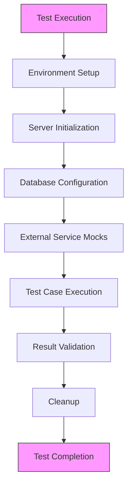
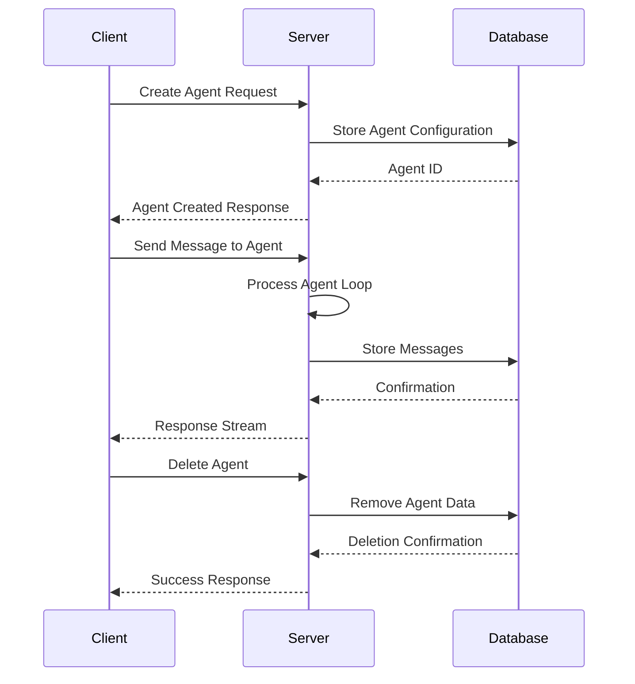
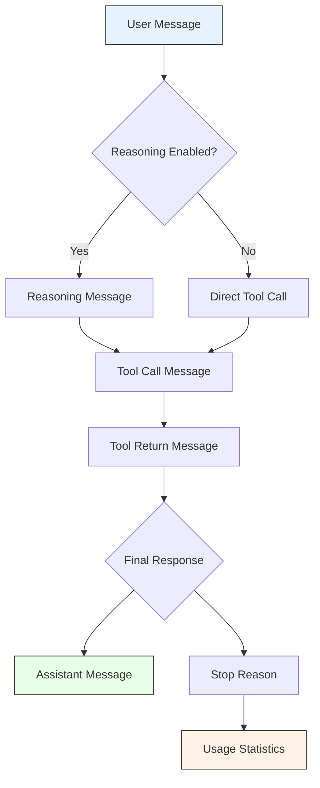
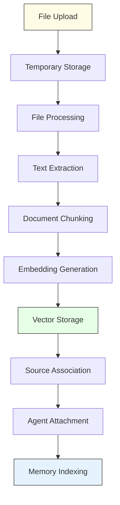
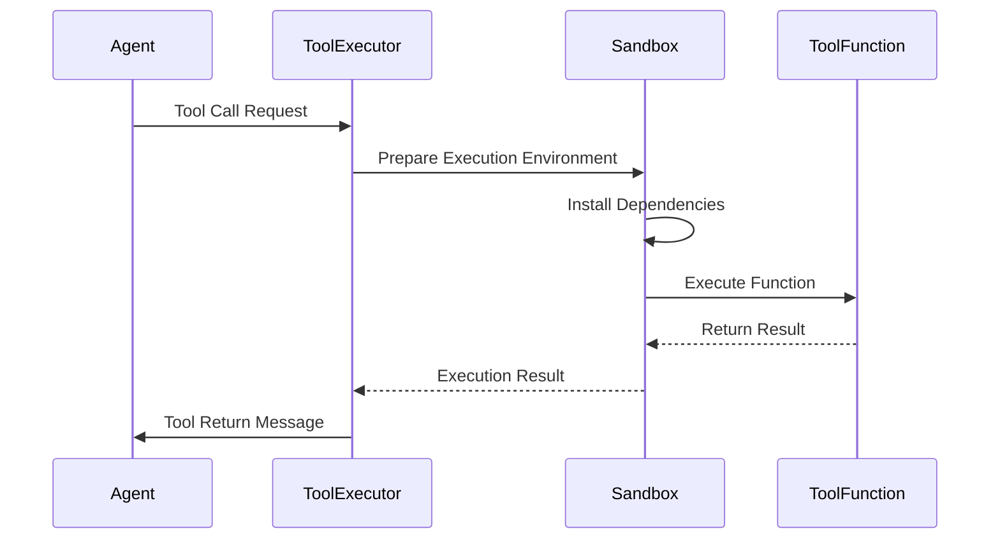
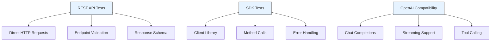
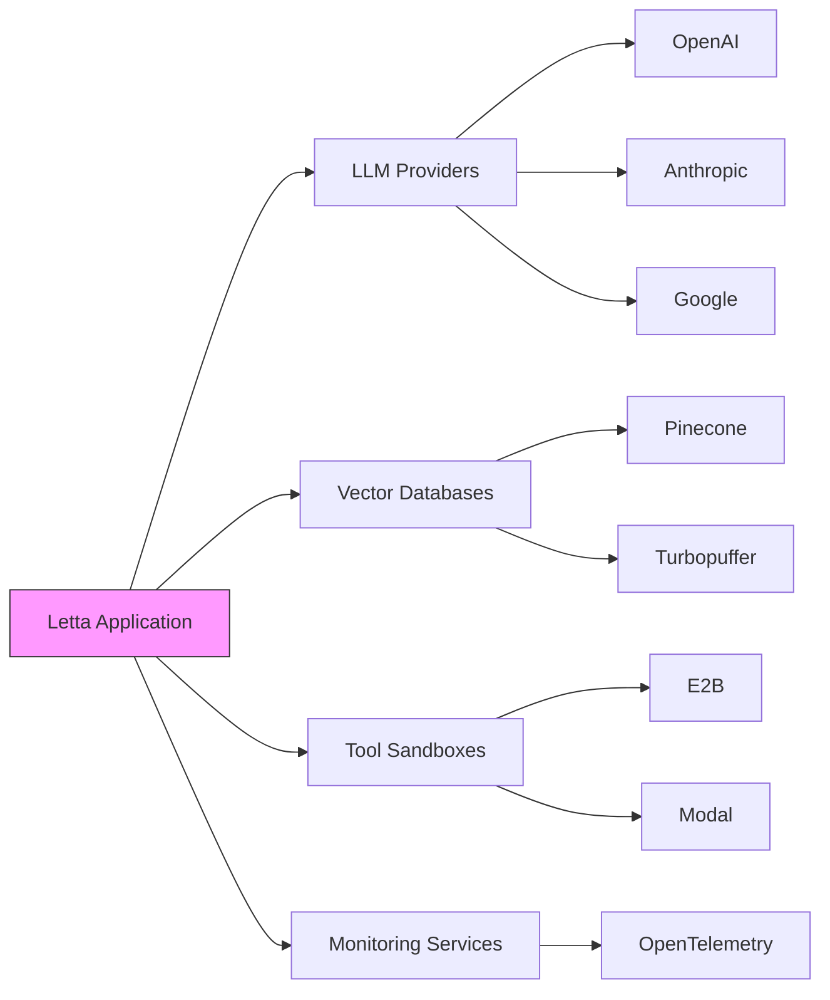
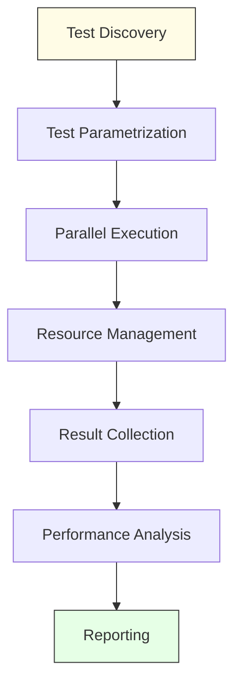
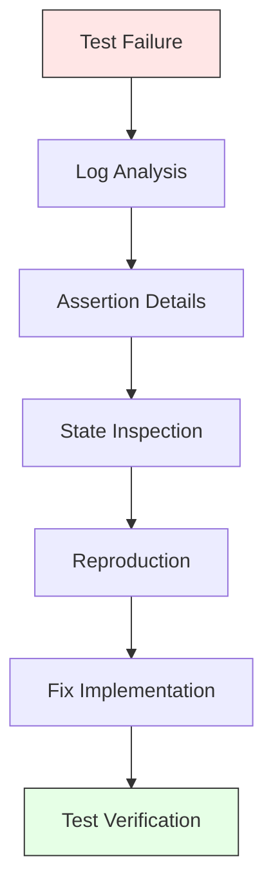
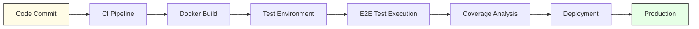

# End-to-End Testing

<cite>
**Referenced Files in This Document**   
- [conftest.py](file://tests/conftest.py)
- [integration_test_send_message.py](file://tests/integration_test_send_message.py)
- [integration_test_chat_completions.py](file://tests/integration_test_chat_completions.py)
- [integration_test_agent_tool_graph.py](file://tests/integration_test_agent_tool_graph.py)
- [integration_test_summarizer.py](file://tests/integration_test_summarizer.py)
- [test_server.py](file://tests/test_server.py)
- [test_agent_manager.py](file://tests/managers/test_agent_manager.py)
- [agents.py](file://letta/server/rest_api/routers/v1/agents.py)
- [app.py](file://letta/server/rest_api/app.py)
- [sources.py](file://letta/server/rest_api/routers/v1/sources.py)
- [server.py](file://letta/server/server.py)
- [agent_file_manager.py](file://letta/services/agent_file_manager.py)
- [tool_execution_sandbox.py](file://letta/services/tool_executor/tool_execution_sandbox.py)
- [local_sandbox.py](file://letta/services/tool_sandbox/local_sandbox.py)
- [endpoints_helper.py](file://tests/helpers/endpoints_helper.py)
</cite>

## Table of Contents
1. [Introduction](#introduction)
2. [Test Architecture and Environment Setup](#test-architecture-and-environment-setup)
3. [Agent Lifecycle Management Testing](#agent-lifecycle-management-testing)
4. [Message Streaming and Real-time Interaction](#message-streaming-and-real-time-interaction)
5. [File Ingestion and Data Processing Validation](#file-ingestion-and-data-processing-validation)
6. [Tool Invocation and Execution Testing](#tool-invocation-and-execution-testing)
7. [Testing with REST and SDK Interfaces](#testing-with-rest-and-sdk-interfaces)
8. [External Service Integration and Mocking](#external-service-integration-and-mocking)
9. [Test Orchestration and Performance Considerations](#test-orchestration-and-performance-considerations)
10. [Debugging Strategies and Test Reliability](#debugging-strategies-and-test-reliability)
11. [CI/CD Integration for Full-Stack Validation](#cicd-integration-for-full-stack-validation)
12. [Conclusion](#conclusion)

## Introduction
End-to-End (E2E) testing in Letta ensures comprehensive validation of the entire system stack, from API entry points through agent processing to database persistence and external service interactions. This documentation details the implementation of E2E tests that validate real client-server interactions, covering critical features such as agent lifecycle management, message streaming, file ingestion, and tool invocation. The testing framework leverages both REST and SDK interfaces to validate system behavior under production-like conditions, incorporating database, Redis, and external service mocks to ensure consistent and reliable test execution. By addressing common challenges like test orchestration, environment consistency, and performance bottlenecks, these E2E tests provide confidence in the system's reliability and functionality across diverse scenarios.

## Test Architecture and Environment Setup

The E2E testing architecture in Letta is designed to validate the complete system stack under production-like conditions. The framework uses pytest with asynchronous fixtures to manage test environments, ensuring proper setup and teardown of server instances, database connections, and external service configurations. The test suite begins with environment initialization through fixtures that either connect to an existing server or launch a new one in a background thread, polling until the health endpoint becomes available.

**Diagram sources**
- [conftest.py](file://tests/conftest.py#L24-L58)
- [integration_test_send_message.py](file://tests/integration_test_send_message.py#L15-L35)

The environment setup includes comprehensive configuration of external dependencies through parametrized fixtures that enable or disable services like E2B sandbox, Pinecone, and Turbopuffer. These fixtures temporarily modify global settings to isolate test behavior without affecting production configurations. Database connection pooling is disabled during tests to prevent event loop conflicts, and connections are properly disposed of after each test to ensure clean state between test runs.

**Section sources**
- [conftest.py](file://tests/conftest.py#L70-L97)
- [conftest.py](file://tests/conftest.py#L100-L177)

## Agent Lifecycle Management Testing

Agent lifecycle management testing validates the complete workflow of agent creation, interaction, and deletion through both REST API and Python SDK interfaces. The test suite verifies that agents can be properly instantiated with specific configurations, including LLM settings, memory blocks, and tool integrations. Each test case follows a structured pattern of creating an agent, sending messages, validating responses, and cleaning up resources.

**Diagram sources**
- [agents.py](file://letta/server/rest_api/routers/v1/agents.py#L77-L166)
- [test_agent_manager.py](file://tests/managers/test_agent_manager.py#L133-L156)

The testing framework validates agent creation by asserting that all configuration parameters are properly persisted and accessible through list and get operations. Tests verify that agents can be retrieved by name, filtered by tags, and paginated correctly. The lifecycle tests also validate proper cleanup by ensuring that deleted agents no longer appear in list queries and that associated resources like messages and memory blocks are properly removed from the database.

**Section sources**
- [agents.py](file://letta/server/rest_api/routers/v1/agents.py#L77-L166)
- [test_agent_manager.py](file://tests/managers/test_agent_manager.py#L133-L156)

## Message Streaming and Real-time Interaction

Message streaming tests validate Letta's real-time interaction capabilities through both SSE (Server-Sent Events) and WebSocket protocols. The framework tests various message types including user messages, reasoning messages, tool calls, and assistant responses, ensuring proper sequencing and content validation. Streaming tests verify that messages are delivered in the correct order with appropriate metadata such as OTID (One-Time ID), run_id, and step_id.

**Diagram sources**
- [integration_test_send_message.py](file://tests/integration_test_send_message.py#L214-L284)
- [server.py](file://letta/server/server.py#L895-L907)

The testing framework includes comprehensive validation of streaming behavior, checking that chunked responses are properly accumulated and that token streaming produces multiple chunks for reasoning and assistant messages. Tests verify that keep-alive ping messages are handled correctly and that the stream terminates with proper stop reason and usage statistics. The framework also validates error handling by testing scenarios where message processing fails or is cancelled mid-stream.

**Section sources**
- [integration_test_send_message.py](file://tests/integration_test_send_message.py#L214-L284)
- [server.py](file://letta/server/server.py#L895-L907)

## File Ingestion and Data Processing Validation

File ingestion testing validates Letta's ability to process various file types and incorporate their content into agent memory through archival storage. The framework tests the complete workflow from file upload through parsing, chunking, embedding, and storage, ensuring that files are properly associated with sources and agents. Tests cover both individual file uploads and batch processing through agent file imports.

**Diagram sources**
- [sources.py](file://letta/server/rest_api/routers/v1/sources.py#L320-L346)
- [agent_file_manager.py](file://letta/services/agent_file_manager.py#L400-L420)

The testing framework validates that uploaded files are properly stored in the database with correct metadata including file name, size, type, and processing status. Tests verify that the file processing pipeline correctly extracts text content, chunks it into appropriate sizes, and generates embeddings using the configured embedding model. The framework also validates that processed passages are properly linked to their source and that agents with attached sources can access the ingested content during message processing.

**Section sources**
- [sources.py](file://letta/server/rest_api/routers/v1/sources.py#L320-L346)
- [agent_file_manager.py](file://letta/services/agent_file_manager.py#L400-L420)

## Tool Invocation and Execution Testing

Tool invocation testing validates Letta's ability to execute both built-in and custom tools within secure sandbox environments. The framework tests the complete tool execution workflow from function call parsing through sandbox execution to result return and message processing. Tests cover various tool types including simple functions, parallel tool calls, and complex tool graphs with dependency rules.

**Diagram sources**
- [tool_execution_sandbox.py](file://letta/services/tool_executor/tool_execution_sandbox.py#L59-L144)
- [local_sandbox.py](file://letta/services/tool_sandbox/local_sandbox.py#L97-L126)

The testing framework validates that tool calls are properly parsed from LLM responses and that arguments are correctly passed to the executing functions. Tests verify that sandbox environments are properly configured with necessary dependencies and environment variables, and that execution results are safely returned to the agent. The framework also tests error handling by validating that exceptions in tool execution are properly captured and reported without compromising system stability.

**Section sources**
- [tool_execution_sandbox.py](file://letta/services/tool_executor/tool_execution_sandbox.py#L59-L144)
- [local_sandbox.py](file://letta/services/tool_sandbox/local_sandbox.py#L97-L126)

## Testing with REST and SDK Interfaces

The E2E testing framework validates Letta's functionality through both REST API and Python SDK interfaces, ensuring consistency across different client implementations. REST API tests use direct HTTP requests to validate endpoint behavior, while SDK tests leverage the Letta client library to validate higher-level abstractions. The framework also includes OpenAI-compatible endpoint testing to validate interoperability with existing tooling.

**Diagram sources**
- [integration_test_chat_completions.py](file://tests/integration_test_chat_completions.py#L153-L197)
- [app.py](file://letta/server/rest_api/app.py#L69-L78)

The testing framework validates that both interfaces produce identical behavior for equivalent operations, ensuring that the SDK correctly abstracts the underlying API calls. Tests verify that authentication, error handling, and response formatting are consistent across interfaces. The OpenAI compatibility tests specifically validate that the chat completions endpoint accepts standard OpenAI request formats and returns responses that conform to the OpenAI API specification.

**Section sources**
- [integration_test_chat_completions.py](file://tests/integration_test_chat_completions.py#L153-L197)
- [app.py](file://letta/server/rest_api/app.py#L69-L78)

## External Service Integration and Mocking

External service integration testing validates Letta's interactions with third-party services while using mocking strategies to ensure test reliability and isolation. The framework tests integrations with LLM providers, vector databases, and tool execution platforms, using parametrized fixtures to enable or disable specific services during test execution.

**Diagram sources**
- [conftest.py](file://tests/conftest.py#L100-L177)
- [app.py](file://letta/server/rest_api/app.py#L54-L58)

The testing framework uses fixture-based mocking to temporarily disable external services by setting API keys to None or redirecting service calls to test configurations. This approach allows tests to validate both enabled and disabled states of external integrations, ensuring that the system behaves correctly when services are unavailable. The framework also tests configuration loading to verify that service settings are properly applied from environment variables and configuration files.

**Section sources**
- [conftest.py](file://tests/conftest.py#L100-L177)
- [app.py](file://letta/server/rest_api/app.py#L54-L58)

## Test Orchestration and Performance Considerations

Test orchestration in Letta's E2E framework is designed to handle complex test scenarios while maintaining performance and reliability. The framework uses pytest's parametrization features to run tests across multiple model configurations and service states, ensuring comprehensive coverage. Performance tests validate system behavior under load, measuring latency and resource usage during agent creation and message processing.

**Diagram sources**
- [pytest.ini](file://tests/pytest.ini#L1-L18)
- [test_agent_mass_creation.py](file://tests/performance_tests/test_agent_mass_creation.py#L282-L294)

The framework addresses performance considerations by implementing exponential backoff in retry logic and using asynchronous task scheduling to prevent blocking operations. Database operations are optimized through batch processing and proper indexing, with tests validating that these optimizations maintain data consistency. The framework also includes monitoring of event loop performance to detect and prevent blocking operations that could impact system responsiveness.

**Section sources**
- [pytest.ini](file://tests/pytest.ini#L1-L18)
- [test_agent_mass_creation.py](file://tests/performance_tests/test_agent_mass_creation.py#L282-L294)

## Debugging Strategies and Test Reliability

The E2E testing framework incorporates comprehensive debugging strategies to ensure test reliability and facilitate issue diagnosis. Tests include detailed assertion messages and logging to provide clear information about failures, with structured validation functions that check specific aspects of system behavior. The framework uses deterministic test data and controlled randomness to ensure consistent test results across executions.

**Diagram sources**
- [endpoints_helper.py](file://tests/helpers/endpoints_helper.py#L123-L168)
- [integration_test_send_message.py](file://tests/integration_test_send_message.py#L214-L284)

The framework enhances test reliability through proper resource cleanup, ensuring that database connections and temporary files are properly disposed of after each test. Tests use unique identifiers and isolated namespaces to prevent cross-test contamination, and include comprehensive validation of preconditions before executing test logic. The framework also implements timeout mechanisms to prevent hanging tests and provides detailed performance metrics to identify potential bottlenecks.

**Section sources**
- [endpoints_helper.py](file://tests/helpers/endpoints_helper.py#L123-L168)
- [integration_test_send_message.py](file://tests/integration_test_send_message.py#L214-L284)

## CI/CD Integration for Full-Stack Validation

CI/CD integration in Letta's E2E testing framework ensures comprehensive validation of the complete system stack before deployment. The framework is designed to run in containerized environments using Docker, with configuration files that define the necessary services and dependencies. The test suite is integrated into the development workflow through automated execution on pull requests and merges.

**Diagram sources**
- [Dockerfile](file://Dockerfile#L48-L88)
- [dev-compose.yaml](file://dev-compose.yaml)

The CI/CD pipeline validates that all E2E tests pass before allowing deployment, ensuring that new changes do not break existing functionality. The framework includes performance testing to detect regressions in system responsiveness and resource usage. Test results are reported with detailed metrics and logs, enabling quick identification and resolution of issues. The integration also includes security scanning to ensure that dependencies are up-to-date and free from known vulnerabilities.

**Section sources**
- [Dockerfile](file://Dockerfile#L48-L88)
- [dev-compose.yaml](file://dev-compose.yaml)

## Conclusion
The End-to-End testing framework in Letta provides comprehensive validation of the complete system stack, ensuring reliability and correctness across all components. By testing real client-server interactions through both REST and SDK interfaces, the framework validates agent lifecycle management, message streaming, file ingestion, and tool invocation under production-like conditions. The architecture incorporates external service mocking, proper resource management, and comprehensive debugging strategies to ensure test reliability and facilitate issue diagnosis. Integrated into the CI/CD pipeline, these E2E tests provide confidence in system stability and functionality, enabling safe and reliable deployment of new features and improvements.