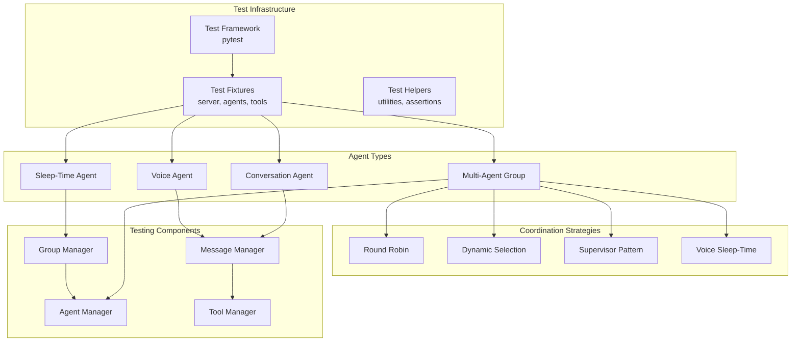
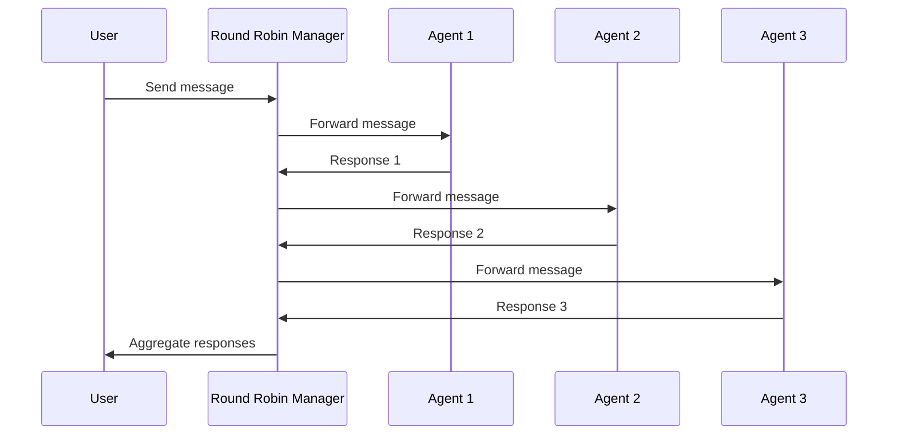
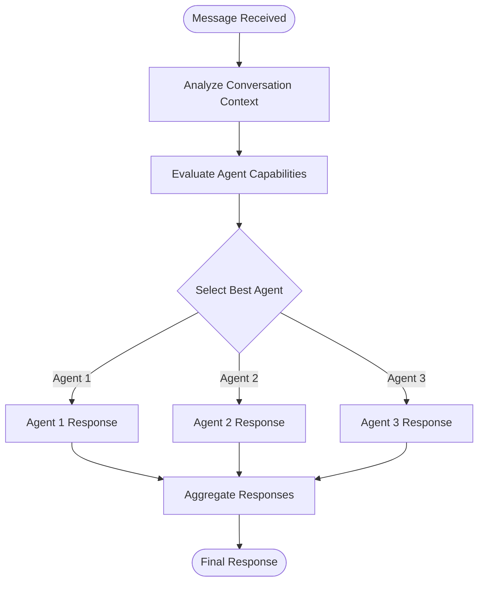
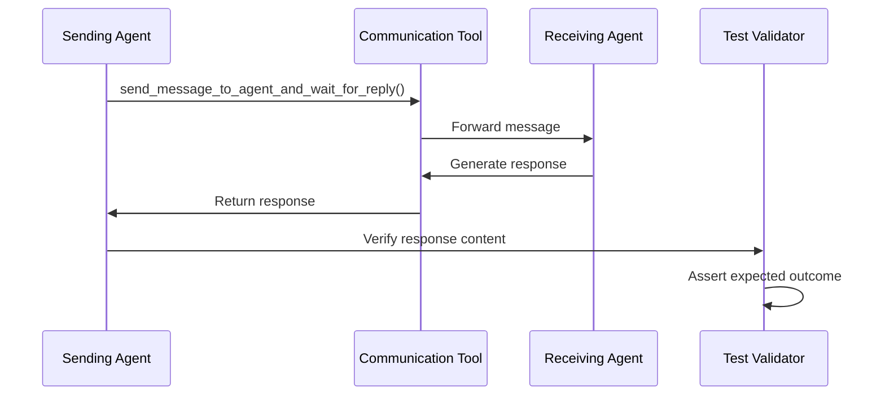
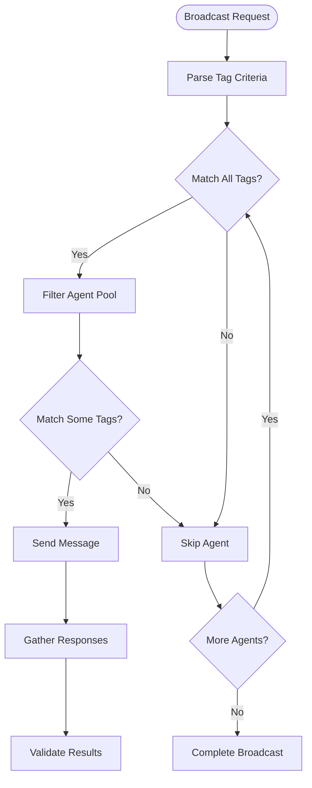
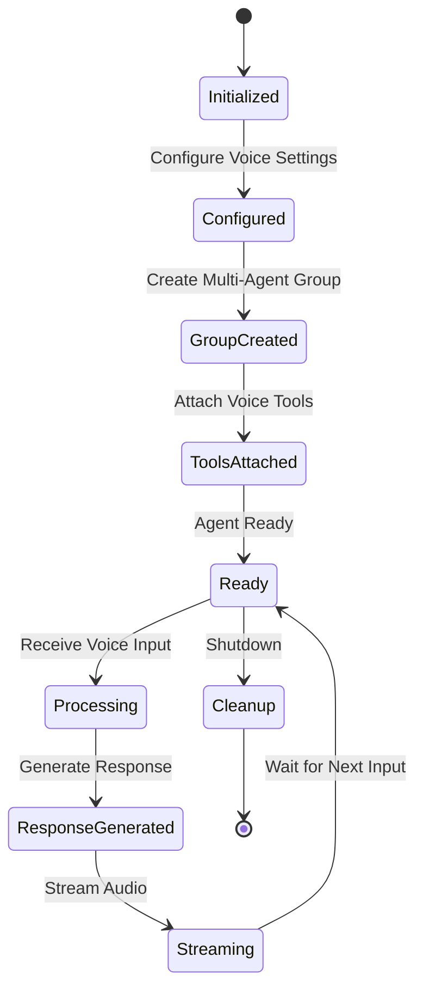

# Agent Interactions Testing

<cite>
**Referenced Files in This Document**
- [integration_test_multi_agent.py](file://tests/integration_test_multi_agent.py)
- [test_multi_agent.py](file://tests/test_multi_agent.py)
- [integration_test_voice_agent.py](file://tests/integration_test_voice_agent.py)
- [dynamic_multi_agent.py](file://letta/groups/dynamic_multi_agent.py)
- [supervisor_multi_agent.py](file://letta/groups/supervisor_multi_agent.py)
- [round_robin_multi_agent.py](file://letta/groups/round_robin_multi_agent.py)
- [sleeptime_multi_agent.py](file://letta/groups/sleeptime_multi_agent.py)
- [group_manager.py](file://letta/services/group_manager.py)
- [multi_agent.py](file://letta/functions/function_sets/multi_agent.py)
- [helpers.py](file://letta/groups/helpers.py)
- [voice_agent.py](file://letta/agents/voice_agent.py)
- [summarizer.py](file://letta/services/summarizer/summarizer.py)
</cite>

## Table of Contents
1. [Introduction](#introduction)
2. [Testing Architecture Overview](#testing-architecture-overview)
3. [Multi-Agent Coordination Strategies](#multi-agent-coordination-strategies)
4. [Test Scenarios and Patterns](#test-scenarios-and-patterns)
5. [Voice Agent Testing](#voice-agent-testing)
6. [Memory Management and State Synchronization](#memory-management-and-state-synchronization)
7. [Concurrency and Race Condition Handling](#concurrency-and-race-condition-handling)
8. [Integration Testing Framework](#integration-testing-framework)
9. [Debugging and Troubleshooting](#debugging-and-troubleshooting)
10. [Best Practices](#best-practices)

## Introduction

The Letta platform's Agent Interactions Testing framework provides comprehensive validation for multi-agent coordination and communication scenarios. This testing infrastructure enables developers to verify complex agent behaviors including message routing, shared memory access, group coordination strategies, and state synchronization across distributed agent systems.

The testing framework supports multiple agent types including traditional conversation agents, voice-enabled agents, sleep-time agents, and specialized multi-agent group managers. Each agent type has distinct interaction patterns and testing requirements that must be validated through targeted test scenarios.

## Testing Architecture Overview

The Letta multi-agent testing architecture is built around several key components that work together to provide comprehensive coverage of agent interaction scenarios.

**Diagram sources**
- [integration_test_multi_agent.py](file://tests/integration_test_multi_agent.py#L1-L50)
- [test_multi_agent.py](file://tests/test_multi_agent.py#L1-L50)
- [group_manager.py](file://letta/services/group_manager.py#L25-L50)

**Section sources**
- [integration_test_multi_agent.py](file://tests/integration_test_multi_agent.py#L1-L376)
- [test_multi_agent.py](file://tests/test_multi_agent.py#L1-L438)

## Multi-Agent Coordination Strategies

Letta implements four primary multi-agent coordination strategies, each with distinct testing requirements and validation patterns.

### Round Robin Strategy

The Round Robin strategy ensures equitable participation among group members by rotating speakers in a predictable sequence. Testing focuses on verifying the rotation mechanism and message distribution patterns.

**Diagram sources**
- [round_robin_multi_agent.py](file://letta/groups/round_robin_multi_agent.py#L63-L105)

### Dynamic Selection Strategy

The Dynamic strategy allows intelligent selection of the most appropriate agent for each interaction based on conversation context and agent capabilities. Testing validates decision-making logic and response quality.

**Diagram sources**
- [dynamic_multi_agent.py](file://letta/groups/dynamic_multi_agent.py#L70-L120)

### Supervisor Strategy

The Supervisor strategy delegates coordination to a designated supervisor agent that manages group interactions and aggregates responses. Testing verifies delegation patterns and aggregation logic.

### Voice Sleep-Time Strategy

The Voice Sleep-Time strategy combines real-time voice interaction with background processing, requiring specialized testing for latency-sensitive scenarios and asynchronous processing workflows.

**Section sources**
- [round_robin_multi_agent.py](file://letta/groups/round_robin_multi_agent.py#L1-L161)
- [dynamic_multi_agent.py](file://letta/groups/dynamic_multi_agent.py#L1-L279)
- [supervisor_multi_agent.py](file://letta/groups/supervisor_multi_agent.py#L1-L121)
- [sleeptime_multi_agent.py](file://letta/groups/sleeptime_multi_agent.py#L1-L291)

## Test Scenarios and Patterns

### Basic Agent Communication Testing

The foundation of multi-agent testing involves validating basic message passing between individual agents. This includes testing tool-based communication and response verification.

**Diagram sources**
- [integration_test_multi_agent.py](file://tests/integration_test_multi_agent.py#L120-L188)

### Tag-Based Agent Filtering

Advanced testing scenarios involve filtering agents based on tags, enabling targeted communication within specific agent subsets.

**Diagram sources**
- [multi_agent.py](file://letta/functions/function_sets/multi_agent.py#L44-L109)

### Group Formation and Management

Testing dynamic group formation involves validating agent addition, removal, and reconfiguration scenarios.

**Section sources**
- [integration_test_multi_agent.py](file://tests/integration_test_multi_agent.py#L202-L376)
- [test_multi_agent.py](file://tests/test_multi_agent.py#L374-L438)
- [multi_agent.py](file://letta/functions/function_sets/multi_agent.py#L1-L158)

## Voice Agent Testing

Voice agents introduce unique testing challenges related to real-time processing, streaming responses, and latency-sensitive operations.

### Voice Agent Lifecycle Testing

Voice agents require specialized testing for initialization, configuration, and lifecycle management.

**Diagram sources**
- [integration_test_voice_agent.py](file://tests/integration_test_voice_agent.py#L492-L545)

### Voice Sleep-Time Agent Testing

Voice Sleep-Time agents combine real-time voice processing with background memory management, requiring specialized testing for both streaming and asynchronous operations.

### Memory Summarization Testing

Voice agents utilize sophisticated memory summarization to manage conversation context within limited buffers.

**Section sources**
- [integration_test_voice_agent.py](file://tests/integration_test_voice_agent.py#L1-L613)
- [voice_agent.py](file://letta/agents/voice_agent.py#L110-L129)

## Memory Management and State Synchronization

Effective multi-agent testing requires careful validation of memory state transitions and synchronization mechanisms across distributed agents.

### Shared Memory Access Patterns

Multi-agent groups share memory blocks to maintain consistent context across agents. Testing validates that memory updates propagate correctly and that agents maintain synchronized state.

### State Transition Validation

Agent state transitions must be validated to ensure consistency during multi-agent operations. This includes verifying that memory modifications trigger appropriate rebuild operations and that system prompts remain coherent.

### Background Processing Workflows

Sleep-time agents and voice agents operate background processing workflows that require specialized testing for asynchronous operations and state persistence.

**Section sources**
- [group_manager.py](file://letta/services/group_manager.py#L355-L415)
- [helpers.py](file://letta/groups/helpers.py#L14-L86)

## Concurrency and Race Condition Handling

Multi-agent systems inherently involve concurrent operations that require careful testing to prevent race conditions and ensure data consistency.

### Thread Safety Testing

The platform implements thread-safe operations for concurrent agent processing, requiring tests that validate proper synchronization mechanisms.

### Deadlock Prevention

Testing includes scenarios that verify deadlock prevention mechanisms, particularly in high-concurrency environments.

### Asynchronous Operation Testing

Many multi-agent operations occur asynchronously, requiring specialized testing approaches for timing-sensitive validations.

**Section sources**
- [sleeptime_multi_agent.py](file://letta/groups/sleeptime_multi_agent.py#L47-L98)
- [helpers.py](file://letta/functions/helpers.py#L415-L449)

## Integration Testing Framework

The Letta platform provides a comprehensive integration testing framework designed specifically for multi-agent scenarios.

### Test Fixture Management

The framework includes sophisticated fixture management for creating and configuring test environments with multiple agents, groups, and tools.

### Server Management

Integration tests require managed server instances that can handle multiple concurrent agent operations and provide consistent testing environments.

### Mock and Stub Patterns

The framework employs extensive mocking and stubbing to isolate specific components while maintaining realistic interaction patterns.

**Section sources**
- [integration_test_multi_agent.py](file://tests/integration_test_multi_agent.py#L17-L119)
- [test_multi_agent.py](file://tests/test_multi_agent.py#L21-L128)

## Debugging and Troubleshooting

Multi-agent testing presents unique debugging challenges that require specialized approaches and tools.

### Logging and Tracing

The platform implements comprehensive logging and tracing capabilities to aid in debugging complex multi-agent interactions.

### State Inspection Tools

Testing frameworks include tools for inspecting agent state, memory contents, and message flows to identify issues in multi-agent scenarios.

### Performance Monitoring

Multi-agent tests include performance monitoring to identify bottlenecks and optimize agent coordination strategies.

### Common Issues and Solutions

| Issue Type | Symptoms | Solution Approach |
|------------|----------|-------------------|
| Race Conditions | Intermittent test failures | Add synchronization points, increase timeouts |
| Memory Leaks | Gradual performance degradation | Monitor memory usage, implement cleanup |
| Deadlocks | Test hangs, timeout failures | Analyze operation sequences, add timeouts |
| State Inconsistency | Unexpected agent behavior | Validate state transitions, add assertions |

## Best Practices

### Test Organization

Organize multi-agent tests by coordination strategy and agent type to maintain clarity and enable targeted testing.

### Resource Management

Properly manage test resources including agents, groups, and tools to prevent resource leaks and ensure consistent test execution.

### Isolation Strategies

Implement proper test isolation to prevent interference between concurrent test executions while maintaining realistic interaction patterns.

### Validation Patterns

Use comprehensive validation patterns that check both functional correctness and performance characteristics of multi-agent interactions.

### Continuous Integration

Integrate multi-agent tests into continuous integration pipelines with appropriate resource allocation and timeout configurations.

The Letta platform's Agent Interactions Testing framework provides a robust foundation for validating complex multi-agent scenarios. Through careful test design, comprehensive validation patterns, and specialized testing approaches, developers can ensure reliable and efficient multi-agent coordination across diverse agent types and coordination strategies.