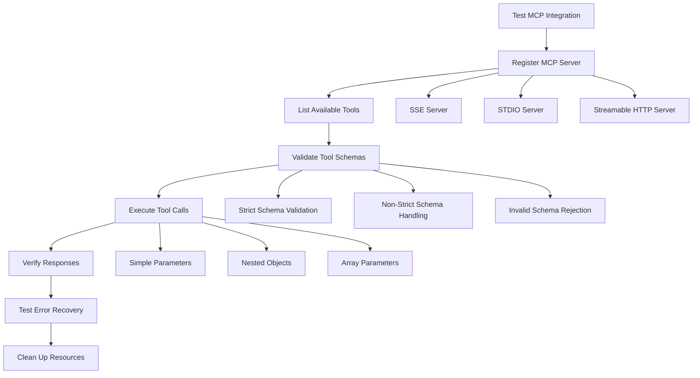
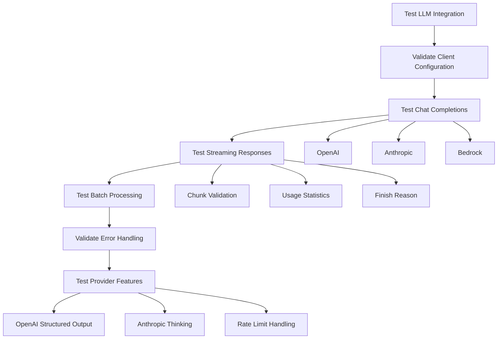
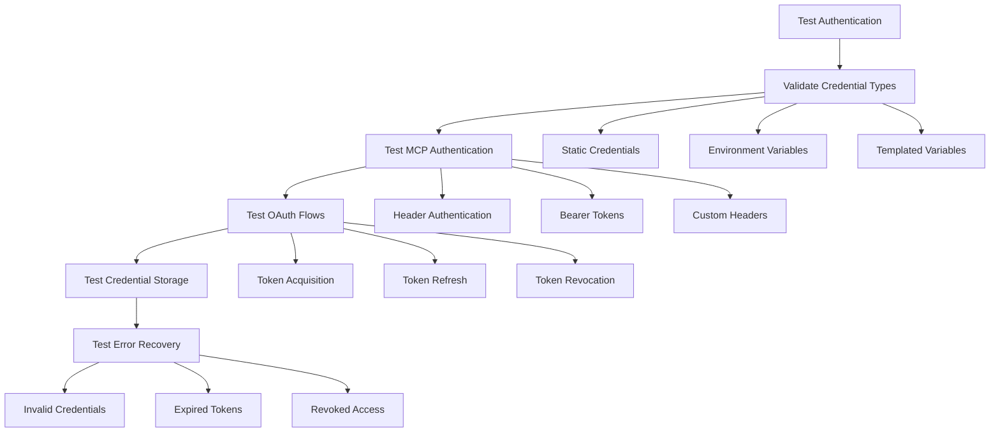
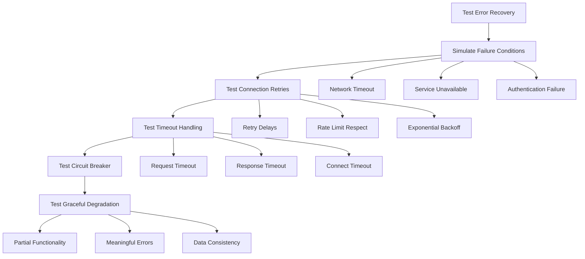
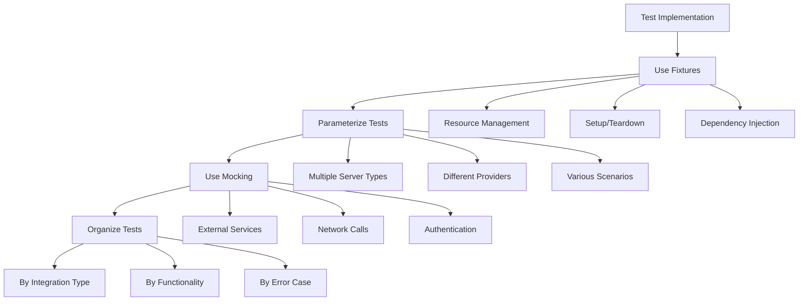
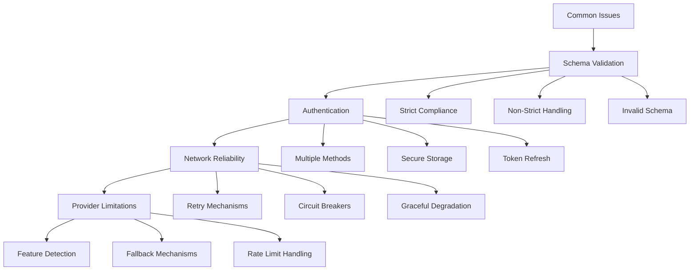

# External Integrations Testing

<cite>
**Referenced Files in This Document**   
- [test_mcp.py](file://tests\mcp_tests\test_mcp.py)
- [test_mcp_schema_validation.py](file://tests\mcp_tests\test_mcp_schema_validation.py)
- [test_schema_validator.py](file://tests\mcp_tests\test_schema_validator.py)
- [integration_test_mcp.py](file://tests\integration_test_mcp.py)
- [types.py](file://letta\functions\mcp_client\types.py)
- [base_client.py](file://letta\services\mcp\base_client.py)
- [stdio_client.py](file://letta\services\mcp\stdio_client.py)
- [streamable_http_client.py](file://letta\services\mcp\streamable_http_client.py)
- [sse_client.py](file://letta\services\mcp\sse_client.py)
- [openai_client.py](file://letta\llm_api\openai_client.py)
- [anthropic_client.py](file://letta\llm_api\anthropic_client.py)
- [mcp_server_manager.py](file://letta\services\mcp_server_manager.py)
</cite>

## Table of Contents
1. [Introduction](#introduction)
2. [MCP Server Integration Testing](#mcp-server-integration-testing)
3. [LLM Provider Integration Testing](#llm-provider-integration-testing)
4. [Authentication and OAuth Testing](#authentication-and-oauth-testing)
5. [Error Recovery and Resilience Testing](#error-recovery-and-resilience-testing)
6. [Test Implementation Patterns](#test-implementation-patterns)
7. [Common Issues and Solutions](#common-issues-and-solutions)
8. [Conclusion](#conclusion)

## Introduction
This document provides comprehensive guidance on testing external integrations within the Letta framework, focusing on connectivity and data exchange with external services and protocols. The testing strategy centers on validating interactions with Model Context Protocol (MCP) servers, LLM providers like OpenAI and Anthropic, and third-party APIs. The implementation uses pytest to create robust test scenarios that cover MCP server registration, tool schema validation, bidirectional message streaming, and error recovery during connection failures.

The test suite includes concrete examples such as testing weather MCP server integration, validating chat completion requests to LLM endpoints, and handling OAuth flows for MCP authentication. These tests ensure that the system can properly connect to external services, validate data schemas, handle streaming responses, and recover from connection issues. The testing framework addresses common challenges like network latency simulation, API rate limiting, schema version compatibility, and secure credential handling.

The architecture supports multiple MCP server types including SSE, STDIO, and Streamable HTTP, each requiring specific testing approaches. The tests validate both successful integration scenarios and edge cases such as invalid schemas, connection timeouts, and authentication failures. This comprehensive testing approach ensures reliable external service integration while maintaining system stability and security.

## MCP Server Integration Testing

The MCP server integration testing framework validates connectivity and functionality with external MCP servers through comprehensive pytest scenarios. The tests verify server registration, tool discovery, schema validation, and bidirectional communication across different transport protocols including SSE, STDIO, and Streamable HTTP. The test suite uses both real and mock MCP servers to validate end-to-end integration workflows.

Key test scenarios include server registration and configuration validation, tool schema inspection, and execution of MCP tools with various data types. For example, the weather MCP server test validates that the system can properly register a server, discover available tools like `get_alerts`, and execute tool calls with appropriate parameters. The tests verify that tool responses are properly formatted and contain expected data, ensuring reliable integration with external services.

The framework also tests complex schema handling, including nested objects, optional fields, and union types. Tests validate that the system can properly handle tools with complex parameter structures, such as the `get_parameter_type_description` tool which accepts nested objects with arrays. The test suite verifies that schema validation works correctly for both strict and non-strict compliant schemas, ensuring compatibility with various MCP server implementations.

**Diagram sources**
- [test_mcp.py](file://tests\mcp_tests\test_mcp.py#L154-L205)
- [integration_test_mcp.py](file://tests\integration_test_mcp.py#L163-L198)

**Section sources**
- [test_mcp.py](file://tests\mcp_tests\test_mcp.py#L1-L378)
- [integration_test_mcp.py](file://tests\integration_test_mcp.py#L1-L400)

## LLM Provider Integration Testing

The LLM provider integration testing framework validates connectivity and functionality with major LLM providers including OpenAI, Anthropic, and others. The tests focus on chat completion requests, streaming responses, batch processing, and proper handling of provider-specific features and limitations. The implementation uses pytest to create comprehensive test scenarios that validate both successful interactions and error recovery.

Key test scenarios include validating chat completion endpoints with streaming support, testing batch request processing, and verifying proper handling of provider-specific parameters. For OpenAI integration, tests validate that the system can properly handle streaming responses, manage token counting, and process tool calls with structured output. The tests verify that streaming chunks are properly formatted and that the final response includes complete usage statistics.

For Anthropic integration, tests validate support for extended thinking, context management, and fine-grained tool streaming. The framework tests both synchronous and asynchronous request patterns, ensuring reliable integration with Anthropic's beta features. Tests also validate proper error handling for common issues like context window exceeded, rate limiting, and authentication failures.

**Diagram sources**
- [test_llm_clients.py](file://tests\test_llm_clients.py#L72-L95)
- [integration_test_chat_completions.py](file://tests\integration_test_chat_completions.py#L153-L197)

**Section sources**
- [openai_client.py](file://letta\llm_api\openai_client.py#L1-L1083)
- [anthropic_client.py](file://letta\llm_api\anthropic_client.py#L1-L1279)

## Authentication and OAuth Testing

The authentication and OAuth testing framework validates secure credential handling and authentication flows for external service integration. The tests focus on MCP server authentication, OAuth flows, and secure credential storage and retrieval. The implementation uses pytest to create comprehensive scenarios that validate both successful authentication and proper handling of authentication failures.

Key test scenarios include validating different authentication methods for MCP servers, testing OAuth token handling, and verifying secure credential storage. For MCP servers, tests validate that the system can properly handle authentication headers, bearer tokens, and custom headers with templated variables. The framework tests both static credentials and environment variable-based credential resolution.

The OAuth testing validates the complete authentication flow, including token acquisition, refresh, and revocation. Tests verify that OAuth tokens are properly stored and used in subsequent requests, and that expired tokens are automatically refreshed. The framework also tests error recovery for common authentication issues like invalid credentials, expired tokens, and revoked access.

**Diagram sources**
- [types.py](file://letta\functions\mcp_client\types.py#L12-L16)
- [base_client.py](file://letta\services\mcp\base_client.py#L20-L24)

**Section sources**
- [types.py](file://letta\functions\mcp_client\types.py#L1-L265)
- [base_client.py](file://letta\services\mcp\base_client.py#L1-L115)

## Error Recovery and Resilience Testing

The error recovery and resilience testing framework validates the system's ability to handle connection failures, network issues, and service disruptions during external integrations. The tests focus on connection retries, timeout handling, circuit breaker patterns, and graceful degradation. The implementation uses pytest to create scenarios that simulate various failure conditions and verify proper recovery mechanisms.

Key test scenarios include validating connection retry logic, testing timeout handling, and verifying circuit breaker functionality. The framework tests both transient failures like network timeouts and persistent failures like service unavailability. Tests verify that the system implements appropriate retry delays, respects rate limits, and avoids overwhelming external services during recovery attempts.

The resilience testing also validates graceful degradation when external services are unavailable. Tests verify that the system can continue operating with reduced functionality, provide meaningful error messages, and maintain data consistency. The framework tests recovery from various failure modes including authentication failures, schema validation errors, and response parsing issues.

**Diagram sources**
- [base_client.py](file://letta\services\mcp\base_client.py#L34-L53)
- [anthropic_client.py](file://letta\llm_api\anthropic_client.py#L619-L723)

**Section sources**
- [base_client.py](file://letta\services\mcp\base_client.py#L1-L115)
- [anthropic_client.py](file://letta\llm_api\anthropic_client.py#L1-L1279)

## Test Implementation Patterns

The test implementation follows consistent patterns across different integration types, ensuring maintainable and reliable test coverage. The framework uses pytest fixtures to manage test dependencies, setup, and teardown, providing a clean and reusable testing infrastructure. Key implementation patterns include fixture-based resource management, parameterized testing, and modular test organization.

The fixture pattern is used extensively to manage test resources such as MCP servers, LLM clients, and authentication credentials. Fixtures handle setup and teardown automatically, ensuring proper resource cleanup and preventing test interference. For example, the `server_url` fixture starts the Letta server in a background thread and ensures it's available before tests run, while the `client` fixture creates a REST client for testing.

Parameterized testing is used to validate multiple scenarios with minimal code duplication. Tests are designed to run across different MCP server types, LLM providers, and authentication methods, ensuring comprehensive coverage. The framework also uses mocking and patching to isolate external dependencies, allowing tests to focus on specific integration points without requiring actual external services.

**Diagram sources**
- [test_mcp.py](file://tests\mcp_tests\test_mcp.py#L84-L120)
- [integration_test_mcp.py](file://tests\integration_test_mcp.py#L27-L157)

**Section sources**
- [test_mcp.py](file://tests\mcp_tests\test_mcp.py#L1-L378)
- [integration_test_mcp.py](file://tests\integration_test_mcp.py#L1-L400)

## Common Issues and Solutions

The integration testing framework addresses several common issues encountered when connecting to external services. These include schema validation problems, authentication challenges, network reliability issues, and provider-specific limitations. The framework provides solutions and best practices for each category of issues, ensuring reliable and maintainable integrations.

Schema validation issues are addressed through comprehensive validation and normalization. The framework tests both strict and non-strict schema compliance, ensuring compatibility with various MCP server implementations. For authentication issues, the framework supports multiple authentication methods and provides secure credential handling through environment variables and templated variables.

Network reliability issues are mitigated through robust error handling and retry mechanisms. The framework implements circuit breakers, exponential backoff, and graceful degradation to maintain system stability during network disruptions. Provider-specific limitations are handled through feature detection and fallback mechanisms, ensuring the system can adapt to different provider capabilities.

**Diagram sources**
- [test_schema_validator.py](file://tests\mcp_tests\test_schema_validator.py#L8-L309)
- [test_mcp_schema_validation.py](file://tests\mcp_tests\test_mcp_schema_validation.py#L1-L800)

**Section sources**
- [test_schema_validator.py](file://tests\mcp_tests\test_schema_validator.py#L1-L309)
- [test_mcp_schema_validation.py](file://tests\mcp_tests\test_mcp_schema_validation.py#L1-L800)

## Conclusion
The external integrations testing framework provides comprehensive coverage for validating connectivity and data exchange with external services and protocols. By using pytest to create robust test scenarios, the framework ensures reliable integration with MCP servers, LLM providers, and third-party APIs. The tests cover critical aspects including server registration, tool schema validation, bidirectional message streaming, and error recovery during connection failures.

The implementation addresses common challenges such as network latency, API rate limiting, schema version compatibility, and secure credential handling. Through consistent test patterns and comprehensive coverage, the framework ensures that external service integrations are reliable, secure, and maintainable. The use of fixtures, parameterized testing, and mocking provides a clean and reusable testing infrastructure that can be extended to support new integration types.

The testing approach balances thorough validation with practical considerations, using both real and mock services to ensure comprehensive coverage while maintaining test efficiency. By validating both successful scenarios and edge cases, the framework helps identify and resolve integration issues early in the development process, contributing to a more stable and reliable system overall.