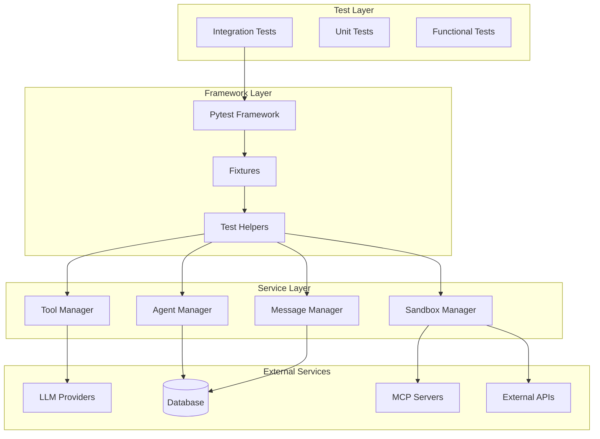
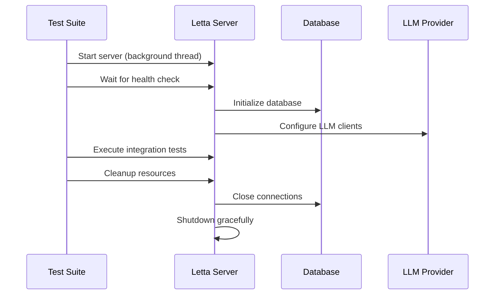
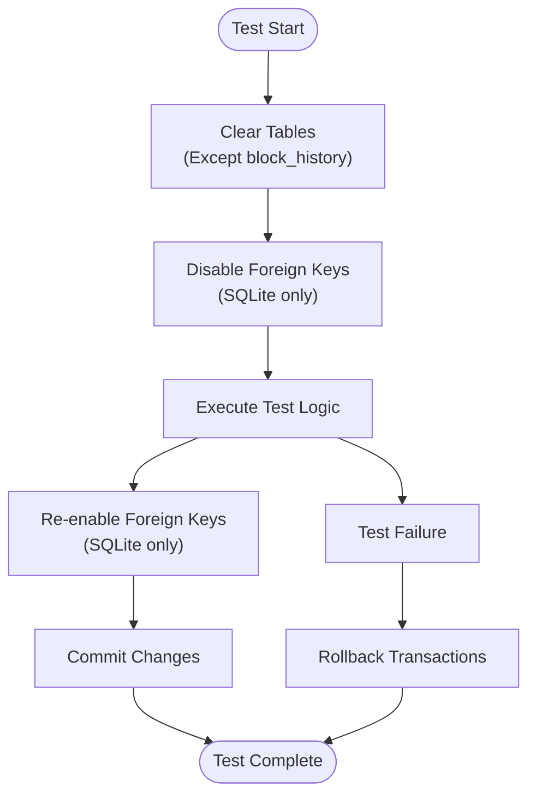
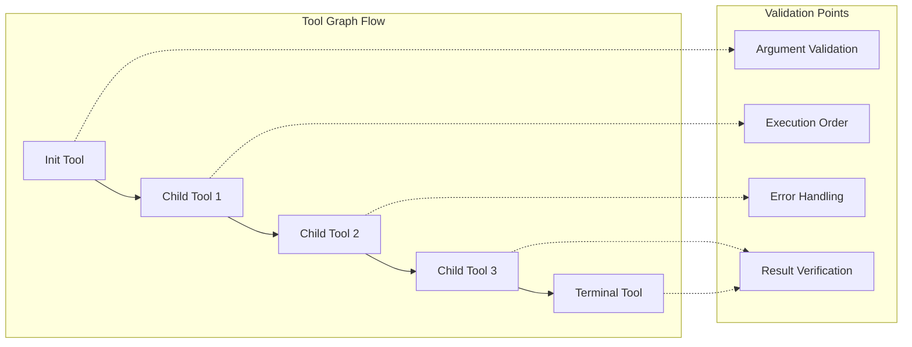
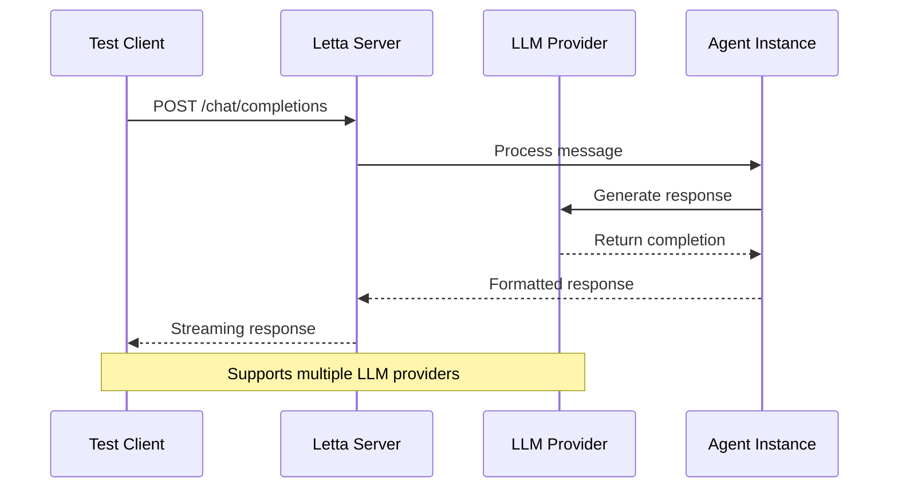
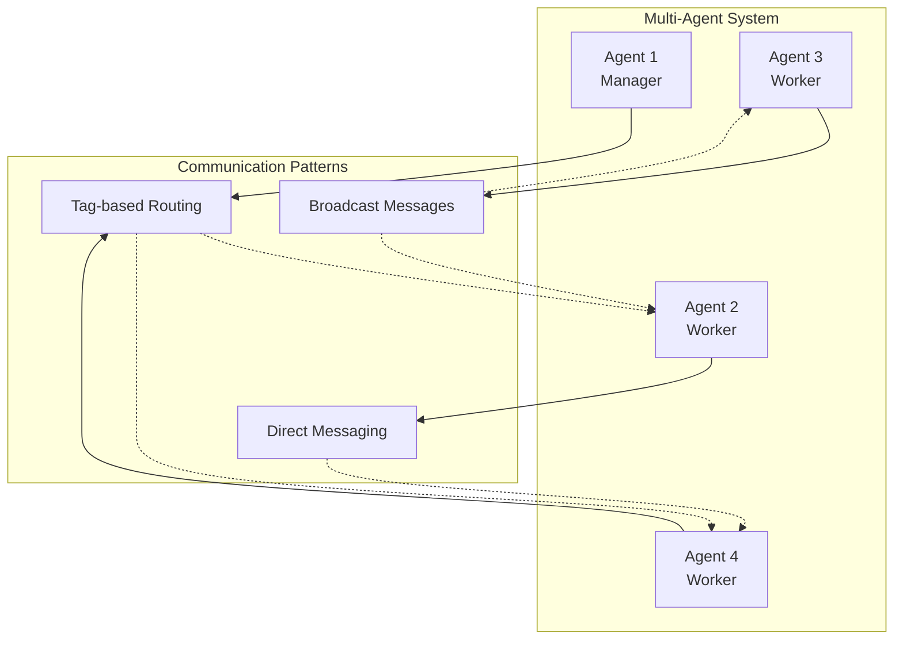
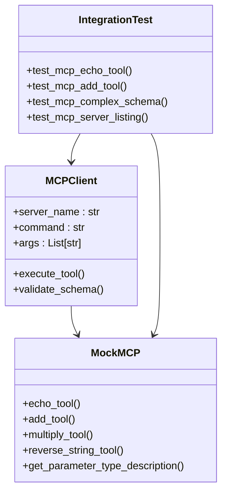
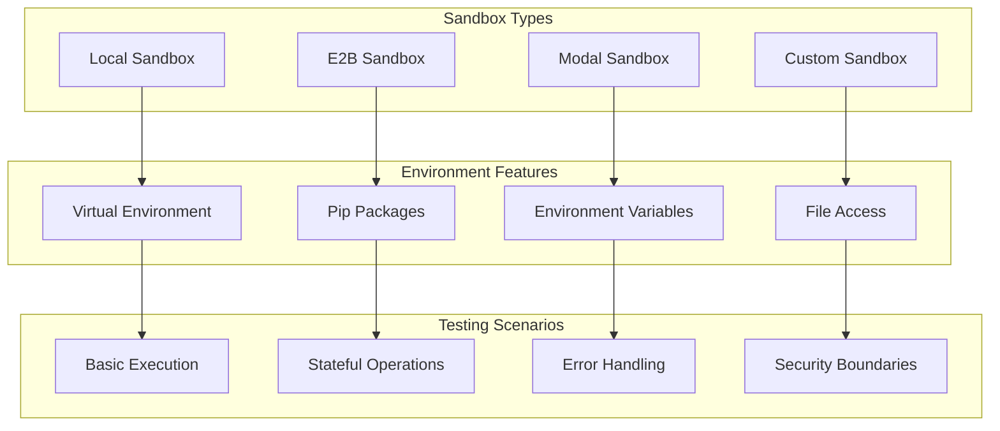
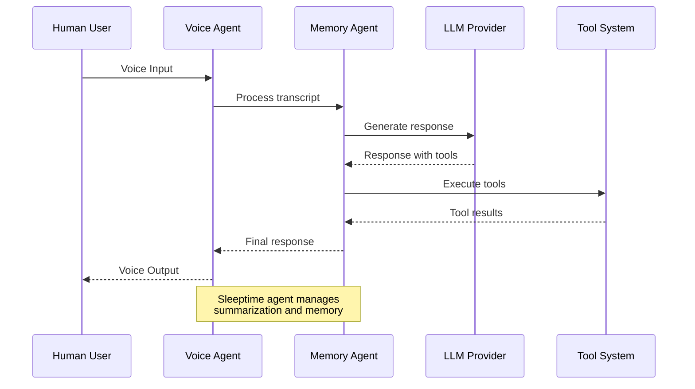
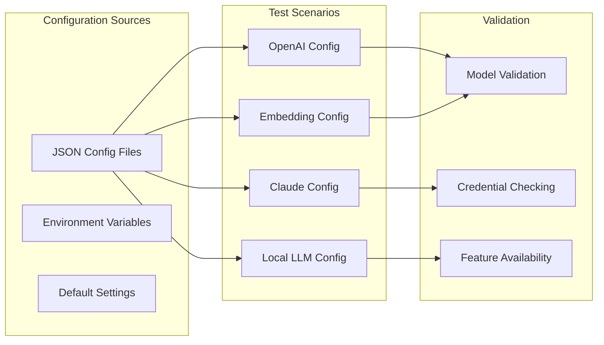

# Integration Testing

<cite>
**Referenced Files in This Document**
- [tests/integration_test_agent_tool_graph.py](file://tests/integration_test_agent_tool_graph.py)
- [tests/integration_test_chat_completions.py](file://tests/integration_test_chat_completions.py)
- [tests/integration_test_multi_agent.py](file://tests/integration_test_multi_agent.py)
- [tests/integration_test_tool_execution_sandbox.py](file://tests/integration_test_tool_execution_sandbox.py)
- [tests/integration_test_mcp.py](file://tests/integration_test_mcp.py)
- [tests/integration_test_voice_agent.py](file://tests/integration_test_voice_agent.py)
- [tests/integration_test_builtin_tools.py](file://tests/integration_test_builtin_tools.py)
- [tests/integration_test_send_message.py](file://tests/integration_test_send_message.py)
- [tests/conftest.py](file://tests/conftest.py)
- [tests/helpers/endpoints_helper.py](file://tests/helpers/endpoints_helper.py)
- [tests/utils.py](file://tests/utils.py)
- [tests/managers/conftest.py](file://tests/managers/conftest.py)
- [letta/services/agent_manager.py](file://letta/services/agent_manager.py)
- [letta/services/tool_executor/tool_execution_sandbox.py](file://letta/services/tool_executor/tool_execution_sandbox.py)
- [letta/functions/mcp_client/types.py](file://letta/functions/mcp_client/types.py)
</cite>

## Table of Contents
1. [Introduction](#introduction)
2. [Testing Architecture Overview](#testing-architecture-overview)
3. [Core Integration Test Components](#core-integration-test-components)
4. [Agent-Tool Communication Testing](#agent-tool-communication-testing)
5. [Multi-Agent Coordination Testing](#multi-agent-coordination-testing)
6. [MCP Server Integration Testing](#mcp-server-integration-testing)
7. [Tool Execution Sandbox Testing](#tool-execution-sandbox-testing)
8. [Voice Agent Testing](#voice-agent-testing)
9. [Test Data Management and Setup](#test-data-management-and-setup)
10. [Common Issues and Solutions](#common-issues-and-solutions)
11. [Best Practices and Strategies](#best-practices-and-strategies)
12. [Conclusion](#conclusion)

## Introduction

Letta's integration testing framework provides comprehensive validation of multi-component interactions within the system. This testing approach focuses on end-to-end scenarios that verify the proper functioning of agent-tool communication, message processing pipelines, multi-agent coordination, and external service integrations. The framework is built around pytest and emphasizes realistic test scenarios that mirror production usage patterns.

Integration tests in Letta serve several critical purposes:
- Validate complex workflows across service boundaries
- Ensure proper data flow between agents, tools, databases, and external APIs
- Test real-world scenarios involving multiple interacting components
- Verify system reliability under various configuration combinations
- Provide confidence in system stability before deployments

## Testing Architecture Overview

Letta's integration testing architecture follows a layered approach with clear separation of concerns:



**Diagram sources**
- [tests/conftest.py](file://tests/conftest.py#L24-L67)
- [tests/helpers/endpoints_helper.py](file://tests/helpers/endpoints_helper.py#L42-L88)

The architecture consists of four main layers:

1. **Test Layer**: Contains integration tests that validate end-to-end scenarios
2. **Framework Layer**: Provides pytest fixtures, helpers, and test utilities
3. **Service Layer**: Core Letta services that manage agents, tools, and data
4. **External Services**: LLM providers, databases, and external integrations

**Section sources**
- [tests/conftest.py](file://tests/conftest.py#L1-L333)
- [tests/helpers/endpoints_helper.py](file://tests/helpers/endpoints_helper.py#L1-L247)

## Core Integration Test Components

### Server Management and Lifecycle

Integration tests require proper server management to ensure consistent and isolated testing environments:



**Diagram sources**
- [tests/conftest.py](file://tests/conftest.py#L24-L67)
- [tests/integration_test_chat_completions.py](file://tests/integration_test_chat_completions.py#L23-L41)

The server management system handles:
- Automatic server startup for test suites
- Health checking and readiness verification
- Graceful shutdown and resource cleanup
- Port management and conflict resolution

### Database Transaction Management

Proper database transaction management ensures test isolation and prevents data contamination:



**Diagram sources**
- [tests/managers/conftest.py](file://tests/managers/conftest.py#L63-L80)

**Section sources**
- [tests/managers/conftest.py](file://tests/managers/conftest.py#L45-L80)
- [tests/conftest.py](file://tests/conftest.py#L79-L97)

## Agent-Tool Communication Testing

### Tool Graph Validation

Letta's integration tests extensively validate agent-tool communication through sophisticated tool graph scenarios:



**Diagram sources**
- [tests/integration_test_agent_tool_graph.py](file://tests/integration_test_agent_tool_graph.py#L348-L356)

Key aspects tested in agent-tool communication:

1. **Sequential Tool Execution**: Verifies tools execute in the correct order
2. **Argument Passing**: Ensures proper parameter passing between tools
3. **Error Propagation**: Validates error handling in tool chains
4. **State Persistence**: Tests tool execution state across multiple calls

### Chat Completion Flows

Integration tests validate chat completion flows through multiple LLM providers:



**Diagram sources**
- [tests/integration_test_chat_completions.py](file://tests/integration_test_chat_completions.py#L153-L197)

**Section sources**
- [tests/integration_test_agent_tool_graph.py](file://tests/integration_test_agent_tool_graph.py#L1-L800)
- [tests/integration_test_chat_completions.py](file://tests/integration_test_chat_completions.py#L1-L197)

## Multi-Agent Coordination Testing

### Agent-to-Agent Communication

Multi-agent testing validates complex coordination scenarios:



**Diagram sources**
- [tests/integration_test_multi_agent.py](file://tests/integration_test_multi_agent.py#L202-L260)

### Tag-Based Message Routing

The multi-agent system supports sophisticated message routing based on agent tags:

| Feature | Description | Test Coverage |
|---------|-------------|---------------|
| Tag Matching | Agents receive messages based on tag criteria | `test_send_message_to_agents_with_tags_simple` |
| Broadcast Scenarios | Sending messages to multiple agents simultaneously | `test_send_message_to_agents_with_tags_complex_tool_use` |
| Message Filtering | Preventing unwanted message delivery | Manual verification of message routing |
| Agent Discovery | Finding agents based on tag combinations | Comprehensive tag validation |

**Section sources**
- [tests/integration_test_multi_agent.py](file://tests/integration_test_multi_agent.py#L1-L376)

## MCP Server Integration Testing

### Mock MCP Server Implementation

Letta's integration tests include comprehensive MCP (Model Context Protocol) server testing:



**Diagram sources**
- [tests/integration_test_mcp.py](file://tests/integration_test_mcp.py#L79-L98)
- [letta/functions/mcp_client/types.py](file://letta/functions/mcp_client/types.py)

### MCP Tool Schema Validation

The testing framework validates complex MCP tool schemas with nested parameters:

| Tool Type | Parameters | Validation Focus |
|-----------|------------|------------------|
| Basic Tools | Simple arguments | Parameter parsing and execution |
| Complex Tools | Nested objects, enums | Schema validation and type safety |
| Multi-step Tools | Sequential execution | State management and error handling |
| Streaming Tools | Real-time responses | Stream processing and completion |

**Section sources**
- [tests/integration_test_mcp.py](file://tests/integration_test_mcp.py#L1-L400)

## Tool Execution Sandbox Testing

### Sandbox Environment Management

Letta's integration tests cover multiple sandbox environments for tool execution:



**Diagram sources**
- [tests/integration_test_tool_execution_sandbox.py](file://tests/integration_test_tool_execution_sandbox.py#L287-L320)

### Tool Execution Validation

The sandbox testing framework validates various execution scenarios:

1. **Local Sandbox Testing**: Validates tool execution in isolated Python environments
2. **E2B Sandbox Testing**: Tests cloud-based sandbox execution with external dependencies
3. **Stateful Tool Testing**: Verifies persistence of agent state across tool executions
4. **Error Recovery Testing**: Ensures proper error handling and cleanup

**Section sources**
- [tests/integration_test_tool_execution_sandbox.py](file://tests/integration_test_tool_execution_sandbox.py#L1-L756)

## Voice Agent Testing

### Voice Conversation Management

Letta's voice agent integration tests validate complex conversational scenarios:



**Diagram sources**
- [tests/integration_test_voice_agent.py](file://tests/integration_test_voice_agent.py#L353-L420)

### Memory Management Testing

Voice agents require sophisticated memory management capabilities:

| Feature | Test Scenario | Validation Method |
|---------|---------------|-------------------|
| Message Buffering | Large conversation handling | Buffer length validation |
| Summarization | Long conversations | Content preservation |
| Memory Retrieval | Context-aware responses | Semantic search validation |
| State Synchronization | Multi-agent memory sharing | Cross-agent consistency |

**Section sources**
- [tests/integration_test_voice_agent.py](file://tests/integration_test_voice_agent.py#L1-L613)

## Test Data Management and Setup

### Configuration Management

Letta's integration tests use sophisticated configuration management:



**Diagram sources**
- [tests/helpers/endpoints_helper.py](file://tests/helpers/endpoints_helper.py#L42-L88)

### Test Data Utilities

The testing framework provides comprehensive utilities for test data management:

1. **Tool Creation Helpers**: Automated tool creation from Python functions
2. **Agent Setup Utilities**: Consistent agent configuration across tests
3. **Message Generation**: Standardized message creation for testing
4. **Mock Data Providers**: Fake data connectors for offline testing

**Section sources**
- [tests/utils.py](file://tests/utils.py#L1-L199)
- [tests/helpers/endpoints_helper.py](file://tests/helpers/endpoints_helper.py#L1-L247)

## Common Issues and Solutions

### Database Connection Management

**Issue**: Database connection pooling causing test failures
**Solution**: Disable connection pooling during testing sessions

```python
@pytest.fixture(scope="session", autouse=True)
def disable_db_pooling_for_tests():
    """Disable database connection pooling for the entire test session."""
    os.environ["LETTA_DISABLE_SQLALCHEMY_POOLING"] = "true"
    yield
    if "LETTA_DISABLE_SQLALCHEMY_POOLING" in os.environ:
        del os.environ["LETTA_DISABLE_SQLALCHEMY_POOLING"]
```

### External Dependency Flakiness

**Issue**: External LLM providers causing test instability
**Solution**: Implement timeout handling and fallback mechanisms

```python
@pytest.mark.timeout(60)
@pytest.mark.parametrize("config_file", [OPENAI_CONFIG, CLAUDE_SONNET_CONFIG])
async def test_model_compatibility_parametrized(server, config_file):
    # Implements timeout and retry logic for external dependencies
```

### Test State Isolation

**Issue**: Tests interfering with each other due to shared state
**Solution**: Comprehensive cleanup and isolation strategies

```python
@pytest.fixture(autouse=True)
async def cleanup_db_connections():
    """Cleanup database connections after each test."""
    yield
    # Cleanup logic with error suppression
```

### Environment Variable Management

**Issue**: External API keys causing test failures
**Solution**: Temporary disabling of sensitive credentials

```python
@pytest.fixture
def disable_e2b_api_key() -> Generator[None, None, None]:
    """Temporarily disables the E2B API key for testing."""
    original_api_key = tool_settings.e2b_api_key
    tool_settings.e2b_api_key = None
    yield
    tool_settings.e2b_api_key = original_api_key
```

**Section sources**
- [tests/conftest.py](file://tests/conftest.py#L79-L117)
- [tests/integration_test_agent_tool_graph.py](file://tests/integration_test_agent_tool_graph.py#L392-L438)

## Best Practices and Strategies

### Mocking LLM Providers

Effective mocking strategies for LLM providers:

1. **Parameterized Testing**: Test across multiple LLM providers
2. **Response Validation**: Verify structured responses
3. **Error Simulation**: Test error handling scenarios
4. **Timeout Management**: Handle slow or unresponsive providers

### Managing Test State

Strategies for maintaining clean test state:

1. **Fixture Hierarchies**: Organize fixtures by scope and dependency
2. **Automatic Cleanup**: Use autouse fixtures for resource management
3. **Isolation Patterns**: Ensure tests don't interfere with each other
4. **Resource Pooling**: Efficient reuse of expensive resources

### Validation Strategies

Comprehensive validation approaches:

1. **Multi-Level Validation**: Check inputs, outputs, and side effects
2. **Schema Validation**: Verify data structure correctness
3. **Behavioral Testing**: Validate expected system behavior
4. **Performance Monitoring**: Track test execution times

### Error Handling Patterns

Robust error handling in integration tests:

```python
try:
    # Test operation
    result = await execute_test_operation()
except AssertionError as e:
    last_error = e
    print(f"Attempt {attempt + 1} failed")
    await cleanup_async(server=server, agent_uuid=agent_uuid, actor=default_user)
```

**Section sources**
- [tests/integration_test_agent_tool_graph.py](file://tests/integration_test_agent_tool_graph.py#L527-L566)
- [tests/conftest.py](file://tests/conftest.py#L100-L137)

## Conclusion

Letta's integration testing framework provides comprehensive validation of complex multi-component interactions within the system. Through sophisticated fixtures, extensive test scenarios, and robust error handling, the framework ensures system reliability and functionality across various deployment configurations.

Key strengths of the integration testing approach:

1. **Realistic Scenarios**: Tests mirror actual production usage patterns
2. **Comprehensive Coverage**: Validates interactions between all major system components
3. **Flexible Configuration**: Supports multiple LLM providers and deployment scenarios
4. **Robust Error Handling**: Manages external dependencies and environmental issues
5. **Scalable Architecture**: Extensible framework for adding new test scenarios

The framework serves as a critical quality assurance mechanism, providing confidence in system stability and enabling safe deployment of new features. By focusing on end-to-end validation of agent-tool communication, multi-agent coordination, and external service integrations, the testing approach ensures Letta maintains its reliability and performance standards in production environments.

Future enhancements to the integration testing framework should focus on expanding coverage of edge cases, improving test execution performance, and enhancing the debugging capabilities for complex multi-component scenarios.