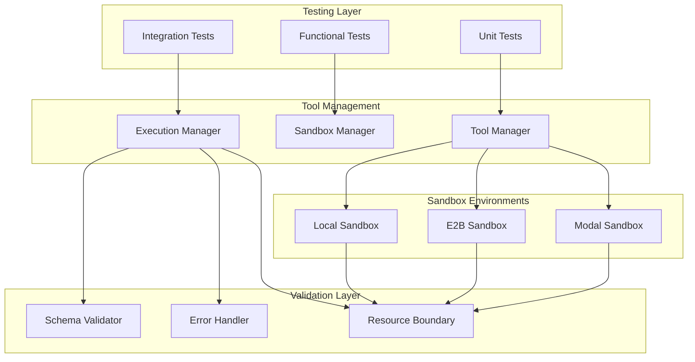
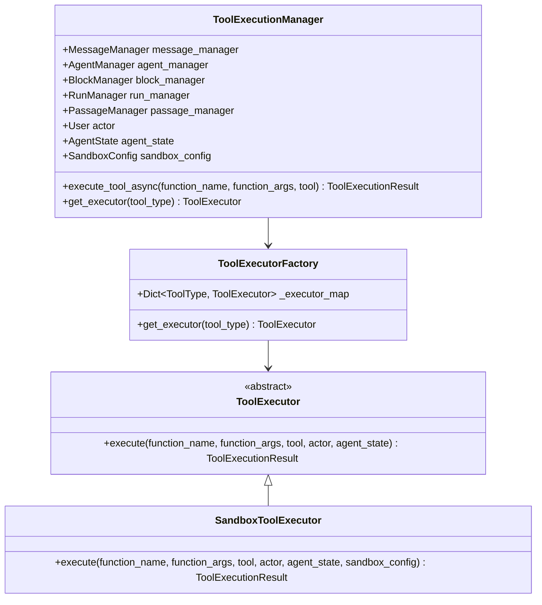
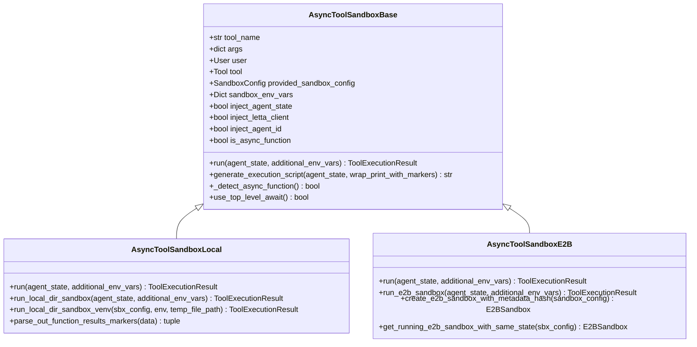
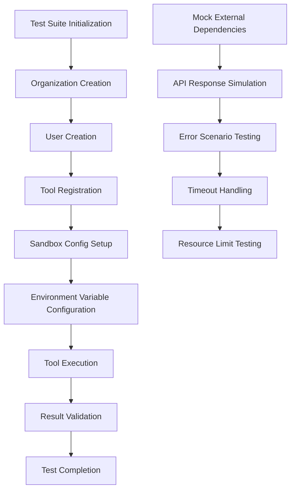
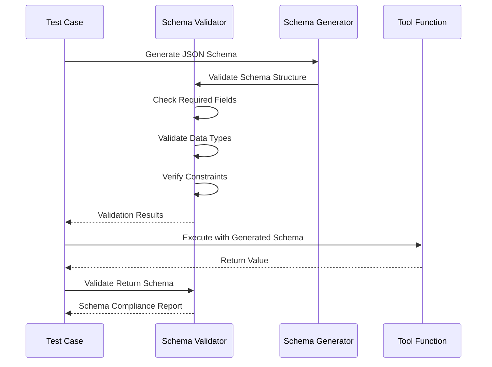
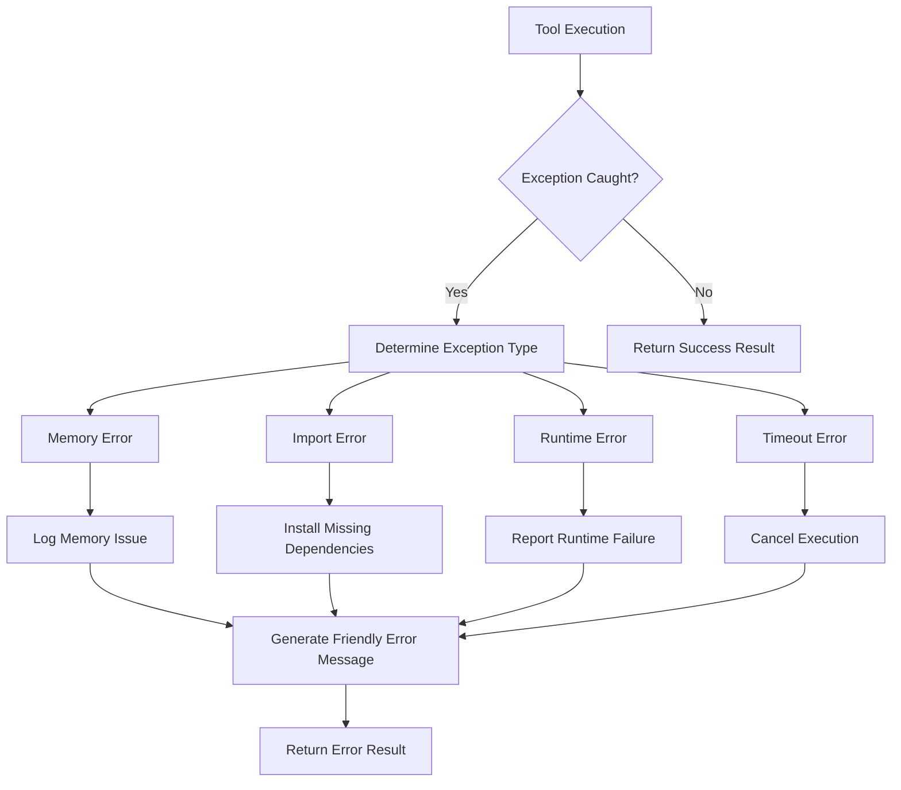
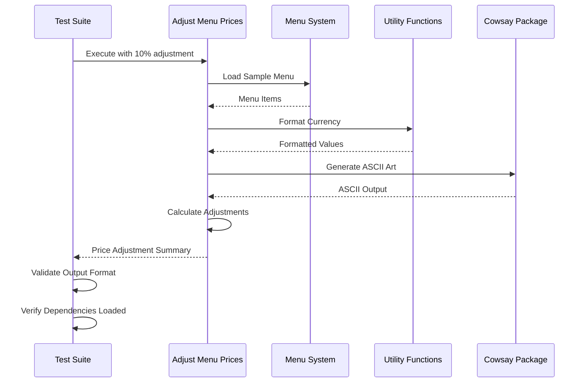

# Tool Execution Testing

<cite>
**Referenced Files in This Document**
- [integration_test_tool_execution_sandbox.py](file://tests/integration_test_tool_execution_sandbox.py)
- [test_tool_schema_parsing.py](file://tests/test_tool_schema_parsing.py)
- [tool_execution_sandbox.py](file://letta/services/tool_executor/tool_execution_sandbox.py)
- [base.py](file://letta/services/tool_sandbox/base.py)
- [local_sandbox.py](file://letta/services/tool_sandbox/local_sandbox.py)
- [e2b_sandbox.py](file://letta/services/tool_sandbox/e2b_sandbox.py)
- [tool_execution_manager.py](file://letta/services/tool_executor/tool_execution_manager.py)
- [mcp_manager.py](file://letta/services/mcp_manager.py)
- [sandbox_config.py](file://letta/schemas/sandbox_config.py)
- [tool_execution_result.py](file://letta/schemas/tool_execution_result.py)
- [adjust_menu_prices.py](file://tests/test_tool_sandbox/restaurant_management_system/adjust_menu_prices.py)
- [test.py](file://tests/test_tool_sandbox/restaurant_management_system/test.py)
</cite>

## Table of Contents
1. [Introduction](#introduction)
2. [System Architecture Overview](#system-architecture-overview)
3. [Core Components](#core-components)
4. [Sandbox Types and Execution Environments](#sandbox-types-and-execution-environments)
5. [Testing Framework Implementation](#testing-framework-implementation)
6. [Tool Schema Validation](#tool-schema-validation)
7. [Error Handling and Runtime Failures](#error-handling-and-runtime-failures)
8. [Security Boundaries and Resource Limits](#security-boundaries-and-resource-limits)
9. [Integration Test Scenarios](#integration-test-scenarios)
10. [Advanced Testing Strategies](#advanced-testing-strategies)
11. [Troubleshooting and Debugging](#troubleshooting-and-debugging)
12. [Best Practices](#best-practices)

## Introduction

Tool Execution Testing is a comprehensive framework designed to validate secure and reliable tool execution within isolated sandboxed environments. This system ensures that tools can be safely executed across different sandbox types (E2B, Modal, local) while maintaining strict security boundaries and providing robust error handling capabilities.

The framework encompasses multiple testing layers including unit tests for individual components, integration tests for end-to-end tool execution workflows, and specialized tests for schema validation, error handling, and security boundary enforcement. It supports various tool types including built-in tools, custom Python tools, and MCP (Model Context Protocol) integrations.

## System Architecture Overview

The Tool Execution Testing system follows a layered architecture that separates concerns between tool definition, execution environment management, and result validation.

**Diagram sources**
- [tool_execution_manager.py](file://letta/services/tool_executor/tool_execution_manager.py#L69-L93)
- [tool_execution_sandbox.py](file://letta/services/tool_executor/tool_execution_sandbox.py#L37-L57)
- [base.py](file://letta/services/tool_sandbox/base.py#L20-L33)

## Core Components

### Tool Execution Manager

The ToolExecutionManager serves as the central orchestrator for all tool execution operations, managing the lifecycle from tool discovery to result validation.

**Diagram sources**
- [tool_execution_manager.py](file://letta/services/tool_executor/tool_execution_manager.py#L69-L93)
- [tool_execution_manager.py](file://letta/services/tool_executor/tool_execution_manager.py#L33-L67)

### Sandbox Execution Framework

The sandbox execution framework provides isolated environments for tool execution with strict security boundaries and resource controls.

**Diagram sources**
- [base.py](file://letta/services/tool_sandbox/base.py#L20-L33)
- [local_sandbox.py](file://letta/services/tool_sandbox/local_sandbox.py#L238-L275)
- [e2b_sandbox.py](file://letta/services/tool_sandbox/e2b_sandbox.py#L42-L68)

**Section sources**
- [tool_execution_manager.py](file://letta/services/tool_executor/tool_execution_manager.py#L69-L162)
- [base.py](file://letta/services/tool_sandbox/base.py#L20-L398)
- [local_sandbox.py](file://letta/services/tool_sandbox/local_sandbox.py#L238-L275)

## Sandbox Types and Execution Environments

### Local Sandbox Environment

The local sandbox provides lightweight execution within the host system's filesystem, supporting virtual environment isolation and dependency management.

Key features:
- Virtual environment creation and management
- Dependency installation via pip requirements
- Environment variable injection
- Process isolation through subprocess execution
- File system sandboxing

### E2B Sandbox Environment

The E2B sandbox offers cloud-based containerized execution with enhanced security and scalability.

Key features:
- Containerized execution with Docker images
- Automatic sandbox lifecycle management
- Resource quota enforcement
- Network isolation
- Persistent state management

### Modal Sandbox Environment

The Modal sandbox provides serverless execution with automatic scaling and cost optimization.

Key features:
- Serverless function execution
- Automatic scaling based on demand
- Cost-effective resource utilization
- Integration with Modal's infrastructure
- Stateless execution model

**Section sources**
- [sandbox_config.py](file://letta/schemas/sandbox_config.py#L55-L112)
- [local_sandbox.py](file://letta/services/tool_sandbox/local_sandbox.py#L238-L275)
- [e2b_sandbox.py](file://letta/services/tool_sandbox/e2b_sandbox.py#L42-L68)

## Testing Framework Implementation

### Test Infrastructure Setup

The testing framework utilizes pytest with comprehensive fixture management for creating consistent test environments.

**Diagram sources**
- [integration_test_tool_execution_sandbox.py](file://tests/integration_test_tool_execution_sandbox.py#L39-L78)

### Built-in Tool Execution Testing

Built-in tools undergo comprehensive testing to ensure core functionality remains intact across different sandbox environments.

Test scenarios include:
- Basic arithmetic operations
- Memory manipulation functions
- File system operations
- Agent state modifications
- Environment variable access

### Custom Python Tool Testing

Custom Python tools require specialized testing approaches to validate complex dependencies and execution contexts.

Key testing aspects:
- Dependency resolution and installation
- Import statement validation
- Function signature compliance
- Return value schema validation
- Error propagation handling

**Section sources**
- [integration_test_tool_execution_sandbox.py](file://tests/integration_test_tool_execution_sandbox.py#L80-L210)

## Tool Schema Validation

### Input/Output Schema Compliance

The schema validation system ensures that tool inputs and outputs conform to expected formats and data types.

**Diagram sources**
- [test_tool_schema_parsing.py](file://tests/test_tool_schema_parsing.py#L56-L86)

### Pydantic Model Integration

Pydantic models provide robust type validation and serialization for complex tool parameters.

Validation features:
- Automatic type coercion
- Nested object validation
- Enum constraint checking
- Custom validator support
- Serialization/deserialization

### Google Style Docstring Validation

The framework validates Google-style docstrings to ensure proper documentation standards and parameter extraction.

**Section sources**
- [test_tool_schema_parsing.py](file://tests/test_tool_schema_parsing.py#L56-L663)

## Error Handling and Runtime Failures

### Exception Propagation and Recovery

The error handling system captures and processes various types of runtime failures while maintaining system stability.

**Diagram sources**
- [tool_execution_sandbox.py](file://letta/services/tool_executor/tool_execution_sandbox.py#L286-L302)

### Timeout Handling

Timeout mechanisms prevent runaway processes and ensure system responsiveness.

Timeout strategies:
- Per-operation timeouts
- Global execution timeouts
- Graceful cancellation
- Resource cleanup on timeout
- Progress reporting

### Dependency Resolution Issues

The framework handles various dependency-related failures gracefully.

Common scenarios:
- Missing package installations
- Version conflicts
- Import path issues
- Circular dependencies
- Permission restrictions

**Section sources**
- [tool_execution_sandbox.py](file://letta/services/tool_executor/tool_execution_sandbox.py#L286-L302)
- [local_sandbox.py](file://letta/services/tool_sandbox/local_sandbox.py#L238-L251)

## Security Boundaries and Resource Limits

### Sandbox Isolation

Each sandbox type implements different security isolation mechanisms to prevent unauthorized access to system resources.

Security measures:
- File system access control
- Network communication restrictions
- Process privilege limitations
- Memory usage monitoring
- CPU time allocation

### Resource Limit Enforcement

Resource limits prevent tools from consuming excessive system resources.

Limit categories:
- Memory consumption thresholds
- Execution time limits
- Disk space quotas
- Network bandwidth restrictions
- Concurrent execution limits

### Validation Against Expected Schemas

The system validates tool return values against predefined schemas to ensure data integrity and prevent malicious output.

Validation processes:
- Type checking
- Range validation
- Format verification
- Size constraints
- Content filtering

**Section sources**
- [sandbox_config.py](file://letta/schemas/sandbox_config.py#L55-L112)
- [tool_execution_result.py](file://letta/schemas/tool_execution_result.py#L8-L19)

## Integration Test Scenarios

### Restaurant Management System Tool Execution

The restaurant management system serves as a comprehensive example of complex tool execution involving external dependencies and real-world business logic.

**Diagram sources**
- [adjust_menu_prices.py](file://tests/test_tool_sandbox/restaurant_management_system/adjust_menu_prices.py#L1-L35)
- [test.py](file://tests/test_tool_sandbox/restaurant_management_system/test.py#L5-L25)

### Environment Variable Injection Testing

Environment variable injection enables tools to access sensitive configuration data securely.

Testing scenarios:
- Global sandbox environment variables
- Per-agent environment variables
- Variable precedence and inheritance
- Secure credential handling
- Dynamic environment updates

### Tool Chaining Logic Validation

Tool chaining tests verify that multiple tools can be executed sequentially with proper state management.

Chain validation includes:
- State preservation between executions
- Parameter passing between tools
- Error propagation in chains
- Performance impact assessment
- Resource cleanup verification

**Section sources**
- [integration_test_tool_execution_sandbox.py](file://tests/integration_test_tool_execution_sandbox.py#L204-L210)
- [integration_test_tool_execution_sandbox.py](file://tests/integration_test_tool_execution_sandbox.py#L322-L350)

## Advanced Testing Strategies

### Mocking External APIs

The framework provides sophisticated mocking capabilities for external API dependencies.

Mocking strategies:
- HTTP request interception
- Response simulation
- Error condition injection
- Rate limiting emulation
- Authentication token simulation

### MCP Tool Integration Testing

MCP (Model Context Protocol) tool integration requires specialized testing approaches for remote tool execution.

Testing aspects:
- Server connectivity validation
- Authentication and authorization
- Schema negotiation
- Tool discovery and registration
- Error handling for network failures

### Security Boundary Verification

Security testing ensures that sandbox environments properly isolate tools from system resources.

Verification methods:
- Privilege escalation detection
- File system access auditing
- Network communication monitoring
- Process injection prevention
- Resource exhaustion protection

**Section sources**
- [mcp_manager.py](file://letta/services/mcp_manager.py#L66-L100)
- [integration_test_tool_execution_sandbox.py](file://tests/integration_test_tool_execution_sandbox.py#L322-L350)

## Troubleshooting and Debugging

### Common Issues and Solutions

| Issue Category | Symptoms | Solution Approach |
|----------------|----------|-------------------|
| Dependency Resolution | ImportError, ModuleNotFoundError | Verify pip requirements, check virtual environment setup |
| Schema Validation | JSON schema validation errors | Review function signatures, validate parameter types |
| Sandbox Configuration | Permission denied, resource limits | Check sandbox permissions, adjust resource quotas |
| Tool Execution | Timeout, hanging processes | Implement proper timeout handling, monitor resource usage |
| Environment Variables | Missing values, incorrect precedence | Verify variable injection order, check precedence rules |

### Debugging Tools and Techniques

Debugging capabilities include:
- Comprehensive logging with structured output
- Execution trace capture
- Resource usage monitoring
- Error stack trace analysis
- Performance profiling

### Performance Monitoring

Performance testing ensures tools execute efficiently within resource constraints.

Monitoring metrics:
- Execution time measurement
- Memory usage tracking
- CPU utilization analysis
- I/O operation monitoring
- Network latency measurement

## Best Practices

### Writing Effective Test Cases

Effective test case design principles:
- Use descriptive test names
- Implement proper setup and teardown
- Test edge cases and error conditions
- Validate both success and failure paths
- Ensure test independence

### Managing Test Data

Test data management strategies:
- Use fixtures for consistent data
- Implement data cleanup procedures
- Separate test data from production data
- Version control test datasets
- Document data dependencies

### Continuous Integration Integration

CI/CD integration considerations:
- Parallel test execution
- Environment isolation
- Artifact management
- Test result reporting
- Automated quality gates

### Security Testing Guidelines

Security testing best practices:
- Regular vulnerability assessments
- Penetration testing schedules
- Dependency scanning automation
- Access control validation
- Audit trail maintenance