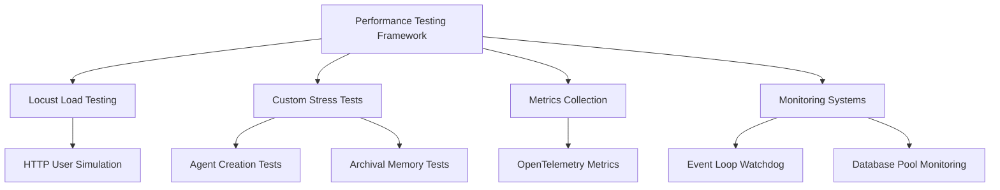
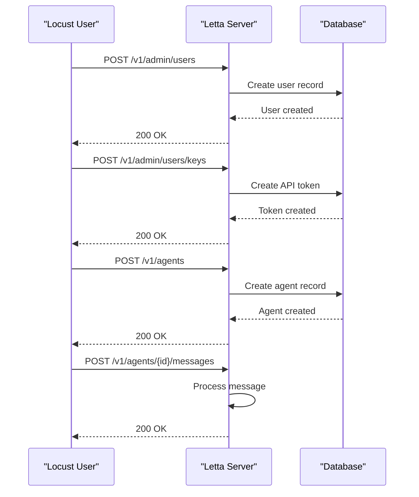
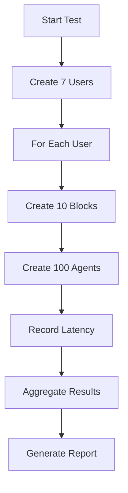
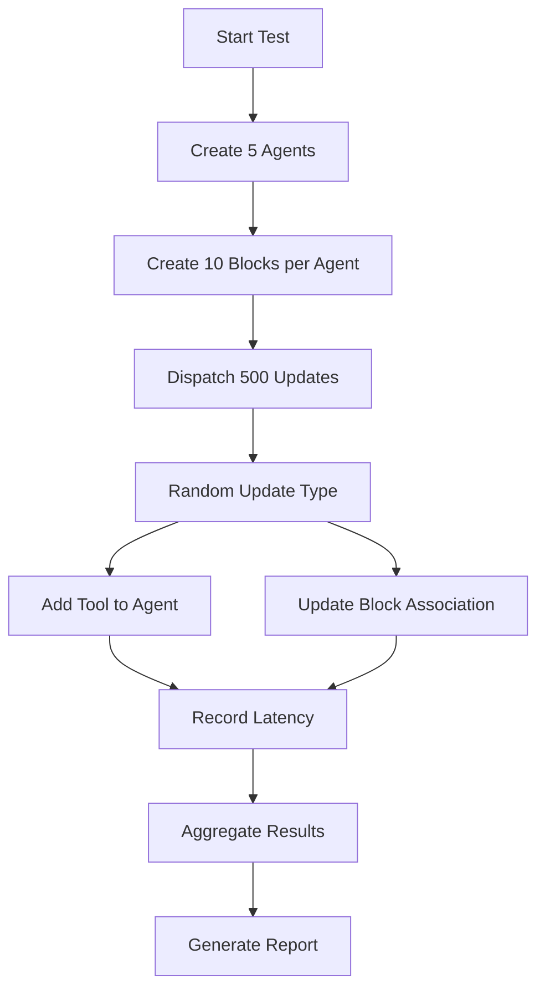
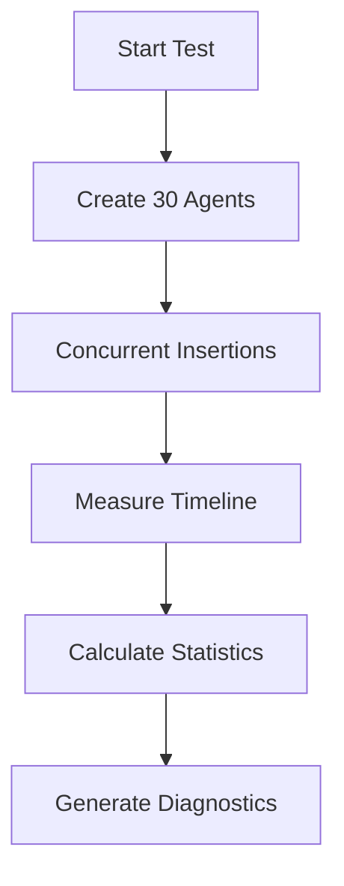
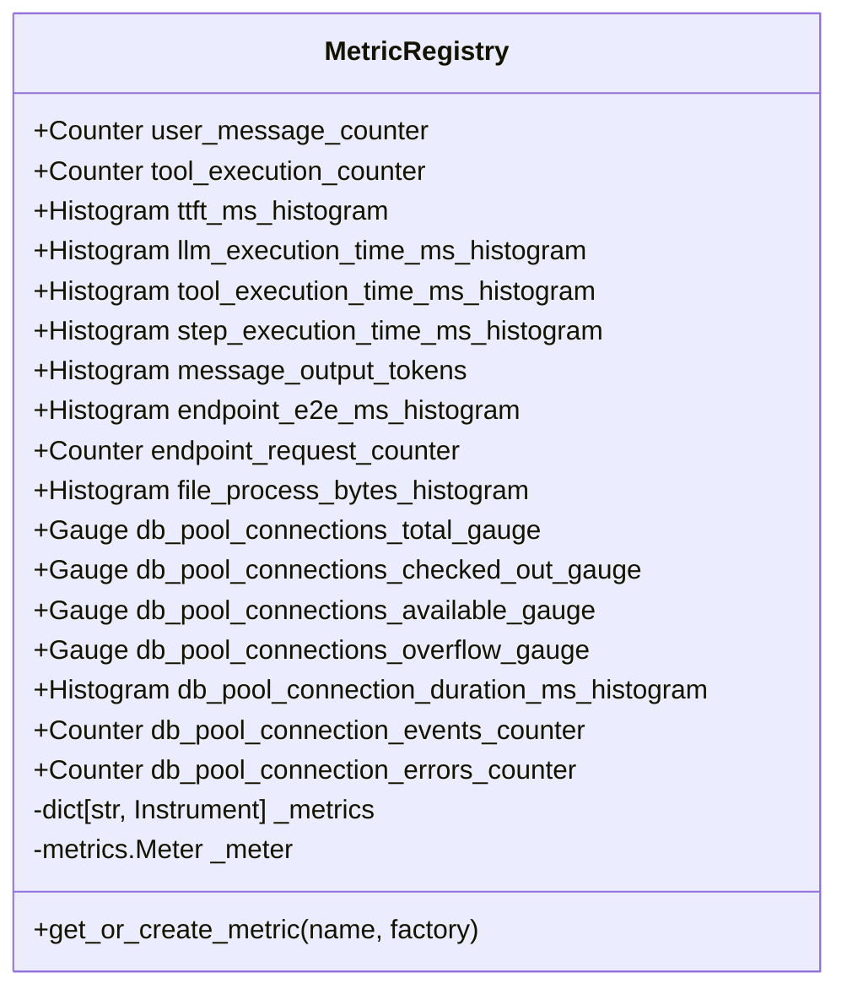
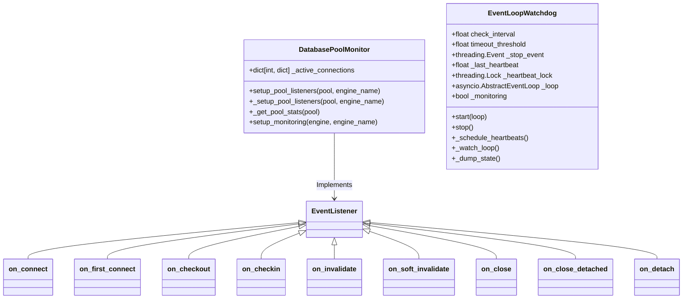
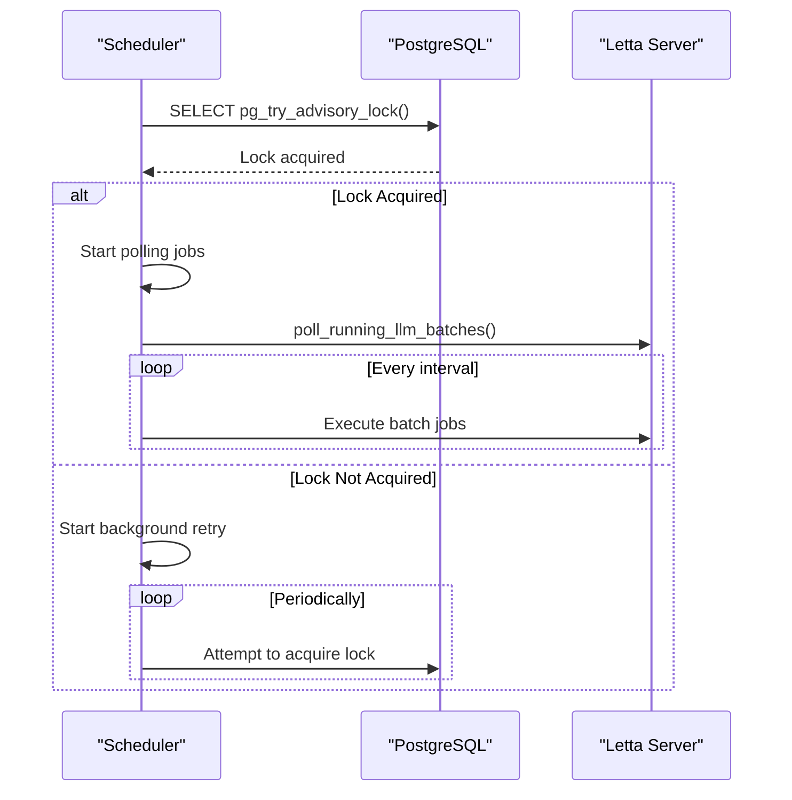
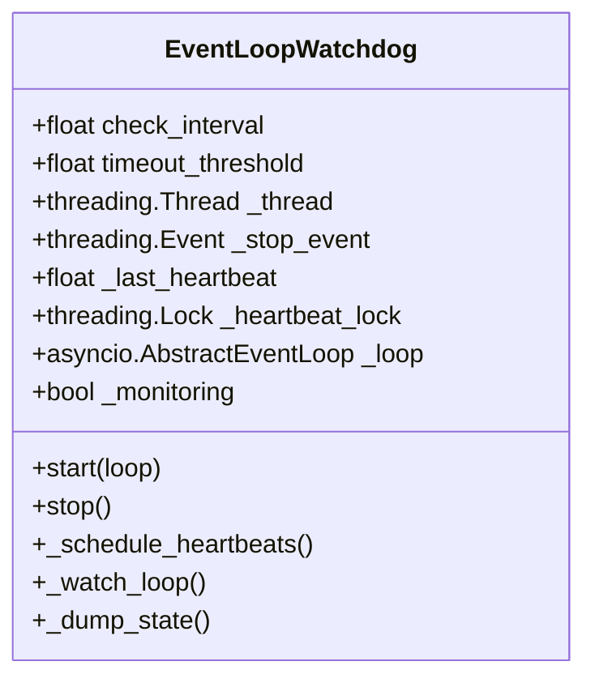

# Performance and Reliability Testing

<cite>
**Referenced Files in This Document**   
- [locust_test.py](file://tests/locust_test.py)
- [test_agent_mass_creation.py](file://tests/performance_tests/test_agent_mass_creation.py)
- [test_agent_mass_update.py](file://tests/performance_tests/test_agent_mass_update.py)
- [test_insert_archival_memory.py](file://tests/performance_tests/test_insert_archival_memory.py)
- [server.py](file://letta/server/server.py)
- [job_manager.py](file://letta/services/job_manager.py)
- [sqlalchemy_base.py](file://letta/orm/sqlalchemy_base.py)
- [metric_registry.py](file://letta/otel/metric_registry.py)
- [db_pool_monitoring.py](file://letta/otel/db_pool_monitoring.py)
- [scheduler.py](file://letta/jobs/scheduler.py)
- [event_loop_watchdog.py](file://letta/monitoring/event_loop_watchdog.py)
- [05c3bc564286_add_metrics_to_agent_loop_runs.py](file://alembic/versions/05c3bc564286_add_metrics_to_agent_loop_runs.py)
</cite>

## Table of Contents
1. [Introduction](#introduction)
2. [Performance Testing Framework](#performance-testing-framework)
3. [Load Testing with Locust](#load-testing-with-locust)
4. [Stress Testing Scenarios](#stress-testing-scenarios)
5. [Metrics Collection and Monitoring](#metrics-collection-and-monitoring)
6. [Database Performance and Connection Pooling](#database-performance-and-connection-pooling)
7. [Job Scheduling and Background Processing](#job-scheduling-and-background-processing)
8. [Event Loop Monitoring and Reliability](#event-loop-monitoring-and-reliability)
9. [Common Performance Issues and Solutions](#common-performance-issues-and-solutions)
10. [Optimization Strategies](#optimization-strategies)
11. [Conclusion](#conclusion)

## Introduction
The Performance and Reliability Testing framework in Letta is designed to validate the system's scalability and stability under various load conditions. This documentation provides a comprehensive overview of the performance testing infrastructure, including load testing with Locust, stress testing scenarios for agent creation and archival memory operations, and the monitoring systems that ensure reliability under production-scale loads. The framework is built to identify bottlenecks, resource leaks, and timeout issues while providing detailed metrics for optimization.

## Performance Testing Framework
Letta's performance testing framework consists of multiple components that work together to simulate real-world usage patterns and measure system behavior under stress. The framework includes both synchronous and asynchronous testing capabilities, allowing for comprehensive evaluation of system performance.



**Diagram sources**
- [locust_test.py](file://tests/locust_test.py)
- [test_agent_mass_creation.py](file://tests/performance_tests/test_agent_mass_creation.py)
- [test_insert_archival_memory.py](file://tests/performance_tests/test_insert_archival_memory.py)
- [metric_registry.py](file://letta/otel/metric_registry.py)
- [event_loop_watchdog.py](file://letta/monitoring/event_loop_watchdog.py)
- [db_pool_monitoring.py](file://letta/otel/db_pool_monitoring.py)

## Load Testing with Locust
The Locust framework is used for load testing Letta's REST API endpoints. The implementation simulates multiple concurrent users performing common operations such as agent creation and message sending.



**Diagram sources**
- [locust_test.py](file://tests/locust_test.py)
- [server.py](file://letta/server/server.py)
- [job_manager.py](file://letta/services/job_manager.py)

The Locust test script defines a `LettaUser` class that inherits from `HttpUser` and implements the following key operations:
- User creation with random names
- API token generation for authentication
- Agent creation with predefined tools and memory configurations
- Message sending to agents

The test simulates realistic user behavior with a wait time between 1 and 5 seconds between operations, allowing for the evaluation of system performance under sustained load.

## Stress Testing Scenarios
Letta includes several stress testing scenarios designed to evaluate system behavior under extreme conditions. These tests focus on critical operations such as agent creation, agent updates, and archival memory insertion.

### Agent Mass Creation Testing
The agent mass creation test evaluates the system's ability to handle concurrent agent creation across multiple users. This test creates 7 users, each creating 100 agents with associated blocks, simulating a high-load scenario.



**Diagram sources**
- [test_agent_mass_creation.py](file://tests/performance_tests/test_agent_mass_creation.py)

Key aspects of this test include:
- Parallel execution using `ThreadPoolExecutor` with up to 20 workers
- Detailed latency measurement for each agent creation operation
- Statistical analysis of performance metrics including mean, median, minimum, and maximum latencies
- Visualization of results through histograms, boxplots, and time series charts

### Agent Mass Update Testing
The agent mass update test evaluates the system's performance when updating multiple agents concurrently. This test creates 5 agents and performs 100 updates per agent, alternating between adding tools and updating block associations.



**Diagram sources**
- [test_agent_mass_update.py](file://tests/performance_tests/test_agent_mass_update.py)

### Archival Memory Insertion Testing
The archival memory insertion test evaluates the system's performance when inserting large volumes of archival memory. This test creates 30 agents and inserts archival memory concurrently, measuring the latency and concurrency of the operations.



**Diagram sources**
- [test_insert_archival_memory.py](file://tests/performance_tests/test_insert_archival_memory.py)

The test includes advanced diagnostics such as:
- Kick-off timeline visualization showing when each insertion started
- Per-call latency measurements
- Latency distribution histograms
- Empirical cumulative distribution function (CDF)
- Concurrency over time tracking
- Summary statistics including percentiles

## Metrics Collection and Monitoring
Letta employs a comprehensive metrics collection system based on OpenTelemetry to monitor system performance and reliability.

### Metrics Registry
The `MetricRegistry` class serves as a central registry for all application metrics, providing lazy initialization of various metric types including counters, histograms, and gauges.



**Diagram sources**
- [metric_registry.py](file://letta/otel/metric_registry.py)

Key metrics collected include:
- **User message counter**: Counts messages sent by users
- **Tool execution counter**: Tracks the number of tools executed
- **Time to first token (TTFT) histogram**: Measures LLM response latency
- **LLM execution time histogram**: Tracks LLM processing duration
- **Tool execution time histogram**: Measures tool execution duration
- **Step execution time histogram**: Tracks individual step processing time
- **Endpoint end-to-end time histogram**: Measures complete request processing time
- **Database connection pool metrics**: Monitors database connection usage and availability

### Database Metrics Implementation
The database metrics are implemented through Alembic migrations that add timing fields to the jobs table:

```sql
-- Alembic migration: 05c3bc564286_add_metrics_to_agent_loop_runs.py
op.add_column("jobs", sa.Column("ttft_ns", sa.BigInteger(), nullable=True))
op.add_column("jobs", sa.Column("total_duration_ns", sa.BigInteger(), nullable=True))
```

These fields are populated by the job manager when recording response times:

```python
async def record_ttft(self, job_id: str, ttft_ns: int, actor: PydanticUser) -> None:
    """Record time to first token for a run"""
    try:
        async with db_registry.async_session() as session:
            job = await self._verify_job_access_async(session=session, job_id=job_id, actor=actor, access=["write"])
            job.ttft_ns = ttft_ns
            await job.update_async(db_session=session, actor=actor, no_commit=True, no_refresh=True)
            await session.commit()
    except Exception as e:
        logger.warning(f"Failed to record TTFT for job {job_id}: {e}")
```

**Section sources**
- [05c3bc564286_add_metrics_to_agent_loop_runs.py](file://alembic/versions/05c3bc564286_add_metrics_to_agent_loop_runs.py#L24-L25)
- [job_manager.py](file://letta/services/job_manager.py#L458-L467)

## Database Performance and Connection Pooling
Letta implements comprehensive database connection pool monitoring to ensure optimal database performance and prevent connection exhaustion.

### Connection Pool Monitoring
The database pool monitoring system tracks various metrics related to connection usage and pool state:



**Diagram sources**
- [db_pool_monitoring.py](file://letta/otel/db_pool_monitoring.py)
- [event_loop_watchdog.py](file://letta/monitoring/event_loop_watchdog.py)

The monitoring system captures the following events:
- **Connect**: When a new connection is created
- **First connect**: When the first connection is established
- **Checkout**: When a connection is checked out from the pool
- **Checkin**: When a connection is checked back into the pool
- **Invalidate**: When a connection is invalidated
- **Soft invalidate**: When a connection is soft invalidated
- **Close**: When a connection is closed
- **Close detached**: When a detached connection is closed
- **Detach**: When a connection is detached from the pool

### Pool Statistics
The system collects detailed statistics about the connection pool state:

```python
@staticmethod
def _get_pool_stats(pool: Pool) -> dict[str, Any]:
    """Get current pool statistics."""
    stats = {
        "total": 0,
        "checked_out": 0,
        "available": 0,
        "overflow": None,
    }
    
    try:
        if not isinstance(pool, QueuePool):
            logger.info("Not currently supported for non-QueuePools")
            
        stats["total"] = pool._pool.maxsize
        stats["available"] = pool._pool.qsize()
        stats["overflow"] = pool._overflow
        stats["checked_out"] = stats["total"] - stats["available"]
        
    except Exception as e:
        logger.info(f"Failed to get pool stats: {e}")
    return stats
```

These statistics are used to populate the following metrics:
- **Total connections gauge**: Total number of connections in the pool
- **Checked out connections gauge**: Number of connections currently checked out
- **Available connections gauge**: Number of available connections in the pool
- **Overflow connections gauge**: Number of overflow connections in the pool
- **Connection duration histogram**: Duration of database connection usage
- **Connection events counter**: Count of connection pool events
- **Connection errors counter**: Count of connection pool errors

**Section sources**
- [db_pool_monitoring.py](file://letta/otel/db_pool_monitoring.py#L274-L295)

## Job Scheduling and Background Processing
Letta implements a robust job scheduling system for handling background processing tasks, with leader election to prevent duplicate job execution in clustered environments.

### Scheduler Architecture
The job scheduler uses APScheduler with PostgreSQL advisory locks for leader election:



**Diagram sources**
- [scheduler.py](file://letta/jobs/scheduler.py)

### Leader Election Process
The leader election process ensures that only one instance runs the scheduler in a clustered environment:

```python
async def _try_acquire_lock_and_start_scheduler(server: SyncServer) -> bool:
    """Attempts to acquire lock, starts scheduler if successful."""
    global _advisory_lock_session, _is_scheduler_leader, scheduler
    
    if _is_scheduler_leader:
        return True  # Already leading
        
    engine_name = None
    lock_session = None
    acquired_lock = False
    try:
        async with db_registry.async_session() as session:
            engine = session.get_bind()
            engine_name = engine.name
            logger.info(f"Database engine type: {engine_name}")
            
        if engine_name != "postgresql":
            logger.warning(f"Advisory locks not supported for {engine_name} database. Starting scheduler without leader election.")
            acquired_lock = True
        else:
            lock_session = async_session_factory()
            result = await lock_session.execute(
                text("SELECT pg_try_advisory_lock(CAST(:lock_key AS bigint))"), {"lock_key": ADVISORY_LOCK_KEY}
            )
            acquired_lock = result.scalar()
            await lock_session.commit()
            
            if not acquired_lock:
                await lock_session.close()
                logger.info("Scheduler lock held by another instance.")
                return False
            else:
                _advisory_lock_session = lock_session
                lock_session = None
                
        trigger = IntervalTrigger(
            seconds=settings.poll_running_llm_batches_interval_seconds,
            jitter=10,
        )
        scheduler.add_job(
            poll_running_llm_batches,
            args=[server],
            trigger=trigger,
            id="poll_llm_batches",
            name="Poll LLM API batch jobs",
            replace_existing=True,
            next_run_time=datetime.datetime.now(datetime.timezone.utc),
        )
        
        if not scheduler.running:
            scheduler.start()
        elif scheduler.state == 2:
            scheduler.resume()
            
        _is_scheduler_leader = True
        return True
```

**Section sources**
- [scheduler.py](file://letta/jobs/scheduler.py#L25-L80)

## Event Loop Monitoring and Reliability
Letta includes an event loop watchdog system to detect and diagnose event loop hangs that could affect system reliability.

### Event Loop Watchdog
The `EventLoopWatchdog` class monitors the event loop health from a separate thread, detecting complete freezes that would cause health check failures.



**Diagram sources**
- [event_loop_watchdog.py](file://letta/monitoring/event_loop_watchdog.py)

The watchdog operates as follows:
1. Runs in a separate thread to avoid being affected by event loop hangs
2. Schedules periodic heartbeats on the event loop
3. Checks the time since the last heartbeat at regular intervals
4. Logs detailed information when a hang is detected
5. Dumps stack traces from all threads to aid in debugging

```python
def _watch_loop(self):
    """Main watchdog loop running in separate thread."""
    consecutive_hangs = 0
    
    while not self._stop_event.is_set():
        try:
            time.sleep(self.check_interval)
            
            with self._heartbeat_lock:
                last_beat = self._last_heartbeat
                
            time_since_heartbeat = time.time() - last_beat
            
            # Try to estimate event loop load (safe from separate thread)
            task_count = -1
            try:
                if self._loop and not self._loop.is_closed():
                    # all_tasks returns only unfinished tasks
                    all_tasks = asyncio.all_tasks(self._loop)
                    task_count = len(all_tasks)
            except Exception:
                # Accessing loop from thread can be fragile, don't fail
                pass
                
            # ALWAYS log every check to prove watchdog is alive
            logger.info(
                f"WATCHDOG_CHECK: heartbeat_age={time_since_heartbeat:.1f}s, consecutive_hangs={consecutive_hangs}, tasks={task_count}"
            )
            
            if time_since_heartbeat > self.timeout_threshold:
                consecutive_hangs += 1
                logger.error(
                    f"EVENT LOOP HANG DETECTED! No heartbeat for {time_since_heartbeat:.1f}s (threshold: {self.timeout_threshold}s), "
                    f"tasks={task_count}"
                )
                
                # Dump basic state
                self._dump_state()
                
                if consecutive_hangs >= 2:
                    logger.critical(f"Event loop appears frozen ({consecutive_hangs} consecutive hangs), tasks={task_count}")
            else:
                if consecutive_hangs > 0:
                    logger.info(f"Event loop recovered (was {consecutive_hangs} hangs, tasks now: {task_count})")
                consecutive_hangs = 0
                
        except Exception as e:
            logger.error(f"Watchdog error: {e}")
```

**Section sources**
- [event_loop_watchdog.py](file://letta/monitoring/event_loop_watchdog.py#L75-L123)

## Common Performance Issues and Solutions
Based on the analysis of the performance testing framework, several common issues can be identified and addressed.

### Database Bottlenecks
Database bottlenecks can occur due to connection pool exhaustion or inefficient queries. The monitoring system helps identify these issues through:

- High connection checkout times
- Frequent connection invalidations
- Overflow connections being created
- Long-running queries detected by the event loop watchdog

Solutions include:
- Increasing the connection pool size
- Optimizing queries with proper indexing
- Implementing query caching
- Using read replicas for read-heavy operations

### Resource Leaks
Resource leaks can occur in various forms, including:
- Database connections not being properly returned to the pool
- Memory leaks in long-running processes
- File descriptors not being closed

The connection pool monitoring system helps detect connection leaks by tracking:
- The number of checked-out connections over time
- Connection duration histograms
- Connection event counters

### Timeout Handling
Timeouts can occur at various levels:
- Database query timeouts
- HTTP request timeouts
- Tool execution timeouts
- Event loop hangs

The system implements timeout handling through:
- Configurable timeout settings for different operations
- Graceful error handling and retry mechanisms
- Comprehensive logging of timeout events
- Alerting through the monitoring system

## Optimization Strategies
Several optimization strategies can be employed to improve system performance and reliability.

### Database Optimization
Database performance can be improved through:
- Proper indexing of frequently queried fields
- Query optimization and execution plan analysis
- Connection pool tuning based on workload patterns
- Read/write splitting for high-traffic scenarios

### Caching Strategies
Caching can significantly improve performance for frequently accessed data:
- LLM configuration caching
- Embedding configuration caching
- Agent state caching
- Query result caching

The system already implements some caching through the `_llm_config_cache` and `_embedding_config_cache` dictionaries in the server class.

### Load Distribution
Load can be distributed across multiple instances through:
- Horizontal scaling of API servers
- Dedicated instances for background processing
- Database read replicas
- Load balancing across multiple nodes

### Asynchronous Processing
Asynchronous processing improves throughput by:
- Allowing concurrent handling of multiple requests
- Preventing blocking operations from affecting other requests
- Efficiently utilizing system resources

The system leverages asyncio throughout the codebase, with async methods for database operations, HTTP requests, and other I/O operations.

## Conclusion
The Performance and Reliability Testing framework in Letta provides a comprehensive suite of tools for validating system scalability and stability. Through load testing with Locust, stress testing of critical operations, and comprehensive monitoring, the system can be evaluated under various load conditions to identify and address performance bottlenecks.

The framework collects detailed metrics on system performance, including response times, database connection usage, and event loop health, providing valuable insights for optimization. The implementation of leader election for background jobs and event loop monitoring ensures reliability in production environments.

By following the testing scenarios and monitoring practices outlined in this documentation, developers can ensure that Letta maintains high performance and reliability under production-scale loads, providing a robust foundation for AI agent applications.