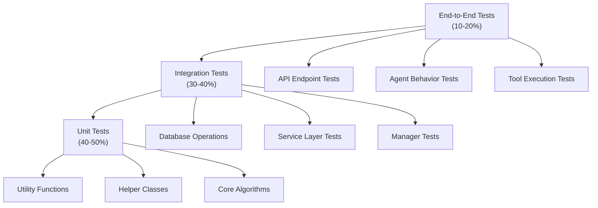
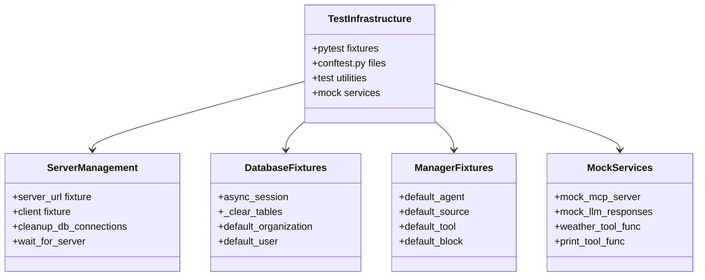
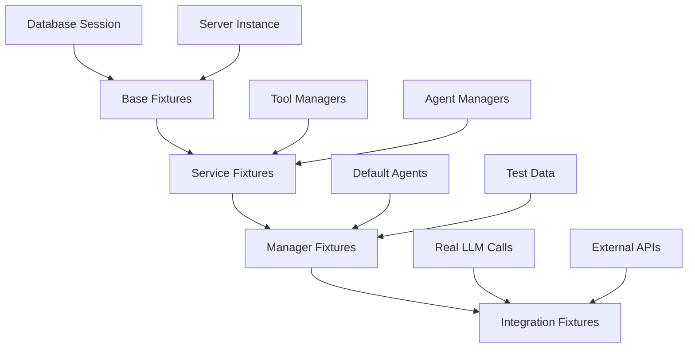
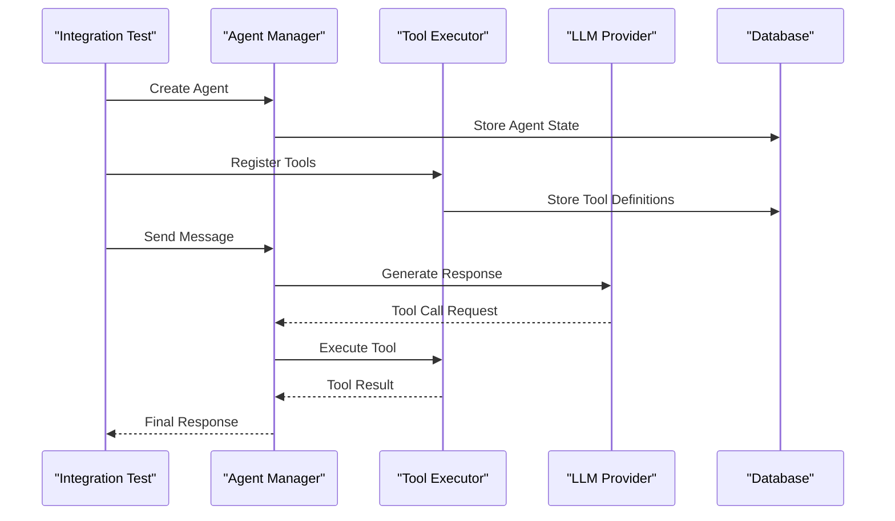
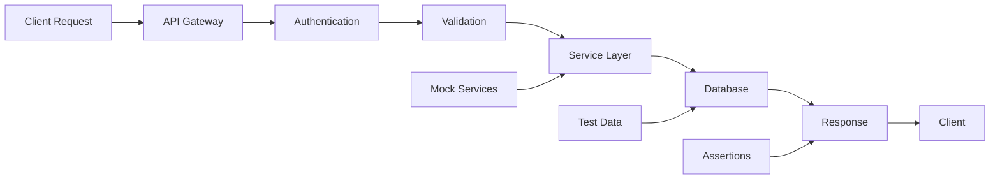
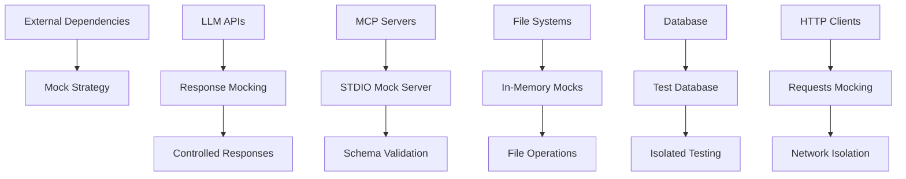
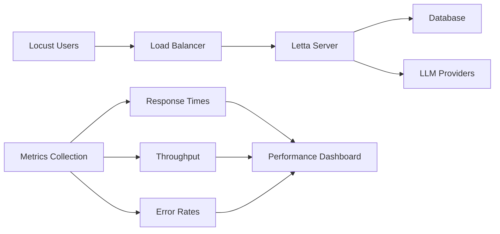
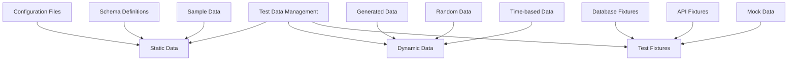
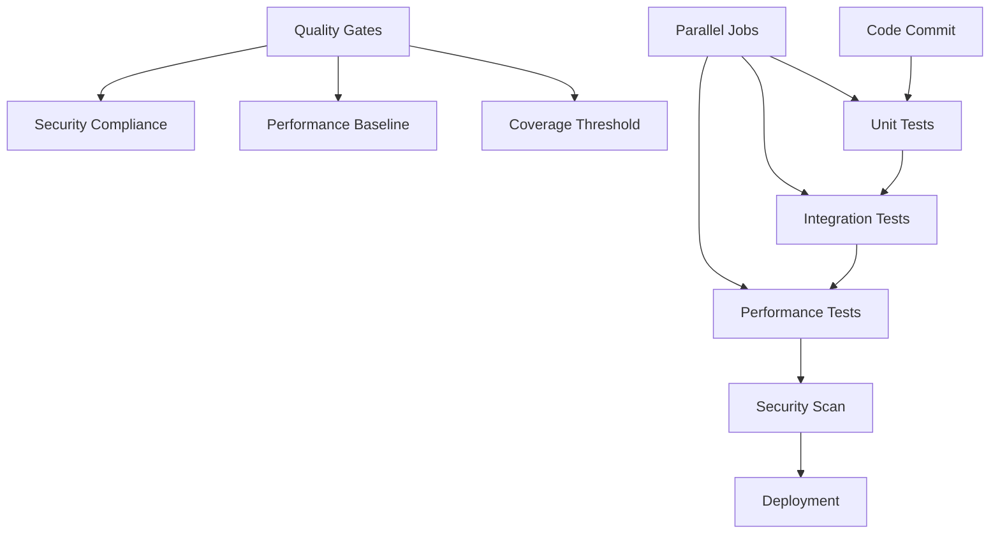

# Testing Strategy

<cite>
**Referenced Files in This Document**
- [tests/conftest.py](file://tests/conftest.py)
- [tests/managers/conftest.py](file://tests/managers/conftest.py)
- [tests/sdk/conftest.py](file://tests/sdk/conftest.py)
- [tests/pytest.ini](file://tests/pytest.ini)
- [tests/locust_test.py](file://tests/locust_test.py)
- [tests/integration_test_agent_tool_graph.py](file://tests/integration_test_agent_tool_graph.py)
- [tests/integration_test_builtin_tools.py](file://tests/integration_test_builtin_tools.py)
- [tests/integration_test_chat_completions.py](file://tests/integration_test_chat_completions.py)
- [tests/test_managers.py](file://tests/test_managers.py)
- [tests/performance_tests/test_agent_mass_creation.py](file://tests/performance_tests/test_agent_mass_creation.py)
- [tests/test_long_running_agents.py](file://tests/test_long_running_agents.py)
- [tests/mock_mcp_server.py](file://tests/mock_mcp_server.py)
- [tests/helpers/endpoints_helper.py](file://tests/helpers/endpoints_helper.py)
- [tests/utils.py](file://tests/utils.py)
</cite>

## Table of Contents
1. [Introduction](#introduction)
2. [Testing Pyramid Architecture](#testing-pyramid-architecture)
3. [Test Infrastructure](#test-infrastructure)
4. [Unit Testing Strategy](#unit-testing-strategy)
5. [Integration Testing Suite](#integration-testing-suite)
6. [End-to-End Testing](#end-to-end-testing)
7. [Mocking Strategy](#mocking-strategy)
8. [Performance Testing](#performance-testing)
9. [Reliability Testing](#reliability-testing)
10. [Test Data Management](#test-data-management)
11. [Continuous Integration](#continuous-integration)
12. [Code Coverage Requirements](#code-coverage-requirements)
13. [Testing Best Practices](#testing-best-practices)

## Introduction

Letta employs a comprehensive testing strategy built around the testing pyramid, utilizing pytest as the primary testing framework. The testing approach encompasses unit tests, integration tests, and end-to-end tests, with sophisticated mocking strategies for external dependencies and robust performance testing capabilities.

The testing infrastructure is designed to handle the complexity of an AI agent system, including LLM interactions, tool execution, message processing, and multi-agent coordination. The strategy emphasizes reliability, maintainability, and scalability while ensuring comprehensive coverage of critical system components.

## Testing Pyramid Architecture

Letta's testing strategy follows the classic testing pyramid pattern with three distinct layers:



**Diagram sources**
- [tests/conftest.py](file://tests/conftest.py#L1-L50)
- [tests/managers/conftest.py](file://tests/managers/conftest.py#L1-L100)

### Testing Pyramid Layers

**Layer 1: Unit Tests (40-50%)**
- Focus on individual functions, methods, and classes
- Fast execution with minimal dependencies
- Comprehensive coverage of core algorithms and utilities
- Mock external dependencies to isolate tested components

**Layer 2: Integration Tests (30-40%)**
- Test component interactions and service layer operations
- Validate database operations, API endpoints, and cross-service communication
- Include agent creation, message processing, and tool execution scenarios
- Use test databases and controlled environments

**Layer 3: End-to-End Tests (10-20%)**
- Complete workflow validation from API to agent execution
- Test real-world scenarios with actual LLM providers
- Validate user journeys and system integrations
- Performance and reliability testing under realistic conditions

**Section sources**
- [tests/conftest.py](file://tests/conftest.py#L1-L333)
- [tests/managers/conftest.py](file://tests/managers/conftest.py#L1-L787)

## Test Infrastructure

The testing infrastructure is built on pytest with extensive fixture management and specialized configurations for different testing scenarios.

### Core Infrastructure Components



**Diagram sources**
- [tests/conftest.py](file://tests/conftest.py#L24-L100)
- [tests/managers/conftest.py](file://tests/managers/conftest.py#L56-L150)

### pytest Configuration

The testing framework uses pytest with specific configurations optimized for Letta's architecture:

| Configuration | Purpose | Implementation |
|---------------|---------|----------------|
| `asyncio_mode = auto` | Async test support | Enables async/await in tests |
| `asyncio_default_fixture_loop_scope = function` | Test isolation | Each test gets fresh async loop |
| `pythonpath = /letta` | Module resolution | Ensures proper import paths |
| `testpaths = /tests` | Test discovery | Limits scope to test directory |

**Section sources**
- [tests/pytest.ini](file://tests/pytest.ini#L1-L19)
- [tests/conftest.py](file://tests/conftest.py#L20-L25)

## Unit Testing Strategy

Unit tests focus on individual components, utilities, and helper functions with strict isolation from external dependencies.

### Fixture Architecture

The unit testing strategy employs a hierarchical fixture system:



**Diagram sources**
- [tests/managers/conftest.py](file://tests/managers/conftest.py#L56-L150)

### Unit Test Patterns

**Utility Function Testing**
- Test mathematical calculations and data transformations
- Validate error handling and edge cases
- Ensure consistent behavior across different inputs

**Helper Class Testing**
- Validate state management and lifecycle methods
- Test serialization and deserialization
- Verify thread safety and concurrency handling

**Core Algorithm Testing**
- Mathematical correctness and precision
- Performance characteristics under various inputs
- Boundary condition handling

**Section sources**
- [tests/test_managers.py](file://tests/test_managers.py#L1-L200)
- [tests/helpers/endpoints_helper.py](file://tests/helpers/endpoints_helper.py#L1-L200)

## Integration Testing Suite

Integration tests validate component interactions, service layer operations, and cross-system communication.

### Agent and Tool Integration Tests

The integration test suite covers comprehensive agent behavior and tool execution scenarios:



**Diagram sources**
- [tests/integration_test_agent_tool_graph.py](file://tests/integration_test_agent_tool_graph.py#L1-L200)
- [tests/integration_test_builtin_tools.py](file://tests/integration_test_builtin_tools.py#L1-L200)

### Database Integration Testing

Database integration tests ensure proper ORM operations and transaction handling:

| Test Category | Focus Areas | Validation Points |
|---------------|-------------|-------------------|
| CRUD Operations | Create, Read, Update, Delete | Data integrity, constraint enforcement |
| Transaction Management | Atomic operations | Rollback, commit, isolation |
| Relationship Testing | Foreign keys, cascades | Referential integrity |
| Concurrency Testing | Thread safety | Race conditions, deadlocks |

### Service Layer Integration

Service layer tests validate business logic and cross-service communication:

- **Agent Management**: Agent creation, updates, deletion, and state transitions
- **Tool Management**: Tool registration, execution, and lifecycle management
- **Message Processing**: Message routing, filtering, and transformation
- **File Operations**: File uploads, processing, and archival

**Section sources**
- [tests/integration_test_agent_tool_graph.py](file://tests/integration_test_agent_tool_graph.py#L1-L200)
- [tests/integration_test_builtin_tools.py](file://tests/integration_test_builtin_tools.py#L1-L200)

## End-to-End Testing

End-to-end tests validate complete user workflows and system integrations.

### API Endpoint Testing

API endpoint tests cover all REST endpoints with comprehensive validation:



**Diagram sources**
- [tests/sdk/conftest.py](file://tests/sdk/conftest.py#L1-L100)

### Agent Workflow Testing

End-to-end agent workflow tests validate complete agent lifecycles:

- **Agent Creation**: Full setup with memory, tools, and configuration
- **Message Processing**: Natural language interaction and tool utilization
- **State Management**: Memory persistence and context maintenance
- **Multi-Agent Coordination**: Agent-to-agent communication and collaboration

### Tool Execution Testing

Comprehensive tool execution testing covers various scenarios:

- **Built-in Tools**: Web search, code execution, message sending
- **Custom Tools**: User-defined functions and external integrations
- **MCP Tools**: Model Context Protocol tool execution
- **Tool Chaining**: Sequential and conditional tool execution

**Section sources**
- [tests/integration_test_chat_completions.py](file://tests/integration_test_chat_completions.py#L1-L197)
- [tests/test_long_running_agents.py](file://tests/test_long_running_agents.py#L1-L133)

## Mocking Strategy

Letta employs sophisticated mocking strategies to isolate tests from external dependencies while maintaining realistic behavior.

### External Dependency Mocking



**Diagram sources**
- [tests/mock_mcp_server.py](file://tests/mock_mcp_server.py#L1-L200)
- [tests/conftest.py](file://tests/conftest.py#L140-L220)

### MCP Server Mocking

The MCP (Model Context Protocol) mocking strategy enables comprehensive testing of tool protocols:

**Mock MCP Server Features:**
- **Basic Tools**: Simple echo, arithmetic operations
- **Complex Schemas**: Nested objects, arrays, enums
- **Error Handling**: Simulated failures and edge cases
- **Schema Validation**: Input/output validation testing

**Implementation Pattern:**
- Standalone Python script acting as MCP server
- FastMCP framework for protocol compliance
- Comprehensive tool catalog with varied complexity
- Real-time tool execution simulation

### LLM API Mocking

LLM API mocking provides controlled responses for testing:

- **Structured Responses**: Predefined JSON schemas
- **Streaming Simulation**: Chunked response generation
- **Error Scenarios**: Network failures, rate limits
- **Token Usage Tracking**: Cost and usage monitoring

### Weather Tool Mocking

Weather tool mocking demonstrates practical external API testing:

```python
# Example weather tool mocking pattern
def get_weather(location: str) -> str:
    """Mock weather API response."""
    return f"The weather in {location} is sunny, 72°F"
```

**Section sources**
- [tests/mock_mcp_server.py](file://tests/mock_mcp_server.py#L1-L200)
- [tests/conftest.py](file://tests/conftest.py#L249-L333)

## Performance Testing

Performance testing ensures Letta maintains acceptable performance under various load conditions.

### Load Testing with Locust

Locust-based load testing validates system scalability:



**Diagram sources**
- [tests/locust_test.py](file://tests/locust_test.py#L1-L106)

### Mass Agent Creation Testing

Mass agent creation testing validates system capacity:

**Performance Metrics Tracked:**
- **Creation Latency**: Time to create agents in bulk
- **Resource Utilization**: CPU, memory, database connections
- **Scalability Patterns**: Linear vs. exponential scaling
- **Bottleneck Identification**: Database, LLM, memory constraints

### Streaming Performance Testing

Streaming performance testing validates real-time capabilities:

- **Response Latency**: Time to first token delivery
- **Throughput**: Messages per second processing
- **Connection Stability**: Long-running connection handling
- **Backpressure Management**: System overload handling

**Section sources**
- [tests/locust_test.py](file://tests/locust_test.py#L1-L106)
- [tests/performance_tests/test_agent_mass_creation.py](file://tests/performance_tests/test_agent_mass_creation.py#L1-L200)

## Reliability Testing

Reliability testing ensures Letta operates correctly under stress and failure conditions.

### Long-Running Agent Testing

Long-running agent testing validates sustained operation:

**Test Scenarios:**
- **Deep Research Agents**: Extended conversation sessions
- **Multi-Step Workflows**: Complex tool chaining sequences
- **Memory Persistence**: Long-term memory retention
- **Resource Cleanup**: Proper resource deallocation

### Failure Recovery Testing

Failure recovery testing validates system resilience:

- **Network Failures**: Connection drops and retries
- **LLM Provider Issues**: Rate limiting and service unavailability
- **Database Failures**: Connection timeouts and recovery
- **Memory Pressure**: Resource exhaustion scenarios

### Stress Testing

Stress testing pushes system boundaries:

- **High Concurrency**: Multiple simultaneous operations
- **Large Data Sets**: Processing extensive message histories
- **Tool Complexity**: Complex tool execution chains
- **Memory Constraints**: Limited system resources

**Section sources**
- [tests/test_long_running_agents.py](file://tests/test_long_running_agents.py#L1-L133)

## Test Data Management

Effective test data management ensures reliable, reproducible testing across environments.

### Test Data Architecture



### Database Test Isolation

Database test isolation ensures clean, repeatable tests:

**Isolation Strategies:**
- **Transaction Rollback**: Automatic cleanup after each test
- **Schema Reset**: Fresh database state for each test
- **Test-Specific Databases**: Separate databases per test suite
- **Foreign Key Management**: Proper constraint handling

### Environment Configuration

Environment configuration management for different testing scenarios:

| Environment | Purpose | Configuration |
|-------------|---------|---------------|
| `DEV` | Development testing | Local services, mock APIs |
| `TEST` | Automated testing | Controlled environment |
| `CI` | Continuous integration | Minimal dependencies |
| `PRODUCTION` | Production-like | Real services |

**Section sources**
- [tests/managers/conftest.py](file://tests/managers/conftest.py#L62-L82)
- [tests/conftest.py](file://tests/conftest.py#L70-L98)

## Continuous Integration

Continuous integration ensures code quality and system stability through automated testing.

### CI Pipeline Structure



### Test Automation

Test automation covers multiple execution modes:

- **Pull Request Testing**: Quick feedback on changes
- **Scheduled Testing**: Regular system validation
- **Release Testing**: Comprehensive validation before deployment
- **Canary Testing**: Gradual rollout validation

### Quality Metrics

Quality metrics ensure testing effectiveness:

- **Test Coverage**: Percentage of code covered by tests
- **Test Pass Rate**: Success rate of test suites
- **Test Execution Time**: Performance of test suites
- **Bug Detection Rate**: Number of bugs caught by tests

**Section sources**
- [tests/pytest.ini](file://tests/pytest.ini#L1-L19)

## Code Coverage Requirements

Code coverage requirements ensure comprehensive test coverage across the codebase.

### Coverage Targets

| Component Type | Coverage Target | Rationale |
|----------------|-----------------|-----------|
| Core Business Logic | 90%+ | Critical functionality |
| Utility Functions | 80%+ | Supporting code |
| API Endpoints | 85%+ | External interfaces |
| Database Operations | 95%+ | Data integrity |
| Tool Execution | 80%+ | External integrations |

### Coverage Monitoring

Coverage monitoring tracks progress and identifies gaps:

- **Automated Reporting**: Coverage reports in CI pipeline
- **Trend Analysis**: Historical coverage trends
- **Gap Identification**: Uncovered code areas
- **Target Achievement**: Progress toward goals

### Coverage Quality

Coverage quality ensures meaningful test coverage:

- **Functional Coverage**: Testing actual functionality
- **Branch Coverage**: All code paths exercised
- **Mutation Testing**: Fault detection capability
- **Integration Coverage**: Cross-component testing

## Testing Best Practices

Testing best practices ensure maintainable, reliable, and effective test suites.

### Test Design Principles

**AAA Pattern (Arrange-Act-Assert)**
- **Arrange**: Set up test data and dependencies
- **Act**: Execute the functionality being tested
- **Assert**: Verify expected outcomes

**Given-When-Then Pattern**
- **Given**: Initial context and setup
- **When**: Action or event being tested
- **Then**: Expected outcome verification

### Test Organization

**Logical Grouping**
- Related tests grouped by feature or component
- Clear naming conventions for test identification
- Hierarchical test structure for clarity

**Test Independence**
- Tests should be able to run independently
- No dependencies between test execution order
- Proper cleanup between tests

### Assertion Strategies

**Comprehensive Assertions**
- Multiple assertion types for different scenarios
- Error message clarity for debugging
- Edge case validation

**Mock Verification**
- Verify mock interactions and expectations
- Ensure proper mock setup and cleanup
- Validate external service interactions

### Maintenance Guidelines

**Refactoring Tests**
- Keep tests readable and maintainable
- Extract common setup code to fixtures
- Update tests when requirements change

**Documentation**
- Comment complex test logic
- Document test assumptions and limitations
- Provide context for test failures

### Contributing Guidelines

**Test Contribution Standards**
- Write tests for new functionality
- Update tests for requirement changes
- Review test quality in pull requests
- Maintain test coverage standards

**Code Review for Tests**
- Verify test logic and assertions
- Check for proper mocking and isolation
- Ensure test readability and maintainability
- Validate test performance impact

**Section sources**
- [tests/helpers/endpoints_helper.py](file://tests/helpers/endpoints_helper.py#L123-L200)
- [tests/utils.py](file://tests/utils.py#L1-L199)