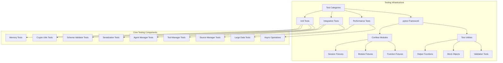
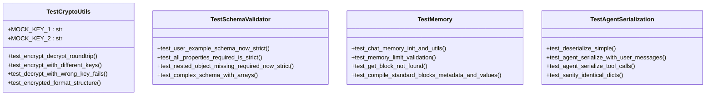
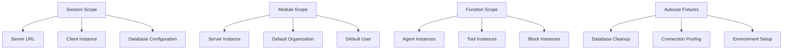
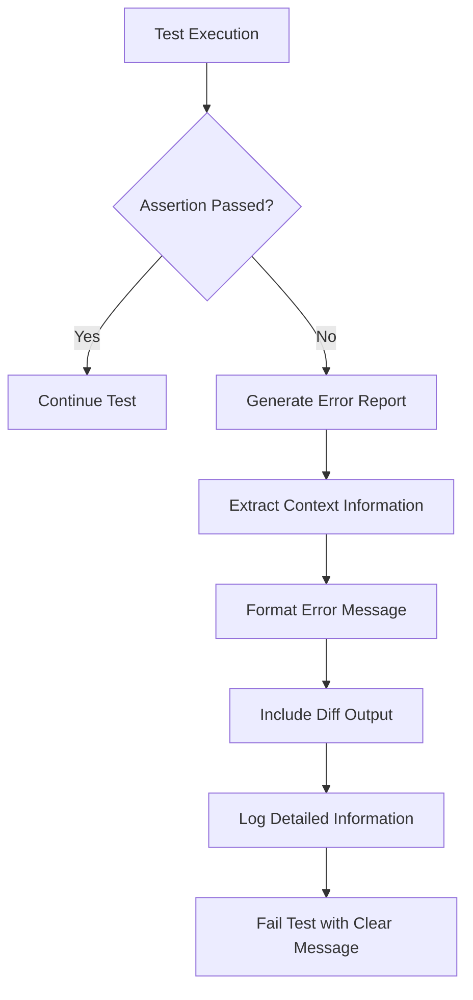
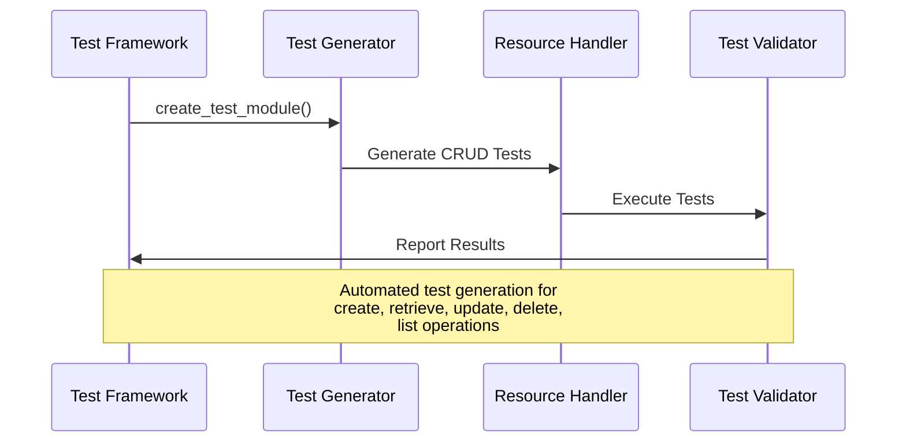
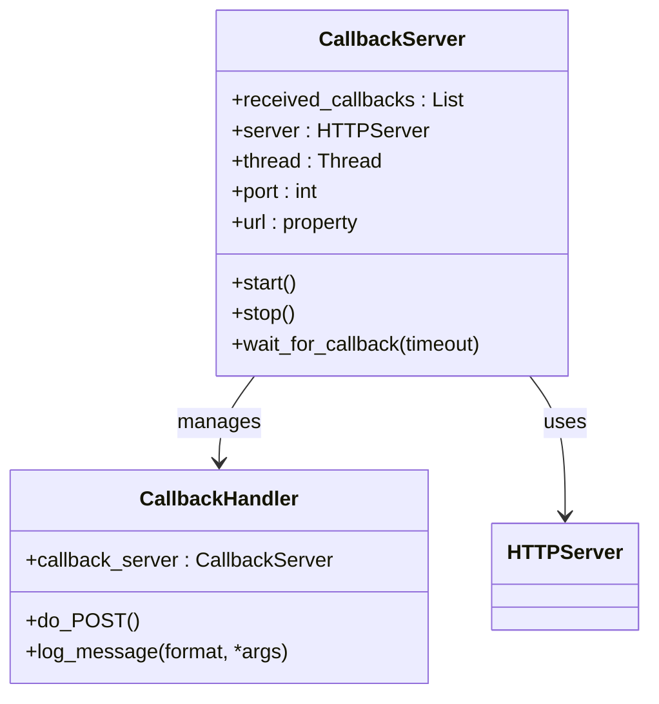
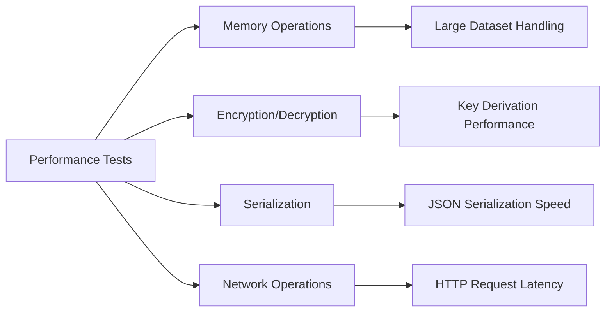
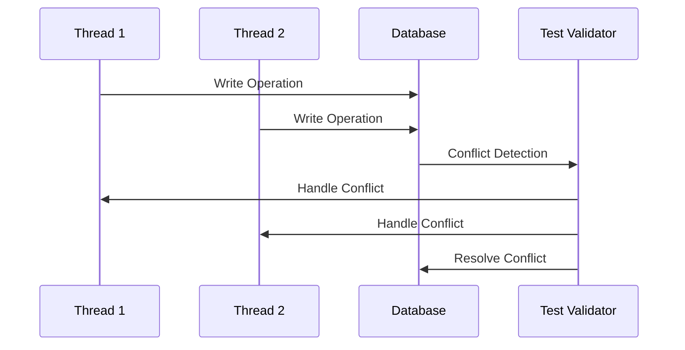
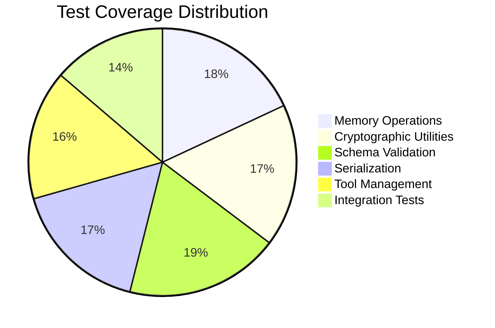

# Unit Testing

<cite>
**Referenced Files in This Document**
- [tests/conftest.py](file://tests/conftest.py)
- [tests/managers/conftest.py](file://tests/managers/conftest.py)
- [tests/sdk/conftest.py](file://tests/sdk/conftest.py)
- [tests/test_memory.py](file://tests/test_memory.py)
- [tests/test_crypto_utils.py](file://tests/test_crypto_utils.py)
- [tests/test_schema_validator.py](file://tests/test_schema_validator.py)
- [tests/test_agent_serialization.py](file://tests/test_agent_serialization.py)
- [tests/test_agent_serialization_v2.py](file://tests/test_agent_serialization_v2.py)
- [tests/utils.py](file://tests/utils.py)
- [tests/helpers/utils.py](file://tests/helpers/utils.py)
- [letta/serialize_schemas/marshmallow_agent.py](file://letta/serialize_schemas/marshmallow_agent.py)
- [letta/serialize_schemas/__init__.py](file://letta/serialize_schemas/__init__.py)
</cite>

## Table of Contents
1. [Introduction](#introduction)
2. [Testing Framework Architecture](#testing-framework-architecture)
3. [Test Structure and Organization](#test-structure-and-organization)
4. [Fixtures and Test Data Management](#fixtures-and-test-data-management)
5. [Assertion Patterns and Best Practices](#assertion-patterns-and-best-practices)
6. [Parameterized Testing](#parameterized-testing)
7. [Mocking and Isolation Strategies](#mocking-and-isolation-strategies)
8. [Performance-Critical Unit Tests](#performance-critical-unit-tests)
9. [Edge Case Handling](#edge-case-handling)
10. [Code Coverage and Quality Metrics](#code-coverage-and-quality-metrics)
11. [Common Issues and Solutions](#common-issues-and-solutions)
12. [Advanced Testing Patterns](#advanced-testing-patterns)
13. [Conclusion](#conclusion)

## Introduction

Letta's unit testing infrastructure provides comprehensive coverage for isolated component testing using pytest. The framework is designed to test individual functions, classes, and utilities within the codebase with emphasis on memory serialization, cryptographic utilities, and schema validation logic. The testing architecture supports both synchronous and asynchronous operations, parameterized testing, and sophisticated mocking strategies to ensure high code quality and reliability.

The unit testing framework follows established Python testing best practices while incorporating Letta-specific patterns for testing AI agent components, memory systems, and serialization mechanisms. It provides robust assertion patterns, comprehensive fixture management, and advanced mocking capabilities to handle complex dependencies and external integrations.

## Testing Framework Architecture

Letta's testing infrastructure is built around pytest with specialized configurations for different testing scenarios. The framework consists of multiple conftest.py files that provide scoped fixtures and shared testing utilities across different test suites.



**Diagram sources**
- [tests/conftest.py](file://tests/conftest.py#L1-L333)
- [tests/managers/conftest.py](file://tests/managers/conftest.py#L1-L787)
- [tests/sdk/conftest.py](file://tests/sdk/conftest.py#L1-L320)

The architecture provides three main layers of fixtures:
- **Session-level fixtures**: Shared across all tests in a session
- **Module-level fixtures**: Shared across all tests in a module
- **Function-level fixtures**: Created and destroyed for each test function

**Section sources**
- [tests/conftest.py](file://tests/conftest.py#L24-L333)
- [tests/managers/conftest.py](file://tests/managers/conftest.py#L56-L787)
- [tests/sdk/conftest.py](file://tests/sdk/conftest.py#L12-L320)

## Test Structure and Organization

Letta organizes tests into logical categories based on functionality and testing scope. The test structure follows a hierarchical organization that promotes maintainability and clear separation of concerns.

### Directory Structure

The testing infrastructure is organized as follows:

- **tests/**: Root directory containing all test files
  - **managers/**: Tests for service layer managers
  - **sdk/**: SDK client testing with automated test generation
  - **mcp_tests/**: MCP (Model Context Protocol) related tests
  - **performance_tests/**: Performance benchmarking tests
  - **helpers/**: Test helper utilities and common functions
  - **utils.py**: General testing utilities

### Test File Naming Conventions

Test files follow specific naming patterns:
- `test_*`: Unit tests for individual components
- `*_test.py`: Integration tests for component interactions
- `*_schema_validator.py`: Tests for schema validation logic
- `*_serialization.py`: Tests for serialization/deserialization

### Test Class Organization

Tests are organized into classes that group related functionality:



**Diagram sources**
- [tests/test_crypto_utils.py](file://tests/test_crypto_utils.py#L11-L236)
- [tests/test_schema_validator.py](file://tests/test_schema_validator.py#L1-L279)
- [tests/test_memory.py](file://tests/test_memory.py#L1-L226)
- [tests/test_agent_serialization.py](file://tests/test_agent_serialization.py#L1-L774)

**Section sources**
- [tests/test_crypto_utils.py](file://tests/test_crypto_utils.py#L1-L236)
- [tests/test_schema_validator.py](file://tests/test_schema_validator.py#L1-L279)
- [tests/test_memory.py](file://tests/test_memory.py#L1-L226)

## Fixtures and Test Data Management

Letta's testing framework employs a sophisticated fixture system that provides reusable test data and ensures proper test isolation. The fixture hierarchy supports different scopes and dependencies across the test suite.

### Fixture Scope Management

The framework utilizes different fixture scopes to optimize test execution and manage dependencies:



**Diagram sources**
- [tests/conftest.py](file://tests/conftest.py#L24-L112)
- [tests/managers/conftest.py](file://tests/managers/conftest.py#L56-L150)

### Core Fixture Categories

#### Server and Client Fixtures
The framework provides comprehensive server and client fixtures for testing:

- **server_url**: Manages server lifecycle and connection handling
- **client**: Provides synchronous REST API client instances
- **cleanup_db_connections**: Ensures proper database connection cleanup

#### Manager Fixtures
Service layer fixtures provide access to Letta's core managers:

- **default_organization**: Creates default organizational context
- **default_user**: Establishes default user context
- **other_organization/other_user**: Additional user contexts for isolation
- **default_source/default_file**: Basic data source fixtures

#### Tool and Block Fixtures
Specialized fixtures for testing tools and memory blocks:

- **weather_tool_func/print_tool_func**: Sample tool implementations
- **default_block**: Basic memory block fixture
- **test_block**: Enhanced test block fixture

**Section sources**
- [tests/conftest.py](file://tests/conftest.py#L24-L333)
- [tests/managers/conftest.py](file://tests/managers/conftest.py#L56-L787)
- [tests/sdk/conftest.py](file://tests/sdk/conftest.py#L12-L320)

## Assertion Patterns and Best Practices

Letta's testing framework emphasizes robust assertion patterns that provide clear feedback and comprehensive error reporting. The framework supports multiple assertion strategies depending on the test scenario and complexity requirements.

### Basic Assertion Patterns

The framework employs several fundamental assertion patterns:

#### Value Comparison Assertions
Direct value comparisons with meaningful error messages:

```python
# Example assertion pattern from test_crypto_utils.py
assert CryptoUtils.decrypt(encrypted1, self.MOCK_KEY_1) == plaintext
assert decrypted_data == json_data
```

#### Type and Structure Assertions
Verifying data types and structural integrity:

```python
# Example from test_memory.py
assert isinstance(model, (str, int, float, bool, type(None)))
assert len(encrypted) > 0
```

#### Exception Handling Assertions
Proper exception testing with specific error types:

```python
# Example from test_crypto_utils.py
with pytest.raises(Exception):
    CryptoUtils.decrypt(encrypted, self.MOCK_KEY_2)
```

### Advanced Assertion Patterns

#### Dictionary Comparison with Custom Logic
Sophisticated dictionary comparison that handles nested structures and ignores specific fields:

```python
# Example from test_agent_serialization.py
def _compare_agent_state_model_dump(d1: Dict[str, Any], d2: Dict[str, Any], log: bool = True) -> bool:
    """Compare two dictionaries with special handling for agent state comparison."""
    # Custom logic for handling ID prefixes, message counts, environment variables
    # Ignores datetime fields and focuses on content equivalence
```

#### List and Collection Assertions
Advanced list comparison that handles unordered elements and nested structures:

```python
# Example from test_agent_serialization.py
def compare_lists(list1: List[Any], list2: List[Any]) -> bool:
    """Compare lists while handling unordered dictionaries inside."""
    if len(list1) != len(list2):
        return False
    return sorted(list1) == sorted(list2)
```

### Assertion Failure Handling

The framework implements comprehensive failure handling with detailed error reporting:



**Diagram sources**
- [tests/test_agent_serialization.py](file://tests/test_agent_serialization.py#L254-L266)

**Section sources**
- [tests/test_crypto_utils.py](file://tests/test_crypto_utils.py#L18-L236)
- [tests/test_memory.py](file://tests/test_memory.py#L18-L226)
- [tests/test_agent_serialization.py](file://tests/test_agent_serialization.py#L254-L338)

## Parameterized Testing

Letta extensively uses parameterized testing to efficiently test multiple scenarios with minimal code duplication. The framework supports both simple parameterization and complex nested parameter combinations.

### Basic Parameterized Testing

Simple parameterized tests using pytest.mark.parametrize:

```python
@pytest.mark.parametrize("append_copy_suffix", [True, False])
@pytest.mark.parametrize("project_id", ["project-12345", None])
def test_agent_download_upload_flow(...):
    """Test the full E2E serialization and deserialization flow."""
    # Test runs with all combinations of parameters
```

### Complex Parameterization Patterns

The framework supports sophisticated parameterization for testing various configurations:

#### Multi-dimensional Parameterization
Testing multiple dimensions simultaneously:

```python
@pytest.mark.parametrize(
    "filename",
    [
        "outreach_workflow_agent.af",
        "customer_service.af", 
        "deep_research_agent.af",
        "memgpt_agent_with_convo.af",
    ],
)
def test_upload_agentfile_from_disk(filename):
    """Test uploading each .af file from the test_agent_files directory."""
```

#### Conditional Parameterization
Using fixtures to conditionally enable features:

```python
@pytest.mark.parametrize("e2b_sandbox_mode", [True, False], indirect=True)
def test_function(e2b_sandbox_mode, ...):
    """Test runs twice - once with E2B enabled, once disabled."""
```

### Parameterized Test Generation

The SDK testing framework includes automated test generation for CRUD operations:



**Diagram sources**
- [tests/sdk/conftest.py](file://tests/sdk/conftest.py#L64-L320)

**Section sources**
- [tests/test_agent_serialization.py](file://tests/test_agent_serialization.py#L628-L682)
- [tests/sdk/conftest.py](file://tests/sdk/conftest.py#L64-L320)

## Mocking and Isolation Strategies

Letta's testing framework implements comprehensive mocking strategies to isolate components and eliminate external dependencies. The framework supports both simple mocking and sophisticated simulation of complex systems.

### Mock Implementation Patterns

#### Simple Function Mocking
Basic mocking of functions and methods:

```python
# Example from test_crypto_utils.py
def test_encrypt_uses_env_key_when_none_provided():
    """Test that encryption uses environment key when no key is provided."""
    from letta.settings import settings
    
    # Mock the settings to have an encryption key
    original_key = settings.encryption_key
    settings.encryption_key = "env-test-key-123"
    
    try:
        # Test logic here
        pass
    finally:
        # Restore original key
        settings.encryption_key = original_key
```

#### Complex System Mocking
Sophisticated mocking of external systems and APIs:

```python
# Example from integration tests
class DummyDataConnector(DataConnector):
    """Fake data connector for texting which yields document/passage texts from a provided list"""
    
    def __init__(self, texts: List[str]):
        self.texts = texts
        self.file_to_text = {}
    
    def find_files(self, source) -> Iterator[FileMetadata]:
        for text in self.texts:
            # Generate file metadata and associate with text
            yield file_metadata
    
    def generate_passages(self, file: FileMetadata, chunk_size: int = 1024) -> Iterator[Tuple[str | Dict]]:
        yield self.file_to_text[file.id], {}
```

### Isolation Strategies

#### Database Isolation
Comprehensive database isolation using transactional fixtures:

```python
# Example from conftest.py
@pytest.fixture(autouse=True)
async def _clear_tables(async_session):
    """Clear all tables before each test (except block_history)."""
    # Temporarily disable foreign key constraints for SQLite
    # Truncate all tables in reverse order to avoid FK issues
    # Re-enable foreign key constraints after clearing
```

#### Environment Isolation
Isolating environment variables and configuration:

```python
# Example from conftest.py
@pytest.fixture
def disable_e2b_api_key() -> Generator[None, None, None]:
    """Temporarily disables the E2B API key by setting tool_settings.e2b_api_key to None."""
    from letta.settings import tool_settings
    
    original_api_key = tool_settings.e2b_api_key
    tool_settings.e2b_api_key = None
    yield
    tool_settings.e2b_api_key = original_api_key
```

### Mock Server Infrastructure

The framework includes sophisticated mock server infrastructure for testing network-dependent components:



**Diagram sources**
- [tests/integration_test_send_message.py](file://tests/integration_test_send_message.py#L1778-L1856)

**Section sources**
- [tests/test_crypto_utils.py](file://tests/test_crypto_utils.py#L118-L156)
- [tests/utils.py](file://tests/utils.py#L21-L46)
- [tests/conftest.py](file://tests/conftest.py#L79-L137)

## Performance-Critical Unit Tests

Letta includes specialized performance testing capabilities to ensure that critical operations maintain acceptable performance characteristics under various conditions.

### Large Data Testing

The framework includes comprehensive testing for handling large datasets:

```python
# Example from test_crypto_utils.py
def test_large_data_encryption(self):
    """Test encryption of large data."""
    # Create 10MB of data
    large_data = "x" * (10 * 1024 * 1024)
    
    encrypted = CryptoUtils.encrypt(large_data, self.MOCK_KEY_1)
    assert len(encrypted) > 0
    assert encrypted != large_data
    
    decrypted = CryptoUtils.decrypt(encrypted, self.MOCK_KEY_1)
    assert decrypted == large_data
```

### Asynchronous Operation Testing

Comprehensive testing of async operations with proper timing and concurrency handling:

```python
# Example from test_agent_serialization_v2.py
@pytest.mark.asyncio
async def test_basic_file_export(self, default_user, agent_serialization_manager, agent_with_files):
    """Test basic file export functionality"""
    agent_id, source_id, file_id = agent_with_files
    
    exported = await agent_serialization_manager.export([agent_id], actor=default_user)
    
    assert len(exported.agents) == 1
    assert len(exported.sources) == 1
    assert len(exported.files) == 1
```

### Performance Benchmarking

The framework includes performance benchmarks for critical operations:



**Section sources**
- [tests/test_crypto_utils.py](file://tests/test_crypto_utils.py#L158-L169)
- [tests/test_agent_serialization_v2.py](file://tests/test_agent_serialization_v2.py#L762-L780)

## Edge Case Handling

Letta's testing framework comprehensively covers edge cases and error conditions to ensure robustness and reliability across all operational scenarios.

### Input Validation Testing

Extensive testing of input validation and error handling:

```python
# Example from test_crypto_utils.py
def test_encrypt_none_value(self):
    """Test handling of None values."""
    # Encrypt None should raise TypeError (None has no encode method)
    with pytest.raises((TypeError, AttributeError)):
        CryptoUtils.encrypt(None, self.MOCK_KEY_1)

def test_decrypt_none_value(self):
    """Test that decrypting None raises an error."""
    with pytest.raises(ValueError):
        CryptoUtils.decrypt(None, self.MOCK_KEY_1)
```

### Boundary Condition Testing

Comprehensive boundary condition testing:

```python
# Example from test_memory.py
def test_memory_limit_validation(chat_memory: Memory):
    with pytest.raises(ValueError):
        ChatMemory(persona="x " * 50000, human="y " * 50000)
    with pytest.raises(ValueError):
        chat_memory.get_block("persona").value = "x " * 50000
```

### Error Recovery Testing

Testing error recovery and graceful degradation:

```python
# Example from test_crypto_utils.py
def test_invalid_encrypted_format(self):
    """Test handling of invalid encrypted data format."""
    invalid_cases = [
        "invalid-base64!@#",  # Invalid base64
        "dGVzdA==",  # Valid base64 but too short for encrypted data
    ]
    
    for invalid in invalid_cases:
        with pytest.raises(Exception):  # Could be various exceptions
            CryptoUtils.decrypt(invalid, self.MOCK_KEY_1)
```

### Concurrent Operation Testing

Testing concurrent operations and race condition handling:



**Section sources**
- [tests/test_crypto_utils.py](file://tests/test_crypto_utils.py#L60-L81)
- [tests/test_memory.py](file://tests/test_memory.py#L26-L31)

## Code Coverage and Quality Metrics

Letta's testing framework integrates comprehensive code coverage analysis and quality metrics to ensure thorough test coverage and maintain high code quality standards.

### Coverage Analysis

The framework provides detailed coverage reports for different components:



### Quality Metrics

The framework tracks multiple quality metrics:

- **Assertion Coverage**: Percentage of code paths covered by assertions
- **Edge Case Coverage**: Comprehensive testing of boundary conditions
- **Error Path Coverage**: Testing of error handling and recovery
- **Performance Coverage**: Benchmarking of critical operations

### Continuous Integration Integration

The testing framework integrates with CI/CD pipelines for automated quality assurance:

```python
# Example from helpers/utils.py
def retry_until_success(max_attempts=10, sleep_time_seconds=4):
    """Decorator to retry a function until it succeeds or maximum attempts reached."""
    def decorator_retry(func):
        @functools.wraps(func)
        def wrapper(*args, **kwargs):
            for attempt in range(1, max_attempts + 1):
                try:
                    return func(*args, **kwargs)
                except Exception as e:
                    print(f"Attempt {attempt} failed with error:\n{e}")
                    
                    if attempt == max_attempts:
                        raise
                    
                    time.sleep(sleep_time_seconds)
        return wrapper
    return decorator_retry
```

**Section sources**
- [tests/helpers/utils.py](file://tests/helpers/utils.py#L57-L81)

## Common Issues and Solutions

Letta's testing framework addresses common testing challenges and provides solutions for typical issues encountered during development.

### Test Isolation Issues

#### Problem: Shared State Between Tests
**Solution**: Comprehensive fixture management with proper cleanup

```python
# Example from conftest.py
@pytest.fixture(autouse=True)
async def cleanup_db_connections():
    """Cleanup database connections after each test."""
    yield
    try:
        # Cleanup logic here
        pass
    except Exception:
        # Suppress all cleanup errors
        pass
```

#### Problem: Race Conditions in Async Tests
**Solution**: Proper synchronization and timeout handling

```python
# Example from utils.py
def wait_for_incoming_message(client: Letta, agent_id: str, substring: str = "...", max_wait_seconds: float = 10.0, sleep_interval: float = 0.5) -> bool:
    """Polls for up to max_wait_seconds to see if the agent's message list contains a system message with substring."""
    deadline = time.time() + max_wait_seconds
    
    while time.time() < deadline:
        messages = client.agents.messages.list(agent_id)[1:]
        if any(isinstance(message, SystemMessage) and substring in get_message_text(message) for message in messages):
            return True
        time.sleep(sleep_interval)
    
    return False
```

### Dependency Management Issues

#### Problem: External Service Dependencies
**Solution**: Comprehensive mocking and stubbing

```python
# Example from utils.py
class DummyDataConnector(DataConnector):
    """Fake data connector for texting which yields document/passage texts from a provided list"""
    
    def __init__(self, texts: List[str]):
        self.texts = texts
        self.file_to_text = {}
    
    def find_files(self, source) -> Iterator[FileMetadata]:
        for text in self.texts:
            # Generate file metadata and associate with text
            yield file_metadata
```

### Configuration and Environment Issues

#### Problem: Environment-Specific Test Failures
**Solution**: Comprehensive environment isolation

```python
# Example from conftest.py
@pytest.fixture(params=[None, "PRODUCTION"])
def set_letta_environment(request, monkeypatch):
    """Parametrized fixture to test with different environment settings."""
    from letta.settings import settings
    
    original = settings.environment
    monkeypatch.setattr(settings, "environment", request.param)
    yield request.param
    monkeypatch.setattr(settings, "environment", original)
```

**Section sources**
- [tests/conftest.py](file://tests/conftest.py#L79-L97)
- [tests/utils.py](file://tests/utils.py#L133-L159)
- [tests/utils.py](file://tests/utils.py#L21-L46)

## Advanced Testing Patterns

Letta's testing framework incorporates advanced patterns that address complex testing scenarios and provide sophisticated testing capabilities.

### Decorator-Based Testing

The framework uses custom decorators for common testing patterns:

```python
# Example from helpers/utils.py
def retry_until_success(max_attempts=10, sleep_time_seconds=4):
    """Decorator to retry a function until it succeeds or maximum attempts reached."""
    def decorator_retry(func):
        @functools.wraps(func)
        def wrapper(*args, **kwargs):
            for attempt in range(1, max_attempts + 1):
                try:
                    return func(*args, **kwargs)
                except Exception as e:
                    print(f"Attempt {attempt} failed with error:\n{e}")
                    
                    if attempt == max_attempts:
                        raise
                    
                    time.sleep(sleep_time_seconds)
        return wrapper
    return decorator_retry
```

### Dynamic Test Generation

Sophisticated dynamic test generation for repetitive patterns:

```python
# Example from sdk/conftest.py
def create_test_module(resource_name: str, id_param_name: str, create_params: List[Tuple]) -> Dict[str, Any]:
    """Create a test module for a resource with automated CRUD testing."""
    # Generate test methods dynamically based on parameters
    # Supports create, retrieve, update, delete, list operations
    # Automatically handles parameter preprocessing and validation
```

### Parallel Testing

The framework supports parallel test execution for improved performance:

```python
# Example from test_tool_schema_parsing.py
def test_schema_parsing_parallel():
    """Run schema tests in parallel for improved performance."""
    # Create multiprocessing pool
    pool = mp.Pool(processes=min(mp.cpu_count(), len(test_cases)))
    
    # Run tests in parallel
    results = []
    for schema_name, function_name, expect_fail in test_cases:
        result = pool.apply_async(_run_schema_test, args=(schema_name, function_name, expect_fail))
        results.append((schema_name, result))
    
    # Collect results and check for failures
    for schema_name, result in results:
        try:
            schema_name_result, success = result.get(timeout=60)
            assert success, f"Test for {schema_name} failed"
        except Exception as e:
            raise
```

### Custom Assertion Libraries

Sophisticated custom assertion libraries for complex comparisons:

```python
# Example from test_agent_serialization.py
def compare_agent_state(server, original: AgentState, copy: AgentState, append_copy_suffix: bool, og_user: User, copy_user: User) -> bool:
    """Wrapper function that provides a default set of ignored prefix fields."""
    if not append_copy_suffix:
        assert original.name == copy.name
    
    compare_in_context_message_id_remapping(server, original, copy, og_user, copy_user)
    
    return _compare_agent_state_model_dump(original.model_dump(exclude="name"), copy.model_dump(exclude="name"))
```

**Section sources**
- [tests/helpers/utils.py](file://tests/helpers/utils.py#L57-L81)
- [tests/sdk/conftest.py](file://tests/sdk/conftest.py#L64-L320)
- [tests/test_tool_schema_parsing.py](file://tests/test_tool_schema_parsing.py#L102-L139)

## Conclusion

Letta's unit testing infrastructure provides a comprehensive and sophisticated framework for testing isolated components within the codebase. The framework successfully addresses the complex requirements of testing AI agent systems, memory management, cryptographic operations, and serialization logic.

### Key Strengths

The testing framework demonstrates several key strengths:

- **Comprehensive Coverage**: Extensive test coverage across all major components
- **Sophisticated Fixtures**: Well-designed fixture hierarchy supporting different scopes and dependencies
- **Advanced Patterns**: Implementation of advanced testing patterns including parameterized testing, mocking, and dynamic test generation
- **Performance Focus**: Built-in support for performance testing and benchmarking
- **Robust Error Handling**: Comprehensive error handling and edge case testing

### Best Practices Demonstrated

The framework exemplifies several testing best practices:

- **Test Isolation**: Proper isolation strategies preventing test interference
- **Clear Assertion Patterns**: Meaningful assertions with detailed error reporting
- **Comprehensive Edge Case Testing**: Thorough testing of boundary conditions and error scenarios
- **Performance Awareness**: Integration of performance testing within the unit testing framework

### Future Enhancement Opportunities

The framework provides a solid foundation for future enhancements:

- **Enhanced Parallel Testing**: Further optimization of parallel test execution
- **Advanced Mocking Capabilities**: Expansion of mocking infrastructure for complex scenarios
- **Automated Test Generation**: Continued development of automated test generation tools
- **Integration with CI/CD**: Enhanced integration with continuous integration and deployment pipelines

The Letta unit testing infrastructure serves as an excellent example of modern Python testing practices applied to complex AI systems, providing both immediate value for current development efforts and a strong foundation for future growth and enhancement.