# Built-in Tools

<cite>
**Referenced Files in This Document**
- [builtin.py](file://letta/functions/function_sets/builtin.py)
- [files.py](file://letta/functions/function_sets/files.py)
- [base.py](file://letta/functions/function_sets/base.py)
- [builtin_tool_executor.py](file://letta/services/tool_executor/builtin_tool_executor.py)
- [files_tool_executor.py](file://letta/services/tool_executor/files_tool_executor.py)
- [tool_executor_base.py](file://letta/services/tool_executor/tool_executor_base.py)
- [tool_execution_manager.py](file://letta/services/tool_executor/tool_execution_manager.py)
- [constants.py](file://letta/constants.py)
- [tool_manager.py](file://letta/services/tool_manager.py)
- [integration_test_builtin_tools.py](file://tests/integration_test_builtin_tools.py)
</cite>

## Table of Contents
1. [Introduction](#introduction)
2. [System Architecture](#system-architecture)
3. [Core Built-in Functions](#core-built-in-functions)
4. [Tool Registration and Management](#tool-registration-and-management)
5. [Execution Flow](#execution-flow)
6. [Security Model](#security-model)
7. [Performance Considerations](#performance-considerations)
8. [Error Handling Patterns](#error-handling-patterns)
9. [Integration Examples](#integration-examples)
10. [Troubleshooting Guide](#troubleshooting-guide)

## Introduction

Letta's Built-in Tools system provides a comprehensive framework for extending agent capabilities through specialized functions that handle web search, file operations, and memory management. These tools are designed with type safety, security, and performance in mind, offering both synchronous and asynchronous execution patterns.

The system consists of three primary categories of built-in tools:
- **Web Search Tools**: External API integration for information retrieval
- **File Operations Tools**: Local file system access and manipulation
- **Memory Management Tools**: Core memory block operations and archival storage

## System Architecture

The built-in tools system follows a layered architecture that separates concerns between tool definition, execution, and management.

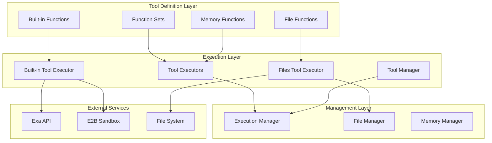

**Diagram sources**
- [builtin_tool_executor.py](file://letta/services/tool_executor/builtin_tool_executor.py#L18-L47)
- [files_tool_executor.py](file://letta/services/tool_executor/files_tool_executor.py#L33-L80)
- [tool_execution_manager.py](file://letta/services/tool_executor/tool_execution_manager.py#L33-L67)

**Section sources**
- [builtin_tool_executor.py](file://letta/services/tool_executor/builtin_tool_executor.py#L18-L47)
- [files_tool_executor.py](file://letta/services/tool_executor/files_tool_executor.py#L33-L80)
- [tool_execution_manager.py](file://letta/services/tool_executor/tool_execution_manager.py#L33-L67)

## Core Built-in Functions

### Web Search Tools

The web search functionality provides AI-powered content retrieval through the Exa API, enabling agents to access current information from the internet.

#### Function Definitions

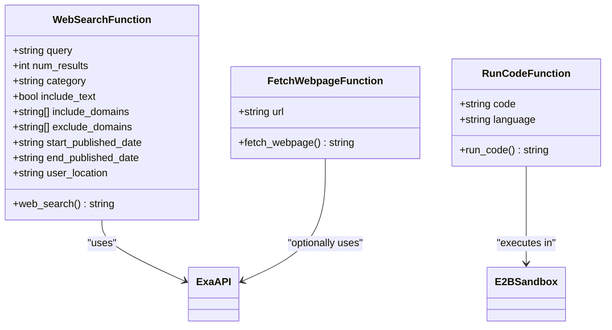

**Diagram sources**
- [builtin.py](file://letta/functions/function_sets/builtin.py#L18-L67)
- [builtin_tool_executor.py](file://letta/services/tool_executor/builtin_tool_executor.py#L76-L274)

#### Key Features

| Feature | Description | Security Consideration |
|---------|-------------|----------------------|
| **Rate Limiting** | Automatic throttling of API calls | Configurable limits per agent |
| **Content Filtering** | Domain inclusion/exclusion lists | Prevents unwanted content access |
| **Text Retrieval Control** | Optional full-content fetching | Balances information depth vs context limits |
| **Geographic Localization** | Country-specific search results | Respects regional preferences |

**Section sources**
- [builtin.py](file://letta/functions/function_sets/builtin.py#L18-L67)
- [builtin_tool_executor.py](file://letta/services/tool_executor/builtin_tool_executor.py#L76-L274)

### File Operations Tools

File operations enable agents to interact with local file systems, providing powerful search and manipulation capabilities.

#### Function Categories

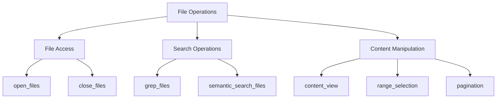

**Diagram sources**
- [files.py](file://letta/functions/function_sets/files.py#L10-L98)
- [files_tool_executor.py](file://letta/services/tool_executor/files_tool_executor.py#L110-L800)

#### Safety Mechanisms

| Protection Level | Implementation | Purpose |
|------------------|----------------|---------|
| **Size Limits** | 50MB per file, 200MB total | Prevents memory exhaustion |
| **Regex Complexity** | 1000 character limit | Guards against catastrophic backtracking |
| **Match Limits** | 20 matches per file, 50 total | Controls search result volume |
| **Timeout Controls** | 30-second grep timeout | Prevents hanging operations |

**Section sources**
- [files.py](file://letta/functions/function_sets/files.py#L10-L98)
- [files_tool_executor.py](file://letta/services/tool_executor/files_tool_executor.py#L36-L47)

### Memory Management Tools

Memory tools provide sophisticated core memory block operations with undo capabilities and structured editing.

#### Memory Operations

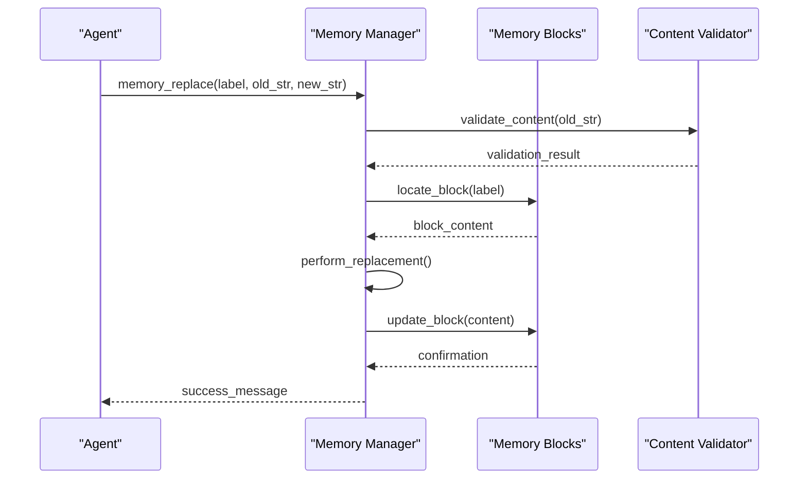

**Diagram sources**
- [base.py](file://letta/functions/function_sets/base.py#L305-L390)

**Section sources**
- [base.py](file://letta/functions/function_sets/base.py#L305-L390)

## Tool Registration and Management

### Function Set Organization

Tools are organized into modular function sets that define their capabilities and integration points.

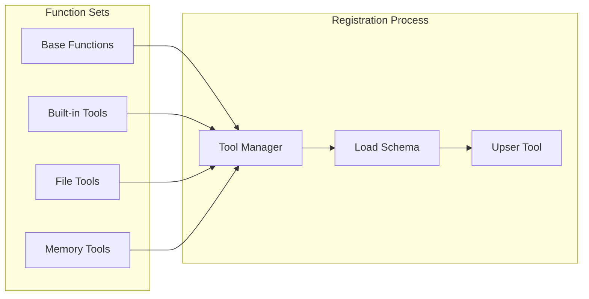

**Diagram sources**
- [tool_manager.py](file://letta/services/tool_manager.py#L898-L924)
- [constants.py](file://letta/constants.py#L156-L166)

### Tool Lifecycle Management

The tool management system handles creation, validation, and lifecycle operations for all built-in tools.

| Operation | Process | Validation |
|-----------|---------|------------|
| **Creation** | Dynamic schema generation from function signatures | Type hint verification |
| **Validation** | Runtime parameter checking and sanitization | Input format validation |
| **Execution** | Secure sandboxed execution with resource limits | Resource usage monitoring |
| **Cleanup** | Automatic resource deallocation and state reset | Memory leak prevention |

**Section sources**
- [tool_manager.py](file://letta/services/tool_manager.py#L898-L924)
- [constants.py](file://letta/constants.py#L156-L166)

## Execution Flow

### Tool Execution Pipeline

The execution flow ensures secure, monitored, and efficient tool invocation with comprehensive error handling.

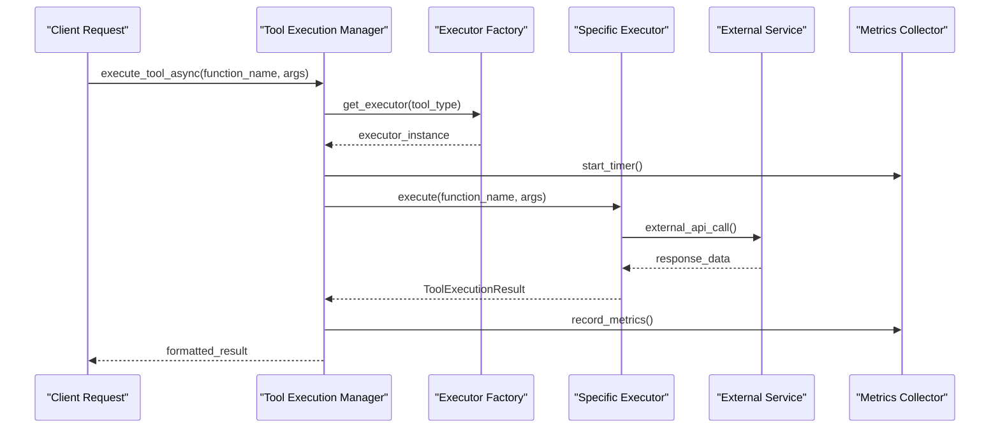

**Diagram sources**
- [tool_execution_manager.py](file://letta/services/tool_executor/tool_execution_manager.py#L96-L130)

### Parallel vs Synchronous Execution

The system supports both parallel and sequential execution patterns based on tool characteristics.

| Execution Mode | Use Case | Performance Benefit |
|----------------|----------|-------------------|
| **Parallel** | Independent tools (web_search, run_code) | Concurrent API calls |
| **Sequential** | Dependent operations | State consistency |
| **Hybrid** | Mixed workloads | Optimal resource utilization |

**Section sources**
- [tool_execution_manager.py](file://letta/services/tool_executor/tool_execution_manager.py#L96-L130)

## Security Model

### Sandboxing and Isolation

Built-in tools operate within a comprehensive security framework that isolates execution and enforces resource limits.

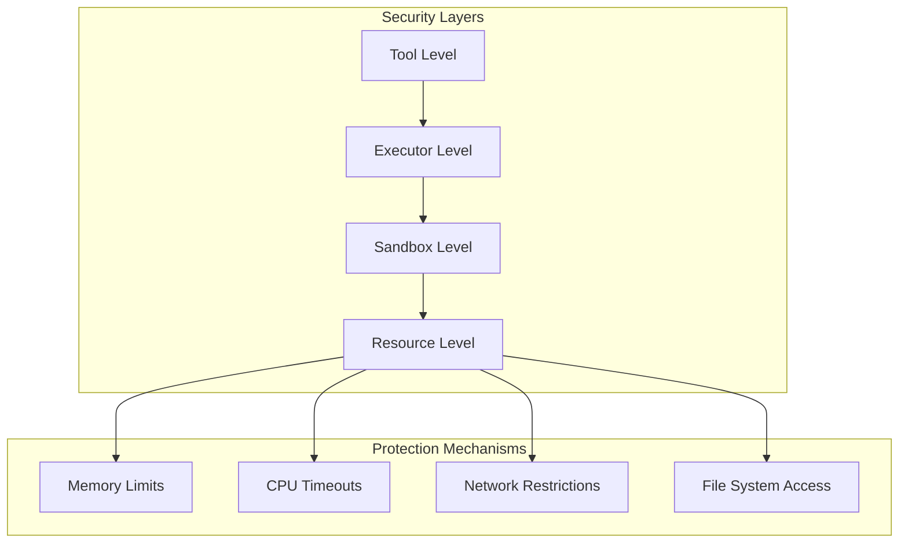

**Diagram sources**
- [builtin_tool_executor.py](file://letta/services/tool_executor/builtin_tool_executor.py#L47-L75)
- [files_tool_executor.py](file://letta/services/tool_executor/files_tool_executor.py#L36-L47)

### Access Control

| Security Boundary | Implementation | Enforcement |
|-------------------|----------------|-------------|
| **API Keys** | Environment variable isolation | Per-agent credential separation |
| **File Access** | Path validation and containment | Whitelist-based file system access |
| **Network Calls** | Proxy-based external communication | Rate limiting and monitoring |
| **Resource Usage** | CPU and memory quotas | Dynamic allocation limits |

**Section sources**
- [builtin_tool_executor.py](file://letta/services/tool_executor/builtin_tool_executor.py#L47-L75)
- [files_tool_executor.py](file://letta/services/tool_executor/files_tool_executor.py#L36-L47)

## Performance Considerations

### Asynchronous vs Synchronous Execution

The system optimizes performance through careful selection of execution patterns based on tool characteristics.

#### Execution Pattern Selection

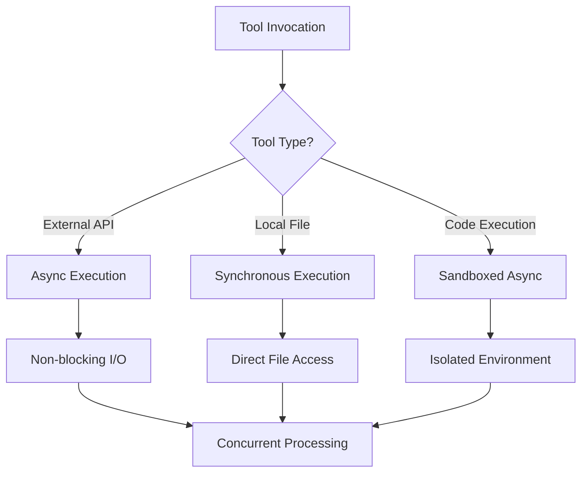

**Diagram sources**
- [tool_execution_manager.py](file://letta/services/tool_executor/tool_execution_manager.py#L96-L130)

#### Performance Metrics

| Metric Category | Measurement | Optimization Target |
|-----------------|-------------|-------------------|
| **Execution Time** | Tool completion latency | < 5 seconds typical |
| **Throughput** | Concurrent tool invocations | 10+ simultaneous tools |
| **Resource Utilization** | Memory and CPU usage | < 80% sustained load |
| **Error Rate** | Failed tool executions | < 1% failure rate |

**Section sources**
- [tool_execution_manager.py](file://letta/services/tool_executor/tool_execution_manager.py#L96-L130)

### Rate Limiting and Throttling

The system implements intelligent rate limiting to prevent abuse and ensure fair resource allocation.

| Rate Limit Type | Configuration | Enforcement |
|-----------------|---------------|-------------|
| **API Calls** | 100 calls/hour per agent | Sliding window algorithm |
| **File Operations** | 5 concurrent files | Queue-based throttling |
| **Memory Usage** | 200MB total per agent | Real-time monitoring |
| **Execution Time** | 30 seconds per tool | Timeout enforcement |

## Error Handling Patterns

### Comprehensive Error Management

The built-in tools system implements robust error handling with graceful degradation and detailed logging.

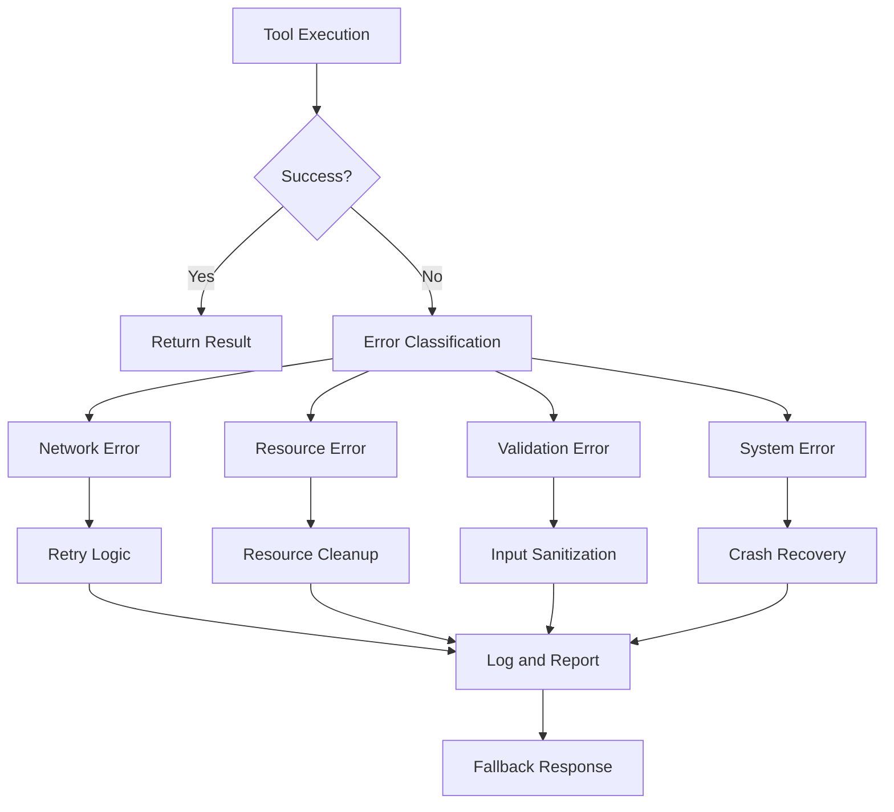

**Diagram sources**
- [builtin_tool_executor.py](file://letta/services/tool_executor/builtin_tool_executor.py#L95-L274)
- [files_tool_executor.py](file://letta/services/tool_executor/files_tool_executor.py#L81-L107)

### Error Recovery Strategies

| Error Category | Recovery Method | User Impact |
|----------------|-----------------|-------------|
| **Network Failures** | Automatic retry with exponential backoff | Minimal latency increase |
| **Rate Limiting** | Queue-based throttling | Delayed execution |
| **Resource Exhaustion** | Graceful degradation | Reduced functionality |
| **Validation Errors** | Input sanitization and correction | Immediate feedback |

**Section sources**
- [builtin_tool_executor.py](file://letta/services/tool_executor/builtin_tool_executor.py#L95-L274)
- [files_tool_executor.py](file://letta/services/tool_executor/files_tool_executor.py#L81-L107)

## Integration Examples

### Basic Tool Usage

Here's how built-in tools are integrated into agent workflows:

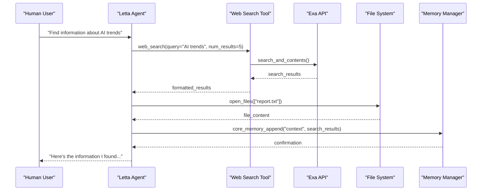

**Diagram sources**
- [integration_test_builtin_tools.py](file://tests/integration_test_builtin_tools.py#L123-L158)

### Advanced Workflow Integration

Complex workflows demonstrate the power of combining multiple built-in tools:

| Step | Tool | Purpose | Security Context |
|------|------|---------|------------------|
| 1 | web_search | Research current information | API key isolation |
| 2 | fetch_webpage | Extract detailed content | Content filtering |
| 3 | open_files | Access local documentation | File permission checks |
| 4 | grep_files | Search within files | Regex validation |
| 5 | memory_replace | Update core memory | Content sanitization |

**Section sources**
- [integration_test_builtin_tools.py](file://tests/integration_test_builtin_tools.py#L123-L314)

## Troubleshooting Guide

### Common Issues and Solutions

#### Web Search Problems

| Issue | Symptoms | Solution |
|-------|----------|----------|
| **API Key Missing** | "EXA_API_KEY is not set" error | Configure EXA_API_KEY environment variable |
| **Rate Limiting** | "Rate limit exceeded" responses | Implement exponential backoff |
| **Empty Results** | No search results returned | Adjust query parameters and filters |
| **Timeout Errors** | Search operations hang | Increase timeout values |

#### File Operation Issues

| Issue | Symptoms | Solution |
|-------|----------|----------|
| **Permission Denied** | File access errors | Verify file permissions and paths |
| **Size Limits** | "File too large" errors | Reduce file size or split operations |
| **Regex Timeouts** | Search hangs indefinitely | Simplify regex patterns |
| **Memory Exhaustion** | Out of memory errors | Implement pagination and streaming |

#### Memory Management Problems

| Issue | Symptoms | Solution |
|-------|----------|----------|
| **Content Truncation** | Missing information in responses | Adjust return_char_limit |
| **Validation Failures** | "Content not found" errors | Ensure exact string matching |
| **Concurrency Conflicts** | Race condition errors | Implement locking mechanisms |
| **State Corruption** | Inconsistent memory state | Add transactional operations |

### Debugging Tools and Techniques

The system provides comprehensive logging and monitoring capabilities for troubleshooting:

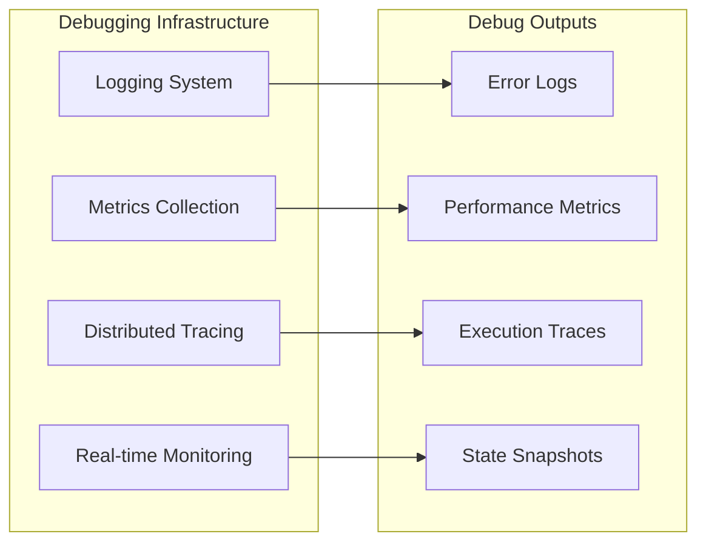

**Section sources**
- [builtin_tool_executor.py](file://letta/services/tool_executor/builtin_tool_executor.py#L95-L274)
- [files_tool_executor.py](file://letta/services/tool_executor/files_tool_executor.py#L81-L107)