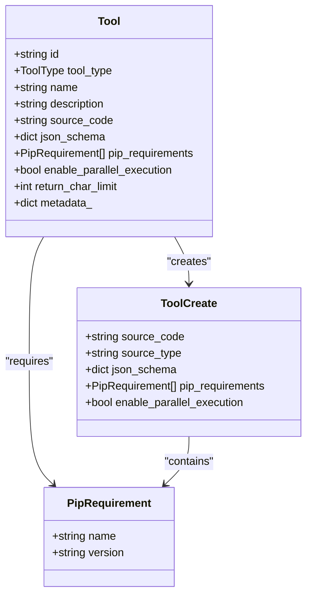
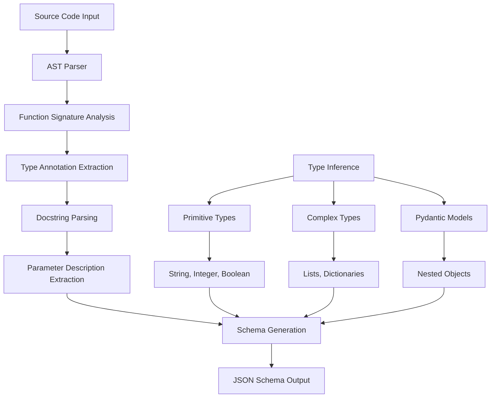
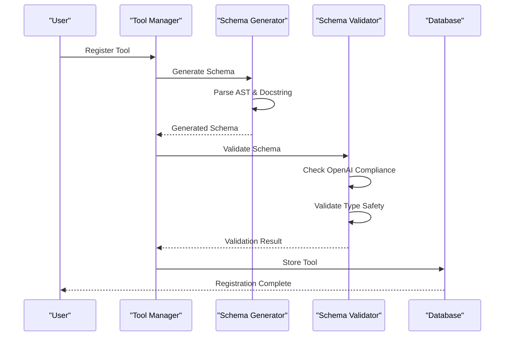
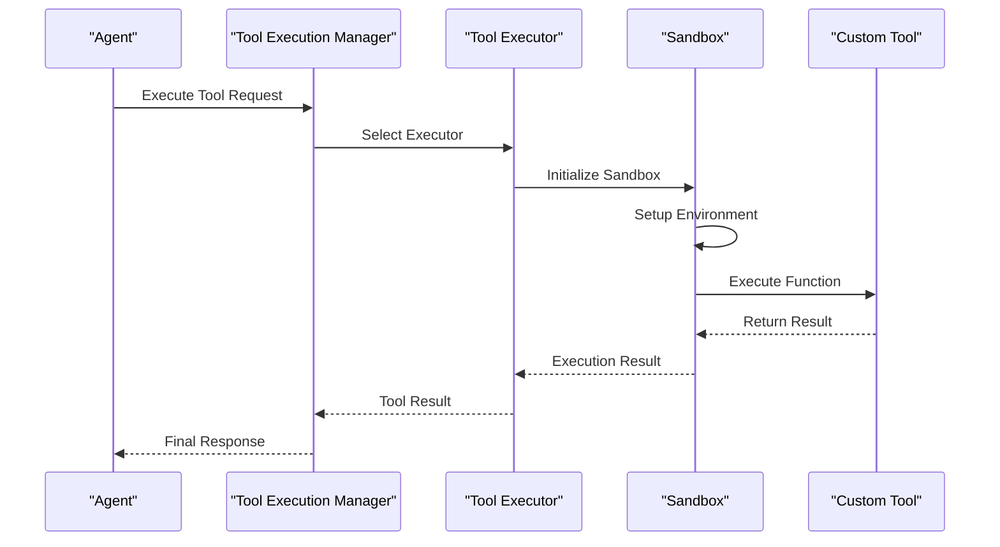
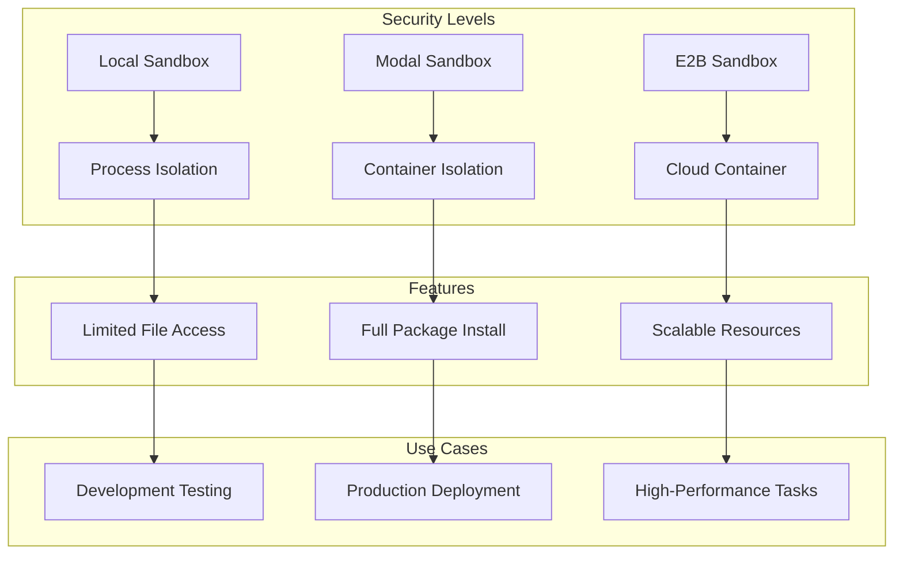
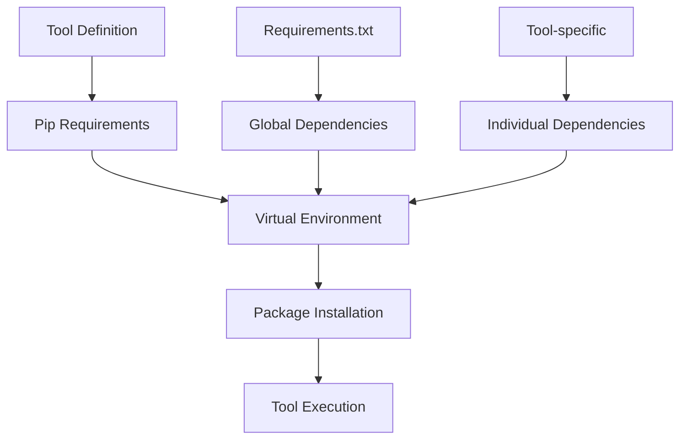
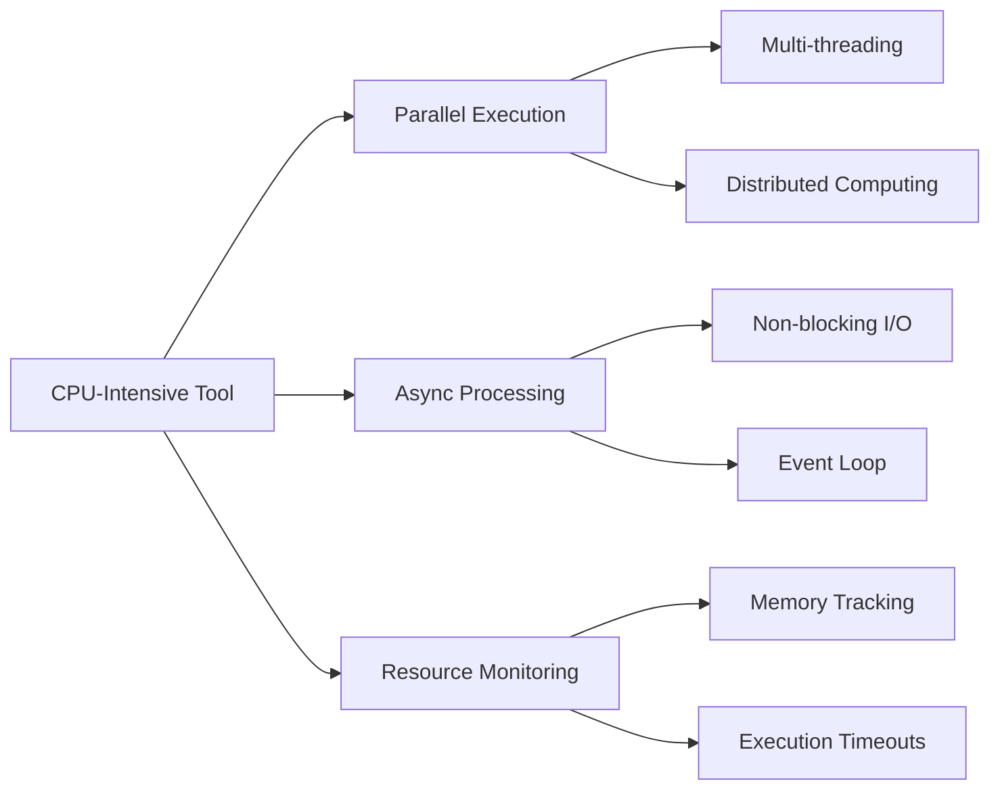

# Custom Python Tools

<cite>
**Referenced Files in This Document**
- [schema_generator.py](file://letta/functions/schema_generator.py)
- [tool_manager.py](file://letta/services/tool_manager.py)
- [core_tool_executor.py](file://letta/services/tool_executor/core_tool_executor.py)
- [base.py](file://letta/services/tool_sandbox/base.py)
- [schema_validator.py](file://letta/functions/schema_validator.py)
- [tool.py](file://letta/schemas/tool.py)
- [pip_requirement.py](file://letta/schemas/pip_requirement.py)
- [tool_execution_helper.py](file://letta/services/helpers/tool_execution_helper.py)
- [simple_d20.py](file://tests/test_tool_schema_parsing_files/simple_d20.py)
- [all_python_complex.py](file://tests/test_tool_schema_parsing_files/all_python_complex.py)
- [integration_test_async_tool_sandbox.py](file://tests/integration_test_async_tool_sandbox.py)
- [README.md](file://README.md)
</cite>

## Table of Contents
1. [Introduction](#introduction)
2. [Tool Definition and Structure](#tool-definition-and-structure)
3. [Schema Generation Process](#schema-generation-process)
4. [Tool Validation and Security](#tool-validation-and-security)
5. [Execution Flow](#execution-flow)
6. [Security Model](#security-model)
7. [Dependency Management](#dependency-management)
8. [Performance Considerations](#performance-considerations)
9. [Debugging and Troubleshooting](#debugging-and-troubleshooting)
10. [Best Practices](#best-practices)

## Introduction

The Custom Python Tools sub-feature enables users to define their own Python functions as reusable tools within the Letta ecosystem. These tools can be registered, validated, executed, and managed with comprehensive security measures and performance optimizations. The system supports both synchronous and asynchronous Python functions with automatic schema generation, dependency management, and sandboxed execution environments.

## Tool Definition and Structure

### Basic Tool Structure

Custom Python tools are defined as Python functions with proper type hints and Google-style docstrings. The tool definition includes several key components:



**Diagram sources**
- [tool.py](file://letta/schemas/tool.py#L35-L106)
- [pip_requirement.py](file://letta/schemas/pip_requirement.py#L6-L14)

### Function Requirements

Custom Python tools must adhere to specific requirements for proper integration:

1. **Google-style Docstring**: Functions must include comprehensive docstrings following Google Python style guidelines
2. **Type Annotations**: All parameters must have proper type annotations
3. **Return Type**: Functions should specify return types for proper schema generation
4. **Parameter Descriptions**: Each parameter must be described in the docstring's Args section

**Section sources**
- [schema_generator.py](file://letta/functions/schema_generator.py#L15-L67)
- [simple_d20.py](file://tests/test_tool_schema_parsing_files/simple_d20.py#L1-L16)

## Schema Generation Process

### AST Parsing and Type Inference

The schema generation process utilizes Abstract Syntax Tree (AST) parsing to analyze Python functions and infer types without executing the code. This approach ensures safety while providing accurate schema information.



**Diagram sources**
- [schema_generator.py](file://letta/functions/schema_generator.py#L409-L526)

### Automatic Schema Generation

The system automatically generates JSON schemas from Python function signatures and docstrings:

| Component | Source | Purpose |
|-----------|--------|---------|
| Function Name | Function definition | Tool identifier |
| Description | Docstring short description | Tool purpose |
| Parameters | Parameter annotations + docstring | Input specification |
| Return Type | Return type annotation | Output specification |
| Required Fields | Parameter default values | Mandatory inputs |

**Section sources**
- [schema_generator.py](file://letta/functions/schema_generator.py#L409-L526)
- [tool_schema_generator.py](file://letta/services/tool_schema_generator.py#L16-L100)

### Advanced Type Handling

The schema generator supports sophisticated type handling including:

- **Primitive Types**: String, integer, boolean, float
- **Collection Types**: Lists, dictionaries with type constraints
- **Complex Types**: Pydantic models and nested structures
- **Optional Types**: Union types with None handling
- **Literal Types**: Enum-like constrained values

**Section sources**
- [schema_generator.py](file://letta/functions/schema_generator.py#L78-L195)

## Tool Validation and Security

### Validation Pipeline

The tool validation process ensures security and compatibility before registration:



**Diagram sources**
- [tool_manager.py](file://letta/services/tool_manager.py#L194-L255)
- [schema_validator.py](file://letta/functions/schema_validator.py#L20-L203)

### Security Validation Checks

The system performs multiple security validations:

1. **Google Style Docstring Validation**: Ensures proper documentation format
2. **Type Annotation Verification**: Validates parameter type annotations
3. **Schema Compliance**: Checks OpenAI strict mode requirements
4. **Malicious Code Detection**: Analyzes source code for security risks
5. **Resource Limits**: Enforces character limits and execution timeouts

**Section sources**
- [schema_validator.py](file://letta/functions/schema_validator.py#L20-L203)
- [schema_generator.py](file://letta/functions/schema_generator.py#L15-L67)

### Schema Health Status

The validation system categorizes schemas into health statuses:

| Status | Description | Action Required |
|--------|-------------|-----------------|
| STRICT_COMPLIANT | Fully compatible with OpenAI strict mode | Ready for production |
| NON_STRICT_ONLY | Valid but not strict-compliant | May work but not optimal |
| INVALID | Contains critical issues | Fix required |

**Section sources**
- [schema_validator.py](file://letta/functions/schema_validator.py#L12-L18)

## Execution Flow

### Core Tool Executor

The execution flow involves multiple components working together to safely execute custom tools:



**Diagram sources**
- [core_tool_executor.py](file://letta/services/tool_executor/core_tool_executor.py#L27-L78)
- [tool_execution_manager.py](file://letta/services/tool_executor/tool_execution_manager.py#L95-L130)

### Parameter Binding and Result Serialization

The system handles parameter binding and result serialization through multiple stages:

1. **Parameter Parsing**: Converts JSON arguments to Python objects
2. **Type Validation**: Ensures parameter types match schema
3. **Agent State Injection**: Provides agent context when requested
4. **Result Serialization**: Converts Python results to JSON-compatible format
5. **Character Limiting**: Truncates large responses appropriately

**Section sources**
- [base.py](file://letta/services/tool_sandbox/base.py#L309-L354)

## Security Model

### Sandboxing Options

The system provides multiple sandboxing levels for tool execution:



**Diagram sources**
- [base.py](file://letta/services/tool_sandbox/base.py#L20-L398)

### Input Validation

Comprehensive input validation ensures secure tool execution:

- **Type Checking**: Validates parameter types against schema
- **Range Validation**: Ensures numeric values fall within acceptable ranges
- **Format Validation**: Verifies string formats (email, URLs, etc.)
- **Size Limits**: Prevents excessive memory usage
- **Sanitization**: Removes potentially harmful content

**Section sources**
- [base.py](file://letta/services/tool_sandbox/base.py#L309-L354)

### Environment Isolation

Each sandbox provides isolated execution environments:

| Feature | Local Sandbox | Modal Sandbox | E2B Sandbox |
|---------|---------------|---------------|-------------|
| Process Isolation | ✓ | ✓ | ✓ |
| Network Access | Limited | Configurable | Full |
| File System | Restricted | Virtual | Full |
| Package Installation | Manual | Automated | Automated |
| Resource Limits | Configurable | Fixed | Scalable |

## Dependency Management

### Pip Requirements System

The system supports automatic dependency management through pip requirements:



**Diagram sources**
- [pip_requirement.py](file://letta/schemas/pip_requirement.py#L6-L14)
- [tool_execution_helper.py](file://letta/services/helpers/tool_execution_helper.py#L86-L136)

### Version Compatibility

The dependency management system handles version compatibility:

- **Semantic Versioning**: Supports version constraints (==, >=, <=)
- **Package Resolution**: Automatically resolves dependency conflicts
- **Caching**: Reuses installed packages when possible
- **Upgrade Support**: Handles package upgrades gracefully

**Section sources**
- [tool_execution_helper.py](file://letta/services/helpers/tool_execution_helper.py#L86-L136)

### Installation Strategies

Different installation strategies are available based on sandbox type:

1. **System-wide Installation**: Direct system package installation
2. **Virtual Environment**: Isolated Python environment
3. **Container Installation**: Full container-based isolation
4. **Cloud Installation**: Managed cloud package installation

**Section sources**
- [tool_execution_helper.py](file://letta/services/helpers/tool_execution_helper.py#L46-L136)

## Performance Considerations

### CPU-Intensive Tools

For CPU-intensive custom tools, the system provides several optimization strategies:



### Asynchronous Execution

The system supports both synchronous and asynchronous tool execution:

| Aspect | Synchronous | Asynchronous |
|--------|-------------|--------------|
| Function Definition | `def tool_func()` | `async def tool_func()` |
| Execution Pattern | Blocking | Non-blocking |
| Resource Usage | Single thread | Multiple coroutines |
| Error Handling | Exceptions | Awaitable errors |
| Performance | Lower concurrency | Higher throughput |

**Section sources**
- [integration_test_async_tool_sandbox.py](file://tests/integration_test_async_tool_sandbox.py#L427-L978)

### Parallel Execution Capabilities

Tools can be configured for parallel execution when appropriate:

- **Enable Parallel Execution**: Set `enable_parallel_execution=True`
- **Resource Contention**: Avoid for shared resource tools
- **State Independence**: Ensure tools don't interfere with each other
- **Performance Benefits**: Significant speedup for independent operations

**Section sources**
- [letta_agent_v3.py](file://letta/agents/letta_agent_v3.py#L995-L1049)

## Debugging and Troubleshooting

### Common Issues and Solutions

| Issue | Symptoms | Solution |
|-------|----------|----------|
| Schema Generation Failure | Tool not recognized | Check docstring format |
| Import Errors | Module not found | Add pip requirements |
| Type Validation Errors | Parameter rejected | Fix type annotations |
| Timeout Errors | Tool hangs | Optimize code or increase timeout |
| Permission Errors | Access denied | Check sandbox permissions |

### Debugging Techniques

Effective debugging strategies for custom tools:

1. **Local Testing**: Test tools locally before deployment
2. **Logging**: Add comprehensive logging to track execution
3. **Schema Validation**: Verify schema compliance before registration
4. **Incremental Development**: Build tools incrementally
5. **Unit Testing**: Create automated tests for tool functionality

**Section sources**
- [integration_test_async_tool_sandbox.py](file://tests/integration_test_async_tool_sandbox.py#L310-L343)

### Error Handling Patterns

Robust error handling patterns for custom tools:

```python
def robust_tool(input_data: str) -> str:
    """
    Example of robust error handling in custom tools.
    
    Args:
        input_data (str): Input data to process
        
    Returns:
        str: Processed result or error message
    """
    try:
        # Validate input
        if not input_data:
            return "Error: Input data is required"
        
        # Process data
        result = perform_operation(input_data)
        return result
        
    except ValueError as e:
        return f"Validation error: {str(e)}"
    except Exception as e:
        return f"Unexpected error: {str(e)}"
```

## Best Practices

### Tool Design Guidelines

1. **Single Responsibility**: Each tool should have one clear purpose
2. **Idempotency**: Tools should produce consistent results for identical inputs
3. **Error Handling**: Implement comprehensive error handling
4. **Documentation**: Provide clear, comprehensive documentation
5. **Testing**: Thoroughly test tools before deployment

### Performance Optimization

- **Async Operations**: Use async functions for I/O-bound tasks
- **Resource Management**: Properly manage resources and cleanup
- **Caching**: Implement caching for expensive computations
- **Batch Processing**: Group related operations when possible

### Security Considerations

- **Input Sanitization**: Never trust user input
- **Least Privilege**: Grant minimal necessary permissions
- **Timeouts**: Set reasonable execution timeouts
- **Monitoring**: Monitor tool execution and performance

**Section sources**
- [all_python_complex.py](file://tests/test_tool_schema_parsing_files/all_python_complex.py#L1-L58)

### Example Implementation

Here's a complete example of a well-designed custom tool:

```python
from typing import List, Optional
from pydantic import BaseModel, Field

class WeatherData(BaseModel):
    temperature: float = Field(..., description="Temperature in Celsius")
    humidity: float = Field(..., description="Humidity percentage")
    conditions: str = Field(..., description="Weather conditions")

def get_weather_data(location: str, units: str = "metric") -> WeatherData:
    """
    Get current weather data for a specified location.
    
    Args:
        location (str): Location name or coordinates
        units (str): Measurement units ("metric" or "imperial")
        
    Returns:
        WeatherData: Structured weather information
    """
    # Implementation would call weather API
    # This is a placeholder for demonstration
    return WeatherData(
        temperature=22.5,
        humidity=65.0,
        conditions="Partly cloudy"
    )
```

This example demonstrates proper type hints, Pydantic models, comprehensive docstrings, and structured return types that integrate seamlessly with the Letta tool system.