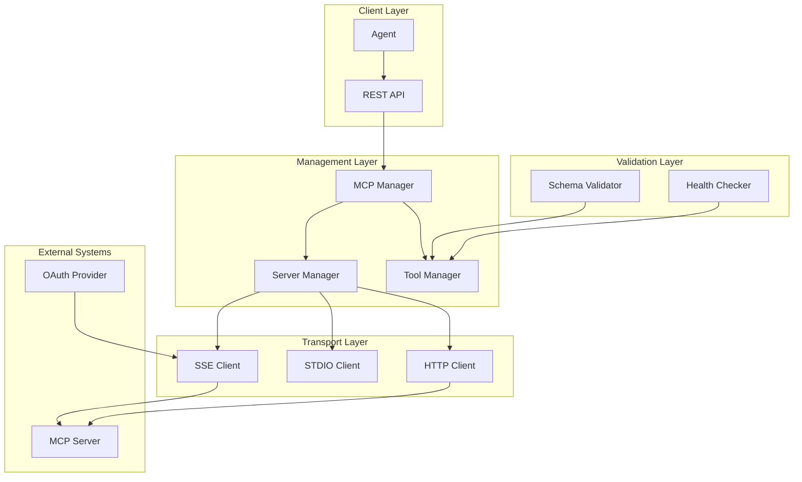
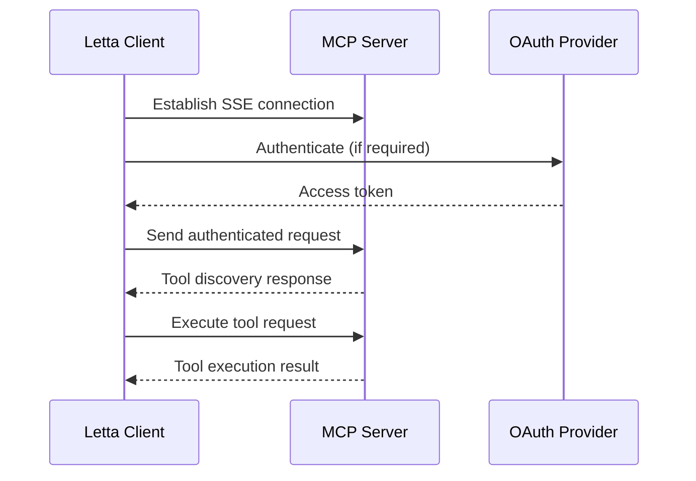
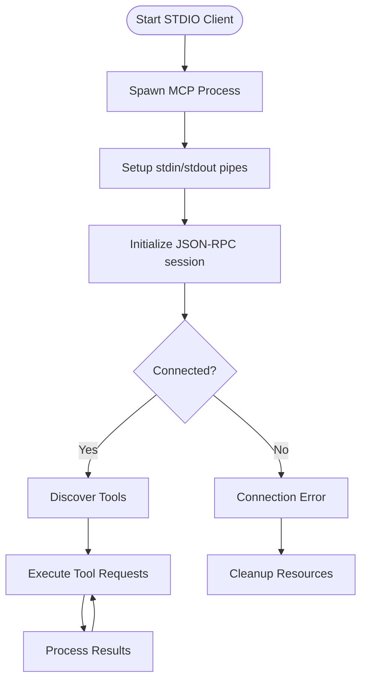
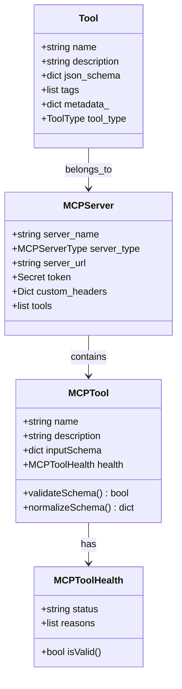
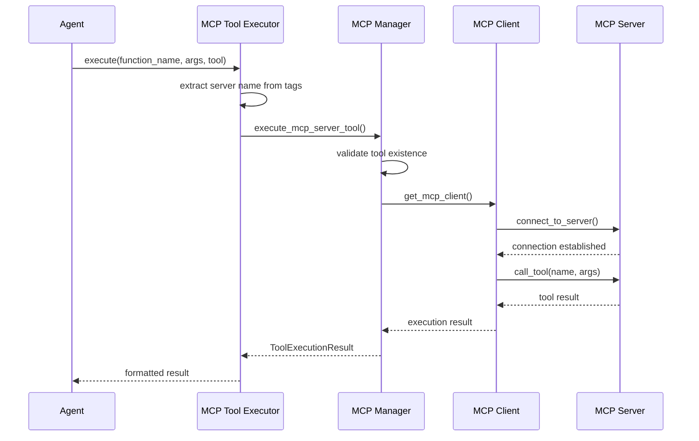
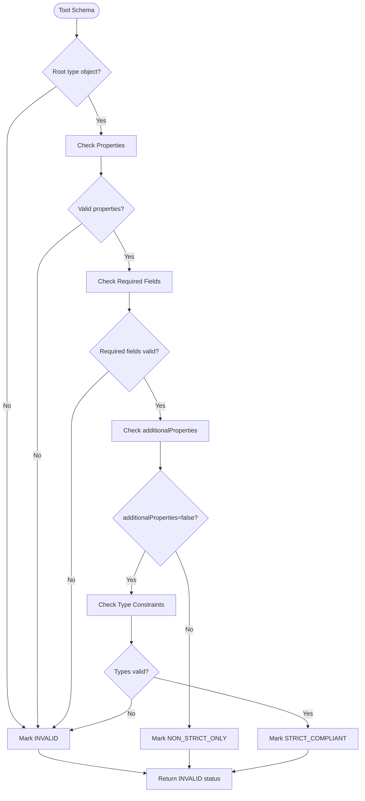
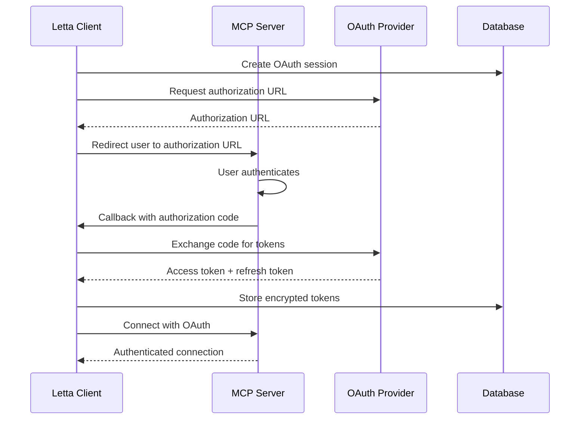
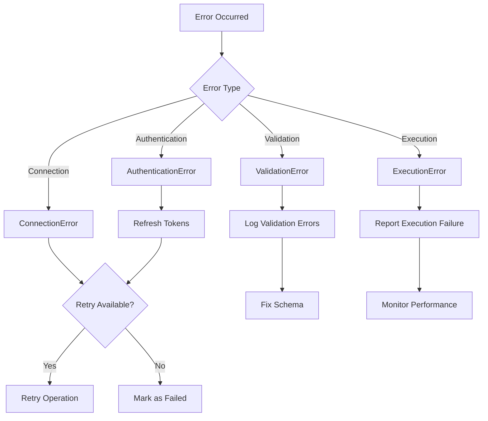

# MCP (Model Context Protocol) Tools

<cite>
**Referenced Files in This Document**
- [mcp.py](file://letta/schemas/mcp.py)
- [mcp_tool_executor.py](file://letta/services/tool_executor/mcp_tool_executor.py)
- [base_client.py](file://letta/services/mcp/base_client.py)
- [sse_client.py](file://letta/services/mcp/sse_client.py)
- [oauth_utils.py](file://letta/services/mcp/oauth_utils.py)
- [schema_validator.py](file://letta/functions/schema_validator.py)
- [mcp_manager.py](file://letta/services/mcp_manager.py)
- [mcp_server_manager.py](file://letta/services/mcp_server_manager.py)
- [mcp_servers.py](file://letta/server/rest_api/routers/v1/mcp_servers.py)
- [tool_schema_generator.py](file://letta/services/tool_schema_generator.py)
- [exceptions.py](file://letta/functions/mcp_client/exceptions.py)
</cite>

## Table of Contents
1. [Introduction](#introduction)
2. [Architecture Overview](#architecture-overview)
3. [MCP Server Registration](#mcp-server-registration)
4. [Tool Discovery and Integration](#tool-discovery-and-integration)
5. [Tool Execution Flow](#tool-execution-flow)
6. [Schema Generation and Validation](#schema-generation-and-validation)
7. [Authentication Mechanisms](#authentication-mechanisms)
8. [Performance Considerations](#performance-considerations)
9. [Error Handling and Troubleshooting](#error-handling-and-troubleshooting)
10. [Best Practices](#best-practices)

## Introduction

The MCP (Model Context Protocol) Tools sub-feature enables Letta to integrate with external tools and services through standardized JSON-RPC over Server-Sent Events (SSE) endpoints. This system allows agents to discover, register, and execute tools from MCP-compliant servers, providing a flexible and extensible way to enhance agent capabilities.

MCP servers expose tools through standardized protocols, enabling seamless integration with various external systems. The implementation supports multiple transport types (SSE, STDIO, Streamable HTTP) and provides robust authentication mechanisms including OAuth and API tokens.

## Architecture Overview

The MCP Tools system follows a layered architecture that separates concerns between server management, tool discovery, execution, and validation:

**Diagram sources**
- [mcp_manager.py](file://letta/services/mcp_manager.py#L1-L50)
- [mcp_server_manager.py](file://letta/services/mcp_server_manager.py#L1-L50)
- [base_client.py](file://letta/services/mcp/base_client.py#L1-L50)

**Section sources**
- [mcp_manager.py](file://letta/services/mcp_manager.py#L1-L100)
- [mcp_server_manager.py](file://letta/services/mcp_server_manager.py#L1-L100)

## MCP Server Registration

### REST API Endpoints

MCP servers are registered and managed through a comprehensive REST API that supports CRUD operations:

| Endpoint | Method | Description |
|----------|--------|-------------|
| `/mcp-servers/` | POST | Create a new MCP server |
| `/mcp-servers/` | GET | List all MCP servers |
| `/mcp-servers/{id}` | GET | Retrieve specific MCP server |
| `/mcp-servers/{id}` | PATCH | Update MCP server configuration |
| `/mcp-servers/{id}` | DELETE | Delete MCP server |

### Server Configuration Types

The system supports three transport types for MCP server communication:

#### SSE (Server-Sent Events) Configuration
SSE servers communicate over HTTP connections using Server-Sent Events protocol:

**Diagram sources**
- [sse_client.py](file://letta/services/mcp/sse_client.py#L24-L47)
- [oauth_utils.py](file://letta/services/mcp/oauth_utils.py#L192-L253)

#### STDIO (Standard Input/Output) Configuration
STDIO servers run as local processes with stdin/stdout communication:

**Diagram sources**
- [base_client.py](file://letta/services/mcp/base_client.py#L29-L53)

#### Streamable HTTP Configuration
HTTP servers provide JSON-RPC endpoints over HTTP with streaming capabilities.

**Section sources**
- [mcp_servers.py](file://letta/server/rest_api/routers/v1/mcp_servers.py#L37-L106)
- [mcp.py](file://letta/schemas/mcp.py#L26-L147)

## Tool Discovery and Integration

### Dynamic Tool Discovery

MCP servers are queried for available tools during registration and periodically for updates. The discovery process involves:

1. **Initial Discovery**: When an MCP server is registered, the system queries for all available tools
2. **Schema Validation**: Each tool's schema is validated against OpenAI strict mode requirements
3. **Health Assessment**: Tools are assessed for compatibility and marked with health status
4. **Integration**: Valid tools are integrated into the agent's tool registry

### Tool Metadata Management

Each discovered tool maintains comprehensive metadata including:

- **Schema Information**: JSON schema for parameter validation
- **Health Status**: Compliance with OpenAI strict mode requirements
- **Server Association**: Link to the originating MCP server
- **Execution Context**: Environment variables and agent-specific configurations

**Diagram sources**
- [mcp.py](file://letta/schemas/mcp.py#L26-L147)
- [schema_validator.py](file://letta/functions/schema_validator.py#L12-L19)

**Section sources**
- [mcp_manager.py](file://letta/services/mcp_manager.py#L77-L100)
- [mcp_server_manager.py](file://letta/services/mcp_server_manager.py#L233-L273)

## Tool Execution Flow

### Execution Pipeline

The tool execution process follows a structured pipeline that ensures proper validation, authentication, and result processing:

**Diagram sources**
- [mcp_tool_executor.py](file://letta/services/tool_executor/mcp_tool_executor.py#L18-L56)
- [mcp_manager.py](file://letta/services/mcp_manager.py#L344-L371)

### Agent Integration

Agents integrate with MCP tools through a tagging system that associates tools with specific MCP servers:

1. **Tag Extraction**: Tools are identified by their MCP server tags
2. **Context Injection**: Agent-specific environment variables are injected
3. **Execution Context**: Agent state and sandbox configurations are maintained
4. **Result Processing**: Tool execution results are formatted for agent consumption

**Section sources**
- [mcp_tool_executor.py](file://letta/services/tool_executor/mcp_tool_executor.py#L18-L56)
- [mcp_manager.py](file://letta/services/mcp_manager.py#L344-L371)

## Schema Generation and Validation

### Schema Validation Process

The system implements comprehensive schema validation to ensure compatibility with OpenAI's strict mode requirements:

**Diagram sources**
- [schema_validator.py](file://letta/functions/schema_validator.py#L20-L203)

### Schema Normalization

The system automatically normalizes schemas to improve compatibility:

- **Type Enhancement**: Adds explicit types for `$ref` properties
- **Property Normalization**: Ensures `additionalProperties: false` for objects
- **Null Handling**: Converts optional fields to nullable types in strict mode
- **Duplicate Removal**: Eliminates duplicate entries in `anyOf` arrays

### Health Status Classification

| Status | Description | Action Required |
|--------|-------------|-----------------|
| `STRICT_COMPLIANT` | Fully compatible with OpenAI strict mode | No action needed |
| `NON_STRICT_ONLY` | Valid but not strict-compliant | May work but not optimal |
| `INVALID` | Broken schema requiring manual intervention | Manual correction needed |

**Section sources**
- [schema_validator.py](file://letta/functions/schema_validator.py#L12-L203)
- [mcp_manager.py](file://letta/services/mcp_manager.py#L147-L187)

## Authentication Mechanisms

### OAuth 2.0 Implementation

The system provides comprehensive OAuth 2.0 support for secure MCP server authentication:

**Diagram sources**
- [oauth_utils.py](file://letta/services/mcp/oauth_utils.py#L192-L253)
- [mcp_servers.py](file://letta/server/rest_api/routers/v1/mcp_servers.py#L249-L296)

### API Token Authentication

For simpler authentication scenarios, the system supports API token authentication:

- **Bearer Token**: Standard OAuth Bearer token format
- **Custom Headers**: Configurable authentication headers
- **Environment Variables**: Support for environment-based credential injection

### Security Features

- **Encryption**: All sensitive credentials are encrypted at rest
- **Token Rotation**: Automatic refresh token handling
- **Secure Storage**: Database-backed token storage with access controls
- **Audit Logging**: Comprehensive logging of authentication events

**Section sources**
- [oauth_utils.py](file://letta/services/mcp/oauth_utils.py#L26-L93)
- [mcp.py](file://letta/schemas/mcp.py#L31-L66)

## Performance Considerations

### Network Latency Optimization

To minimize the impact of network latency on agent performance:

1. **Connection Pooling**: Reuse MCP client connections across tool executions
2. **Async Operations**: All MCP operations are performed asynchronously
3. **Timeout Management**: Configurable timeouts prevent hanging operations
4. **Circuit Breaker**: Automatic fallback for unresponsive servers

### Caching Strategies

The system implements multiple caching layers:

- **Tool Metadata Cache**: Persisted tool schemas to avoid repeated validation
- **Client Connection Cache**: Maintain active connections to reduce handshake overhead
- **Schema Cache**: Cache generated schemas to speed up subsequent operations

### Monitoring and Metrics

Key performance indicators tracked include:

- **Connection Success Rate**: Percentage of successful MCP server connections
- **Tool Discovery Time**: Time taken to discover tools from servers
- **Execution Latency**: Average time for tool execution requests
- **Error Rates**: Frequency of various error types

**Section sources**
- [base_client.py](file://letta/services/mcp/base_client.py#L29-L53)
- [mcp_manager.py](file://letta/services/mcp_manager.py#L77-L100)

## Error Handling and Troubleshooting

### Common Issues and Solutions

#### Connection Timeouts

**Symptoms**: MCP server connections fail with timeout errors
**Causes**: Network connectivity issues, server overload, incorrect URLs
**Solutions**:
- Verify server accessibility and network connectivity
- Check firewall and proxy configurations
- Adjust timeout settings in server configuration

#### Schema Compatibility Issues

**Symptoms**: Tools marked as `INVALID` in health status
**Causes**: Non-compliant JSON schemas, missing required fields
**Solutions**:
- Review schema validation errors in logs
- Use schema normalization features
- Contact server administrator for schema updates

#### Authentication Failures

**Symptoms**: 401 Unauthorized errors during tool execution
**Causes**: Expired tokens, incorrect credentials, OAuth configuration issues
**Solutions**:
- Refresh OAuth tokens through the admin interface
- Verify token expiration and renewal mechanisms
- Check OAuth provider configuration

### Error Propagation

The system implements structured error handling:

**Diagram sources**
- [base_client.py](file://letta/services/mcp/base_client.py#L29-L53)
- [exceptions.py](file://letta/functions/mcp_client/exceptions.py#L1-L6)

### Debugging Tools

The system provides comprehensive debugging capabilities:

- **Verbose Logging**: Detailed logs for troubleshooting connection issues
- **Schema Inspection**: Tools to inspect and validate tool schemas
- **Connection Testing**: Built-in tools to test server connectivity
- **Performance Monitoring**: Metrics for identifying bottlenecks

**Section sources**
- [base_client.py](file://letta/services/mcp/base_client.py#L29-L53)
- [exceptions.py](file://letta/functions/mcp_client/exceptions.py#L1-L6)

## Best Practices

### Server Configuration

1. **Use Descriptive Names**: Choose meaningful server names for easy identification
2. **Secure Credentials**: Always use encrypted storage for sensitive credentials
3. **Environment Variables**: Leverage environment variables for deployment flexibility
4. **Health Monitoring**: Regularly monitor server health and tool availability

### Tool Management

1. **Schema Validation**: Ensure all tools have valid JSON schemas
2. **Documentation**: Provide clear descriptions for all tools
3. **Testing**: Thoroughly test tools before deployment
4. **Version Control**: Track tool schema changes and updates

### Security Considerations

1. **Principle of Least Privilege**: Grant minimal necessary permissions
2. **Regular Audits**: Periodically review access permissions and credentials
3. **Monitoring**: Implement comprehensive logging and alerting
4. **Backup**: Maintain backups of server configurations and credentials

### Performance Optimization

1. **Connection Reuse**: Maintain persistent connections when possible
2. **Batch Operations**: Group related operations to reduce overhead
3. **Caching**: Implement appropriate caching strategies
4. **Monitoring**: Track performance metrics and optimize accordingly