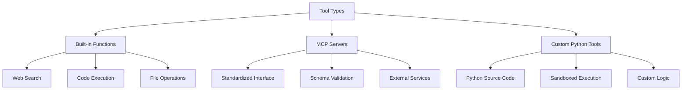
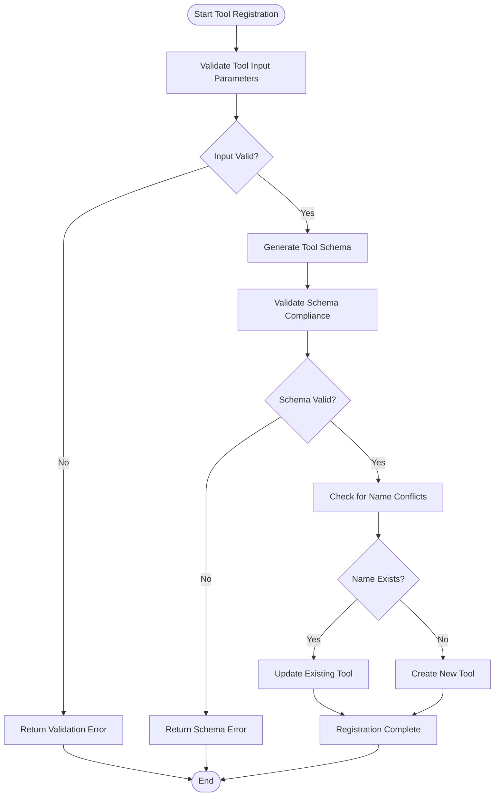
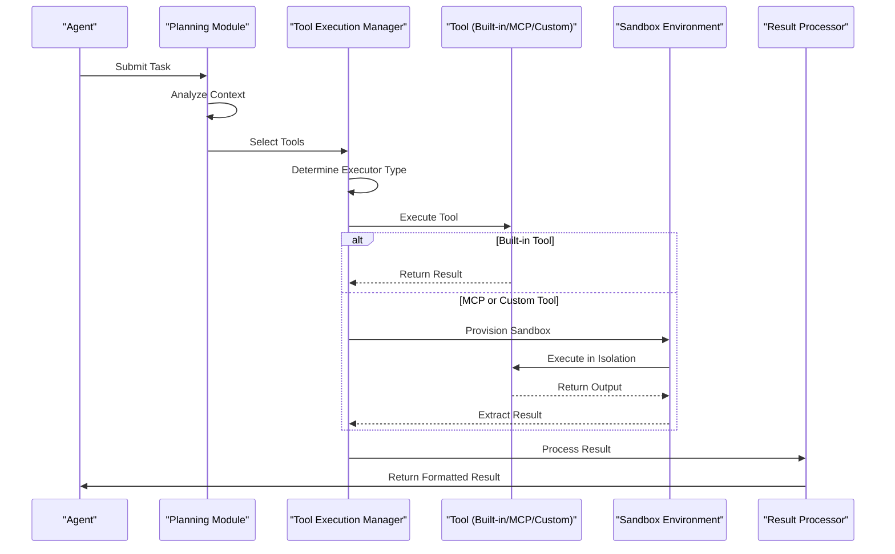
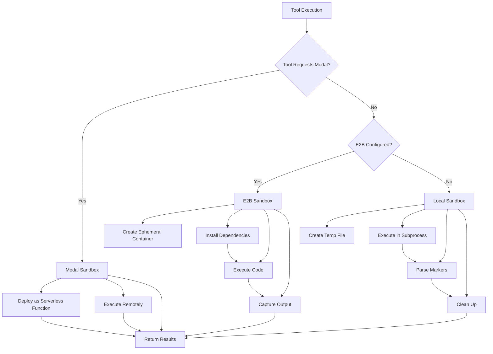
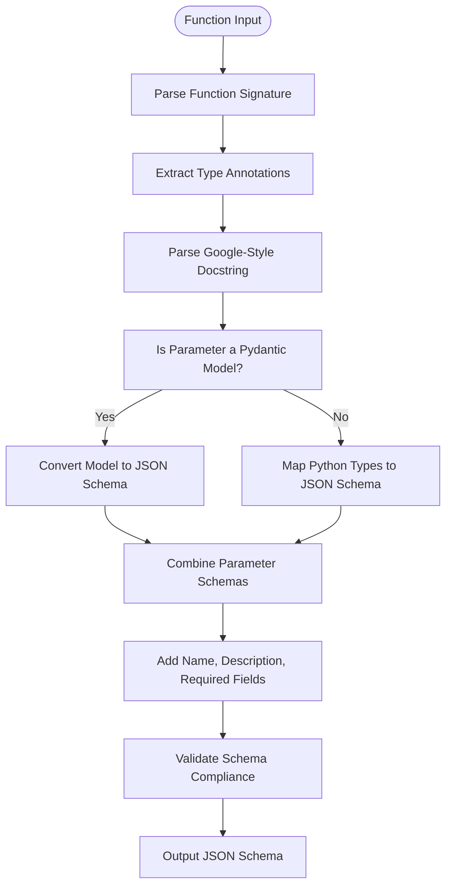
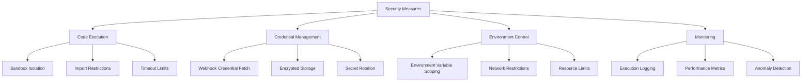

# Tool Integration System

<cite>
**Referenced Files in This Document**   
- [tool_execution_manager.py](file://letta/services/tool_executor/tool_execution_manager.py)
- [builtin_tool_executor.py](file://letta/services/tool_executor/builtin_tool_executor.py)
- [mcp_tool_executor.py](file://letta/services/tool_executor/mcp_tool_executor.py)
- [sandbox_tool_executor.py](file://letta/services/tool_executor/sandbox_tool_executor.py)
- [tool_execution_sandbox.py](file://letta/services/tool_executor/tool_execution_sandbox.py)
- [e2b_sandbox.py](file://letta/services/tool_sandbox/e2b_sandbox.py)
- [modal_sandbox.py](file://letta/services/tool_sandbox/modal_sandbox.py)
- [local_sandbox.py](file://letta/services/tool_sandbox/local_sandbox.py)
- [schema_generator.py](file://letta/functions/schema_generator.py)
- [schema_validator.py](file://letta/functions/schema_validator.py)
- [tool_manager.py](file://letta/services/tool_manager.py)
- [tool_schema_generator.py](file://letta/services/tool_schema_generator.py)
- [mcp_server_manager.py](file://letta/services/mcp_server_manager.py)
- [mcp_manager.py](file://letta/services/mcp_manager.py)
- [sandbox_credentials_service.py](file://letta/services/sandbox_credentials_service.py)
- [agent_manager.py](file://letta/services/agent_manager.py)
- [letta_agent_v3.py](file://letta/agents/letta_agent_v3.py)
</cite>

## Table of Contents
1. [Introduction](#introduction)
2. [Tool Types](#tool-types)
3. [Tool Registration and Validation](#tool-registration-and-validation)
4. [Tool Execution Lifecycle](#tool-execution-lifecycle)
5. [Sandboxing Mechanisms](#sandboxing-mechanisms)
6. [Tool Schema Generation](#tool-schema-generation)
7. [Tool Attachment and Implementation](#tool-attachment-and-implementation)
8. [Security Considerations](#security-considerations)
9. [Performance Implications](#performance-implications)
10. [Conclusion](#conclusion)

## Introduction

The Tool Integration System in Letta provides a comprehensive framework for extending agent capabilities through various tool types. This system enables agents to perform complex operations beyond their core functionality by integrating external services, executing code, and accessing specialized functions. The architecture supports three main tool types: built-in functions for common operations like web search and file operations, MCP (Model Context Protocol) servers for standardized external service integration, and custom Python tools for specialized functionality. The system incorporates robust sandboxing mechanisms using E2B and Modal for secure code execution, ensuring that arbitrary code runs in isolated environments. Tool schema generation from Python functions and type hints enables seamless integration with LLM function calling capabilities, while comprehensive security measures protect against credential exposure and unauthorized access.

**Section sources**
- [tool_execution_manager.py](file://letta/services/tool_executor/tool_execution_manager.py#L1-L162)
- [builtin_tool_executor.py](file://letta/services/tool_executor/builtin_tool_executor.py#L1-L274)

## Tool Types

Letta's extensible tool architecture supports three primary tool types that enable agents to extend their capabilities and interact with external systems. Built-in functions provide essential capabilities such as web search, code execution, and file operations, implemented as core components within the Letta system. These functions are optimized for common tasks and provide immediate access to functionality like the `web_search` tool that uses Exa's AI-powered search engine to retrieve relevant web content with configurable parameters for result filtering and content inclusion. MCP (Model Context Protocol) servers represent a standardized approach to integrating external services, allowing tools to be discovered and executed through a consistent interface. These servers expose tools with proper schema definitions that include input parameters, descriptions, and validation rules, enabling seamless integration with the agent system. Custom Python tools offer the most flexibility, allowing developers to implement specialized functionality by providing Python source code that is executed in secure sandboxed environments. Each tool type serves a specific purpose in the ecosystem, with built-in functions providing reliable core capabilities, MCP servers enabling standardized third-party integrations, and custom tools offering maximum flexibility for specialized requirements.

**Diagram sources**
- [builtin_tool_executor.py](file://letta/services/tool_executor/builtin_tool_executor.py#L32-L45)
- [mcp_tool_executor.py](file://letta/services/tool_executor/mcp_tool_executor.py#L14-L57)
- [sandbox_tool_executor.py](file://letta/services/tool_executor/sandbox_tool_executor.py#L24-L179)

## Tool Registration and Validation

The tool registration and validation process in Letta ensures that all tools are properly defined, secure, and compatible with the system's requirements. When registering a tool, the system performs comprehensive validation to verify the tool's schema, source code, and metadata. For custom Python tools, the registration process includes schema generation from the function's type hints and docstring, ensuring that the tool's interface is properly documented and accessible to the LLM. The validation process checks for proper Google Python style docstrings, complete parameter descriptions, and correct type annotations, raising errors for any missing or incorrect information. MCP server tools undergo additional validation to ensure their JSON schemas comply with OpenAI's strict mode requirements, including checks for explicit 'additionalProperties' settings and proper type definitions for $ref properties. The system normalizes MCP schemas to fix common issues and ensure compatibility across different implementations. During registration, tools are also checked for name conflicts and schema consistency, with the system updating existing tools when schema changes are detected. This comprehensive validation process ensures that all registered tools meet the quality and security standards required for reliable operation within the agent ecosystem.

**Diagram sources**
- [tool_schema_generator.py](file://letta/services/tool_schema_generator.py#L16-L100)
- [schema_validator.py](file://letta/functions/schema_validator.py#L20-L203)
- [mcp_server_manager.py](file://letta/services/mcp_server_manager.py#L360-L384)

## Tool Execution Lifecycle

The tool execution lifecycle in Letta follows a structured process from planning to result processing, ensuring reliable and secure tool invocation. The lifecycle begins with the agent's planning phase, where the LLM determines which tools to use based on the current task and context. Once tools are selected, the execution manager determines the appropriate executor based on the tool type, routing built-in functions to specialized executors and custom tools to sandboxed environments. For tools requiring parallel execution, the system separates tools by their parallel execution capability, executing compatible tools concurrently to optimize performance. During execution, the system captures stdout, stderr, and function return values, with special handling for different sandbox types to extract results safely. After execution, the system processes the results, handling both successful outcomes and errors appropriately. For successful executions, the function return value is returned to the agent, while errors are formatted into user-friendly messages that preserve the essential information without exposing sensitive implementation details. Throughout the lifecycle, comprehensive logging and metrics collection provide visibility into tool performance and usage patterns, enabling optimization and troubleshooting.

**Diagram sources**
- [letta_agent_v3.py](file://letta/agents/letta_agent_v3.py#L995-L1026)
- [tool_execution_manager.py](file://letta/services/tool_executor/tool_execution_manager.py#L96-L162)
- [sandbox_tool_executor.py](file://letta/services/tool_executor/sandbox_tool_executor.py#L28-L179)

## Sandboxing Mechanisms

Letta employs multiple sandboxing mechanisms to ensure secure execution of arbitrary code through E2B and Modal platforms. The E2B sandbox provides a cloud-based execution environment that isolates code execution in ephemeral containers, preventing access to the host system and limiting network connectivity to approved endpoints. When executing code in the E2B sandbox, the system creates a new sandbox instance with a specific configuration hash to ensure consistent execution environments, installs required pip packages, and executes the code with captured stdout and stderr streams. The Modal sandbox offers an alternative execution environment that deploys tools as serverless functions, providing additional isolation and scalability benefits. The system attempts Modal execution first when configured and requested, falling back to E2B or local execution if Modal is unavailable. For local execution, the system creates temporary Python files in a designated sandbox directory and executes them in subprocesses with restricted environment variables and terminal behavior. All sandboxing mechanisms include comprehensive error handling, with special parsing to extract function results from output streams and proper cleanup of temporary resources after execution. These layered sandboxing approaches provide defense in depth, ensuring that even if one mechanism fails, others provide additional protection against potential security threats.

**Diagram sources**
- [sandbox_tool_executor.py](file://letta/services/tool_executor/sandbox_tool_executor.py#L69-L124)
- [e2b_sandbox.py](file://letta/services/tool_sandbox/e2b_sandbox.py#L42-L167)
- [modal_sandbox.py](file://letta/services/tool_sandbox/modal_sandbox.py#L31-L196)
- [local_sandbox.py](file://letta/services/tool_sandbox/local_sandbox.py#L31-L276)

## Tool Schema Generation

The tool schema generation process in Letta converts Python functions into standardized JSON schemas that can be used for LLM function calling and tool integration. This process begins by analyzing the function's signature, type annotations, and Google-style docstring to extract parameter information, descriptions, and return types. For functions with Pydantic model parameters, the system recursively converts the model schema into the appropriate JSON schema format, preserving field descriptions and validation rules. The schema generator handles various Python types, mapping them to corresponding JSON schema types while supporting complex structures like unions, tuples, and nested objects. For custom tools, the system can generate schemas from either the function's docstring or a provided args_schema, with fallback mechanisms to ensure schema generation even when type annotations are incomplete. The generated schema includes the tool name, description, and parameters object with properties, types, and required fields, making it compatible with OpenAI's function calling API and other LLM providers. This automated schema generation eliminates the need for manual schema definition, reducing errors and ensuring consistency across all tools in the system.

**Diagram sources**
- [schema_generator.py](file://letta/functions/schema_generator.py#L409-L526)
- [tool_schema_generator.py](file://letta/services/tool_schema_generator.py#L16-L90)
- [pydantic_model_to_json_schema](file://letta/functions/schema_generator.py#L227-L407)

## Tool Attachment and Implementation

Tool attachment and implementation in Letta follows a structured process that enables seamless integration of various tool types with agents. Custom Python tools are implemented by defining functions with proper Google-style docstrings that include parameter descriptions and type annotations, which are automatically converted to JSON schemas during registration. The system supports attaching tools to agents through the agent manager, which handles the association between agents and their available tools. When implementing MCP server tools, developers define the server configuration with endpoints and authentication details, and the system automatically discovers and registers the available tools with proper schema validation. Built-in functions are implemented as methods within specialized executor classes, with each function following a consistent pattern for execution and result formatting. The implementation process includes comprehensive error handling, with functions expected to return structured results that include success status, return values, and any captured output streams. For tools requiring external dependencies, the system supports specifying pip requirements that are automatically installed in the execution environment. This structured approach to tool implementation ensures consistency across different tool types while providing the flexibility needed for various use cases.

**Section sources**
- [tool_manager.py](file://letta/services/tool_manager.py#L194-L200)
- [agent_manager.py](file://letta/services/agent_manager.py#L2816-L2825)
- [builtin_tool_executor.py](file://letta/services/tool_executor/builtin_tool_executor.py#L18-L274)

## Security Considerations

The Tool Integration System incorporates comprehensive security measures to protect against risks associated with arbitrary code execution and credential management. For code execution, all custom tools run in isolated sandbox environments that prevent access to the host system and limit network connectivity to approved endpoints. The system implements strict import restrictions in schema code, only allowing imports from a predefined list of safe modules to prevent malicious code execution during schema parsing. Credential management is handled through a dedicated webhook service that securely fetches credentials at runtime, preventing hard-coded secrets in tool code. The system supports encrypted storage of OAuth tokens and other sensitive information, with a migration path from plaintext to encrypted storage. Environment variables are carefully managed, with agent-specific secrets merged with sandbox-level variables in a controlled manner to prevent unauthorized access. The system also implements request timeouts and resource limits to prevent denial-of-service attacks from poorly performing or malicious tools. Additionally, the tool execution process includes comprehensive logging and monitoring, with detailed metrics collected for each execution to detect and respond to suspicious activity. These layered security measures provide defense in depth, ensuring that even if one protection mechanism is bypassed, others remain in place to protect the system.

**Diagram sources**
- [sandbox_credentials_service.py](file://letta/services/sandbox_credentials_service.py#L45-L61)
- [modal_executor.py](file://sandbox/modal_executor.py#L87-L119)
- [tool_execution_sandbox.py](file://letta/services/tool_executor/tool_execution_sandbox.py#L315-L470)
- [tool_manager.py](file://letta/services/tool_manager.py#L45-L61)

## Performance Implications

The Tool Integration System's architecture has several performance implications that affect tool usage and optimization strategies. Remote tool calls, particularly to MCP servers and external APIs, introduce network latency that can significantly impact overall response times. The system mitigates this through parallel execution of compatible tools, allowing multiple independent operations to proceed simultaneously rather than sequentially. For frequently used tools, the system implements sandbox reuse by maintaining a hash of the configuration state, reducing the overhead of repeatedly provisioning new environments. The choice of sandbox provider (E2B, Modal, or local) affects performance characteristics, with Modal offering faster cold starts for serverless functions and E2B providing more consistent execution environments. The system also implements caching for tool discovery and schema validation, reducing redundant network requests when interacting with MCP servers. For performance-critical applications, developers can optimize tool usage by minimizing the number of external calls, batching related operations, and leveraging the system's parallel execution capabilities. The architecture includes comprehensive metrics collection for tool execution times, enabling identification of performance bottlenecks and optimization opportunities. These performance considerations guide the design of efficient tool usage patterns that balance functionality with responsiveness.

**Section sources**
- [tool_execution_manager.py](file://letta/services/tool_executor/tool_execution_manager.py#L119-L130)
- [e2b_sandbox.py](file://letta/services/tool_sandbox/e2b_sandbox.py#L418-L430)
- [modal_sandbox.py](file://letta/services/tool_sandbox/modal_sandbox.py#L54-L84)

## Conclusion

The Tool Integration System in Letta provides a robust and extensible framework for enhancing agent capabilities through various tool types and secure execution mechanisms. By supporting built-in functions, MCP servers, and custom Python tools, the system offers flexibility for diverse use cases while maintaining consistency in tool registration, validation, and execution. The comprehensive sandboxing mechanisms using E2B and Modal ensure secure execution of arbitrary code, protecting the host system from potential threats. The automated tool schema generation from Python functions and type hints simplifies tool implementation and ensures compatibility with LLM function calling capabilities. Security considerations are addressed through multiple layers of protection, including credential management, environment isolation, and comprehensive monitoring. Performance optimization is achieved through parallel execution, sandbox reuse, and caching mechanisms that reduce latency for frequently used tools. This integrated approach enables developers to extend agent functionality safely and efficiently, creating powerful applications that can interact with external systems, process complex data, and perform specialized operations while maintaining security and reliability.