# Tool Sandboxing and Execution Security

<cite>
**Referenced Files in This Document**
- [e2b_sandbox.py](file://letta/services/tool_sandbox/e2b_sandbox.py)
- [modal_sandbox.py](file://letta/services/tool_sandbox/modal_sandbox.py)
- [sandbox_tool_executor.py](file://letta/services/tool_executor/sandbox_tool_executor.py)
- [sandbox_config_manager.py](file://letta/services/sandbox_config_manager.py)
- [sandbox_config.py](file://letta/orm/sandbox_config.py)
- [base.py](file://letta/services/tool_sandbox/base.py)
- [local_sandbox.py](file://letta/services/tool_sandbox/local_sandbox.py)
- [sandbox_credentials_service.py](file://letta/services/sandbox_credentials_service.py)
- [sandbox_config.py](file://letta/schemas/sandbox_config.py)
</cite>

## Table of Contents
1. [Introduction](#introduction)
2. [Architecture Overview](#architecture-overview)
3. [Sandbox Configuration Management](#sandbox-configuration-management)
4. [Sandbox Types and Providers](#sandbox-types-and-providers)
5. [Secure Tool Execution Lifecycle](#secure-tool-execution-lifecycle)
6. [Credential Management and Secret Injection](#credential-management-and-secret-injection)
7. [Communication Channels](#communication-channels)
8. [Security Features](#security-features)
9. [Performance Considerations](#performance-considerations)
10. [Common Issues and Debugging](#common-issues-and-debugging)
11. [Best Practices](#best-practices)

## Introduction

The Tool Sandboxing and Execution Security sub-feature provides a comprehensive framework for securely executing third-party tools within isolated environments. This system ensures that potentially dangerous code execution is contained, monitored, and protected against security threats while maintaining performance and reliability.

The sandboxing architecture supports multiple execution providers (E2B, Modal, and local) with pluggable security policies, resource limits, and network isolation. It implements a hierarchical environment variable system, credential injection mechanisms, and robust error handling to provide a secure execution environment for AI agents.

## Architecture Overview

The sandboxing system follows a layered architecture with clear separation of concerns:

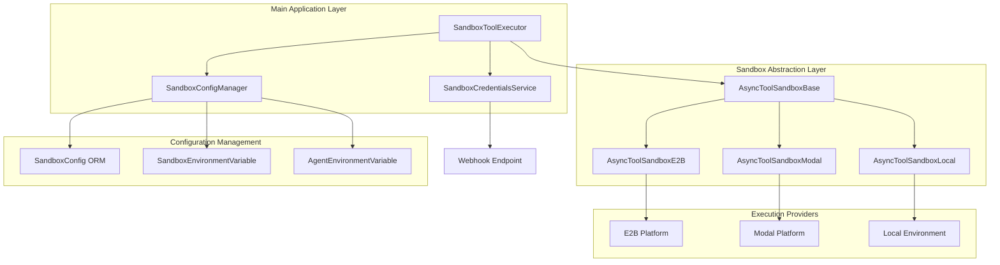

**Diagram sources**
- [sandbox_tool_executor.py](file://letta/services/tool_executor/sandbox_tool_executor.py#L24-L179)
- [base.py](file://letta/services/tool_sandbox/base.py#L20-L398)
- [sandbox_config_manager.py](file://letta/services/sandbox_config_manager.py#L28-L353)

**Section sources**
- [sandbox_tool_executor.py](file://letta/services/tool_executor/sandbox_tool_executor.py#L24-L179)
- [base.py](file://letta/services/tool_sandbox/base.py#L20-L398)

## Sandbox Configuration Management

### SandboxConfig ORM Model

The sandbox configuration system is built around the `SandboxConfig` ORM model, which provides persistent storage for sandbox settings and environment variables.

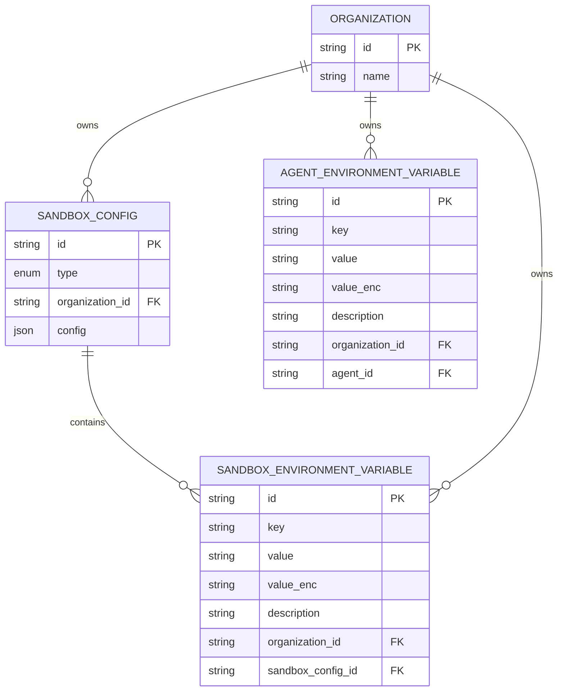

**Diagram sources**
- [sandbox_config.py](file://letta/orm/sandbox_config.py#L18-L82)

### Configuration Types and Fingerprinting

Each sandbox type has specific configuration requirements:

| Sandbox Type | Configuration Class | Purpose |
|--------------|-------------------|---------|
| E2B | `E2BSandboxConfig` | Cloud-based sandbox with Docker containers |
| Modal | `ModalSandboxConfig` | Serverless function execution environment |
| Local | `LocalSandboxConfig` | Local virtual environment execution |

The system uses cryptographic fingerprinting to track configuration changes:

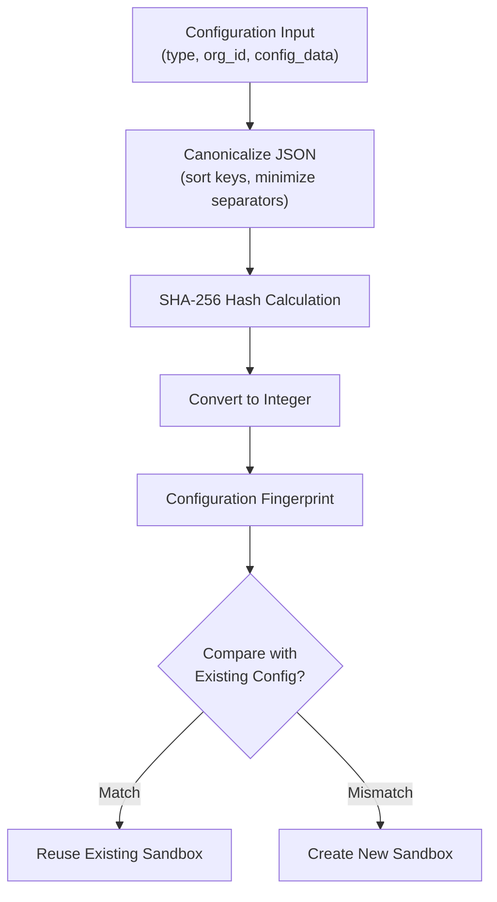

**Diagram sources**
- [sandbox_config.py](file://letta/schemas/sandbox_config.py#L114-L131)

**Section sources**
- [sandbox_config.py](file://letta/schemas/sandbox_config.py#L114-L131)
- [sandbox_config.py](file://letta/orm/sandbox_config.py#L18-L82)

## Sandbox Types and Providers

### E2B Sandbox Implementation

E2B provides cloud-based sandboxing with Docker container isolation:

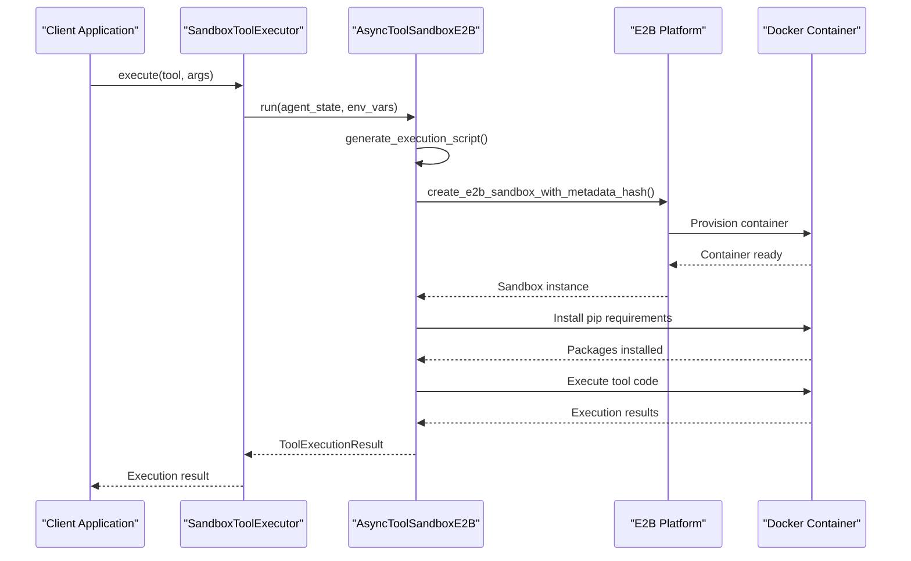

**Diagram sources**
- [e2b_sandbox.py](file://letta/services/tool_sandbox/e2b_sandbox.py#L43-L147)

Key E2B security features:
- **Container Isolation**: Each sandbox runs in a separate Docker container
- **Resource Limits**: Configurable timeout and resource constraints
- **Package Management**: Automatic pip package installation
- **Metadata Tracking**: Configuration fingerprinting for reuse detection

### Modal Sandbox Implementation

Modal provides serverless function execution with automatic scaling:

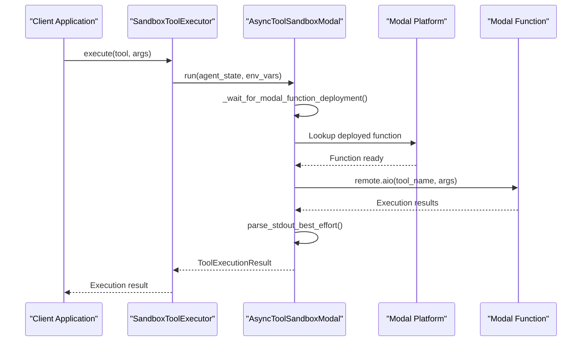

**Diagram sources**
- [modal_sandbox.py](file://letta/services/tool_sandbox/modal_sandbox.py#L87-L196)

### Local Sandbox Implementation

Local sandboxing provides lightweight execution within virtual environments:

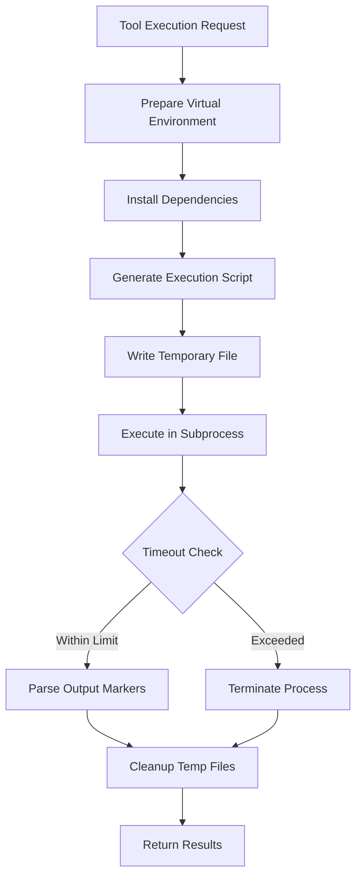

**Diagram sources**
- [local_sandbox.py](file://letta/services/tool_sandbox/local_sandbox.py#L49-L276)

**Section sources**
- [e2b_sandbox.py](file://letta/services/tool_sandbox/e2b_sandbox.py#L43-L264)
- [modal_sandbox.py](file://letta/services/tool_sandbox/modal_sandbox.py#L31-L196)
- [local_sandbox.py](file://letta/services/tool_sandbox/local_sandbox.py#L31-L276)

## Secure Tool Execution Lifecycle

### Environment Provisioning

The sandbox provisioning process follows a secure initialization sequence:

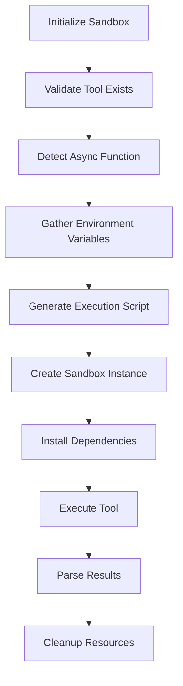

**Diagram sources**
- [base.py](file://letta/services/tool_sandbox/base.py#L48-L398)

### Code Generation and Execution

The system generates secure execution scripts with proper parameter handling:

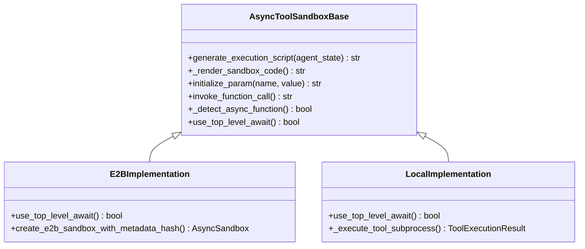

**Diagram sources**
- [base.py](file://letta/services/tool_sandbox/base.py#L20-L398)

### Result Retrieval and Validation

The system implements secure result parsing with integrity verification:

| Security Measure | Implementation | Purpose |
|------------------|----------------|---------|
| Output Markers | Binary markers with checksums | Prevent output tampering |
| Memory Integrity | Agent state comparison | Ensure no unauthorized modifications |
| Error Handling | Structured error reporting | Safe error propagation |
| Resource Cleanup | Automatic resource deallocation | Prevent resource leaks |

**Section sources**
- [base.py](file://letta/services/tool_sandbox/base.py#L48-L398)
- [e2b_sandbox.py](file://letta/services/tool_sandbox/e2b_sandbox.py#L43-L147)
- [local_sandbox.py](file://letta/services/tool_sandbox/local_sandbox.py#L49-L276)

## Credential Management and Secret Injection

### Webhook-Based Credential Service

The system implements a secure credential injection mechanism through webhook endpoints:

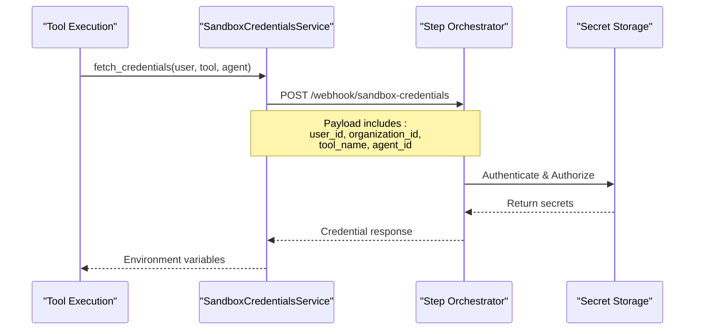

**Diagram sources**
- [sandbox_credentials_service.py](file://letta/services/sandbox_credentials_service.py#L12-L81)

### Environment Variable Hierarchy

The system implements a multi-layered environment variable resolution:

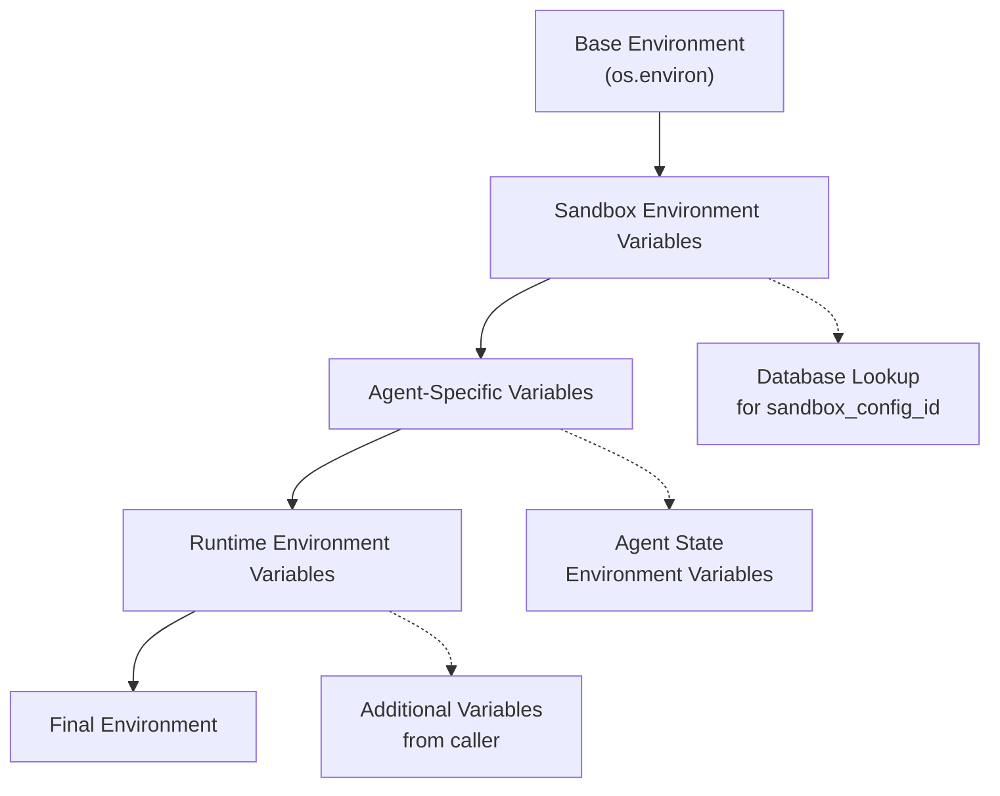

**Diagram sources**
- [base.py](file://letta/services/tool_sandbox/base.py#L381-L397)

### Secret Encryption and Storage

Sensitive environment variables are automatically encrypted:

| Variable Type | Storage Method | Security Level |
|---------------|----------------|----------------|
| Sandbox Secrets | AES encryption with database key | Database-level protection |
| Agent Secrets | Same encryption as sandbox secrets | Same as sandbox secrets |
| Runtime Secrets | Memory-only during execution | Runtime protection only |

**Section sources**
- [sandbox_credentials_service.py](file://letta/services/sandbox_credentials_service.py#L12-L81)
- [base.py](file://letta/services/tool_sandbox/base.py#L381-L397)

## Communication Channels

### Inter-Sandbox Communication

The system maintains secure communication channels between the main application and sandbox environments:

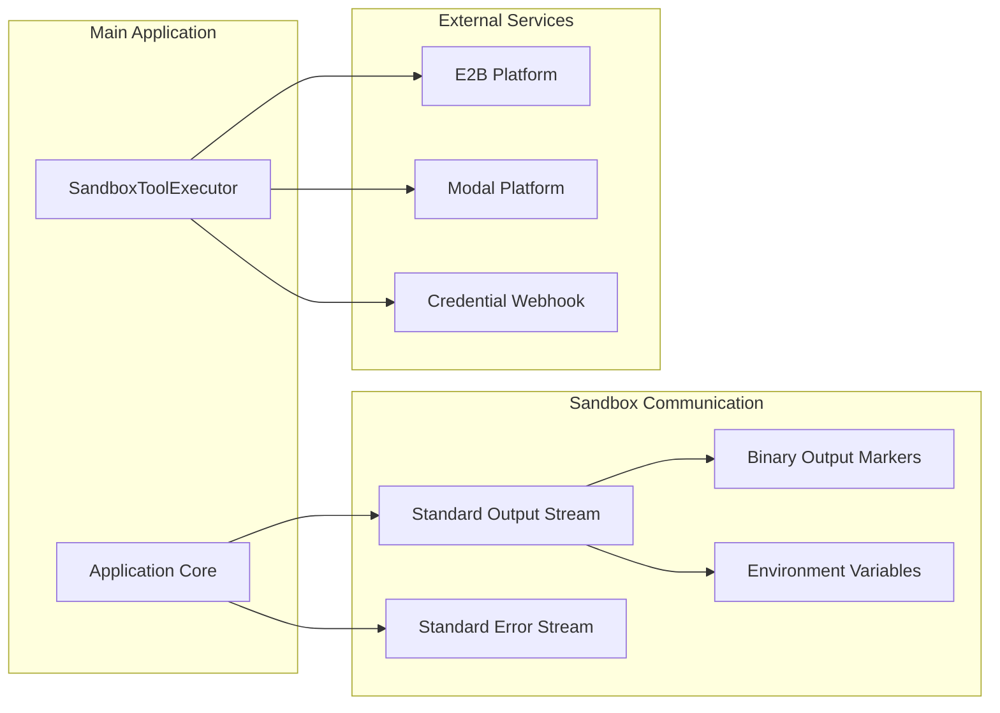

**Diagram sources**
- [sandbox_tool_executor.py](file://letta/services/tool_executor/sandbox_tool_executor.py#L24-L179)

### Result Serialization and Deserialization

The system uses a secure serialization protocol for passing results:

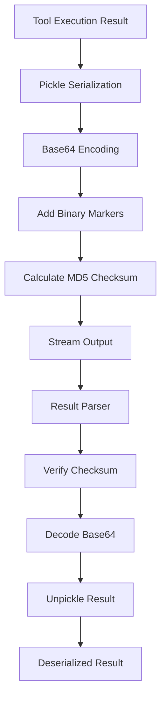

**Diagram sources**
- [base.py](file://letta/services/tool_sandbox/base.py#L290-L306)

**Section sources**
- [sandbox_tool_executor.py](file://letta/services/tool_executor/sandbox_tool_executor.py#L24-L179)
- [base.py](file://letta/services/tool_sandbox/base.py#L290-L306)

## Security Features

### Isolation Mechanisms

The sandboxing system implements multiple layers of isolation:

| Isolation Layer | Implementation | Security Benefit |
|-----------------|----------------|------------------|
| Process Isolation | Separate subprocesses | Prevent cross-process attacks |
| Network Isolation | Controlled network access | Limit external communications |
| File System Isolation | Sandboxed directories | Prevent unauthorized file access |
| Resource Isolation | CPU/memory limits | Prevent resource exhaustion |

### Network Policies

Network access is controlled through configurable policies:

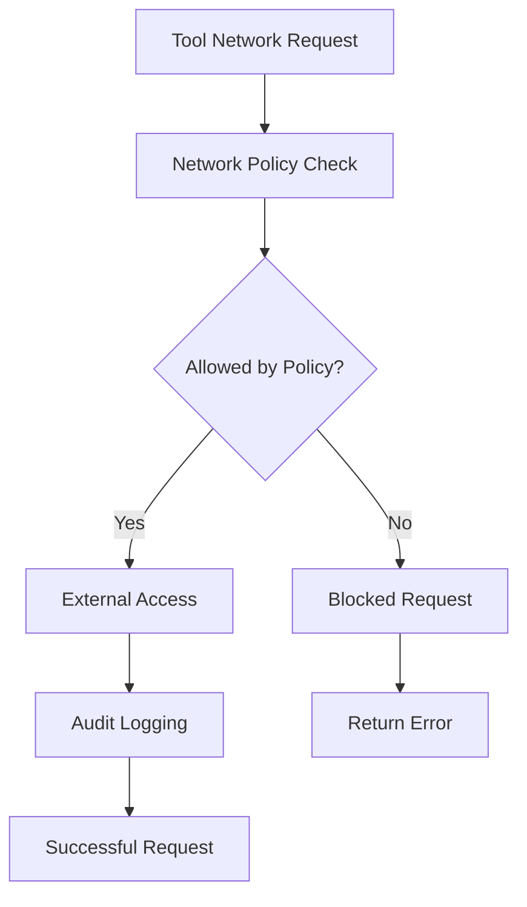

### Resource Limits

Each sandbox enforces resource constraints:

| Resource Type | Default Limit | Configurable |
|---------------|---------------|--------------|
| Execution Timeout | 5 minutes (E2B), 60 seconds (Modal) | Yes |
| Memory Usage | Provider-dependent | Yes |
| CPU Usage | Provider-dependent | Yes |
| Disk Space | Provider-dependent | Yes |

**Section sources**
- [e2b_sandbox.py](file://letta/services/tool_sandbox/e2b_sandbox.py#L56-L147)
- [modal_sandbox.py](file://letta/services/tool_sandbox/modal_sandbox.py#L87-L196)

## Performance Considerations

### Cold Start Optimization

Different sandbox providers have varying cold start characteristics:

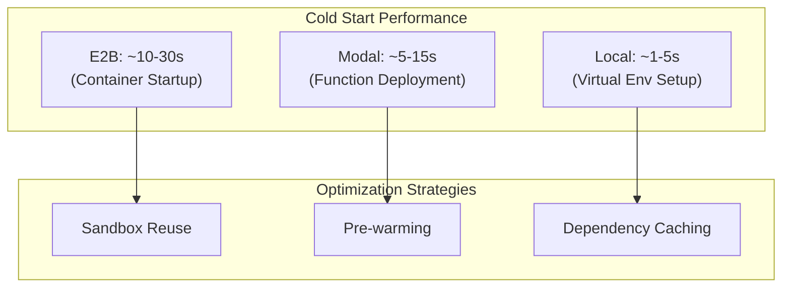

### Execution Time Optimization

The system provides several optimization strategies:

| Optimization | E2B | Modal | Local |
|--------------|-----|-------|-------|
| Sandbox Reuse | ✓ | ✗ | ✓ |
| Pre-warming | ✓ | ✓ | ✗ |
| Dependency Caching | ✓ | ✓ | ✓ |
| Parallel Execution | ✓ | ✓ | ✓ |

### Provider Comparison

| Feature | E2B | Modal | Local |
|---------|-----|-------|-------|
| Scalability | Excellent | Excellent | Limited |
| Cost | Pay-per-execution | Pay-per-execution | Infrastructure cost |
| Latency | Medium | Low | Low |
| Complexity | High | Medium | Low |
| Security | Excellent | Good | Good |

**Section sources**
- [sandbox_tool_executor.py](file://letta/services/tool_executor/sandbox_tool_executor.py#L69-L123)

## Common Issues and Debugging

### Cold Start Latency

**Problem**: Tools experience significant delays during initial execution.

**Solutions**:
- Enable sandbox reuse when possible
- Implement pre-warming strategies
- Choose appropriate sandbox provider for use case

### Resource Constraints

**Problem**: Tools fail due to resource limitations.

**Debugging Steps**:
1. Check sandbox configuration timeouts
2. Monitor resource usage patterns
3. Adjust provider-specific limits
4. Implement retry logic for transient failures

### Dependency Conflicts

**Problem**: Package installation failures in sandbox environments.

**Common Causes**:
- Version conflicts between packages
- Missing system dependencies
- Provider-specific package restrictions

**Resolution**:
- Specify compatible package versions
- Use virtual environments
- Test dependencies in isolated environments

### Communication Failures

**Problem**: Sandbox execution hangs or produces corrupted output.

**Diagnostic Approach**:
1. Verify binary marker integrity
2. Check output stream encoding
3. Monitor process termination
4. Review error logs for clues

**Section sources**
- [e2b_sandbox.py](file://letta/services/tool_sandbox/e2b_sandbox.py#L70-L147)
- [local_sandbox.py](file://letta/services/tool_sandbox/local_sandbox.py#L181-L276)

## Best Practices

### Configuration Management

1. **Use Configuration Fingerprints**: Leverage the fingerprinting system to avoid unnecessary sandbox recreation
2. **Organizational Separation**: Maintain separate configurations per organization for security isolation
3. **Environment Variable Organization**: Use structured naming conventions for environment variables
4. **Secret Rotation**: Implement regular rotation of sensitive credentials

### Security Hardening

1. **Principle of Least Privilege**: Grant minimal necessary permissions to sandboxed tools
2. **Network Isolation**: Restrict network access to essential endpoints only
3. **Resource Monitoring**: Implement monitoring for resource consumption patterns
4. **Audit Logging**: Enable comprehensive logging for security auditing

### Performance Optimization

1. **Provider Selection**: Choose sandbox provider based on execution patterns
2. **Dependency Management**: Optimize package installations and caching
3. **Execution Patterns**: Design tools for optimal sandbox utilization
4. **Error Handling**: Implement robust error handling and retry mechanisms

### Development Guidelines

1. **Testing Strategy**: Test tools in sandbox environments before production deployment
2. **Documentation**: Maintain clear documentation of tool requirements and dependencies
3. **Version Control**: Track sandbox configuration changes through version control
4. **Monitoring**: Implement comprehensive monitoring and alerting for sandbox operations